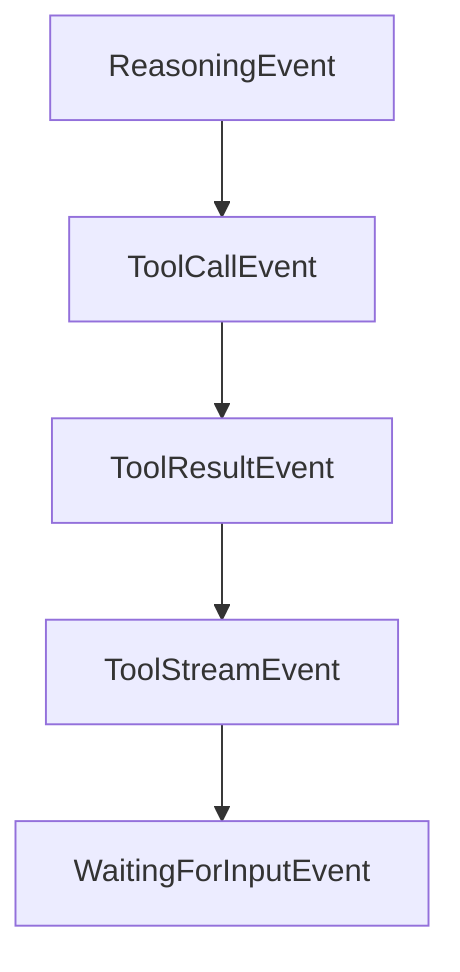

# Chapter 4: Skills and Slash Command Extensions

Welcome to **Chapter 4: Skills and Slash Command Extensions**. In this part of **Mistral Vibe Tutorial: Minimal CLI Coding Agent by Mistral**, you will build an intuitive mental model first, then move into concrete implementation details and practical production tradeoffs.


Vibe's skills system enables reusable behavior packages and user-invocable slash command extensions.

## Skill Benefits

- codify recurring team standards
- attach specialized prompts/workflows
- expose custom slash commands where needed

## Skill Design Guidance

1. keep skill descriptions concise and task-specific
2. declare allowed tools clearly for safety
3. store skills in shared repository paths for consistency

## Source References

- [Mistral Vibe README: skills system](https://github.com/mistralai/mistral-vibe/blob/main/README.md)
- [Agent Skills spec reference](https://agentskills.io/specification)

## Summary

You now have a strategy for turning ad hoc prompt patterns into reusable Vibe skills.

Next: [Chapter 5: Subagents and Task Delegation](05-subagents-and-task-delegation.md)

## Source Code Walkthrough

### `vibe/core/types.py`

The `ReasoningEvent` class in [`vibe/core/types.py`](https://github.com/mistralai/mistral-vibe/blob/HEAD/vibe/core/types.py) handles a key part of this chapter's functionality:

```py


class ReasoningEvent(BaseEvent):
    content: str
    message_id: str | None = None


class ToolCallEvent(BaseEvent):
    tool_call_id: str
    tool_name: str
    tool_class: type[BaseTool]
    tool_call_index: int | None = None
    args: BaseModel | None = None


class ToolResultEvent(BaseEvent):
    tool_name: str
    tool_class: type[BaseTool] | None
    result: BaseModel | None = None
    error: str | None = None
    skipped: bool = False
    skip_reason: str | None = None
    cancelled: bool = False
    duration: float | None = None
    tool_call_id: str


class ToolStreamEvent(BaseEvent):
    tool_name: str
    message: str
    tool_call_id: str

```

This class is important because it defines how Mistral Vibe Tutorial: Minimal CLI Coding Agent by Mistral implements the patterns covered in this chapter.

### `vibe/core/types.py`

The `ToolCallEvent` class in [`vibe/core/types.py`](https://github.com/mistralai/mistral-vibe/blob/HEAD/vibe/core/types.py) handles a key part of this chapter's functionality:

```py


class ToolCallEvent(BaseEvent):
    tool_call_id: str
    tool_name: str
    tool_class: type[BaseTool]
    tool_call_index: int | None = None
    args: BaseModel | None = None


class ToolResultEvent(BaseEvent):
    tool_name: str
    tool_class: type[BaseTool] | None
    result: BaseModel | None = None
    error: str | None = None
    skipped: bool = False
    skip_reason: str | None = None
    cancelled: bool = False
    duration: float | None = None
    tool_call_id: str


class ToolStreamEvent(BaseEvent):
    tool_name: str
    message: str
    tool_call_id: str


class WaitingForInputEvent(BaseEvent):
    task_id: str
    label: str | None = None
    predefined_answers: list[str] | None = None
```

This class is important because it defines how Mistral Vibe Tutorial: Minimal CLI Coding Agent by Mistral implements the patterns covered in this chapter.

### `vibe/core/types.py`

The `ToolResultEvent` class in [`vibe/core/types.py`](https://github.com/mistralai/mistral-vibe/blob/HEAD/vibe/core/types.py) handles a key part of this chapter's functionality:

```py


class ToolResultEvent(BaseEvent):
    tool_name: str
    tool_class: type[BaseTool] | None
    result: BaseModel | None = None
    error: str | None = None
    skipped: bool = False
    skip_reason: str | None = None
    cancelled: bool = False
    duration: float | None = None
    tool_call_id: str


class ToolStreamEvent(BaseEvent):
    tool_name: str
    message: str
    tool_call_id: str


class WaitingForInputEvent(BaseEvent):
    task_id: str
    label: str | None = None
    predefined_answers: list[str] | None = None


class CompactStartEvent(BaseEvent):
    current_context_tokens: int
    threshold: int
    # WORKAROUND: Using tool_call to communicate compact events to the client.
    # This should be revisited when the ACP protocol defines how compact events
    # should be represented.
```

This class is important because it defines how Mistral Vibe Tutorial: Minimal CLI Coding Agent by Mistral implements the patterns covered in this chapter.

### `vibe/core/types.py`

The `ToolStreamEvent` class in [`vibe/core/types.py`](https://github.com/mistralai/mistral-vibe/blob/HEAD/vibe/core/types.py) handles a key part of this chapter's functionality:

```py


class ToolStreamEvent(BaseEvent):
    tool_name: str
    message: str
    tool_call_id: str


class WaitingForInputEvent(BaseEvent):
    task_id: str
    label: str | None = None
    predefined_answers: list[str] | None = None


class CompactStartEvent(BaseEvent):
    current_context_tokens: int
    threshold: int
    # WORKAROUND: Using tool_call to communicate compact events to the client.
    # This should be revisited when the ACP protocol defines how compact events
    # should be represented.
    # [RFD](https://agentclientprotocol.com/rfds/session-usage)
    tool_call_id: str


class CompactEndEvent(BaseEvent):
    old_context_tokens: int
    new_context_tokens: int
    summary_length: int
    # WORKAROUND: Using tool_call to communicate compact events to the client.
    # This should be revisited when the ACP protocol defines how compact events
    # should be represented.
    # [RFD](https://agentclientprotocol.com/rfds/session-usage)
```

This class is important because it defines how Mistral Vibe Tutorial: Minimal CLI Coding Agent by Mistral implements the patterns covered in this chapter.


## How These Components Connect


