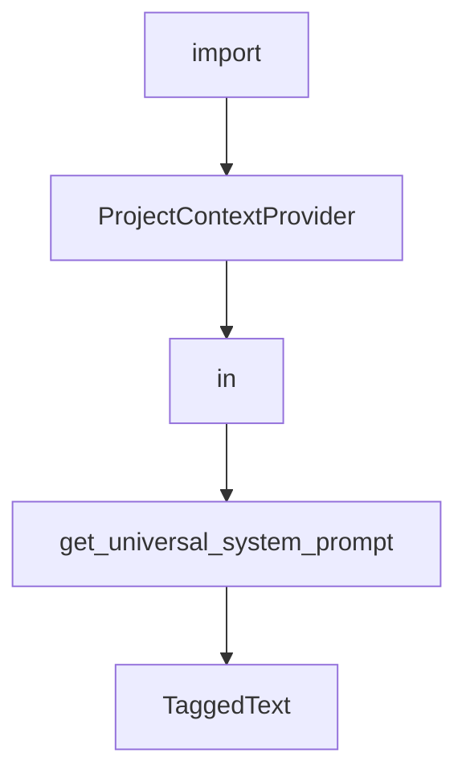

# Chapter 4: Skills and Slash Command Extensions

Welcome to **Chapter 4: Skills and Slash Command Extensions**. In this part of **Mistral Vibe Tutorial: Minimal CLI Coding Agent by Mistral**, you will build an intuitive mental model first, then move into concrete implementation details and practical production tradeoffs.


Vibe's skills system enables reusable behavior packages and user-invocable slash command extensions.

## Skill Benefits

- codify recurring team standards
- attach specialized prompts/workflows
- expose custom slash commands where needed

## Skill Design Guidance

1. keep skill descriptions concise and task-specific
2. declare allowed tools clearly for safety
3. store skills in shared repository paths for consistency

## Source References

- [Mistral Vibe README: skills system](https://github.com/mistralai/mistral-vibe/blob/main/README.md)
- [Agent Skills spec reference](https://agentskills.io/specification)

## Summary

You now have a strategy for turning ad hoc prompt patterns into reusable Vibe skills.

Next: [Chapter 5: Subagents and Task Delegation](05-subagents-and-task-delegation.md)

## Depth Expansion Playbook

## Source Code Walkthrough

### `vibe/acp/utils.py`

The `import` interface in [`vibe/acp/utils.py`](https://github.com/mistralai/mistral-vibe/blob/HEAD/vibe/acp/utils.py) handles a key part of this chapter's functionality:

```py
from __future__ import annotations

from enum import StrEnum
from typing import TYPE_CHECKING, Literal, cast

from acp.schema import (
    AgentMessageChunk,
    AgentThoughtChunk,
    ContentToolCallContent,
    ModelInfo,
    PermissionOption,
    SessionConfigOption,
    SessionConfigOptionSelect,
    SessionConfigSelectOption,
    SessionMode,
    SessionModelState,
    SessionModeState,
    TextContentBlock,
    ToolCallProgress,
    ToolCallStart,
    UserMessageChunk,
)

from vibe.core.agents.models import AgentProfile, AgentType
from vibe.core.proxy_setup import SUPPORTED_PROXY_VARS, get_current_proxy_settings
from vibe.core.types import CompactEndEvent, CompactStartEvent, LLMMessage
from vibe.core.utils import compact_reduction_display

if TYPE_CHECKING:
    from vibe.core.config import ModelConfig
```

This interface is important because it defines how Mistral Vibe Tutorial: Minimal CLI Coding Agent by Mistral implements the patterns covered in this chapter.

### `vibe/core/system_prompt.py`

The `ProjectContextProvider` class in [`vibe/core/system_prompt.py`](https://github.com/mistralai/mistral-vibe/blob/HEAD/vibe/core/system_prompt.py) handles a key part of this chapter's functionality:

```py


class ProjectContextProvider:
    def __init__(
        self, config: ProjectContextConfig, root_path: str | Path = "."
    ) -> None:
        self.root_path = Path(root_path).resolve()
        self.config = config

    def get_git_status(self) -> str:
        if self.root_path in _git_status_cache:
            return _git_status_cache[self.root_path]

        result = self._fetch_git_status()
        _git_status_cache[self.root_path] = result
        return result

    def _fetch_git_status(self) -> str:
        try:
            timeout = min(self.config.timeout_seconds, 10.0)
            num_commits = self.config.default_commit_count

            current_branch = subprocess.run(
                ["git", "branch", "--show-current"],
                capture_output=True,
                check=True,
                cwd=self.root_path,
                stdin=subprocess.DEVNULL if is_windows() else None,
                text=True,
                timeout=timeout,
            ).stdout.strip()

```

This class is important because it defines how Mistral Vibe Tutorial: Minimal CLI Coding Agent by Mistral implements the patterns covered in this chapter.

### `vibe/core/system_prompt.py`

The `in` class in [`vibe/core/system_prompt.py`](https://github.com/mistralai/mistral-vibe/blob/HEAD/vibe/core/system_prompt.py) handles a key part of this chapter's functionality:

```py
import os
from pathlib import Path
from string import Template
import subprocess
import sys
from typing import TYPE_CHECKING

from vibe.core.config.harness_files import get_harness_files_manager
from vibe.core.paths import VIBE_HOME
from vibe.core.prompts import UtilityPrompt
from vibe.core.utils import is_dangerous_directory, is_windows

if TYPE_CHECKING:
    from vibe.core.agents import AgentManager
    from vibe.core.config import ProjectContextConfig, VibeConfig
    from vibe.core.skills.manager import SkillManager
    from vibe.core.tools.manager import ToolManager

_git_status_cache: dict[Path, str] = {}


class ProjectContextProvider:
    def __init__(
        self, config: ProjectContextConfig, root_path: str | Path = "."
    ) -> None:
        self.root_path = Path(root_path).resolve()
        self.config = config

    def get_git_status(self) -> str:
        if self.root_path in _git_status_cache:
            return _git_status_cache[self.root_path]

```

This class is important because it defines how Mistral Vibe Tutorial: Minimal CLI Coding Agent by Mistral implements the patterns covered in this chapter.

### `vibe/core/system_prompt.py`

The `get_universal_system_prompt` function in [`vibe/core/system_prompt.py`](https://github.com/mistralai/mistral-vibe/blob/HEAD/vibe/core/system_prompt.py) handles a key part of this chapter's functionality:

```py


def get_universal_system_prompt(
    tool_manager: ToolManager,
    config: VibeConfig,
    skill_manager: SkillManager,
    agent_manager: AgentManager,
) -> str:
    sections = [config.system_prompt]

    if config.include_commit_signature:
        sections.append(_add_commit_signature())

    if config.include_model_info:
        sections.append(f"Your model name is: `{config.active_model}`")

    if config.include_prompt_detail:
        sections.append(_get_os_system_prompt())
        tool_prompts = []
        for tool_class in tool_manager.available_tools.values():
            if prompt := tool_class.get_tool_prompt():
                tool_prompts.append(prompt)
        if tool_prompts:
            sections.append("\n---\n".join(tool_prompts))

        skills_section = _get_available_skills_section(skill_manager)
        if skills_section:
            sections.append(skills_section)

        subagents_section = _get_available_subagents_section(agent_manager)
        if subagents_section:
            sections.append(subagents_section)
```

This function is important because it defines how Mistral Vibe Tutorial: Minimal CLI Coding Agent by Mistral implements the patterns covered in this chapter.


## How These Components Connect


