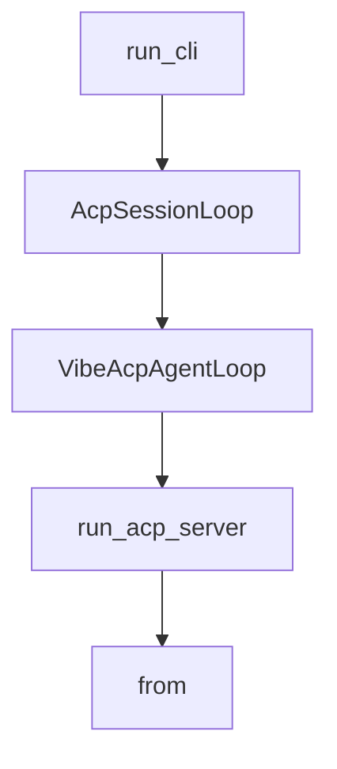

# Chapter 5: Subagents and Task Delegation

Welcome to **Chapter 5: Subagents and Task Delegation**. In this part of **Mistral Vibe Tutorial: Minimal CLI Coding Agent by Mistral**, you will build an intuitive mental model first, then move into concrete implementation details and practical production tradeoffs.


Vibe supports task delegation to subagents, allowing specialized work to run with isolated context.

## Delegation Model

- main agent handles top-level coordination
- subagents perform scoped tasks
- outputs flow back into the primary conversation

## Practical Uses

- codebase exploration in parallel
- focused refactor analysis versus implementation split
- staged task decomposition without overloading main context

## Source References

- [Mistral Vibe README: subagents and task delegation](https://github.com/mistralai/mistral-vibe/blob/main/README.md)

## Summary

You now know how to use subagents to scale complex coding tasks.

Next: [Chapter 6: Programmatic and Non-Interactive Modes](06-programmatic-and-non-interactive-modes.md)

## Source Code Walkthrough

### `vibe/cli/cli.py`

The `run_cli` function in [`vibe/cli/cli.py`](https://github.com/mistralai/mistral-vibe/blob/HEAD/vibe/cli/cli.py) handles a key part of this chapter's functionality:

```py


def run_cli(args: argparse.Namespace) -> None:
    load_dotenv_values()
    bootstrap_config_files()

    if args.setup:
        run_onboarding()
        sys.exit(0)

    try:
        initial_agent_name = get_initial_agent_name(args)
        config = load_config_or_exit()
        setup_tracing(config)

        if args.enabled_tools:
            config.enabled_tools = args.enabled_tools

        loaded_session = load_session(args, config)

        stdin_prompt = get_prompt_from_stdin()
        if args.prompt is not None:
            config.disabled_tools = [*config.disabled_tools, "ask_user_question"]
            programmatic_prompt = args.prompt or stdin_prompt
            if not programmatic_prompt:
                print(
                    "Error: No prompt provided for programmatic mode", file=sys.stderr
                )
                sys.exit(1)
            output_format = OutputFormat(
                args.output if hasattr(args, "output") else "text"
            )
```

This function is important because it defines how Mistral Vibe Tutorial: Minimal CLI Coding Agent by Mistral implements the patterns covered in this chapter.

### `vibe/acp/acp_agent_loop.py`

The `AcpSessionLoop` class in [`vibe/acp/acp_agent_loop.py`](https://github.com/mistralai/mistral-vibe/blob/HEAD/vibe/acp/acp_agent_loop.py) handles a key part of this chapter's functionality:

```py


class AcpSessionLoop(BaseModel):
    model_config = ConfigDict(arbitrary_types_allowed=True)
    id: str
    agent_loop: AgentLoop
    task: asyncio.Task[None] | None = None


class VibeAcpAgentLoop(AcpAgent):
    client: Client

    def __init__(self) -> None:
        self.sessions: dict[str, AcpSessionLoop] = {}
        self.client_capabilities: ClientCapabilities | None = None
        self.client_info: Implementation | None = None

    @override
    async def initialize(
        self,
        protocol_version: int,
        client_capabilities: ClientCapabilities | None = None,
        client_info: Implementation | None = None,
        **kwargs: Any,
    ) -> InitializeResponse:
        self.client_capabilities = client_capabilities
        self.client_info = client_info

        # The ACP Agent process can be launched in 3 different ways, depending on installation
        #  - dev mode: `uv run vibe-acp`, ran from the project root
        #  - uv tool install: `vibe-acp`, similar to dev mode, but uv takes care of path resolution
        #  - bundled binary: `./vibe-acp` from binary location
```

This class is important because it defines how Mistral Vibe Tutorial: Minimal CLI Coding Agent by Mistral implements the patterns covered in this chapter.

### `vibe/acp/acp_agent_loop.py`

The `VibeAcpAgentLoop` class in [`vibe/acp/acp_agent_loop.py`](https://github.com/mistralai/mistral-vibe/blob/HEAD/vibe/acp/acp_agent_loop.py) handles a key part of this chapter's functionality:

```py


class VibeAcpAgentLoop(AcpAgent):
    client: Client

    def __init__(self) -> None:
        self.sessions: dict[str, AcpSessionLoop] = {}
        self.client_capabilities: ClientCapabilities | None = None
        self.client_info: Implementation | None = None

    @override
    async def initialize(
        self,
        protocol_version: int,
        client_capabilities: ClientCapabilities | None = None,
        client_info: Implementation | None = None,
        **kwargs: Any,
    ) -> InitializeResponse:
        self.client_capabilities = client_capabilities
        self.client_info = client_info

        # The ACP Agent process can be launched in 3 different ways, depending on installation
        #  - dev mode: `uv run vibe-acp`, ran from the project root
        #  - uv tool install: `vibe-acp`, similar to dev mode, but uv takes care of path resolution
        #  - bundled binary: `./vibe-acp` from binary location
        # The 2 first modes are working similarly, under the hood uv runs `/some/python /my/entrypoint.py``
        # The last mode is quite different as our bundler also includes the python install.
        # So sys.executable is already /path/to/binary/vibe-acp.
        # For this reason, we make a distinction in the way we call the setup command
        command = sys.executable
        if "python" not in Path(command).name:
            # It's the case for bundled binaries, we don't need any other arguments
```

This class is important because it defines how Mistral Vibe Tutorial: Minimal CLI Coding Agent by Mistral implements the patterns covered in this chapter.

### `vibe/acp/acp_agent_loop.py`

The `run_acp_server` function in [`vibe/acp/acp_agent_loop.py`](https://github.com/mistralai/mistral-vibe/blob/HEAD/vibe/acp/acp_agent_loop.py) handles a key part of this chapter's functionality:

```py


def run_acp_server() -> None:
    try:
        asyncio.run(
            run_agent(
                agent=VibeAcpAgentLoop(),
                use_unstable_protocol=True,
                observers=[acp_message_observer],
            )
        )
    except KeyboardInterrupt:
        # This is expected when the server is terminated
        pass
    except Exception as e:
        # Log any unexpected errors
        print(f"ACP Agent Server error: {e}", file=sys.stderr)
        raise

```

This function is important because it defines how Mistral Vibe Tutorial: Minimal CLI Coding Agent by Mistral implements the patterns covered in this chapter.


## How These Components Connect


