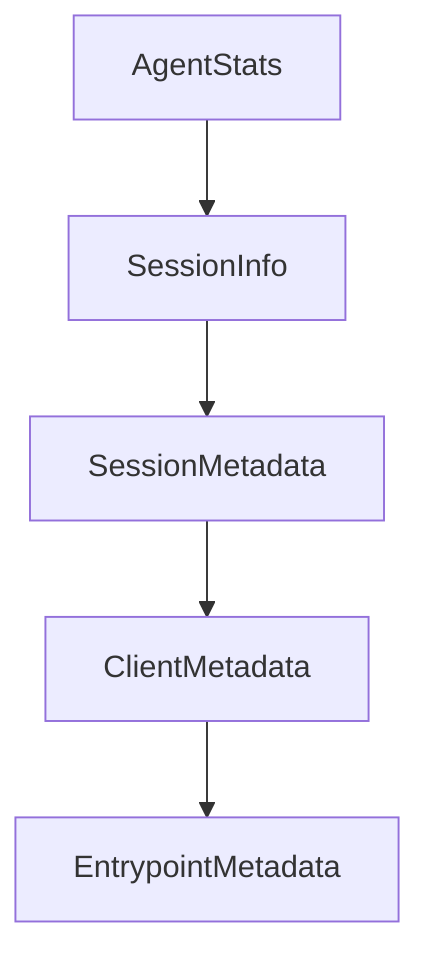

# Chapter 5: Subagents and Task Delegation

Welcome to **Chapter 5: Subagents and Task Delegation**. In this part of **Mistral Vibe Tutorial: Minimal CLI Coding Agent by Mistral**, you will build an intuitive mental model first, then move into concrete implementation details and practical production tradeoffs.


Vibe supports task delegation to subagents, allowing specialized work to run with isolated context.

## Delegation Model

- main agent handles top-level coordination
- subagents perform scoped tasks
- outputs flow back into the primary conversation

## Practical Uses

- codebase exploration in parallel
- focused refactor analysis versus implementation split
- staged task decomposition without overloading main context

## Source References

- [Mistral Vibe README: subagents and task delegation](https://github.com/mistralai/mistral-vibe/blob/main/README.md)

## Summary

You now know how to use subagents to scale complex coding tasks.

Next: [Chapter 6: Programmatic and Non-Interactive Modes](06-programmatic-and-non-interactive-modes.md)

## Depth Expansion Playbook

## Source Code Walkthrough

### `vibe/core/types.py`

The `AgentStats` class in [`vibe/core/types.py`](https://github.com/mistralai/mistral-vibe/blob/HEAD/vibe/core/types.py) handles a key part of this chapter's functionality:

```py


class AgentStats(BaseModel):
    steps: int = 0
    session_prompt_tokens: int = 0
    session_completion_tokens: int = 0
    tool_calls_agreed: int = 0
    tool_calls_rejected: int = 0
    tool_calls_failed: int = 0
    tool_calls_succeeded: int = 0

    context_tokens: int = 0

    last_turn_prompt_tokens: int = 0
    last_turn_completion_tokens: int = 0
    last_turn_duration: float = 0.0
    tokens_per_second: float = 0.0

    input_price_per_million: float = 0.0
    output_price_per_million: float = 0.0

    _listeners: dict[str, Callable[[AgentStats], None]] = PrivateAttr(
        default_factory=dict
    )

    def __setattr__(self, name: str, value: Any) -> None:
        super().__setattr__(name, value)
        if name in self._listeners:
            self._listeners[name](self)

    def trigger_listeners(self) -> None:
        for listener in self._listeners.values():
```

This class is important because it defines how Mistral Vibe Tutorial: Minimal CLI Coding Agent by Mistral implements the patterns covered in this chapter.

### `vibe/core/types.py`

The `SessionInfo` class in [`vibe/core/types.py`](https://github.com/mistralai/mistral-vibe/blob/HEAD/vibe/core/types.py) handles a key part of this chapter's functionality:

```py


class SessionInfo(BaseModel):
    session_id: str
    start_time: str
    message_count: int
    stats: AgentStats
    save_dir: str


class SessionMetadata(BaseModel):
    session_id: str
    start_time: str
    end_time: str | None
    git_commit: str | None
    git_branch: str | None
    environment: dict[str, str | None]
    username: str


class ClientMetadata(BaseModel):
    name: str
    version: str


class EntrypointMetadata(BaseModel):
    agent_entrypoint: Literal["cli", "acp", "programmatic"]
    agent_version: str
    client_name: str
    client_version: str


```

This class is important because it defines how Mistral Vibe Tutorial: Minimal CLI Coding Agent by Mistral implements the patterns covered in this chapter.

### `vibe/core/types.py`

The `SessionMetadata` class in [`vibe/core/types.py`](https://github.com/mistralai/mistral-vibe/blob/HEAD/vibe/core/types.py) handles a key part of this chapter's functionality:

```py


class SessionMetadata(BaseModel):
    session_id: str
    start_time: str
    end_time: str | None
    git_commit: str | None
    git_branch: str | None
    environment: dict[str, str | None]
    username: str


class ClientMetadata(BaseModel):
    name: str
    version: str


class EntrypointMetadata(BaseModel):
    agent_entrypoint: Literal["cli", "acp", "programmatic"]
    agent_version: str
    client_name: str
    client_version: str


StrToolChoice = Literal["auto", "none", "any", "required"]


class AvailableFunction(BaseModel):
    name: str
    description: str
    parameters: dict[str, Any]

```

This class is important because it defines how Mistral Vibe Tutorial: Minimal CLI Coding Agent by Mistral implements the patterns covered in this chapter.

### `vibe/core/types.py`

The `ClientMetadata` class in [`vibe/core/types.py`](https://github.com/mistralai/mistral-vibe/blob/HEAD/vibe/core/types.py) handles a key part of this chapter's functionality:

```py


class ClientMetadata(BaseModel):
    name: str
    version: str


class EntrypointMetadata(BaseModel):
    agent_entrypoint: Literal["cli", "acp", "programmatic"]
    agent_version: str
    client_name: str
    client_version: str


StrToolChoice = Literal["auto", "none", "any", "required"]


class AvailableFunction(BaseModel):
    name: str
    description: str
    parameters: dict[str, Any]


class AvailableTool(BaseModel):
    type: Literal["function"] = "function"
    function: AvailableFunction


class FunctionCall(BaseModel):
    name: str | None = None
    arguments: str | None = None

```

This class is important because it defines how Mistral Vibe Tutorial: Minimal CLI Coding Agent by Mistral implements the patterns covered in this chapter.


## How These Components Connect


