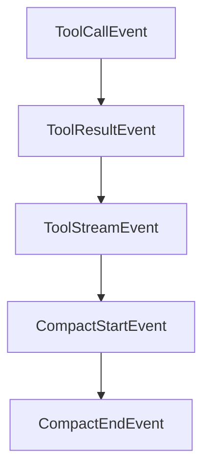

# Chapter 6: Programmatic and Non-Interactive Modes

Welcome to **Chapter 6: Programmatic and Non-Interactive Modes**. In this part of **Mistral Vibe Tutorial: Minimal CLI Coding Agent by Mistral**, you will build an intuitive mental model first, then move into concrete implementation details and practical production tradeoffs.


Vibe can run non-interactively for scripted workflows with bounded turns/cost and structured output.

## Programmatic Example

```bash
vibe --prompt "Analyze security risks in src/" --max-turns 5 --max-price 1.0 --output json
```

## Automation Controls

- `--max-turns` for deterministic upper bounds
- `--max-price` for cost control
- `--output` for machine-readable integration

## Source References

- [Mistral Vibe README: programmatic mode](https://github.com/mistralai/mistral-vibe/blob/main/README.md)

## Summary

You now understand how to use Vibe for script-friendly and CI-ready tasks.

Next: [Chapter 7: ACP and Editor Integrations](07-acp-and-editor-integrations.md)

## Depth Expansion Playbook

## Source Code Walkthrough

### `vibe/core/types.py`

The `ToolCallEvent` class in [`vibe/core/types.py`](https://github.com/mistralai/mistral-vibe/blob/HEAD/vibe/core/types.py) handles a key part of this chapter's functionality:

```py


class ToolCallEvent(BaseEvent):
    tool_call_id: str
    tool_name: str
    tool_class: type[BaseTool]
    tool_call_index: int | None = None
    args: BaseModel | None = None


class ToolResultEvent(BaseEvent):
    tool_name: str
    tool_class: type[BaseTool] | None
    result: BaseModel | None = None
    error: str | None = None
    skipped: bool = False
    skip_reason: str | None = None
    cancelled: bool = False
    duration: float | None = None
    tool_call_id: str


class ToolStreamEvent(BaseEvent):
    tool_name: str
    message: str
    tool_call_id: str


class CompactStartEvent(BaseEvent):
    current_context_tokens: int
    threshold: int
    # WORKAROUND: Using tool_call to communicate compact events to the client.
```

This class is important because it defines how Mistral Vibe Tutorial: Minimal CLI Coding Agent by Mistral implements the patterns covered in this chapter.

### `vibe/core/types.py`

The `ToolResultEvent` class in [`vibe/core/types.py`](https://github.com/mistralai/mistral-vibe/blob/HEAD/vibe/core/types.py) handles a key part of this chapter's functionality:

```py


class ToolResultEvent(BaseEvent):
    tool_name: str
    tool_class: type[BaseTool] | None
    result: BaseModel | None = None
    error: str | None = None
    skipped: bool = False
    skip_reason: str | None = None
    cancelled: bool = False
    duration: float | None = None
    tool_call_id: str


class ToolStreamEvent(BaseEvent):
    tool_name: str
    message: str
    tool_call_id: str


class CompactStartEvent(BaseEvent):
    current_context_tokens: int
    threshold: int
    # WORKAROUND: Using tool_call to communicate compact events to the client.
    # This should be revisited when the ACP protocol defines how compact events
    # should be represented.
    # [RFD](https://agentclientprotocol.com/rfds/session-usage)
    tool_call_id: str


class CompactEndEvent(BaseEvent):
    old_context_tokens: int
```

This class is important because it defines how Mistral Vibe Tutorial: Minimal CLI Coding Agent by Mistral implements the patterns covered in this chapter.

### `vibe/core/types.py`

The `ToolStreamEvent` class in [`vibe/core/types.py`](https://github.com/mistralai/mistral-vibe/blob/HEAD/vibe/core/types.py) handles a key part of this chapter's functionality:

```py


class ToolStreamEvent(BaseEvent):
    tool_name: str
    message: str
    tool_call_id: str


class CompactStartEvent(BaseEvent):
    current_context_tokens: int
    threshold: int
    # WORKAROUND: Using tool_call to communicate compact events to the client.
    # This should be revisited when the ACP protocol defines how compact events
    # should be represented.
    # [RFD](https://agentclientprotocol.com/rfds/session-usage)
    tool_call_id: str


class CompactEndEvent(BaseEvent):
    old_context_tokens: int
    new_context_tokens: int
    summary_length: int
    # WORKAROUND: Using tool_call to communicate compact events to the client.
    # This should be revisited when the ACP protocol defines how compact events
    # should be represented.
    # [RFD](https://agentclientprotocol.com/rfds/session-usage)
    tool_call_id: str


class OutputFormat(StrEnum):
    TEXT = auto()
    JSON = auto()
```

This class is important because it defines how Mistral Vibe Tutorial: Minimal CLI Coding Agent by Mistral implements the patterns covered in this chapter.

### `vibe/core/types.py`

The `CompactStartEvent` class in [`vibe/core/types.py`](https://github.com/mistralai/mistral-vibe/blob/HEAD/vibe/core/types.py) handles a key part of this chapter's functionality:

```py


class CompactStartEvent(BaseEvent):
    current_context_tokens: int
    threshold: int
    # WORKAROUND: Using tool_call to communicate compact events to the client.
    # This should be revisited when the ACP protocol defines how compact events
    # should be represented.
    # [RFD](https://agentclientprotocol.com/rfds/session-usage)
    tool_call_id: str


class CompactEndEvent(BaseEvent):
    old_context_tokens: int
    new_context_tokens: int
    summary_length: int
    # WORKAROUND: Using tool_call to communicate compact events to the client.
    # This should be revisited when the ACP protocol defines how compact events
    # should be represented.
    # [RFD](https://agentclientprotocol.com/rfds/session-usage)
    tool_call_id: str


class OutputFormat(StrEnum):
    TEXT = auto()
    JSON = auto()
    STREAMING = auto()


type ApprovalCallback = Callable[
    [str, BaseModel, str], Awaitable[tuple[ApprovalResponse, str | None]]
]
```

This class is important because it defines how Mistral Vibe Tutorial: Minimal CLI Coding Agent by Mistral implements the patterns covered in this chapter.


## How These Components Connect


