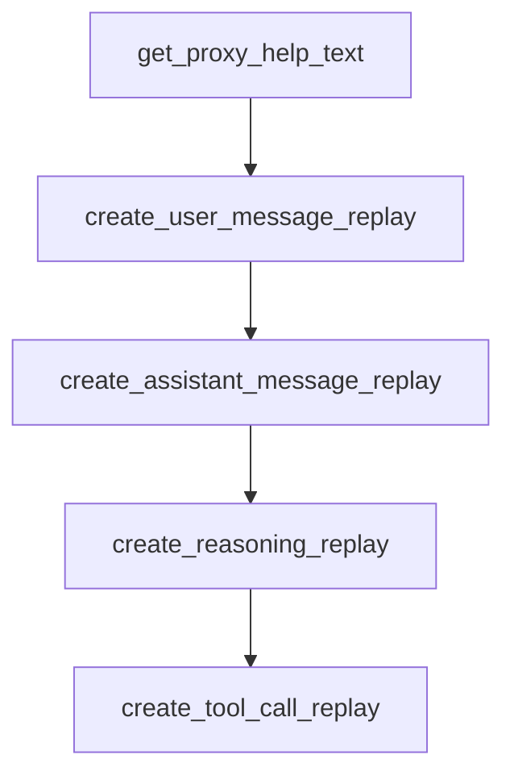

# Chapter 6: Programmatic and Non-Interactive Modes

Welcome to **Chapter 6: Programmatic and Non-Interactive Modes**. In this part of **Mistral Vibe Tutorial: Minimal CLI Coding Agent by Mistral**, you will build an intuitive mental model first, then move into concrete implementation details and practical production tradeoffs.


Vibe can run non-interactively for scripted workflows with bounded turns/cost and structured output.

## Programmatic Example

```bash
vibe --prompt "Analyze security risks in src/" --max-turns 5 --max-price 1.0 --output json
```

## Automation Controls

- `--max-turns` for deterministic upper bounds
- `--max-price` for cost control
- `--output` for machine-readable integration

## Source References

- [Mistral Vibe README: programmatic mode](https://github.com/mistralai/mistral-vibe/blob/main/README.md)

## Summary

You now understand how to use Vibe for script-friendly and CI-ready tasks.

Next: [Chapter 7: ACP and Editor Integrations](07-acp-and-editor-integrations.md)

## Source Code Walkthrough

### `vibe/acp/utils.py`

The `get_proxy_help_text` function in [`vibe/acp/utils.py`](https://github.com/mistralai/mistral-vibe/blob/HEAD/vibe/acp/utils.py) handles a key part of this chapter's functionality:

```py


def get_proxy_help_text() -> str:
    lines = [
        "## Proxy Configuration",
        "",
        "Configure proxy and SSL settings for HTTP requests.",
        "",
        "### Usage:",
        "- `/proxy-setup` - Show this help and current settings",
        "- `/proxy-setup KEY value` - Set an environment variable",
        "- `/proxy-setup KEY` - Remove an environment variable",
        "",
        "### Supported Variables:",
    ]

    for key, description in SUPPORTED_PROXY_VARS.items():
        lines.append(f"- `{key}`: {description}")

    lines.extend(["", "### Current Settings:"])

    current = get_current_proxy_settings()
    any_set = False
    for key, value in current.items():
        if value:
            lines.append(f"- `{key}={value}`")
            any_set = True

    if not any_set:
        lines.append("- (none configured)")

    return "\n".join(lines)
```

This function is important because it defines how Mistral Vibe Tutorial: Minimal CLI Coding Agent by Mistral implements the patterns covered in this chapter.

### `vibe/acp/utils.py`

The `create_user_message_replay` function in [`vibe/acp/utils.py`](https://github.com/mistralai/mistral-vibe/blob/HEAD/vibe/acp/utils.py) handles a key part of this chapter's functionality:

```py


def create_user_message_replay(msg: LLMMessage) -> UserMessageChunk:
    content = msg.content if isinstance(msg.content, str) else ""
    return UserMessageChunk(
        session_update="user_message_chunk",
        content=TextContentBlock(type="text", text=content),
        message_id=msg.message_id,
    )


def create_assistant_message_replay(msg: LLMMessage) -> AgentMessageChunk | None:
    content = msg.content if isinstance(msg.content, str) else ""
    if not content:
        return None

    return AgentMessageChunk(
        session_update="agent_message_chunk",
        content=TextContentBlock(type="text", text=content),
        message_id=msg.message_id,
    )


def create_reasoning_replay(msg: LLMMessage) -> AgentThoughtChunk | None:
    if not isinstance(msg.reasoning_content, str) or not msg.reasoning_content:
        return None

    return AgentThoughtChunk(
        session_update="agent_thought_chunk",
        content=TextContentBlock(type="text", text=msg.reasoning_content),
        message_id=msg.reasoning_message_id,
    )
```

This function is important because it defines how Mistral Vibe Tutorial: Minimal CLI Coding Agent by Mistral implements the patterns covered in this chapter.

### `vibe/acp/utils.py`

The `create_assistant_message_replay` function in [`vibe/acp/utils.py`](https://github.com/mistralai/mistral-vibe/blob/HEAD/vibe/acp/utils.py) handles a key part of this chapter's functionality:

```py


def create_assistant_message_replay(msg: LLMMessage) -> AgentMessageChunk | None:
    content = msg.content if isinstance(msg.content, str) else ""
    if not content:
        return None

    return AgentMessageChunk(
        session_update="agent_message_chunk",
        content=TextContentBlock(type="text", text=content),
        message_id=msg.message_id,
    )


def create_reasoning_replay(msg: LLMMessage) -> AgentThoughtChunk | None:
    if not isinstance(msg.reasoning_content, str) or not msg.reasoning_content:
        return None

    return AgentThoughtChunk(
        session_update="agent_thought_chunk",
        content=TextContentBlock(type="text", text=msg.reasoning_content),
        message_id=msg.reasoning_message_id,
    )


def create_tool_call_replay(
    tool_call_id: str, tool_name: str, arguments: str | None
) -> ToolCallStart:
    return ToolCallStart(
        session_update="tool_call",
        title=tool_name,
        tool_call_id=tool_call_id,
```

This function is important because it defines how Mistral Vibe Tutorial: Minimal CLI Coding Agent by Mistral implements the patterns covered in this chapter.

### `vibe/acp/utils.py`

The `create_reasoning_replay` function in [`vibe/acp/utils.py`](https://github.com/mistralai/mistral-vibe/blob/HEAD/vibe/acp/utils.py) handles a key part of this chapter's functionality:

```py


def create_reasoning_replay(msg: LLMMessage) -> AgentThoughtChunk | None:
    if not isinstance(msg.reasoning_content, str) or not msg.reasoning_content:
        return None

    return AgentThoughtChunk(
        session_update="agent_thought_chunk",
        content=TextContentBlock(type="text", text=msg.reasoning_content),
        message_id=msg.reasoning_message_id,
    )


def create_tool_call_replay(
    tool_call_id: str, tool_name: str, arguments: str | None
) -> ToolCallStart:
    return ToolCallStart(
        session_update="tool_call",
        title=tool_name,
        tool_call_id=tool_call_id,
        kind="other",
        raw_input=arguments,
    )


def create_tool_result_replay(msg: LLMMessage) -> ToolCallProgress | None:
    if not msg.tool_call_id:
        return None

    content = msg.content if isinstance(msg.content, str) else ""
    return ToolCallProgress(
        session_update="tool_call_update",
```

This function is important because it defines how Mistral Vibe Tutorial: Minimal CLI Coding Agent by Mistral implements the patterns covered in this chapter.


## How These Components Connect


