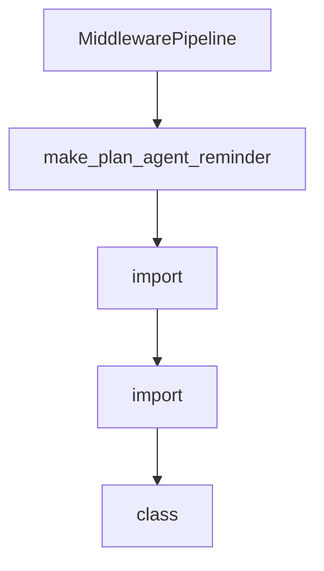

# Chapter 7: ACP and Editor Integrations

Welcome to **Chapter 7: ACP and Editor Integrations**. In this part of **Mistral Vibe Tutorial: Minimal CLI Coding Agent by Mistral**, you will build an intuitive mental model first, then move into concrete implementation details and practical production tradeoffs.


Vibe includes ACP support so editor clients can run agent workflows through standardized protocol interfaces.

## Integration Path

- use `vibe-acp` as ACP server command
- configure supported editors (Zed, JetBrains, Neovim plugins)
- keep auth/config setup consistent between CLI and ACP sessions

## Source References

- [ACP setup documentation](https://github.com/mistralai/mistral-vibe/blob/main/docs/acp-setup.md)
- [ACP entrypoint implementation](https://github.com/mistralai/mistral-vibe/blob/main/vibe/acp/entrypoint.py)

## Summary

You now have a clear model for connecting Vibe to ACP-capable editor environments.

Next: [Chapter 8: Production Operations and Governance](08-production-operations-and-governance.md)

## Source Code Walkthrough

### `vibe/core/middleware.py`

The `MiddlewarePipeline` class in [`vibe/core/middleware.py`](https://github.com/mistralai/mistral-vibe/blob/HEAD/vibe/core/middleware.py) handles a key part of this chapter's functionality:

```py


class MiddlewarePipeline:
    def __init__(self) -> None:
        self.middlewares: list[ConversationMiddleware] = []

    def add(self, middleware: ConversationMiddleware) -> MiddlewarePipeline:
        self.middlewares.append(middleware)
        return self

    def clear(self) -> None:
        self.middlewares.clear()

    def reset(self, reset_reason: ResetReason = ResetReason.STOP) -> None:
        for mw in self.middlewares:
            mw.reset(reset_reason)

    async def run_before_turn(self, context: ConversationContext) -> MiddlewareResult:
        messages_to_inject = []

        for mw in self.middlewares:
            result = await mw.before_turn(context)
            if result.action == MiddlewareAction.INJECT_MESSAGE and result.message:
                messages_to_inject.append(result.message)
            elif result.action in {MiddlewareAction.STOP, MiddlewareAction.COMPACT}:
                return result
        if messages_to_inject:
            combined_message = "\n\n".join(messages_to_inject)
            return MiddlewareResult(
                action=MiddlewareAction.INJECT_MESSAGE, message=combined_message
            )

```

This class is important because it defines how Mistral Vibe Tutorial: Minimal CLI Coding Agent by Mistral implements the patterns covered in this chapter.

### `vibe/core/middleware.py`

The `make_plan_agent_reminder` function in [`vibe/core/middleware.py`](https://github.com/mistralai/mistral-vibe/blob/HEAD/vibe/core/middleware.py) handles a key part of this chapter's functionality:

```py


def make_plan_agent_reminder(plan_file_path: str) -> str:
    return f"""<{VIBE_WARNING_TAG}>Plan mode is active. You MUST NOT make any edits (except to the plan file below), run any non-readonly tools (including changing configs or making commits), or otherwise make any changes to the system. This supersedes any other instructions you have received.

## Plan File Info
Create or edit your plan at {plan_file_path} using the write_file and search_replace tools.
Build your plan incrementally by writing to or editing this file.
This is the only file you are allowed to edit. Make sure to create it early and edit as soon as you internally update your plan.

## Instructions
1. Research the user's query using read-only tools (grep, read_file, etc.)
2. If you are unsure about requirements or approach, use the ask_user_question tool to clarify before finalizing your plan
3. Write your plan to the plan file above
4. When your plan is complete, call the exit_plan_mode tool to request user approval and switch to implementation mode</{VIBE_WARNING_TAG}>"""


PLAN_AGENT_EXIT = f"""<{VIBE_WARNING_TAG}>Plan mode has ended. If you have a plan ready, you can now start executing it. If not, you can now use editing tools and make changes to the system.</{VIBE_WARNING_TAG}>"""

CHAT_AGENT_REMINDER = f"""<{VIBE_WARNING_TAG}>Chat mode is active. The user wants to have a conversation -- ask questions, get explanations, or discuss code and architecture. You MUST NOT make any edits, run any non-readonly tools, or otherwise make any changes to the system. This supersedes any other instructions you have received. Instead, you should:
1. Answer the user's questions directly and comprehensively
2. Explain code, concepts, or architecture as requested
3. Use read-only tools (grep, read_file) to look up relevant code when needed
4. Focus on being informative and conversational -- your response IS the deliverable, not a precursor to action</{VIBE_WARNING_TAG}>"""

CHAT_AGENT_EXIT = f"""<{VIBE_WARNING_TAG}>Chat mode has ended. You can now use editing tools and make changes to the system.</{VIBE_WARNING_TAG}>"""


class ReadOnlyAgentMiddleware:
    def __init__(
        self,
        profile_getter: Callable[[], AgentProfile],
```

This function is important because it defines how Mistral Vibe Tutorial: Minimal CLI Coding Agent by Mistral implements the patterns covered in this chapter.

### `vibe/core/middleware.py`

The `import` interface in [`vibe/core/middleware.py`](https://github.com/mistralai/mistral-vibe/blob/HEAD/vibe/core/middleware.py) handles a key part of this chapter's functionality:

```py
from __future__ import annotations

from collections.abc import Callable
from dataclasses import dataclass, field
from enum import StrEnum, auto
from typing import TYPE_CHECKING, Any, Protocol

from vibe.core.agents import AgentProfile
from vibe.core.utils import VIBE_WARNING_TAG

if TYPE_CHECKING:
    from vibe.core.config import VibeConfig
    from vibe.core.types import AgentStats, MessageList


class MiddlewareAction(StrEnum):
    CONTINUE = auto()
    STOP = auto()
    COMPACT = auto()
    INJECT_MESSAGE = auto()


class ResetReason(StrEnum):
    STOP = auto()
    COMPACT = auto()


@dataclass
class ConversationContext:
    messages: MessageList
```

This interface is important because it defines how Mistral Vibe Tutorial: Minimal CLI Coding Agent by Mistral implements the patterns covered in this chapter.

### `vibe/cli/commands.py`

The `import` class in [`vibe/cli/commands.py`](https://github.com/mistralai/mistral-vibe/blob/HEAD/vibe/cli/commands.py) handles a key part of this chapter's functionality:

```py
from __future__ import annotations

from dataclasses import dataclass
import sys

ALT_KEY = "⌥" if sys.platform == "darwin" else "Alt"


@dataclass
class Command:
    aliases: frozenset[str]
    description: str
    handler: str
    exits: bool = False


class CommandRegistry:
    def __init__(self, excluded_commands: list[str] | None = None) -> None:
        if excluded_commands is None:
            excluded_commands = []
        self.commands = {
            "help": Command(
                aliases=frozenset(["/help"]),
                description="Show help message",
                handler="_show_help",
            ),
            "config": Command(
                aliases=frozenset(["/config"]),
                description="Edit config settings",
                handler="_show_config",
```

This class is important because it defines how Mistral Vibe Tutorial: Minimal CLI Coding Agent by Mistral implements the patterns covered in this chapter.


## How These Components Connect


