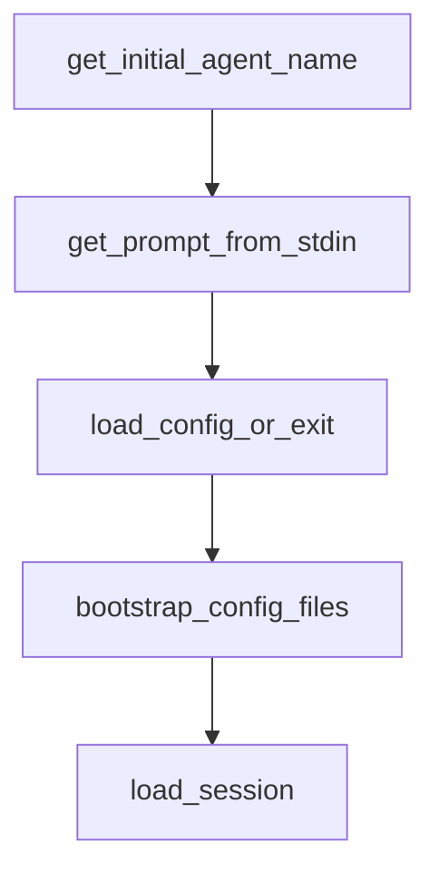

# Chapter 7: ACP and Editor Integrations

Welcome to **Chapter 7: ACP and Editor Integrations**. In this part of **Mistral Vibe Tutorial: Minimal CLI Coding Agent by Mistral**, you will build an intuitive mental model first, then move into concrete implementation details and practical production tradeoffs.


Vibe includes ACP support so editor clients can run agent workflows through standardized protocol interfaces.

## Integration Path

- use `vibe-acp` as ACP server command
- configure supported editors (Zed, JetBrains, Neovim plugins)
- keep auth/config setup consistent between CLI and ACP sessions

## Source References

- [ACP setup documentation](https://github.com/mistralai/mistral-vibe/blob/main/docs/acp-setup.md)
- [ACP entrypoint implementation](https://github.com/mistralai/mistral-vibe/blob/main/vibe/acp/entrypoint.py)

## Summary

You now have a clear model for connecting Vibe to ACP-capable editor environments.

Next: [Chapter 8: Production Operations and Governance](08-production-operations-and-governance.md)

## Depth Expansion Playbook

## Source Code Walkthrough

### `vibe/cli/cli.py`

The `get_initial_agent_name` function in [`vibe/cli/cli.py`](https://github.com/mistralai/mistral-vibe/blob/HEAD/vibe/cli/cli.py) handles a key part of this chapter's functionality:

```py


def get_initial_agent_name(args: argparse.Namespace) -> str:
    if args.prompt is not None and args.agent == BuiltinAgentName.DEFAULT:
        return BuiltinAgentName.AUTO_APPROVE
    return args.agent


def get_prompt_from_stdin() -> str | None:
    if sys.stdin.isatty():
        return None
    try:
        if content := sys.stdin.read().strip():
            sys.stdin = sys.__stdin__ = open("/dev/tty")
            return content
    except KeyboardInterrupt:
        pass
    except OSError:
        return None

    return None


def load_config_or_exit() -> VibeConfig:
    try:
        return VibeConfig.load()
    except MissingAPIKeyError:
        run_onboarding()
        return VibeConfig.load()
    except MissingPromptFileError as e:
        rprint(f"[yellow]Invalid system prompt id: {e}[/]")
        sys.exit(1)
```

This function is important because it defines how Mistral Vibe Tutorial: Minimal CLI Coding Agent by Mistral implements the patterns covered in this chapter.

### `vibe/cli/cli.py`

The `get_prompt_from_stdin` function in [`vibe/cli/cli.py`](https://github.com/mistralai/mistral-vibe/blob/HEAD/vibe/cli/cli.py) handles a key part of this chapter's functionality:

```py


def get_prompt_from_stdin() -> str | None:
    if sys.stdin.isatty():
        return None
    try:
        if content := sys.stdin.read().strip():
            sys.stdin = sys.__stdin__ = open("/dev/tty")
            return content
    except KeyboardInterrupt:
        pass
    except OSError:
        return None

    return None


def load_config_or_exit() -> VibeConfig:
    try:
        return VibeConfig.load()
    except MissingAPIKeyError:
        run_onboarding()
        return VibeConfig.load()
    except MissingPromptFileError as e:
        rprint(f"[yellow]Invalid system prompt id: {e}[/]")
        sys.exit(1)
    except ValueError as e:
        rprint(f"[yellow]{e}[/]")
        sys.exit(1)


def bootstrap_config_files() -> None:
```

This function is important because it defines how Mistral Vibe Tutorial: Minimal CLI Coding Agent by Mistral implements the patterns covered in this chapter.

### `vibe/cli/cli.py`

The `load_config_or_exit` function in [`vibe/cli/cli.py`](https://github.com/mistralai/mistral-vibe/blob/HEAD/vibe/cli/cli.py) handles a key part of this chapter's functionality:

```py


def load_config_or_exit() -> VibeConfig:
    try:
        return VibeConfig.load()
    except MissingAPIKeyError:
        run_onboarding()
        return VibeConfig.load()
    except MissingPromptFileError as e:
        rprint(f"[yellow]Invalid system prompt id: {e}[/]")
        sys.exit(1)
    except ValueError as e:
        rprint(f"[yellow]{e}[/]")
        sys.exit(1)


def bootstrap_config_files() -> None:
    mgr = get_harness_files_manager()
    config_file = mgr.user_config_file
    if not config_file.exists():
        try:
            config_file.parent.mkdir(parents=True, exist_ok=True)
            with config_file.open("wb") as f:
                tomli_w.dump(VibeConfig.create_default(), f)
        except Exception as e:
            rprint(f"[yellow]Could not create default config file: {e}[/]")

    history_file = HISTORY_FILE.path
    if not history_file.exists():
        try:
            history_file.parent.mkdir(parents=True, exist_ok=True)
            history_file.write_text("Hello Vibe!\n", "utf-8")
```

This function is important because it defines how Mistral Vibe Tutorial: Minimal CLI Coding Agent by Mistral implements the patterns covered in this chapter.

### `vibe/cli/cli.py`

The `bootstrap_config_files` function in [`vibe/cli/cli.py`](https://github.com/mistralai/mistral-vibe/blob/HEAD/vibe/cli/cli.py) handles a key part of this chapter's functionality:

```py


def bootstrap_config_files() -> None:
    mgr = get_harness_files_manager()
    config_file = mgr.user_config_file
    if not config_file.exists():
        try:
            config_file.parent.mkdir(parents=True, exist_ok=True)
            with config_file.open("wb") as f:
                tomli_w.dump(VibeConfig.create_default(), f)
        except Exception as e:
            rprint(f"[yellow]Could not create default config file: {e}[/]")

    history_file = HISTORY_FILE.path
    if not history_file.exists():
        try:
            history_file.parent.mkdir(parents=True, exist_ok=True)
            history_file.write_text("Hello Vibe!\n", "utf-8")
        except Exception as e:
            rprint(f"[yellow]Could not create history file: {e}[/]")


def load_session(
    args: argparse.Namespace, config: VibeConfig
) -> tuple[list[LLMMessage], Path] | None:
    if not args.continue_session and not args.resume:
        return None

    if not config.session_logging.enabled:
        rprint(
            "[red]Session logging is disabled. "
            "Enable it in config to use --continue or --resume[/]"
```

This function is important because it defines how Mistral Vibe Tutorial: Minimal CLI Coding Agent by Mistral implements the patterns covered in this chapter.


## How These Components Connect


