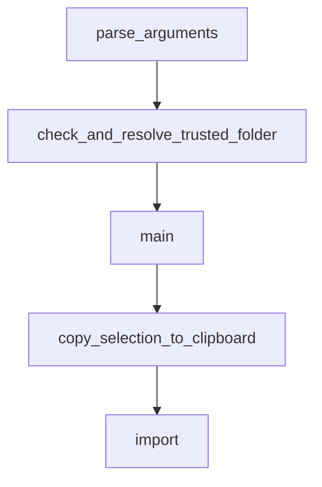

# Chapter 8: Production Operations and Governance

Welcome to **Chapter 8: Production Operations and Governance**. In this part of **Mistral Vibe Tutorial: Minimal CLI Coding Agent by Mistral**, you will build an intuitive mental model first, then move into concrete implementation details and practical production tradeoffs.


Production Vibe usage requires policy around approvals, tool permissions, and update cadence.

## Governance Checklist

1. define approved agent profiles by environment
2. restrict auto-approve usage to trusted, low-risk workflows
3. review skill/tool additions via normal code review
4. pin and test versions before organization-wide rollouts
5. monitor CI and release updates for behavior changes

## Source References

- [Mistral Vibe README](https://github.com/mistralai/mistral-vibe/blob/main/README.md)
- [Mistral Vibe CI workflow](https://github.com/mistralai/mistral-vibe/blob/main/.github/workflows/ci.yml)

## Summary

You now have a practical baseline for responsible team-scale Vibe adoption.

## Depth Expansion Playbook

## Source Code Walkthrough

### `vibe/cli/entrypoint.py`

The `parse_arguments` function in [`vibe/cli/entrypoint.py`](https://github.com/mistralai/mistral-vibe/blob/HEAD/vibe/cli/entrypoint.py) handles a key part of this chapter's functionality:

```py


def parse_arguments() -> argparse.Namespace:
    parser = argparse.ArgumentParser(description="Run the Mistral Vibe interactive CLI")
    parser.add_argument(
        "-v", "--version", action="version", version=f"%(prog)s {__version__}"
    )
    parser.add_argument(
        "initial_prompt",
        nargs="?",
        metavar="PROMPT",
        help="Initial prompt to start the interactive session with.",
    )
    parser.add_argument(
        "-p",
        "--prompt",
        nargs="?",
        const="",
        metavar="TEXT",
        help="Run in programmatic mode: send prompt, auto-approve all tools, "
        "output response, and exit.",
    )
    parser.add_argument(
        "--max-turns",
        type=int,
        metavar="N",
        help="Maximum number of assistant turns "
        "(only applies in programmatic mode with -p).",
    )
    parser.add_argument(
        "--max-price",
        type=float,
```

This function is important because it defines how Mistral Vibe Tutorial: Minimal CLI Coding Agent by Mistral implements the patterns covered in this chapter.

### `vibe/cli/entrypoint.py`

The `check_and_resolve_trusted_folder` function in [`vibe/cli/entrypoint.py`](https://github.com/mistralai/mistral-vibe/blob/HEAD/vibe/cli/entrypoint.py) handles a key part of this chapter's functionality:

```py


def check_and_resolve_trusted_folder() -> None:
    try:
        cwd = Path.cwd()
    except FileNotFoundError:
        rprint(
            "[red]Error: Current working directory no longer exists.[/]\n"
            "[yellow]The directory you started vibe from has been deleted. "
            "Please change to an existing directory and try again, "
            "or use --workdir to specify a working directory.[/]"
        )
        sys.exit(1)

    if not has_trustable_content(cwd) or cwd.resolve() == Path.home().resolve():
        return

    is_folder_trusted = trusted_folders_manager.is_trusted(cwd)

    if is_folder_trusted is not None:
        return

    try:
        is_folder_trusted = ask_trust_folder(cwd)
    except (KeyboardInterrupt, EOFError, TrustDialogQuitException):
        sys.exit(0)
    except Exception as e:
        rprint(f"[yellow]Error showing trust dialog: {e}[/]")
        return

    if is_folder_trusted is True:
        trusted_folders_manager.add_trusted(cwd)
```

This function is important because it defines how Mistral Vibe Tutorial: Minimal CLI Coding Agent by Mistral implements the patterns covered in this chapter.

### `vibe/cli/entrypoint.py`

The `main` function in [`vibe/cli/entrypoint.py`](https://github.com/mistralai/mistral-vibe/blob/HEAD/vibe/cli/entrypoint.py) handles a key part of this chapter's functionality:

```py


def main() -> None:
    args = parse_arguments()

    if args.workdir:
        workdir = args.workdir.expanduser().resolve()
        if not workdir.is_dir():
            rprint(
                f"[red]Error: --workdir does not exist or is not a directory: {workdir}[/]"
            )
            sys.exit(1)
        os.chdir(workdir)

    is_interactive = args.prompt is None
    if is_interactive:
        check_and_resolve_trusted_folder()
    init_harness_files_manager("user", "project")

    from vibe.cli.cli import run_cli

    run_cli(args)


if __name__ == "__main__":
    main()

```

This function is important because it defines how Mistral Vibe Tutorial: Minimal CLI Coding Agent by Mistral implements the patterns covered in this chapter.

### `vibe/cli/clipboard.py`

The `copy_selection_to_clipboard` function in [`vibe/cli/clipboard.py`](https://github.com/mistralai/mistral-vibe/blob/HEAD/vibe/cli/clipboard.py) handles a key part of this chapter's functionality:

```py


def copy_selection_to_clipboard(app: App, show_toast: bool = True) -> str | None:
    selected_texts = _get_selected_texts(app)
    if not selected_texts:
        return None

    combined_text = "\n".join(selected_texts)
    try:
        _copy_to_clipboard(combined_text)
        if show_toast:
            app.notify(
                f'"{_shorten_preview(selected_texts)}" copied to clipboard',
                severity="information",
                timeout=2,
                markup=False,
            )
        return combined_text
    except Exception:
        app.notify(
            "Failed to copy - clipboard not available", severity="warning", timeout=3
        )
        return None

```

This function is important because it defines how Mistral Vibe Tutorial: Minimal CLI Coding Agent by Mistral implements the patterns covered in this chapter.


## How These Components Connect


