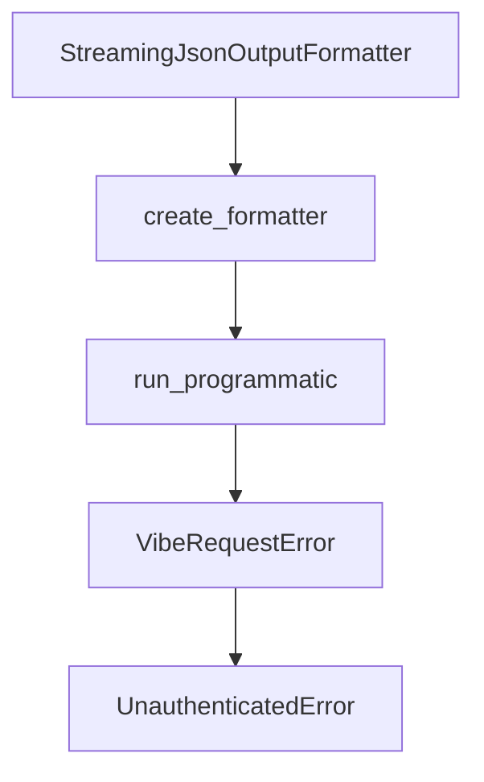

# Chapter 8: Production Operations and Governance

Welcome to **Chapter 8: Production Operations and Governance**. In this part of **Mistral Vibe Tutorial: Minimal CLI Coding Agent by Mistral**, you will build an intuitive mental model first, then move into concrete implementation details and practical production tradeoffs.


Production Vibe usage requires policy around approvals, tool permissions, and update cadence.

## Governance Checklist

1. define approved agent profiles by environment
2. restrict auto-approve usage to trusted, low-risk workflows
3. review skill/tool additions via normal code review
4. pin and test versions before organization-wide rollouts
5. monitor CI and release updates for behavior changes

## Source References

- [Mistral Vibe README](https://github.com/mistralai/mistral-vibe/blob/main/README.md)
- [Mistral Vibe CI workflow](https://github.com/mistralai/mistral-vibe/blob/main/.github/workflows/ci.yml)

## Summary

You now have a practical baseline for responsible team-scale Vibe adoption.

## Source Code Walkthrough

### `vibe/core/output_formatters.py`

The `StreamingJsonOutputFormatter` class in [`vibe/core/output_formatters.py`](https://github.com/mistralai/mistral-vibe/blob/HEAD/vibe/core/output_formatters.py) handles a key part of this chapter's functionality:

```py


class StreamingJsonOutputFormatter(OutputFormatter):
    def on_message_added(self, message: LLMMessage) -> None:
        json.dump(message.model_dump(mode="json"), self.stream, ensure_ascii=False)
        self.stream.write("\n")
        self.stream.flush()

    def on_event(self, event: BaseEvent) -> None:
        pass

    def finalize(self) -> str | None:
        return None


def create_formatter(
    format_type: OutputFormat, stream: TextIO = sys.stdout
) -> OutputFormatter:
    formatters = {
        OutputFormat.TEXT: TextOutputFormatter,
        OutputFormat.JSON: JsonOutputFormatter,
        OutputFormat.STREAMING: StreamingJsonOutputFormatter,
    }

    formatter_class = formatters.get(format_type, TextOutputFormatter)
    return formatter_class(stream)

```

This class is important because it defines how Mistral Vibe Tutorial: Minimal CLI Coding Agent by Mistral implements the patterns covered in this chapter.

### `vibe/core/output_formatters.py`

The `create_formatter` function in [`vibe/core/output_formatters.py`](https://github.com/mistralai/mistral-vibe/blob/HEAD/vibe/core/output_formatters.py) handles a key part of this chapter's functionality:

```py


def create_formatter(
    format_type: OutputFormat, stream: TextIO = sys.stdout
) -> OutputFormatter:
    formatters = {
        OutputFormat.TEXT: TextOutputFormatter,
        OutputFormat.JSON: JsonOutputFormatter,
        OutputFormat.STREAMING: StreamingJsonOutputFormatter,
    }

    formatter_class = formatters.get(format_type, TextOutputFormatter)
    return formatter_class(stream)

```

This function is important because it defines how Mistral Vibe Tutorial: Minimal CLI Coding Agent by Mistral implements the patterns covered in this chapter.

### `vibe/core/programmatic.py`

The `run_programmatic` function in [`vibe/core/programmatic.py`](https://github.com/mistralai/mistral-vibe/blob/HEAD/vibe/core/programmatic.py) handles a key part of this chapter's functionality:

```py
from vibe.core.utils import ConversationLimitException

__all__ = ["TeleportError", "run_programmatic"]

_DEFAULT_CLIENT_METADATA = ClientMetadata(name="vibe_programmatic", version=__version__)


def run_programmatic(
    config: VibeConfig,
    prompt: str,
    max_turns: int | None = None,
    max_price: float | None = None,
    output_format: OutputFormat = OutputFormat.TEXT,
    previous_messages: list[LLMMessage] | None = None,
    agent_name: str = BuiltinAgentName.AUTO_APPROVE,
    client_metadata: ClientMetadata = _DEFAULT_CLIENT_METADATA,
    teleport: bool = False,
) -> str | None:
    formatter = create_formatter(output_format)

    agent_loop = AgentLoop(
        config,
        agent_name=agent_name,
        message_observer=formatter.on_message_added,
        max_turns=max_turns,
        max_price=max_price,
        enable_streaming=False,
        entrypoint_metadata=EntrypointMetadata(
            agent_entrypoint="programmatic",
            agent_version=__version__,
            client_name=client_metadata.name,
            client_version=client_metadata.version,
```

This function is important because it defines how Mistral Vibe Tutorial: Minimal CLI Coding Agent by Mistral implements the patterns covered in this chapter.

### `vibe/acp/exceptions.py`

The `VibeRequestError` class in [`vibe/acp/exceptions.py`](https://github.com/mistralai/mistral-vibe/blob/HEAD/vibe/acp/exceptions.py) handles a key part of this chapter's functionality:

```py


class VibeRequestError(RequestError):
    code: int

    def __init__(self, message: str, data: dict[str, Any] | None = None) -> None:
        super().__init__(self.code, message, data)


class UnauthenticatedError(VibeRequestError):
    code = UNAUTHENTICATED

    def __init__(self, detail: str) -> None:
        super().__init__(message=detail)

    @classmethod
    def from_missing_api_key(cls, exc: MissingAPIKeyError) -> UnauthenticatedError:
        return cls(f"Missing API key for {exc.provider_name} provider.")


class NotImplementedMethodError(VibeRequestError):
    code = METHOD_NOT_FOUND

    def __init__(self, method: str) -> None:
        super().__init__(
            message=f"Method not implemented: {method}", data={"method": method}
        )


class InvalidRequestError(VibeRequestError):
    code = INVALID_PARAMS

```

This class is important because it defines how Mistral Vibe Tutorial: Minimal CLI Coding Agent by Mistral implements the patterns covered in this chapter.


## How These Components Connect


