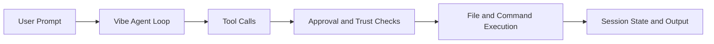

# Mistral Vibe Tutorial: Minimal CLI Coding Agent by Mistral

> Learn how to use `mistralai/mistral-vibe` for terminal-native coding workflows with configurable agent profiles, skills, subagents, and ACP integrations.

## Why This Track Matters

Mistral Vibe is a fast-moving open-source coding agent with strong terminal ergonomics, configurable trust controls, and extensibility through skills and ACP tooling.

This track focuses on:

- installation and interactive terminal operation
- trust and approval controls for safer edits/commands
- skills/subagent orchestration for complex tasks
- automation and ACP-based editor integrations

## Current Snapshot (Verified February 12, 2026)

- repository: [`mistralai/mistral-vibe`](https://github.com/mistralai/mistral-vibe)
- stars: about **3.0k**
- latest release: [`v2.1.0`](https://github.com/mistralai/mistral-vibe/releases/tag/v2.1.0)
- recent activity: updates on **February 11, 2026**
- project positioning: minimal but capable CLI coding assistant by Mistral

## Mental Model

## Chapter Guide

| Chapter | Key Question | Outcome |
|:--------|:-------------|:--------|
| [01 - Getting Started](01-getting-started.md) | How do I install and launch Vibe quickly? | Working baseline |
| [02 - Agent Profiles and Trust Model](02-agent-profiles-and-trust-model.md) | How do built-in agents and trust folders affect behavior? | Safer execution defaults |
| [03 - Tooling and Approval Workflow](03-tooling-and-approval-workflow.md) | How does Vibe handle file edits, shell commands, and approvals? | Reliable operator control |
| [04 - Skills and Slash Command Extensions](04-skills-and-slash-command-extensions.md) | How do I codify repeatable prompts and custom commands? | Reusable team workflows |
| [05 - Subagents and Task Delegation](05-subagents-and-task-delegation.md) | How can Vibe parallelize specialized work safely? | Better scaling for complex tasks |
| [06 - Programmatic and Non-Interactive Modes](06-programmatic-and-non-interactive-modes.md) | How do I use Vibe in scripts and CI flows? | Automation strategy |
| [07 - ACP and Editor Integrations](07-acp-and-editor-integrations.md) | How does Vibe connect to IDE clients and ACP tools? | Multi-client integration model |
| [08 - Production Operations and Governance](08-production-operations-and-governance.md) | How do teams operationalize Vibe responsibly? | Production baseline |

## What You Will Learn

- how to run Vibe in interactive and scripted workflows
- how to tune safety and trust controls for team use
- how to extend behavior through skills and agent profiles
- how to integrate ACP workflows with supported editors

## Source References

- [Mistral Vibe Repository](https://github.com/mistralai/mistral-vibe)
- [Mistral Vibe README](https://github.com/mistralai/mistral-vibe/blob/main/README.md)
- [ACP setup docs](https://github.com/mistralai/mistral-vibe/blob/main/docs/acp-setup.md)
- [ACP entrypoint](https://github.com/mistralai/mistral-vibe/blob/main/vibe/acp/entrypoint.py)

## Related Tutorials

- [Kimi CLI Tutorial](../kimi-cli-tutorial/)
- [GitHub Copilot CLI Tutorial](../copilot-cli-tutorial/)
- [Cline Tutorial](../cline-tutorial/)
- [OpenCode Tutorial](../opencode-tutorial/)

---

Start with [Chapter 1: Getting Started](01-getting-started.md).
