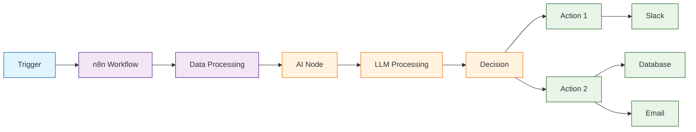

# n8n AI Tutorial: Workflow Automation with AI

> Build powerful AI-powered automations with n8n's visual workflow builder.

<div align="center">

**⚡ AI Meets Automation**

[](https://github.com/n8n-io/n8n)

</div>

---

## 🎯 What is n8n?

**n8n**<sup>[View Repo](https://github.com/n8n-io/n8n)</sup> is a fair-code workflow automation platform that lets you connect anything to everything. With its AI capabilities, you can build intelligent automations that leverage LLMs, process documents, and make smart decisions.

### Key Features

| Feature | Description |
|:--------|:------------|
| **Visual Builder** | Drag-and-drop workflow creation |
| **AI Nodes** | OpenAI, Anthropic, local models |
| **400+ Integrations** | Connect any service |
| **Self-Hostable** | Full control over your data |
| **Code When Needed** | JavaScript/Python in workflows |
| **Agents** | Build AI agents with tools |



## Tutorial Chapters

1. **[Chapter 1: Getting Started](01-getting-started.md)** - Installation and first workflow
2. **[Chapter 2: AI Nodes](02-ai-nodes.md)** - Using OpenAI, Anthropic, and local models
3. **[Chapter 3: Document AI](03-document-ai.md)** - Processing PDFs, images, and text
4. **[Chapter 4: AI Agents](04-ai-agents.md)** - Building autonomous agents
5. **[Chapter 5: RAG Workflows](05-rag.md)** - Retrieval-augmented generation
6. **[Chapter 6: Smart Decisions](06-decisions.md)** - AI-powered routing and logic
7. **[Chapter 7: Custom AI Tools](07-custom-tools.md)** - Extending agent capabilities
8. **[Chapter 8: Production Deployment](08-production.md)** - Scaling and monitoring

## What You'll Learn

- **Build AI Workflows** visually with n8n
- **Connect LLM Providers** (OpenAI, Anthropic, Ollama)
- **Process Documents** with AI extraction
- **Create AI Agents** with tool access
- **Implement RAG** for knowledge-based AI
- **Make Smart Decisions** based on AI analysis
- **Deploy Production** automations

## Prerequisites

- Docker (recommended) or Node.js 18+
- API keys for AI providers
- Basic workflow automation understanding

## Quick Start

### Docker

```bash
docker run -it --rm \
  --name n8n \
  -p 5678:5678 \
  -v n8n_data:/home/node/.n8n \
  n8nio/n8n

# Open http://localhost:5678
```

### npm

```bash
npm install n8n -g
n8n start
```

## Your First AI Workflow

1. **Add Trigger** - Webhook, Schedule, or Manual
2. **Add AI Node** - OpenAI, Anthropic, etc.
3. **Configure Prompt** - Define your AI task
4. **Add Output** - Slack, Email, Database
5. **Activate** - Run your workflow

## AI Nodes Available

| Node | Capability |
|:-----|:-----------|
| **OpenAI** | GPT-4, GPT-3.5, embeddings |
| **Anthropic** | Claude 3.5, Claude 3 |
| **Ollama** | Local LLM inference |
| **AI Agent** | Autonomous agents with tools |
| **Vector Store** | RAG with Pinecone, Qdrant |
| **Document Loader** | PDF, web, text processing |

## Example: Smart Email Responder

```json
{
  "nodes": [
    {
      "type": "gmail-trigger",
      "parameters": {"event": "newEmail"}
    },
    {
      "type": "openai",
      "parameters": {
        "model": "gpt-4o",
        "prompt": "Classify this email and draft a response:\n\n{{$json.text}}"
      }
    },
    {
      "type": "if",
      "parameters": {
        "conditions": [{"value1": "{{$json.classification}}", "value2": "urgent"}]
      }
    },
    {
      "type": "gmail",
      "parameters": {"operation": "sendReply"}
    }
  ]
}
```

## AI Agent Example

```
Trigger: Customer Support Ticket

AI Agent:
  - Tool: Search Knowledge Base
  - Tool: Check Order Status
  - Tool: Create Support Ticket
  
Logic: Agent decides which tools to use based on customer query

Output: 
  - Reply to customer
  - Update CRM
  - Notify team if escalation needed
```

## RAG Workflow

```
1. Document Loader → Process PDF
2. Text Splitter → Chunk document
3. Embeddings → OpenAI embeddings
4. Vector Store → Store in Pinecone
5. On Query:
   - Search vector store
   - Pass context to LLM
   - Generate response
```

## Integrations + AI

| Integration | AI Use Case |
|:------------|:------------|
| **Slack** | AI-powered responses |
| **Gmail** | Smart email categorization |
| **Notion** | AI content generation |
| **Airtable** | Data enrichment |
| **GitHub** | PR review automation |
| **Stripe** | Fraud detection |

## Learning Path

### 🟢 Beginner Track
1. Chapters 1-3: Setup and basic AI nodes
2. Build simple AI automations

### 🟡 Intermediate Track
1. Chapters 4-6: Agents, RAG, and decisions
2. Create intelligent workflows

### 🔴 Advanced Track
1. Chapters 7-8: Custom tools and production
2. Scale enterprise AI automation

---

**Ready to automate with AI? Let's begin with [Chapter 1: Getting Started](01-getting-started.md)!**

*Generated for [Awesome Code Docs](https://github.com/johnxie/awesome-code-docs)*
