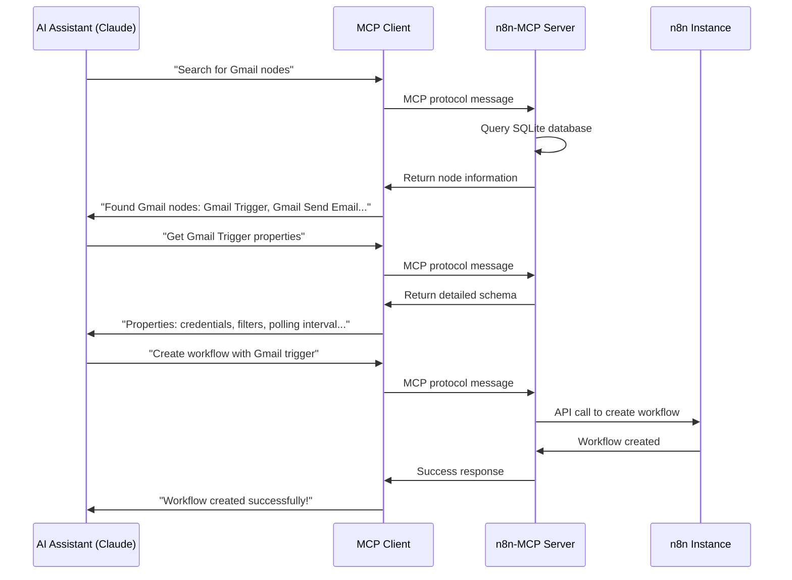
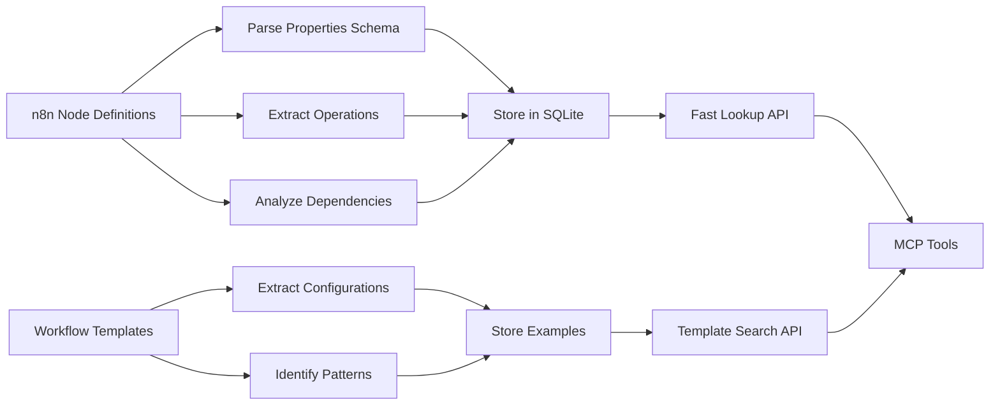

# Chapter 1: Understanding MCP Protocol and n8n Integration

Welcome to your journey into n8n-MCP! Before we dive into the code, let's understand what makes this project so powerful. Imagine you're an AI assistant trying to help someone build a workflow. Without n8n-MCP, you'd be guessing at node configurations and capabilities. With it, you have instant access to comprehensive knowledge about n8n's entire ecosystem.

## What Problem Does This Solve?

Think about this scenario: You're Claude, helping a user automate their email marketing workflow. They want to connect Gmail to a CRM system, filter leads, and send personalized emails. Without n8n-MCP, you'd know Gmail and email concepts generally, but you'd have to guess:

- What n8n nodes are available for Gmail?
- How do you configure the Gmail trigger?
- What parameters does the CRM node accept?
- Are there existing workflow templates you could adapt?

With n8n-MCP, you instantly know that n8n has Gmail nodes with specific properties, you can see real workflow examples, and you can even create and test workflows directly. This transforms AI assistants from helpful generalists into n8n workflow experts.

## The Model Context Protocol (MCP)

The Model Context Protocol is like a universal translator that lets AI assistants communicate with external tools and data sources. Think of it as a standardized API that AI models can use to extend their capabilities beyond just text generation.

### How MCP Works



### MCP vs Traditional APIs

Traditional APIs require AI assistants to understand each service's specific interface. MCP provides a standardized way to:

1. **Discover available tools** - "What can you do?"
2. **Execute tools** - "Do this specific action"
3. **Handle responses** - Standardized success/error formats

This means AI assistants can work with any MCP-compatible service using the same mental model.

## n8n: The Workflow Automation Powerhouse

n8n is an open-source workflow automation tool that connects different services together. It's like Zapier or Microsoft Power Automate, but with much more flexibility and power. n8n has grown to include:

- **537 core nodes** - Built-in integrations for popular services
- **547 community nodes** - User-contributed integrations
- **Extensive customization** - Build custom logic and integrations
- **Self-hosted option** - Run on your own infrastructure

The challenge? With over 1,000 nodes, finding the right one and configuring it correctly is complex. This is where n8n-MCP shines.

## The n8n-MCP Bridge

n8n-MCP acts as the perfect translator between AI assistants and n8n's complexity. It provides:

### 1. **Comprehensive Node Knowledge**
```typescript
// Instead of guessing, AI assistants get exact information
{
  "nodeType": "n8n-nodes-base.gmail",
  "properties": {
    "credential": "gmailOAuth2",
    "operation": ["send", "get", "getAll"],
    "email": "user@example.com",
    // ... complete schema
  }
}
```

### 2. **Real-World Examples**
n8n-MCP extracts configurations from 2,646+ actual workflows, so AI assistants learn from real usage patterns rather than theoretical documentation.

### 3. **Direct Workflow Manipulation**
Beyond just providing information, n8n-MCP lets AI assistants create, modify, and test workflows directly through the n8n API.

## How n8n-MCP Processes n8n Data

The system doesn't just scrape documentation—it intelligently processes n8n's node definitions:



This processing enables lightning-fast responses—AI assistants get answers in milliseconds, not minutes of searching.

## The Two Communication Modes

n8n-MCP supports two deployment scenarios:

### 1. **Stdio Mode (Local Development)**
For Claude Desktop and local AI assistants:
- Direct process communication
- No network setup required
- Perfect for development and testing

### 2. **HTTP Mode (Production)**
For remote deployments and multi-tenant scenarios:
- REST API with session management
- Supports Server-Sent Events (SSE)
- Production-ready with health checks

## Why This Architecture Matters

The beauty of n8n-MCP's design is its **composability**. Each component can be used independently:

- Want just the MCP server? Use `N8NDocumentationMCPServer`
- Need HTTP API integration? Use `N8NMCPEngine`
- Building a multi-tenant platform? Use `InstanceContext`

This modular design makes n8n-MCP incredibly flexible for different deployment scenarios.

## What You'll Learn Next

Now that you understand the "why" and "what" of n8n-MCP, the following chapters will dive into the "how":

- **Chapter 2** explores the `N8NMCPEngine` - the main integration point
- **Chapter 3** covers session management for production deployments
- **Chapter 4** dives into the `N8nApiClient` for robust API communication

Congratulations! You now understand how n8n-MCP transforms AI assistants from general-purpose helpers into n8n workflow automation experts. Ready to see how it works under the hood?