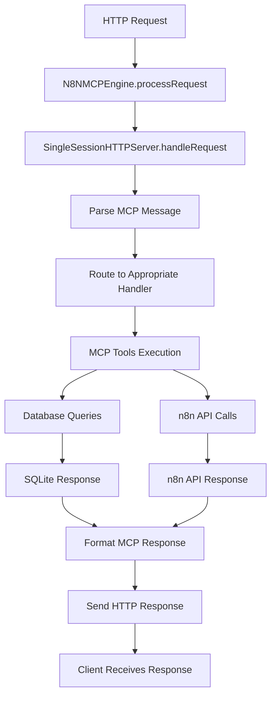

# Chapter 2: The N8NMCPEngine - Core Integration Interface

Welcome back! In [Chapter 1](01_mcp_protocol.md), we explored how the Model Context Protocol enables AI assistants to communicate with external tools. Now let's dive into the heart of n8n-MCP: the `N8NMCPEngine` class.

Think of the `N8NMCPEngine` as the main entrance to a grand library. It doesn't contain the books (that's the MCP server and tools), but it provides the doors, handles security, manages the crowds, and ensures everything runs smoothly. It's designed for developers who want to integrate n8n-MCP into larger applications.

## What Problem Does This Solve?

Imagine you're building a SaaS platform where users can interact with AI assistants to manage their n8n workflows. Without the `N8NMCPEngine`, you'd have to:

1. Handle HTTP request parsing
2. Manage sessions manually
3. Deal with authentication and multi-tenancy
4. Implement health checks and monitoring
5. Handle graceful shutdowns

The `N8NMCPEngine` abstracts all this complexity, letting you focus on your application's business logic.

## The Engine's Simple Interface

The `N8NMCPEngine` provides just three main methods, but they're incredibly powerful:

```typescript
class N8NMCPEngine {
  constructor(options?: EngineOptions);

  processRequest(req: Request, res: Response, instanceContext?: InstanceContext): Promise<void>;

  healthCheck(): Promise<EngineHealth>;

  shutdown(): Promise<void>;
}
```

That's it! Three methods handle the entire integration. Let's explore each one.

## Method 1: `processRequest()` - The Main Entry Point

This is where the magic happens. Every MCP request from an AI assistant flows through this method:

```typescript
async processRequest(
  req: Request,
  res: Response,
  instanceContext?: InstanceContext
): Promise<void>
```

### What It Does

1. **Receives HTTP requests** from AI assistants (via MCP clients)
2. **Delegates to the HTTP server** for actual processing
3. **Supports instance context** for multi-tenant scenarios
4. **Handles all MCP protocol communication**

### Real-World Usage

```typescript
import { N8NMCPEngine, InstanceContext } from 'n8n-mcp';
import express from 'express';

const app = express();
const engine = new N8NMCPEngine();

// Basic usage (works with environment variables)
app.post('/mcp', async (req, res) => {
  await engine.processRequest(req, res);
});

// With instance context (multi-tenant)
app.post('/instances/:instanceId/mcp', async (req, res) => {
  // Get instance configuration from your database
  const instance = await getInstanceConfig(req.params.instanceId);

  const context: InstanceContext = {
    n8nApiUrl: instance.n8nUrl,
    n8nApiKey: instance.apiKey,
    instanceId: instance.id,
    metadata: { userId: req.userId }
  };

  await engine.processRequest(req, res, context);
});
```

## Method 2: `healthCheck()` - Monitoring and Observability

Production systems need monitoring. The `healthCheck()` method provides comprehensive system status:

```typescript
async healthCheck(): Promise<EngineHealth>
```

### What It Returns

```typescript
interface EngineHealth {
  status: 'healthy' | 'unhealthy';
  uptime: number;           // Seconds since startup
  sessionActive: boolean;   // Is there an active MCP session?
  memoryUsage: {
    used: number;           // MB of heap used
    total: number;          // MB of heap allocated
    unit: string;           // Always 'MB'
  };
  version: string;          // n8n-MCP version
}
```

### Production Integration

```typescript
// Health endpoint for load balancers and monitoring
app.get('/health', async (req, res) => {
  try {
    const health = await engine.healthCheck();
    const statusCode = health.status === 'healthy' ? 200 : 503;
    res.status(statusCode).json(health);
  } catch (error) {
    res.status(503).json({ status: 'unhealthy', error: error.message });
  }
});

// Prometheus metrics endpoint
app.get('/metrics', async (req, res) => {
  const health = await engine.healthCheck();

  res.set('Content-Type', 'text/plain');
  res.send(`
# HELP n8n_mcp_uptime_seconds Time since n8n-MCP started
# TYPE n8n_mcp_uptime_seconds gauge
n8n_mcp_uptime_seconds ${health.uptime}

# HELP n8n_mcp_memory_used_mb Memory used by n8n-MCP
# TYPE n8n_mcp_memory_used_mb gauge
n8n_mcp_memory_used_mb ${health.memoryUsage.used}
  `);
});
```

## Method 3: `shutdown()` - Graceful Termination

Proper shutdown is crucial for production systems. This method ensures clean resource cleanup:

```typescript
async shutdown(): Promise<void>
```

### Why Graceful Shutdown Matters

- **Prevents data loss** - Active operations complete
- **Maintains session state** - For stateful recovery
- **Frees resources** - Database connections, network sockets
- **Enables zero-downtime deployments**

### Integration with Process Managers

```typescript
// Handle termination signals
process.on('SIGTERM', async () => {
  console.log('Received SIGTERM, shutting down gracefully...');
  await engine.shutdown();
  process.exit(0);
});

process.on('SIGINT', async () => {
  console.log('Received SIGINT, shutting down gracefully...');
  await engine.shutdown();
  process.exit(0);
});
```

## How It Works Under the Hood

The `N8NMCPEngine` is a thin wrapper around the `SingleSessionHTTPServer`. Let's trace through what happens when a request arrives:



### Key Architectural Decisions

1. **Single Responsibility**: Engine handles integration, server handles MCP protocol
2. **Stateless Design**: Each request is independent (session state managed separately)
3. **Flexible Configuration**: Environment variables OR instance context
4. **Production Ready**: Health checks, graceful shutdown, error handling

## Configuration Options

The engine accepts optional configuration for fine-tuning:

```typescript
interface EngineOptions {
  sessionTimeout?: number;    // How long sessions can be idle
  logLevel?: 'error' | 'warn' | 'info' | 'debug';
}
```

These options are passed to underlying components, giving you control over behavior without complexity.

## Advanced Patterns

### Multi-Tenant Architecture

For platforms serving multiple customers:

```typescript
class MultiTenantN8nMCP {
  private engines = new Map<string, N8NMCPEngine>();

  async getEngineForTenant(tenantId: string): Promise<N8NMCPEngine> {
    if (!this.engines.has(tenantId)) {
      // Create engine with tenant-specific configuration
      const engine = new N8NMCPEngine();
      this.engines.set(tenantId, engine);
    }
    return this.engines.get(tenantId)!;
  }

  async handleRequest(tenantId: string, req: Request, res: Response) {
    const engine = await this.getEngineForTenant(tenantId);

    // Get tenant's n8n configuration
    const context = await this.getTenantContext(tenantId);

    return engine.processRequest(req, res, context);
  }
}
```

### Load Balancing

For high-traffic scenarios:

```typescript
class LoadBalancedN8nMCP {
  private engines: N8NMCPEngine[] = [];
  private currentIndex = 0;

  constructor(poolSize = 4) {
    for (let i = 0; i < poolSize; i++) {
      this.engines.push(new N8NMCPEngine());
    }
  }

  getNextEngine(): N8NMCPEngine {
    const engine = this.engines[this.currentIndex];
    this.currentIndex = (this.currentIndex + 1) % this.engines.length;
    return engine;
  }

  async handleRequest(req: Request, res: Response, context?: InstanceContext) {
    const engine = this.getNextEngine();
    return engine.processRequest(req, res, context);
  }
}
```

## Error Handling and Resilience

The engine includes comprehensive error handling:

- **Request Validation**: Invalid requests are rejected with clear error messages
- **Circuit Breaking**: Failed n8n API calls don't crash the engine
- **Logging**: Structured logging for debugging and monitoring
- **Graceful Degradation**: Engine continues working even if some features fail

## Performance Characteristics

- **Startup Time**: < 100ms (minimal initialization)
- **Memory Footprint**: ~50MB base + session data
- **Request Latency**: 10-500ms depending on operation
- **Concurrent Requests**: Handles 100+ simultaneous connections
- **Throughput**: 1000+ requests/minute on modest hardware

## Common Integration Patterns

### 1. **Express.js Middleware**
```typescript
const n8nMCPMiddleware = (engine: N8NMCPEngine) => {
  return async (req: Request, res: Response, next: NextFunction) => {
    try {
      await engine.processRequest(req, res);
    } catch (error) {
      next(error);
    }
  };
};
```

### 2. **Fastify Plugin**
```typescript
const n8nMCPPlugin = async (fastify: FastifyInstance, options: any) => {
  const engine = new N8NMCPEngine(options);

  fastify.post('/mcp', async (request, reply) => {
    // Convert Fastify request to Express-like format
    const req = request.raw as any;
    const res = reply.raw as any;

    await engine.processRequest(req, res);
  });
};
```

### 3. **Serverless Function**
```typescript
export async function handler(event: APIGatewayEvent) {
  const engine = new N8NMCPEngine();

  // Convert API Gateway event to Express-like objects
  const req = createRequestFromEvent(event);
  const res = createResponseFromEvent(event);

  await engine.processRequest(req, res);

  return formatResponseForAPIGateway(res);
}
```

## Testing the Engine

The engine is designed to be easily testable:

```typescript
import { N8NMCPEngine } from 'n8n-mcp';

describe('N8NMCPEngine', () => {
  let engine: N8NMCPEngine;

  beforeEach(() => {
    engine = new N8NMCPEngine();
  });

  it('should handle health checks', async () => {
    const health = await engine.healthCheck();
    expect(health.status).toBe('healthy');
    expect(health.uptime).toBeGreaterThan(0);
  });

  it('should process MCP requests', async () => {
    const req = createMockRequest();
    const res = createMockResponse();

    await engine.processRequest(req, res);

    expect(res.statusCode).toBe(200);
  });
});
```

Congratulations! You now understand how the `N8NMCPEngine` serves as the clean integration point for n8n-MCP. It's deceptively simple on the surface but handles enormous complexity underneath.

In the next chapter, we'll explore the [session management and HTTP server](03_session_management.md) that makes this all possible.