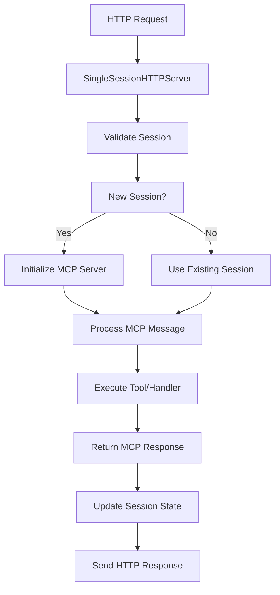

# Chapter 3: Session Management and HTTP Server

Welcome to the infrastructure layer! In [Chapter 2](02_engine_architecture.md), we saw how the `N8NMCPEngine` provides a clean integration API. Now let's explore what happens behind that API: the `SingleSessionHTTPServer` and its sophisticated session management.

Think of this chapter as understanding the electrical grid that powers a city. The `N8NMCPEngine` is like the city's main power plant, but the `SingleSessionHTTPServer` is the distribution network—managing connections, ensuring reliable delivery, and handling failures gracefully.

## Why Session Management Matters in MCP

MCP isn't like typical REST APIs where each request is independent. AI assistants establish **conversational sessions** where context matters:

```typescript
// This is NOT how MCP works:
GET /api/search-nodes?q=gmail  // Independent request

// This IS how MCP works:
POST /mcp {"method": "tools/call", "params": {...}}  // Part of a session
POST /mcp {"method": "tools/call", "params": {...}}  // Continues the session
POST /mcp {"method": "tools/call", "params": {...}}  // Still the same session
```

Each conversation with an AI assistant needs to maintain state, track tool availability, and handle authentication. That's where session management becomes crucial.

## The SingleSessionHTTPServer Architecture

The `SingleSessionHTTPServer` is designed around one core principle: **one session per server instance**. This design choice enables:

1. **Simplified State Management** - No complex multi-session coordination
2. **Better Performance** - Single session eliminates locking overhead
3. **Easier Debugging** - Clear session boundaries and logging
4. **Production Readiness** - Designed for containerized deployments



## Session Lifecycle

Sessions in n8n-MCP follow a clear lifecycle:

### 1. **Initialization Phase**
```typescript
// When first request arrives
const session = {
  id: generateUniqueId(),
  startTime: Date.now(),
  lastActivity: Date.now(),
  mcpServer: new N8NDocumentationMCPServer(),
  instanceContext: providedContext,
  isActive: true
};
```

### 2. **Active Phase**
- Processes MCP messages
- Updates `lastActivity` timestamp
- Maintains connection state
- Handles tool executions

### 3. **Idle Timeout**
- Monitors time since `lastActivity`
- Automatically cleans up idle sessions
- Prevents resource leaks

### 4. **Termination Phase**
- Graceful shutdown via `shutdown()` method
- Saves session state if needed
- Cleans up resources

## HTTP Transport: JSON-RPC vs SSE

The server supports two HTTP transport methods, each optimized for different use cases:

### JSON-RPC Mode (Default)
```typescript
// Request
POST /mcp
Content-Type: application/json

{
  "jsonrpc": "2.0",
  "id": 1,
  "method": "tools/list",
  "params": {}
}

// Response
{
  "jsonrpc": "2.0",
  "id": 1,
  "result": {
    "tools": [...]
  }
}
```

**Best for:**
- Simple integrations
- Load balancers that buffer responses
- Environments preferring request-response patterns

### Server-Sent Events (SSE) Mode
```typescript
// Initial handshake
POST /mcp?sse=true
// Server responds with session ID and starts SSE stream

// Client receives:
data: {"jsonrpc": "2.0", "id": 1, "result": {...}}
data: {"jsonrpc": "2.0", "method": "notifications/tools/list_changed", "params": {...}}
```

**Best for:**
- Real-time updates
- OpenAI Codex integration
- Long-running conversations
- Streaming responses

## Session State Persistence

For production deployments, session state can be exported and restored:

```typescript
interface SessionState {
  sessionId: string;
  instanceContext: InstanceContext;
  startTime: number;
  lastActivity: number;
  // ... other metadata
}

// Export before container restart
const sessions = engine.exportSessionState();

// Restore after container restart
const restoredCount = engine.restoreSessionState(sessions);
```

This enables **zero-downtime deployments** and **container orchestration** without losing active conversations.

## Multi-Tenant Session Isolation

The server supports multi-tenant deployments through instance context:

```typescript
// Each tenant gets isolated session management
const tenantA = { instanceId: 'tenant-a', n8nApiKey: 'key-a' };
const tenantB = { instanceId: 'tenant-b', n8nApiKey: 'key-b' };

// Requests with different contexts create separate sessions
await server.handleRequest(reqA, resA, tenantA);  // Session A
await server.handleRequest(reqB, resB, tenantB);  // Session B
```

## Error Handling and Resilience

The server implements comprehensive error handling:

### Request Validation
```typescript
// Invalid JSON
HTTP 400 Bad Request
{"error": "Invalid JSON in request body"}

// Missing required fields
HTTP 400 Bad Request
{"error": "Missing jsonrpc field"}

// Session timeout
HTTP 408 Request Timeout
{"error": "Session expired"}
```

### Circuit Breaking
- Failed n8n API calls don't crash sessions
- Automatic retry with exponential backoff
- Graceful degradation when services are unavailable

### Logging and Monitoring
```typescript
// Structured logging for debugging
logger.info('MCP request processed', {
  sessionId: 'sess-123',
  method: 'tools/call',
  duration: 150,
  success: true
});
```

## Performance Optimizations

### Connection Pooling
```typescript
// HTTP connections to n8n are pooled and reused
const axiosConfig = {
  baseURL: n8nApiUrl,
  timeout: 30000,
  maxSockets: 10,        // Connection pool
  keepAlive: true        // Persistent connections
};
```

### Caching Strategy
- Node metadata cached in memory
- Template search results cached with TTL
- Session state kept in memory for fast access

### Async Processing
```typescript
// Non-blocking request handling
app.post('/mcp', async (req, res) => {
  // Process asynchronously, don't block event loop
  await server.handleRequest(req, res, context);
});
```

## Production Deployment Patterns

### Docker Container
```dockerfile
FROM node:18-alpine
COPY dist/ /app/
EXPOSE 3000
CMD ["node", "/app/mcp/index.js"]
```

### Kubernetes Deployment
```yaml
apiVersion: apps/v1
kind: Deployment
metadata:
  name: n8n-mcp
spec:
  replicas: 3
  template:
    spec:
      containers:
      - name: n8n-mcp
        image: n8n-mcp:latest
        ports:
        - containerPort: 3000
        env:
        - name: MCP_MODE
          value: "http"
        livenessProbe:
          httpGet:
            path: /health
            port: 3000
          initialDelaySeconds: 30
```

### Load Balancing
```nginx
upstream n8n_mcp_backend {
    ip_hash;  # Session affinity
    server mcp-pod-1:3000;
    server mcp-pod-2:3000;
    server mcp-pod-3:3000;
}

server {
    listen 80;
    location /mcp {
        proxy_pass http://n8n_mcp_backend;
        proxy_set_header Host $host;
        proxy_set_header X-Real-IP $remote_addr;
    }
}
```

## Monitoring and Observability

The server provides comprehensive monitoring capabilities:

### Health Endpoints
```typescript
GET /health
{
  "status": "healthy",
  "sessionActive": true,
  "uptime": 3600,
  "memoryUsage": {"used": 45, "total": 100, "unit": "MB"}
}
```

### Metrics Collection
```typescript
// Prometheus-compatible metrics
# HELP mcp_requests_total Total MCP requests processed
# TYPE mcp_requests_total counter
mcp_requests_total{method="tools/call"} 150

# HELP mcp_request_duration_seconds Request duration in seconds
# TYPE mcp_request_duration_seconds histogram
mcp_request_duration_seconds_bucket{le="0.1"} 120
```

### Structured Logging
```json
{
  "timestamp": "2024-01-15T10:30:00Z",
  "level": "info",
  "message": "MCP request processed",
  "sessionId": "sess-abc123",
  "method": "tools/call",
  "tool": "search_nodes",
  "duration": 0.087,
  "success": true
}
```

## Security Considerations

### Authentication
- Instance context validation
- API key verification
- Request rate limiting
- Input sanitization

### Authorization
- Tool access control based on instance context
- Workflow operation permissions
- Data access restrictions

### Transport Security
- HTTPS enforcement in production
- Secure header validation
- CSRF protection
- CORS configuration

## Scaling Strategies

### Horizontal Scaling
```typescript
// Multiple server instances behind load balancer
const servers = [
  new SingleSessionHTTPServer({ port: 3001 }),
  new SingleSessionHTTPServer({ port: 3002 }),
  new SingleSessionHTTPServer({ port: 3003 })
];
```

### Vertical Scaling
```typescript
// Optimize single instance performance
const server = new SingleSessionHTTPServer({
  maxConnections: 1000,
  sessionTimeout: 3600000,  // 1 hour
  workerThreads: 4
});
```

### Database Scaling
```typescript
// Connection pooling for database operations
const dbConfig = {
  maxConnections: 20,
  connectionTimeoutMillis: 10000,
  idleTimeoutMillis: 30000
};
```

## Troubleshooting Common Issues

### Session Timeouts
```typescript
// Increase timeout for long-running operations
const server = new SingleSessionHTTPServer({
  sessionTimeout: 7200000  // 2 hours
});
```

### Memory Leaks
```typescript
// Monitor memory usage
const memUsage = process.memoryUsage();
if (memUsage.heapUsed > 100 * 1024 * 1024) {  // 100MB
  logger.warn('High memory usage detected');
}
```

### Connection Issues
```typescript
// Implement retry logic
const response = await retry(
  () => server.handleRequest(req, res),
  { attempts: 3, delay: 1000 }
);
```

Congratulations! You now understand how the `SingleSessionHTTPServer` manages the complex state required for MCP conversations while providing production-grade reliability and performance.

In the next chapter, we'll explore the [N8nApiClient](04_api_client.md) that handles all communication with n8n instances.