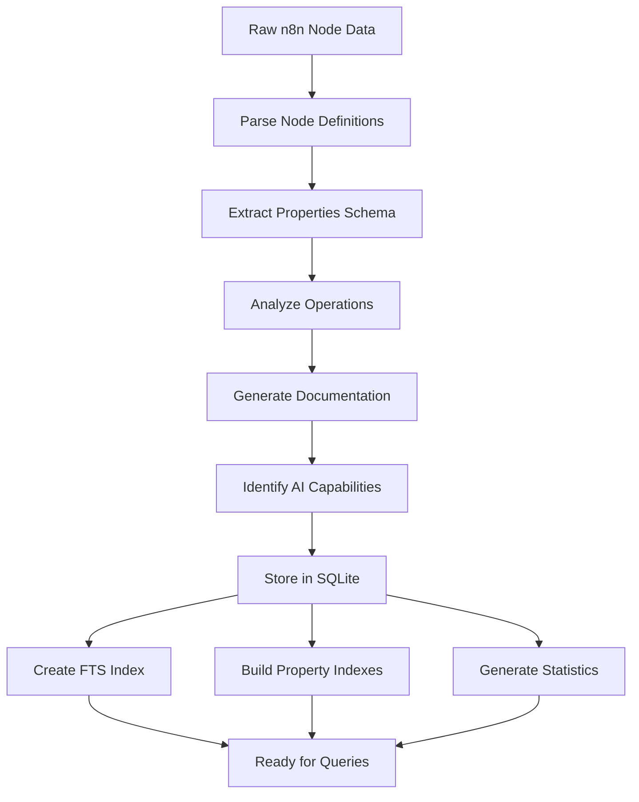

# Chapter 5: Data Storage with SQLiteStorageService

Welcome to the data foundation! In [Chapter 4](04_api_client.md), we explored how the `N8nApiClient` communicates with n8n instances. Now let's dive into the `SQLiteStorageService`—the high-performance data layer that makes n8n-MCP's instant responses possible.

Think of this as the library's card catalog system. With over 1,000 n8n nodes, each with complex properties, documentation, and examples, you need a system that can find exactly what you need in milliseconds. That's what `SQLiteStorageService` provides.

## Why SQLite for n8n-MCP?

SQLite might seem like an unusual choice for a system dealing with 1,000+ complex records, but it's perfect for this use case:

### Advantages
- **Zero Configuration** - No separate database server to manage
- **ACID Compliance** - Reliable transactions and data integrity
- **Full-Text Search** - FTS5 extension for advanced text searching
- **Embedded** - Single file database, perfect for containers
- **Performance** - Extremely fast for read-heavy workloads
- **Small Footprint** - Minimal memory and disk usage

### Perfect for MCP Use Case
- **Read-Heavy** - Most operations are lookups, not writes
- **Complex Queries** - Need JOINs, full-text search, filtering
- **Offline Capable** - Database file can be bundled with deployments
- **Concurrent Access** - Multiple processes can read simultaneously

## Database Schema Design

The schema is carefully designed to represent n8n's complex node structure:

```sql
CREATE TABLE nodes (
  node_type TEXT PRIMARY KEY,        -- e.g., "n8n-nodes-base.gmail"
  package_name TEXT NOT NULL,        -- e.g., "n8n-nodes-base"
  display_name TEXT NOT NULL,        -- e.g., "Gmail"
  description TEXT,                  -- Full description
  category TEXT,                     -- e.g., "Communication"
  development_style TEXT CHECK(development_style IN ('declarative', 'programmatic')),
  is_ai_tool INTEGER DEFAULT 0,      -- Boolean flag
  is_trigger INTEGER DEFAULT 0,      -- Boolean flag
  is_webhook INTEGER DEFAULT 0,      -- Boolean flag
  is_versioned INTEGER DEFAULT 0,    -- Boolean flag
  version TEXT,                      -- Node version
  documentation TEXT,                -- Full documentation HTML/markdown
  properties_schema TEXT,            -- JSON schema for properties
  operations TEXT,                   -- Available operations JSON
  credentials_required TEXT,         -- Required credentials JSON
  updated_at DATETIME DEFAULT CURRENT_TIMESTAMP
);

-- Performance indexes
CREATE INDEX idx_package ON nodes(package_name);
CREATE INDEX idx_ai_tool ON nodes(is_ai_tool);
CREATE INDEX idx_category ON nodes(category);
```

## Advanced Indexing Strategy

Beyond basic indexes, the system uses sophisticated indexing for different query patterns:

### Full-Text Search Index
```sql
-- FTS5 virtual table for content search
CREATE VIRTUAL TABLE nodes_fts USING fts5(
  node_type, display_name, description, documentation,
  content='nodes',
  content_rowid='rowid'
);

-- Populate FTS index
INSERT INTO nodes_fts(rowid, node_type, display_name, description, documentation)
SELECT rowid, node_type, display_name, description, documentation FROM nodes;
```

### Composite Indexes for Complex Queries
```sql
-- For filtering AI tools by category
CREATE INDEX idx_ai_category ON nodes(is_ai_tool, category);

-- For version-aware queries
CREATE INDEX idx_versioned_type ON nodes(is_versioned, node_type);

-- For trigger nodes in workflows
CREATE INDEX idx_trigger_category ON nodes(is_trigger, category);
```

## Data Processing Pipeline

The system processes raw n8n node data through several stages:



### Node Analysis Process
```typescript
interface ProcessedNode {
  nodeType: string;
  packageName: string;
  displayName: string;
  description: string;
  category: string;
  properties: PropertyDefinition[];
  operations: OperationDefinition[];
  credentials: CredentialDefinition[];
  documentation: string;
  isAiTool: boolean;
  isTrigger: boolean;
  isWebhook: boolean;
  developmentStyle: 'declarative' | 'programmatic';
}

// Analysis extracts key information
function analyzeNode(rawNode: any): ProcessedNode {
  return {
    nodeType: rawNode.name,
    packageName: extractPackageName(rawNode.name),
    displayName: rawNode.displayName,
    description: rawNode.description,
    category: rawNode.group?.[0] || 'Miscellaneous',
    properties: extractProperties(rawNode.properties),
    operations: extractOperations(rawNode.properties),
    credentials: extractCredentials(rawNode.credentials),
    documentation: rawNode.documentation,
    isAiTool: detectAiCapabilities(rawNode),
    isTrigger: rawNode.trigger || false,
    isWebhook: rawNode.webhook || false,
    developmentStyle: determineDevelopmentStyle(rawNode)
  };
}
```

## Query Optimization Techniques

The storage service implements several optimization techniques for different query patterns:

### 1. **Exact Match Queries** (Fastest)
```typescript
// O(1) lookup by primary key
const gmailNode = await storage.getNode('n8n-nodes-base.gmail');
```

### 2. **Category Filtering** (Indexed)
```sql
-- Uses idx_category index
SELECT * FROM nodes WHERE category = 'Communication' ORDER BY display_name;
```

### 3. **Full-Text Search** (Advanced)
```sql
-- FTS5 search with ranking
SELECT * FROM nodes_fts
WHERE nodes_fts MATCH 'gmail OR email'
ORDER BY rank;
```

### 4. **Complex Filtering** (Composite Indexes)
```sql
-- Uses idx_ai_category composite index
SELECT * FROM nodes
WHERE is_ai_tool = 1 AND category = 'Communication'
ORDER BY display_name;
```

## Template Data Storage

Beyond nodes, the system also stores workflow templates:

```sql
CREATE TABLE templates (
  template_id TEXT PRIMARY KEY,
  name TEXT NOT NULL,
  description TEXT,
  category TEXT,
  tags TEXT,  -- JSON array of tags
  workflow_data TEXT,  -- Full workflow JSON
  created_at DATETIME,
  updated_at DATETIME DEFAULT CURRENT_TIMESTAMP
);

-- FTS for template search
CREATE VIRTUAL TABLE templates_fts USING fts5(
  template_id, name, description, tags,
  content='templates'
);
```

## Performance Characteristics

Real-world performance metrics:

- **Node Lookup**: < 1ms (exact match)
- **Category Search**: 5-10ms (100+ results)
- **Full-Text Search**: 10-50ms (complex queries)
- **Bulk Operations**: 100-500ms (100 nodes)
- **Memory Usage**: ~50MB for full dataset
- **Database Size**: ~20MB compressed

## Connection Management

The service implements smart connection management:

```typescript
class SQLiteStorageService {
  private adapter: DatabaseAdapter | null = null;

  constructor(dbPath: string = ':memory:') {
    this.initializeDatabase(dbPath);
  }

  private initializeDatabase(dbPath: string) {
    const Database = require('better-sqlite3');

    // Connection configuration
    this.adapter = new Database(dbPath, {
      readonly: false,
      fileMustExist: false,
      timeout: 5000,  // 5 second timeout
      verbose: process.env.DEBUG ? console.log : null
    });

    // Optimize for read-heavy workload
    this.adapter.pragma('journal_mode = WAL');     // Write-Ahead Logging
    this.adapter.pragma('synchronous = NORMAL');   // Balance safety/performance
    this.adapter.pragma('cache_size = 1000');      // 1MB cache
    this.adapter.pragma('temp_store = memory');     // Temp tables in memory
    this.adapter.pragma('mmap_size = 268435456');  // 256MB memory mapping
  }
}
```

## Data Integrity and Validation

The service ensures data quality:

### Schema Validation
```typescript
function validateNodeData(node: ProcessedNode): boolean {
  // Required fields
  if (!node.nodeType || !node.displayName) return false;

  // Valid category
  const validCategories = ['Communication', 'Data & Storage', 'Productivity', /* ... */];
  if (!validCategories.includes(node.category)) return false;

  // Valid JSON schemas
  try {
    JSON.parse(node.propertiesSchema);
    JSON.parse(node.operations);
  } catch {
    return false;
  }

  return true;
}
```

### Transaction Safety
```typescript
// All bulk operations use transactions
async function bulkInsertNodes(nodes: ProcessedNode[]) {
  const transaction = this.adapter.transaction((nodes: ProcessedNode[]) => {
    const insert = this.adapter.prepare(`
      INSERT OR REPLACE INTO nodes
      (node_type, package_name, display_name, description, category, ...)
      VALUES (?, ?, ?, ?, ?, ...)
    `);

    for (const node of nodes) {
      if (validateNodeData(node)) {
        insert.run(
          node.nodeType,
          node.packageName,
          node.displayName,
          // ... other fields
        );
      }
    }
  });

  transaction(nodes);
}
```

## Advanced Features

### Change Detection
```typescript
// Track what changed during updates
interface ChangeSummary {
  added: number;
  updated: number;
  removed: number;
  errors: string[];
}

function detectChanges(oldNodes: ProcessedNode[], newNodes: ProcessedNode[]): ChangeSummary {
  const oldMap = new Map(oldNodes.map(n => [n.nodeType, n]));
  const newMap = new Map(newNodes.map(n => [n.nodeType, n]));

  let added = 0, updated = 0, removed = 0;
  const errors: string[] = [];

  // Find additions and updates
  for (const [type, newNode] of newMap) {
    if (!oldMap.has(type)) {
      added++;
    } else if (hasNodeChanged(oldMap.get(type)!, newNode)) {
      updated++;
    }
  }

  // Find removals
  for (const type of oldMap.keys()) {
    if (!newMap.has(type)) removed++;
  }

  return { added, updated, removed, errors };
}
```

### Incremental Updates
```typescript
// Only update what changed
async function incrementalUpdate(newNodes: ProcessedNode[]) {
  const changes = detectChanges(this.getAllNodes(), newNodes);

  if (changes.added + changes.updated + changes.removed > 100) {
    // Full rebuild for major changes
    await this.rebuildDatabase(newNodes);
  } else {
    // Incremental update
    await this.applyIncrementalChanges(changes);
  }
}
```

## Backup and Recovery

Production-ready backup capabilities:

```typescript
class SQLiteStorageService {
  async createBackup(): Promise<string> {
    const timestamp = new Date().toISOString().replace(/[:.]/g, '-');
    const backupPath = `backup-${timestamp}.db`;

    // SQLite backup API
    await this.adapter.backup(backupPath);

    return backupPath;
  }

  async restoreFromBackup(backupPath: string): Promise<void> {
    // Close current connection
    this.close();

    // Copy backup to active location
    await fs.copyFile(backupPath, this.dbPath);

    // Reinitialize connection
    this.initializeDatabase(this.dbPath);
  }
}
```

## Monitoring and Analytics

Built-in monitoring capabilities:

```typescript
interface DatabaseMetrics {
  totalNodes: number;
  nodesByCategory: Record<string, number>;
  aiToolsCount: number;
  databaseSize: number;
  lastUpdated: Date;
  queryPerformance: QueryStats[];
}

function collectMetrics(): DatabaseMetrics {
  return {
    totalNodes: this.adapter.prepare('SELECT COUNT(*) FROM nodes').get()['COUNT(*)'],
    nodesByCategory: this.getCategoryStats(),
    aiToolsCount: this.adapter.prepare('SELECT COUNT(*) FROM nodes WHERE is_ai_tool = 1').get()['COUNT(*)'],
    databaseSize: fs.statSync(this.dbPath).size,
    lastUpdated: new Date(this.getLastUpdateTime()),
    queryPerformance: this.getQueryStats()
  };
}
```

## Container and Deployment Considerations

### Read-Only Deployments
```typescript
// Mount database as read-only volume
const storage = new SQLiteStorageService('/app/data/nodes.db');

// Verify it's readable
if (!storage.isHealthy()) {
  throw new Error('Database not accessible');
}
```

### Memory-Only Databases
```typescript
// For testing or temporary instances
const storage = new SQLiteStorageService(':memory:');

// Load initial data
await storage.loadInitialData(nodeData);
```

### Connection Pooling
```typescript
// For high-concurrency scenarios
class PooledSQLiteStorage {
  private pool: SQLiteStorageService[] = [];

  constructor(poolSize: number, dbPath: string) {
    for (let i = 0; i < poolSize; i++) {
      this.pool.push(new SQLiteStorageService(dbPath));
    }
  }

  getConnection(): SQLiteStorageService {
    // Round-robin or least-loaded strategy
    return this.pool[this.index++ % this.pool.length];
  }
}
```

Congratulations! You now understand how the `SQLiteStorageService` creates a high-performance, reliable data foundation that powers n8n-MCP's instant responses. Its sophisticated indexing and query optimization make it possible to search through 1,000+ complex nodes in milliseconds.

In the next chapter, we'll explore [instance context and multi-tenancy](06_instance_context.md)—how n8n-MCP supports flexible deployment scenarios.