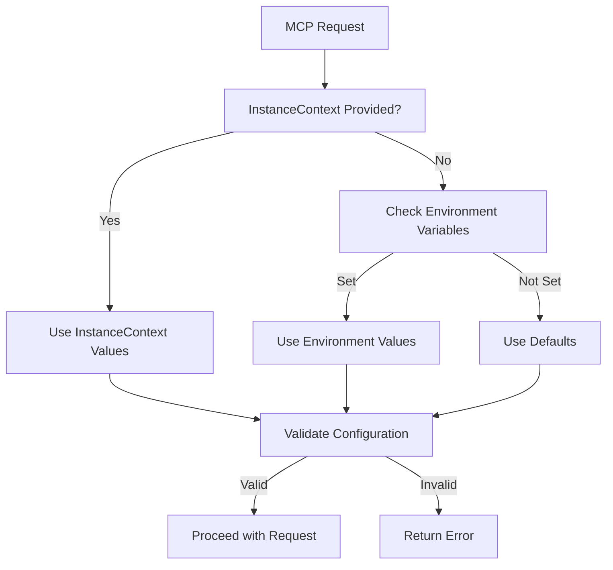

# Chapter 6: Instance Context and Multi-tenancy

Welcome to the flexibility layer! In [Chapter 5](05_data_storage.md), we explored how `SQLiteStorageService` provides fast access to n8n node data. Now let's dive into the `InstanceContext` system—the elegant solution that enables n8n-MCP to adapt to any deployment scenario.

Think of `InstanceContext` as a universal remote control. Instead of hardcoding configuration, it allows you to dynamically configure n8n-MCP for different environments, tenants, and use cases—all without changing the core code.

## What Problem Does This Solve?

Traditional applications use environment variables for configuration, but this becomes limiting for multi-tenant scenarios:

```bash
# Traditional approach - one configuration per deployment
export N8N_API_URL=https://n8n.company.com
export N8N_API_KEY=company-api-key
```

Problems with this approach:
- **Single Tenant Only** - One configuration per process
- **Deployment Complexity** - Different configs require different deployments
- **No Runtime Flexibility** - Can't change config without restart
- **Security Concerns** - All tenants share same process credentials

`InstanceContext` solves these elegantly.

## The InstanceContext Interface

The core abstraction is beautifully simple yet powerful:

```typescript
interface InstanceContext {
  // n8n connection configuration
  n8nApiUrl?: string;
  n8nApiKey?: string;
  n8nApiTimeout?: number;
  n8nApiMaxRetries?: number;

  // Instance identification
  instanceId?: string;
  sessionId?: string;

  // Extensible metadata
  metadata?: Record<string, any>;
}
```

### Optional Configuration
Notice that **all fields are optional**. This enables flexible deployment patterns:

- **Environment Variables**: When context fields are undefined, fall back to env vars
- **Runtime Configuration**: Pass context at request time for dynamic behavior
- **Progressive Enhancement**: Start simple, add complexity as needed

## Configuration Hierarchy

n8n-MCP uses a smart configuration hierarchy:



### Priority Order
1. **InstanceContext** (highest priority - request-specific)
2. **Environment Variables** (fallback)
3. **Sensible Defaults** (lowest priority)

## Multi-Tenant Architecture Patterns

### Pattern 1: SaaS Platform with Per-Tenant n8n Instances

```typescript
class SaaSTenantManager {
  private tenantConfigs = new Map<string, InstanceContext>();

  // Load tenant configurations from database
  async loadTenantConfig(tenantId: string): Promise<InstanceContext> {
    const tenant = await this.db.getTenant(tenantId);

    return {
      instanceId: tenantId,
      n8nApiUrl: tenant.n8nUrl,
      n8nApiKey: tenant.apiKey,
      n8nApiTimeout: 45000,  // Longer timeout for SaaS
      n8nApiMaxRetries: 5,    // More retries for reliability
      metadata: {
        plan: tenant.plan,
        region: tenant.region,
        createdAt: tenant.createdAt
      }
    };
  }

  // Handle MCP requests with tenant isolation
  async handleMCPRequest(req: Request, res: Response, tenantId: string) {
    const context = await this.loadTenantConfig(tenantId);

    // Each tenant gets isolated processing
    await this.mcpEngine.processRequest(req, res, context);
  }
}
```

### Pattern 2: Self-Hosted n8n with Multiple Users

```typescript
class SelfHostedManager {
  // Single n8n instance, multiple users with different permissions
  async handleUserRequest(req: Request, res: Response, userId: string) {
    const user = await this.auth.getUser(userId);

    const context: InstanceContext = {
      instanceId: `user-${userId}`,
      n8nApiUrl: process.env.N8N_API_URL,  // Shared instance
      n8nApiKey: user.apiKey,              // User-specific key
      n8nApiTimeout: 30000,
      metadata: {
        userId: userId,
        permissions: user.permissions,
        rateLimit: user.rateLimit
      }
    };

    await this.mcpEngine.processRequest(req, res, context);
  }
}
```

### Pattern 3: Development and Testing Environments

```typescript
class EnvironmentManager {
  private environments = {
    development: {
      n8nApiUrl: 'http://localhost:5678',
      n8nApiTimeout: 10000
    },
    staging: {
      n8nApiUrl: 'https://staging.n8n.company.com',
      n8nApiTimeout: 30000
    },
    production: {
      n8nApiUrl: 'https://n8n.company.com',
      n8nApiTimeout: 30000,
      n8nApiMaxRetries: 5
    }
  };

  getContextForEnvironment(env: string): InstanceContext {
    const config = this.environments[env];

    return {
      instanceId: `env-${env}`,
      ...config,
      n8nApiKey: process.env[`N8N_API_KEY_${env.toUpperCase()}`],
      metadata: {
        environment: env,
        debug: env === 'development'
      }
    };
  }
}
```

## Runtime Flexibility Examples

### Dynamic Configuration Based on Request Headers

```typescript
// Route requests to different n8n instances based on domain
app.post('/mcp', async (req, res) => {
  const host = req.headers.host;
  let context: InstanceContext;

  if (host?.includes('tenant1.company.com')) {
    context = await getTenantContext('tenant1');
  } else if (host?.includes('tenant2.company.com')) {
    context = await getTenantContext('tenant2');
  } else {
    // Default instance
    context = getDefaultContext();
  }

  await engine.processRequest(req, res, context);
});
```

### API Key Rotation

```typescript
class KeyRotationManager {
  private currentKeys = new Map<string, string>();

  // Rotate keys without restarting
  async rotateKey(instanceId: string, newKey: string) {
    this.currentKeys.set(instanceId, newKey);

    // Update in-memory cache
    // Next requests will use new key
    logger.info(`Rotated API key for instance: ${instanceId}`);
  }

  getContextWithRotatedKey(baseContext: InstanceContext): InstanceContext {
    const rotatedKey = this.currentKeys.get(baseContext.instanceId!);

    return {
      ...baseContext,
      n8nApiKey: rotatedKey || baseContext.n8nApiKey
    };
  }
}
```

## Validation and Security

The system includes comprehensive validation:

### Input Validation
```typescript
function validateInstanceContext(context: InstanceContext): {
  valid: boolean;
  errors?: string[]
} {
  const errors: string[] = [];

  // URL validation
  if (context.n8nApiUrl && !isValidUrl(context.n8nApiUrl)) {
    errors.push('Invalid n8nApiUrl format');
  }

  // API key validation
  if (context.n8nApiKey && !isValidApiKey(context.n8nApiKey)) {
    errors.push('Invalid n8nApiKey format');
  }

  // Timeout validation
  if (context.n8nApiTimeout && context.n8nApiTimeout <= 0) {
    errors.push('n8nApiTimeout must be positive');
  }

  // Retries validation
  if (context.n8nApiMaxRetries && context.n8nApiMaxRetries < 0) {
    errors.push('n8nApiMaxRetries must be non-negative');
  }

  return {
    valid: errors.length === 0,
    errors: errors.length > 0 ? errors : undefined
  };
}
```

### Security Best Practices

```typescript
class SecureInstanceContext {
  // Encrypt sensitive data in metadata
  static encryptMetadata(metadata: Record<string, any>): string {
    const json = JSON.stringify(metadata);
    return encrypt(json, process.env.ENCRYPTION_KEY!);
  }

  static decryptMetadata(encrypted: string): Record<string, any> {
    const json = decrypt(encrypted, process.env.ENCRYPTION_KEY!);
    return JSON.parse(json);
  }

  // Validate context doesn't contain malicious data
  static sanitize(context: InstanceContext): InstanceContext {
    return {
      ...context,
      // Remove any potentially dangerous metadata
      metadata: this.sanitizeMetadata(context.metadata)
    };
  }
}
```

## Session State Management

Instance context enables sophisticated session management:

```typescript
interface SessionState {
  sessionId: string;
  instanceContext: InstanceContext;
  startTime: number;
  lastActivity: number;
  // ... other session data
}

class SessionManager {
  private sessions = new Map<string, SessionState>();

  createSession(context: InstanceContext): string {
    const sessionId = generateUniqueId();

    const session: SessionState = {
      sessionId,
      instanceContext: context,
      startTime: Date.now(),
      lastActivity: Date.now()
    };

    this.sessions.set(sessionId, session);
    return sessionId;
  }

  getSession(sessionId: string): SessionState | undefined {
    return this.sessions.get(sessionId);
  }

  updateActivity(sessionId: string) {
    const session = this.sessions.get(sessionId);
    if (session) {
      session.lastActivity = Date.now();
    }
  }

  cleanupExpiredSessions(maxAge: number = 3600000) { // 1 hour
    const now = Date.now();

    for (const [sessionId, session] of this.sessions) {
      if (now - session.lastActivity > maxAge) {
        this.sessions.delete(sessionId);
      }
    }
  }
}
```

## Advanced Multi-Tenant Patterns

### Tenant Isolation with Resource Limits

```typescript
class TenantResourceManager {
  private limits = new Map<string, TenantLimits>();

  interface TenantLimits {
    maxConcurrentRequests: number;
    maxRequestsPerHour: number;
    maxWorkflows: number;
    allowedCategories: string[];
  }

  async checkLimits(tenantId: string, action: string): Promise<boolean> {
    const limits = this.limits.get(tenantId);
    if (!limits) return true; // No limits set

    switch (action) {
      case 'create_workflow':
        return await this.checkWorkflowLimit(tenantId, limits);
      case 'execute_workflow':
        return await this.checkExecutionLimit(tenantId, limits);
      default:
        return true;
    }
  }

  enforceLimits(context: InstanceContext, action: string): InstanceContext {
    const tenantId = context.instanceId!;

    if (!this.checkLimits(tenantId, action)) {
      throw new Error(`Resource limit exceeded for tenant: ${tenantId}`);
    }

    return {
      ...context,
      metadata: {
        ...context.metadata,
        action,
        timestamp: Date.now()
      }
    };
  }
}
```

### Cross-Tenant Template Sharing

```typescript
class TemplateSharingManager {
  // Share templates across tenants while maintaining isolation
  async getSharedTemplates(tenantId: string): Promise<Template[]> {
    // Get public templates from other tenants
    const publicTemplates = await this.db.getPublicTemplates();

    // Filter based on tenant permissions
    const accessibleTemplates = publicTemplates.filter(template =>
      this.hasAccess(tenantId, template.tenantId, template.visibility)
    );

    return accessibleTemplates;
  }

  private hasAccess(viewerTenantId: string, ownerTenantId: string, visibility: string): boolean {
    if (visibility === 'public') return true;
    if (viewerTenantId === ownerTenantId) return true;

    // Check sharing agreements
    return this.hasSharingAgreement(viewerTenantId, ownerTenantId);
  }
}
```

## Deployment Architecture Examples

### Kubernetes Multi-Tenant Deployment

```yaml
apiVersion: apps/v1
kind: Deployment
metadata:
  name: n8n-mcp-multitenant
spec:
  replicas: 3
  template:
    spec:
      containers:
      - name: n8n-mcp
        image: n8n-mcp:latest
        env:
        # No hardcoded tenant config - all dynamic
        - name: NODE_ENV
          value: "production"
        ports:
        - containerPort: 3000
---
apiVersion: v1
kind: Service
metadata:
  name: n8n-mcp-service
spec:
  selector:
    app: n8n-mcp
  ports:
    - port: 80
      targetPort: 3000
  # Session affinity for consistent routing
  sessionAffinity: ClientIP
```

### Serverless Deployment

```typescript
// AWS Lambda handler with instance context
export async function handler(event: APIGatewayEvent) {
  const tenantId = extractTenantFromEvent(event);

  const context = await getTenantContext(tenantId);

  // Create engine for this invocation
  const engine = new N8NMCPEngine();

  const req = createRequestFromLambda(event);
  const res = createResponseForLambda();

  await engine.processRequest(req, res, context);

  return formatLambdaResponse(res);
}
```

## Monitoring and Analytics

Instance context enables detailed tenant-level monitoring:

```typescript
class TenantAnalytics {
  private metrics = new Map<string, TenantMetrics>();

  recordRequest(tenantId: string, method: string, duration: number, success: boolean) {
    const metrics = this.metrics.get(tenantId) || {
      requests: 0,
      errors: 0,
      totalDuration: 0,
      methodCounts: new Map<string, number>()
    };

    metrics.requests++;
    if (!success) metrics.errors++;
    metrics.totalDuration += duration;

    const methodCount = metrics.methodCounts.get(method) || 0;
    metrics.methodCounts.set(method, methodCount + 1);

    this.metrics.set(tenantId, metrics);
  }

  getTenantReport(tenantId: string): TenantReport {
    const metrics = this.metrics.get(tenantId);
    if (!metrics) return null;

    return {
      tenantId,
      totalRequests: metrics.requests,
      errorRate: metrics.errors / metrics.requests,
      averageDuration: metrics.totalDuration / metrics.requests,
      popularMethods: Array.from(metrics.methodCounts.entries())
        .sort((a, b) => b[1] - a[1])
        .slice(0, 5)
    };
  }
}
```

## Error Handling and Resilience

The system gracefully handles configuration failures:

```typescript
class ContextFallbackManager {
  async resolveContext(requestContext?: Partial<InstanceContext>): Promise<InstanceContext> {
    // Try request context first
    if (requestContext && validateInstanceContext(requestContext).valid) {
      return requestContext as InstanceContext;
    }

    // Fall back to environment
    const envContext = this.loadFromEnvironment();
    if (envContext && validateInstanceContext(envContext).valid) {
      return envContext;
    }

    // Final fallback to defaults
    return this.getDefaultContext();
  }

  private loadFromEnvironment(): InstanceContext | null {
    const apiUrl = process.env.N8N_API_URL;
    const apiKey = process.env.N8N_API_KEY;

    if (!apiUrl || !apiKey) return null;

    return {
      n8nApiUrl: apiUrl,
      n8nApiKey: apiKey,
      n8nApiTimeout: parseInt(process.env.N8N_API_TIMEOUT || '30000'),
      n8nApiMaxRetries: parseInt(process.env.N8N_API_MAX_RETRIES || '3')
    };
  }

  private getDefaultContext(): InstanceContext {
    // Minimal viable configuration
    return {
      n8nApiTimeout: 30000,
      n8nApiMaxRetries: 3
    };
  }
}
```

Congratulations! You now understand how `InstanceContext` enables n8n-MCP to adapt to any deployment scenario, from simple single-tenant setups to complex multi-tenant SaaS platforms. This flexibility is key to n8n-MCP's success in diverse environments.

In the next chapter, we'll explore the [MCP tools architecture](07_mcp_tools.md)—the comprehensive tool ecosystem that provides AI assistants with n8n capabilities.