# Chapter 7: MCP Tools Architecture

Welcome to the tools layer—the heart of n8n-MCP's functionality! In [Chapter 6](06_instance_context.md), we explored how `InstanceContext` enables flexible multi-tenant deployments. Now let's dive into the MCP tools—the actual capabilities that AI assistants use to interact with n8n.

Think of MCP tools as a comprehensive toolkit that transforms AI assistants from helpful generalists into n8n workflow automation experts. Each tool is carefully designed to provide specific, actionable capabilities.

## What Are MCP Tools?

MCP tools are the interface between AI assistants and external capabilities. They follow a standardized JSON-RPC format:

```typescript
// Tool Definition
interface Tool {
  name: string;
  description: string;
  inputSchema: JSONSchema;
}

// Tool Call
{
  "jsonrpc": "2.0",
  "id": 1,
  "method": "tools/call",
  "params": {
    "name": "tool_name",
    "arguments": {
      "param1": "value1",
      "param2": "value2"
    }
  }
}

// Tool Response
{
  "jsonrpc": "2.0",
  "id": 1,
  "result": {
    "content": [
      {
        "type": "text",
        "text": "Tool execution result"
      }
    ]
  }
}
```

## n8n-MCP Tool Categories

n8n-MCP organizes its 15+ tools into logical categories based on functionality:

```mermaid
flowchart TD
    A[MCP Tools] --> B[System Tools]
    A --> C[Discovery Tools]
    A --> D[Configuration Tools]
    A --> E[Validation Tools]
    A --> F[Template Tools]
    A --> G[Workflow Management Tools]

    B --> B1[tools_documentation]
    B --> B2[n8n_health_check]

    C --> C1[search_nodes]

    D --> D1[get_node]

    E --> E1[validate_node]
    E --> E2[validate_workflow]

    F --> F1[get_template]
    F --> F2[search_templates]

    G --> G1[n8n_create_workflow]
    G --> G2[n8n_get_workflow]
    G --> G3[n8n_update_full_workflow]
    G --> G4[n8n_update_partial_workflow]
    G --> G5[n8n_delete_workflow]
    G --> G6[n8n_list_workflows]
    G --> G7[n8n_validate_workflow]
    G --> G8[n8n_autofix_workflow]
    G --> G9[n8n_test_workflow]
    G --> G10[n8n_executions]
    G --> G11[n8n_workflow_versions]
    G --> G12[n8n_deploy_template]
```



## Tool Design Principles

Each tool follows consistent design principles:

### 1. **Single Responsibility**
Every tool does one thing well. For example:
- `search_nodes`: Only searches, doesn't retrieve details
- `get_node`: Only retrieves details, doesn't search

### 2. **Progressive Information Disclosure**
Tools provide information at the right level of detail:
- **Search tools**: Provide overviews for browsing
- **Get tools**: Provide complete details for specific items
- **Management tools**: Provide operational capabilities

### 3. **Consistent Parameter Patterns**
```typescript
// All search tools follow similar patterns
interface SearchParams {
  query?: string;        // Text search
  limit?: number;        // Result limit (default: 10)
  offset?: number;       // Pagination offset (default: 0)
  filters?: Record<string, any>; // Category-specific filters
}
```

### 4. **Structured Responses**
All tools return consistent response formats with metadata:

```typescript
interface ToolResponse {
  success: boolean;
  data: any;            // Tool-specific result
  metadata: {
    timestamp: string;
    executionTime: number;
    version: string;
    instanceId?: string;
  };
  errors?: string[];    // Only present if success = false
}
```

## Tool Categories Deep Dive

### System Tools - Housekeeping and Diagnostics

**Purpose**: Provide essential system information and diagnostics

#### `tools_documentation`
- **What it does**: Lists all available MCP tools with descriptions
- **Use case**: Help AI assistants discover what capabilities are available
- **Parameters**: None
- **Response**: Complete tool catalog with schemas

#### `n8n_health_check`
- **What it does**: Checks n8n instance connectivity and health
- **Use case**: Verify n8n connection before performing operations
- **Parameters**: None
- **Response**: Health status, version info, connectivity status

### Discovery Tools - Finding n8n Components

**Purpose**: Help AI assistants find relevant n8n nodes and components

#### `search_nodes`
- **What it does**: Search through 1,000+ n8n nodes using text and filters
- **Use case**: "Find email-related nodes" or "Show me AI tools"
- **Parameters**:
  - `query`: Text search across names, descriptions, categories
  - `category`: Filter by node category (Communication, Data, etc.)
  - `is_ai_tool`: Filter for AI-capable nodes
  - `limit`/`offset`: Pagination
- **Response**: List of matching nodes with basic info

### Configuration Tools - Understanding Node Details

**Purpose**: Provide detailed information about specific n8n components

#### `get_node`
- **What it does**: Retrieve complete details for a specific node
- **Use case**: "Tell me everything about the Gmail node"
- **Parameters**:
  - `node_type`: Exact node type (e.g., "n8n-nodes-base.gmail")
- **Response**: Complete node schema, properties, operations, documentation

### Validation Tools - Ensuring Correctness

**Purpose**: Help AI assistants validate their work and catch errors

#### `validate_node`
- **What it does**: Validate a node's configuration against its schema
- **Use case**: "Check if my Gmail configuration is correct"
- **Parameters**:
  - `node_type`: The node type to validate against
  - `configuration`: The node configuration object
- **Response**: Validation results with specific errors and suggestions

#### `validate_workflow`
- **What it does**: Validate complete workflow structure and connections
- **Use case**: "Check if this workflow will work"
- **Parameters**:
  - `workflow`: Complete workflow object with nodes and connections
- **Response**: Comprehensive validation report

### Template Tools - Learning from Examples

**Purpose**: Provide access to workflow templates and examples

#### `get_template`
- **What it does**: Retrieve a specific workflow template
- **Use case**: "Show me the email marketing template"
- **Parameters**:
  - `template_id`: Unique template identifier
- **Response**: Complete template with workflow data and metadata

#### `search_templates`
- **What it does**: Search through 2,700+ workflow templates
- **Use case**: "Find templates for social media automation"
- **Parameters**:
  - `query`: Text search across template names and descriptions
  - `category`: Filter by template category
  - `limit`/`offset`: Pagination
- **Response**: List of matching templates

### Workflow Management Tools - Direct n8n Operations

**Purpose**: Enable AI assistants to create, modify, and manage n8n workflows

#### Core CRUD Operations
- **`n8n_create_workflow`**: Create new workflows from scratch
- **`n8n_get_workflow`**: Retrieve existing workflow details
- **`n8n_update_full_workflow`**: Replace entire workflows
- **`n8n_update_partial_workflow`**: Modify specific parts of workflows
- **`n8n_delete_workflow`**: Remove workflows
- **`n8n_list_workflows`**: Browse available workflows

#### Advanced Operations
- **`n8n_validate_workflow`**: Check workflow validity
- **`n8n_autofix_workflow`**: Automatically fix common workflow issues
- **`n8n_test_workflow`**: Execute workflows for testing
- **`n8n_executions`**: View workflow execution history
- **`n8n_workflow_versions`**: Access workflow version history
- **`n8n_deploy_template`**: Deploy templates as active workflows

## Tool Implementation Architecture

### Base Tool Structure
All tools extend a common base class for consistency:

```typescript
abstract class BaseTool {
  abstract readonly name: string;
  abstract readonly description: string;
  abstract readonly inputSchema: JSONSchema;

  abstract execute(args: any, context: ToolContext): Promise<ToolResult>;

  protected validateArgs(args: any): ValidationResult {
    // Common validation logic
  }

  protected createSuccessResponse(data: any): ToolResult {
    return {
      success: true,
      data,
      metadata: {
        timestamp: new Date().toISOString(),
        executionTime: Date.now() - this.startTime,
        version: this.getVersion()
      }
    };
  }
}
```

### Tool Context
Every tool execution receives contextual information:

```typescript
interface ToolContext {
  instanceContext: InstanceContext;    // n8n connection details
  sessionId: string;                   // Current session identifier
  userId?: string;                     // User identifier (if available)
  requestId: string;                   // Unique request identifier
  startTime: number;                   // Execution start timestamp
}
```

### Error Handling
Tools implement consistent error handling:

```typescript
class ToolError extends Error {
  constructor(
    message: string,
    public readonly code: ToolErrorCode,
    public readonly details?: any
  ) {
    super(message);
  }
}

enum ToolErrorCode {
  VALIDATION_ERROR = 'VALIDATION_ERROR',
  N8N_API_ERROR = 'N8N_API_ERROR',
  NOT_FOUND = 'NOT_FOUND',
  PERMISSION_DENIED = 'PERMISSION_DENIED',
  RATE_LIMITED = 'RATE_LIMITED'
}
```

## Tool Registration and Discovery

Tools are registered in a centralized registry:

```typescript
class ToolRegistry {
  private tools = new Map<string, BaseTool>();

  register(tool: BaseTool): void {
    this.tools.set(tool.name, tool);
  }

  getTool(name: string): BaseTool | undefined {
    return this.tools.get(name);
  }

  getAllTools(): BaseTool[] {
    return Array.from(this.tools.values());
  }

  // Generate MCP tool list for protocol handshake
  getMCPToolList(): Tool[] {
    return this.getAllTools().map(tool => ({
      name: tool.name,
      description: tool.description,
      inputSchema: tool.inputSchema
    }));
  }
}
```

## Performance Optimizations

### Caching Strategies
```typescript
class ToolCache {
  // Cache node data (changes infrequently)
  @Cache({ ttl: 3600000 }) // 1 hour
  async getNodeData(nodeType: string): Promise<NodeData> {
    return this.storage.getNode(nodeType);
  }

  // Cache template searches (changes moderately)
  @Cache({ ttl: 300000 }) // 5 minutes
  async searchTemplates(query: string): Promise<Template[]> {
    return this.storage.searchTemplates(query);
  }

  // Don't cache workflow operations (changes frequently)
  async getWorkflow(id: string): Promise<Workflow> {
    return this.n8nApi.getWorkflow(id);
  }
}
```

### Batch Operations
```typescript
class BatchToolProcessor {
  async executeBatch(operations: ToolOperation[]): Promise<ToolResult[]> {
    // Group operations by type for efficiency
    const grouped = this.groupByTool(operations);

    // Execute in parallel where possible
    const results = await Promise.allSettled(
      grouped.map(group => this.executeToolBatch(group))
    );

    return this.flattenResults(results);
  }
}
```

## Security and Access Control

### Tool-Level Permissions
```typescript
interface ToolPermissions {
  read: boolean;      // Can use read-only tools
  write: boolean;     // Can use workflow modification tools
  execute: boolean;   // Can execute workflows
  admin: boolean;     // Can use administrative tools
}

class PermissionChecker {
  checkToolAccess(toolName: string, context: ToolContext): boolean {
    const permissions = this.getPermissions(context.userId);

    switch (toolName) {
      case 'n8n_create_workflow':
      case 'n8n_update_workflow':
        return permissions.write;

      case 'n8n_test_workflow':
        return permissions.execute;

      default:
        return permissions.read;
    }
  }
}
```

### Rate Limiting
```typescript
class ToolRateLimiter {
  private limits = new Map<string, RateLimit>();

  checkLimit(toolName: string, userId: string): boolean {
    const key = `${toolName}:${userId}`;
    const limit = this.limits.get(key) || this.getDefaultLimit(toolName);

    return limit.allow();
  }

  private getDefaultLimit(toolName: string): RateLimit {
    // Different limits for different tool types
    if (toolName.startsWith('n8n_')) {
      return new RateLimit(10, 'minute');  // 10 workflow ops/minute
    } else {
      return new RateLimit(60, 'minute');  // 60 search ops/minute
    }
  }
}
```

## Tool Development Workflow

### 1. Define Tool Interface
```typescript
interface SearchNodesArgs {
  query?: string;
  category?: string;
  is_ai_tool?: boolean;
  limit?: number;
  offset?: number;
}
```

### 2. Implement Tool Class
```typescript
class SearchNodesTool extends BaseTool {
  readonly name = 'search_nodes';
  readonly description = 'Search through n8n nodes using text and filters';

  readonly inputSchema = {
    type: 'object',
    properties: {
      query: { type: 'string' },
      category: { type: 'string' },
      is_ai_tool: { type: 'boolean' },
      limit: { type: 'number', default: 10 },
      offset: { type: 'number', default: 0 }
    }
  };

  async execute(args: SearchNodesArgs, context: ToolContext): Promise<ToolResult> {
    // Implementation here
  }
}
```

### 3. Register and Test
```typescript
// Register tool
registry.register(new SearchNodesTool());

// Test tool
const result = await registry.getTool('search_nodes')?.execute({
  query: 'gmail',
  limit: 5
}, context);
```

## Tool Analytics and Monitoring

### Usage Tracking
```typescript
class ToolAnalytics {
  recordToolUsage(toolName: string, context: ToolContext, success: boolean, duration: number) {
    // Store in database for analysis
    this.db.insert('tool_usage', {
      tool_name: toolName,
      user_id: context.userId,
      instance_id: context.instanceContext.instanceId,
      success,
      duration,
      timestamp: new Date()
    });
  }

  getUsageStats(toolName?: string): UsageStats {
    // Generate usage reports
  }
}
```

Congratulations! You now understand the comprehensive MCP tools architecture that powers n8n-MCP. These tools transform AI assistants into n8n workflow automation experts.

In the next chapters, we'll explore specific tool categories in detail: [discovery tools](08_discovery_tools.md) for finding nodes and [workflow management tools](09_workflow_management.md) for direct n8n operations.