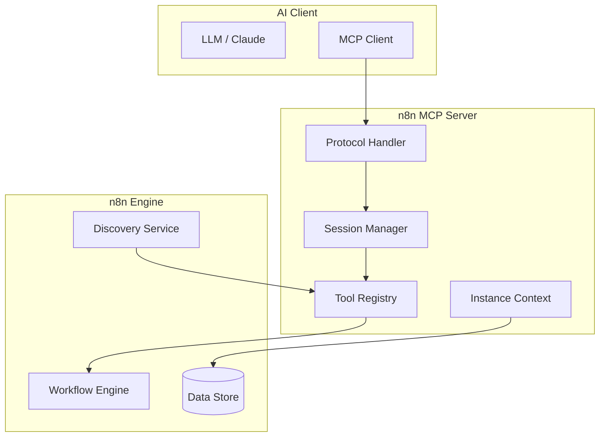

# n8n Model Context Protocol: Deep Dive Tutorial

> **Project**: [n8n](https://github.com/n8n-io/n8n) — Visual workflow automation with Model Context Protocol (MCP) integration for AI-powered tool use.

## What Is This Tutorial?

This tutorial covers n8n's integration with the Model Context Protocol (MCP) — the open standard for connecting AI models to external tools and data sources. Learn how n8n implements MCP servers, manages sessions, and exposes workflow automation as AI-callable tools.

| Feature | Description |
|---------|-------------|
| **MCP Protocol** | Anthropic's standard for AI-tool communication |
| **Session Management** | Multi-tenant session handling with lifecycle |
| **Tool Discovery** | Dynamic tool registration and schema generation |
| **Workflow Integration** | Expose n8n workflows as MCP-callable tools |
| **Data Storage** | Persistent context and state management |

## Architecture Overview

## Tutorial Structure

| Chapter | Topic | What You'll Learn |
|---------|-------|-------------------|
| [1. MCP Protocol](01_mcp_protocol.md) | Foundation | Protocol spec, message types, transport |
| [2. Engine Architecture](02_engine_architecture.md) | Core | MCP server engine, request routing |
| [3. Session Management](03_session_management.md) | Sessions | Multi-tenant sessions, lifecycle, state |
| [4. API Client](04_api_client.md) | Client | MCP client implementation, auth |
| [5. Data Storage](05_data_storage.md) | Persistence | Context storage, state management |
| [6. Instance Context](06_instance_context.md) | Context | Environment config, tenant isolation |
| [7. MCP Tools](07_mcp_tools.md) | Tools | Tool definition, schema, execution |
| [8. Discovery Tools](08_discovery_tools.md) | Discovery | Dynamic tool registration, catalog |
| [9. Workflow Management](09_workflow_management.md) | Workflows | Exposing workflows as MCP tools |

## Tech Stack

| Component | Technology |
|-----------|-----------|
| **Runtime** | Node.js, TypeScript |
| **Protocol** | Model Context Protocol (MCP) |
| **Transport** | JSON-RPC over stdio / HTTP |
| **Platform** | n8n workflow engine |

---

Ready to begin? Start with [Chapter 1: MCP Protocol](01_mcp_protocol.md).

---

*Built with insights from the [n8n repository](https://github.com/n8n-io/n8n) and MCP specification.*
