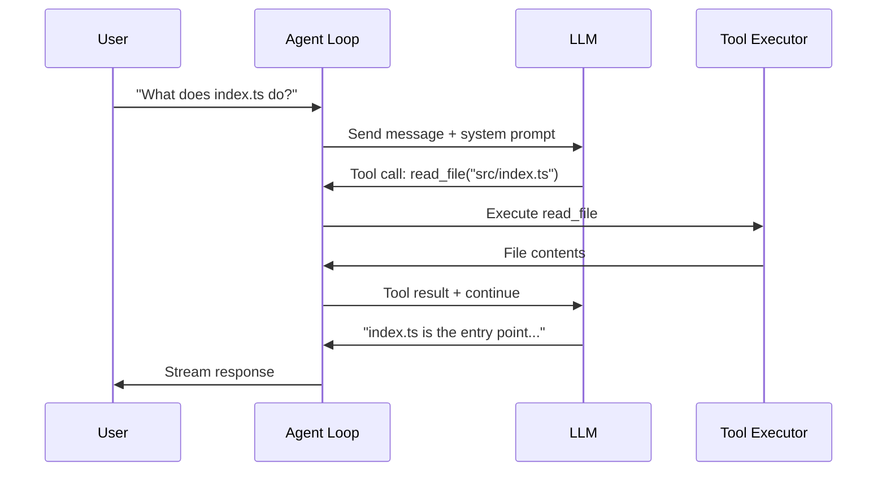

# Chapter 1: Getting Started

Welcome to **Chapter 1: Getting Started**. In this part of **Nanocoder Tutorial: Building and Understanding AI Coding Agents**, you will build an intuitive mental model first, then move into concrete implementation details and practical production tradeoffs.


> Install nanocoder, configure your first provider, and run your first interactive coding session.

## Overview

This chapter walks you through installing nanocoder, connecting it to an LLM provider, and running your first interactive session. You'll understand the basic interaction model that all AI coding agents share: a conversational loop where the AI can read, write, and execute code on your behalf.

## Installation

### From npm (Recommended)

```bash
# Install globally
npm install -g @anthropic/nanocoder

# Verify installation
nanocoder --version
```

### From Source

```bash
# Clone the repository
git clone https://github.com/Nano-Collective/nanocoder.git
cd nanocoder

# Install dependencies
pnpm install

# Build the project
pnpm build

# Link for global usage
pnpm link --global
```

### System Requirements

| Requirement | Minimum | Recommended |
|-------------|---------|-------------|
| Node.js | 20.0+ | 22.x LTS |
| pnpm | 8.0+ | Latest |
| RAM | 4 GB | 8 GB+ (for local models) |
| Disk | 500 MB | 10 GB+ (for local models) |

## Configuring an LLM Provider

Nanocoder works with any OpenAI-compatible API. You can use cloud providers, local models, or a combination of both.

### Option 1: Local Models with Ollama

```bash
# Install Ollama (macOS)
brew install ollama

# Pull a coding model
ollama pull qwen2.5-coder:7b

# Nanocoder auto-detects Ollama at localhost:11434
nanocoder
```

### Option 2: Cloud Providers

```bash
# Set your API key as an environment variable
export OPENROUTER_API_KEY="sk-or-v1-..."

# Or configure in agents.config.json
cat > agents.config.json << 'EOF'
{
  "provider": {
    "name": "openrouter",
    "apiBase": "https://openrouter.ai/api/v1",
    "apiKey": "${OPENROUTER_API_KEY}",
    "model": "anthropic/claude-sonnet-4-20250514"
  }
}
EOF
```

### Option 3: Local Server (llama.cpp, LM Studio, vLLM)

```bash
# Point to any OpenAI-compatible server
cat > agents.config.json << 'EOF'
{
  "provider": {
    "name": "local",
    "apiBase": "http://localhost:8080/v1",
    "apiKey": "not-needed",
    "model": "local-model"
  }
}
EOF
```

## Your First Interactive Session

Launch nanocoder in any project directory:

```bash
cd ~/my-project
nanocoder
```

You'll see an interactive prompt where you can chat with the AI about your code:

```
🤖 nanocoder v0.1.0
Provider: ollama (qwen2.5-coder:7b)
Working directory: ~/my-project

> What files are in this project and what do they do?
```

The agent will:
1. Read your project structure
2. Analyze key files
3. Provide a summary of the codebase

### Understanding the Interaction Model



Every interaction follows this pattern:
1. **User sends a message** to the agent loop
2. **Agent forwards to LLM** with system prompt and conversation history
3. **LLM responds** with either text or tool calls
4. **Tool calls are executed** (with user approval for destructive operations)
5. **Results are fed back** to the LLM for further processing
6. **Final response** is streamed to the user

### Trying Tool-Based Operations

Ask the agent to make a change:

```
> Create a new file called hello.ts that exports a greet function

🔧 Tool: write_file
   Path: hello.ts
   Content:
   export function greet(name: string): string {
     return `Hello, ${name}!`;
   }

   Approve? [y/n/e(dit)]
```

The approval workflow ensures you always review changes before they're applied. This is a fundamental safety pattern in all production AI coding agents.

## Slash Commands

Nanocoder includes built-in commands for session control:

| Command | Description |
|---------|-------------|
| `/help` | Show available commands |
| `/model <name>` | Switch the active model |
| `/tag <file>` | Add a file to the context window |
| `/untag <file>` | Remove a file from context |
| `/clear` | Clear conversation history |
| `/config` | Show current configuration |
| `/exit` | End the session |

```
> /model claude-sonnet-4-20250514
Switched to model: claude-sonnet-4-20250514

> /tag src/utils.ts
Added src/utils.ts to context (2.1 KB, ~520 tokens)

> Now refactor the helper functions in utils.ts
```

## Non-Interactive Mode

For scripting and automation, use `run` mode:

```bash
# Single task execution
nanocoder run "Add error handling to all async functions in src/"

# Pipe input
echo "Fix the TypeScript errors" | nanocoder run

# With specific model
nanocoder run --model gpt-4o "Write unit tests for src/auth.ts"
```

## Project Structure Overview

Understanding nanocoder's own codebase helps you understand AI coding agents in general:

```
nanocoder/
├── src/
│   ├── index.ts          # CLI entry point
│   ├── agent/
│   │   ├── loop.ts       # Core agent loop
│   │   ├── system.ts     # System prompt construction
│   │   └── history.ts    # Conversation history management
│   ├── providers/
│   │   ├── base.ts       # Provider interface
│   │   ├── ollama.ts     # Ollama integration
│   │   └── openai.ts     # OpenAI-compatible API
│   ├── tools/
│   │   ├── registry.ts   # Tool registration
│   │   ├── read.ts       # File reading
│   │   ├── write.ts      # File writing
│   │   ├── bash.ts       # Command execution
│   │   └── search.ts     # Code search
│   ├── config/
│   │   └── loader.ts     # Configuration management
│   └── ui/
│       ├── terminal.ts   # Terminal rendering
│       └── approval.ts   # Approval workflow UI
├── agents.config.json    # Default configuration
├── package.json
└── tsconfig.json
```

## Summary

You've installed nanocoder, configured an LLM provider, and run your first interactive session. The key concept to remember is the **agent loop**: a cycle of user input → LLM reasoning → tool execution → result feedback that powers all AI coding agents.

## Key Takeaways

1. Nanocoder is a local-first CLI agent that keeps your code on your machine
2. It works with any OpenAI-compatible API, including local models via Ollama
3. The interaction model follows a read-eval-execute loop with tool calling
4. An approval workflow gates all destructive operations
5. Slash commands provide session control without leaving the chat interface

## Next Steps

In [Chapter 2: Architecture & Agent Loop](02-architecture-agent-loop.md), we'll dive deep into the core architecture—how the agent loop is implemented, how messages are orchestrated, and how the system prompt shapes agent behavior.

---

*Built with insights from the [Nanocoder](https://github.com/Nano-Collective/nanocoder) project.*

## Depth Expansion Playbook

<!-- depth-expansion-v2 -->

This chapter is expanded to v1-style depth for production-grade learning and implementation quality.

### Strategic Context

- tutorial: **Nanocoder Tutorial: Building and Understanding AI Coding Agents**
- tutorial slug: **nanocoder-tutorial**
- chapter focus: **Chapter 1: Getting Started**
- system context: **Nanocoder Tutorial**
- objective: move from surface-level usage to repeatable engineering operation

### Architecture Decomposition

1. Define the runtime boundary for `Chapter 1: Getting Started`.
2. Separate control-plane decisions from data-plane execution.
3. Capture input contracts, transformation points, and output contracts.
4. Trace state transitions across request lifecycle stages.
5. Identify extension hooks and policy interception points.
6. Map ownership boundaries for team and automation workflows.
7. Specify rollback and recovery paths for unsafe changes.
8. Track observability signals for correctness, latency, and cost.

### Operator Decision Matrix

| Decision Area | Low-Risk Path | High-Control Path | Tradeoff |
|:--------------|:--------------|:------------------|:---------|
| Runtime mode | managed defaults | explicit policy config | speed vs control |
| State handling | local ephemeral | durable persisted state | simplicity vs auditability |
| Tool integration | direct API use | mediated adapter layer | velocity vs governance |
| Rollout method | manual change | staged + canary rollout | effort vs safety |
| Incident response | best effort logs | runbooks + SLO alerts | cost vs reliability |

### Failure Modes and Countermeasures

| Failure Mode | Early Signal | Root Cause Pattern | Countermeasure |
|:-------------|:-------------|:-------------------|:---------------|
| stale context | inconsistent outputs | missing refresh window | enforce context TTL and refresh hooks |
| policy drift | unexpected execution | ad hoc overrides | centralize policy profiles |
| auth mismatch | 401/403 bursts | credential sprawl | rotation schedule + scope minimization |
| schema breakage | parser/validation errors | unmanaged upstream changes | contract tests per release |
| retry storms | queue congestion | no backoff controls | jittered backoff + circuit breakers |
| silent regressions | quality drop without alerts | weak baseline metrics | eval harness with thresholds |

### Implementation Runbook

1. Establish a reproducible baseline environment.
2. Capture chapter-specific success criteria before changes.
3. Implement minimal viable path with explicit interfaces.
4. Add observability before expanding feature scope.
5. Run deterministic tests for happy-path behavior.
6. Inject failure scenarios for negative-path validation.
7. Compare output quality against baseline snapshots.
8. Promote through staged environments with rollback gates.
9. Record operational lessons in release notes.

### Quality Gate Checklist

- [ ] chapter-level assumptions are explicit and testable
- [ ] API/tool boundaries are documented with input/output examples
- [ ] failure handling includes retry, timeout, and fallback policy
- [ ] security controls include auth scopes and secret rotation plans
- [ ] observability includes logs, metrics, traces, and alert thresholds
- [ ] deployment guidance includes canary and rollback paths
- [ ] docs include links to upstream sources and related tracks
- [ ] post-release verification confirms expected behavior under load

### Source Alignment

- [Nanocoder Repository](https://github.com/Nano-Collective/nanocoder)
- [Nanocoder Releases](https://github.com/Nano-Collective/nanocoder/releases)
- [Nanocoder Documentation Directory](https://github.com/Nano-Collective/nanocoder/tree/main/docs)
- [Nanocoder MCP Configuration Guide](https://github.com/Nano-Collective/nanocoder/blob/main/docs/mcp-configuration.md)
- [Nano Collective Website](https://nanocollective.org/)

### Cross-Tutorial Connection Map

- [Aider Tutorial](../aider-tutorial/)
- [Claude Code Tutorial](../claude-code-tutorial/)
- [Continue Tutorial](../continue-tutorial/)
- [OpenHands Tutorial](../openhands-tutorial/)
- [Chapter 1: Getting Started](01-getting-started.md)

### Advanced Practice Exercises

1. Build a minimal end-to-end implementation for `Chapter 1: Getting Started`.
2. Add instrumentation and measure baseline latency and error rate.
3. Introduce one controlled failure and confirm graceful recovery.
4. Add policy constraints and verify they are enforced consistently.
5. Run a staged rollout and document rollback decision criteria.

### Review Questions

1. Which execution boundary matters most for this chapter and why?
2. What signal detects regressions earliest in your environment?
3. What tradeoff did you make between delivery speed and governance?
4. How would you recover from the highest-impact failure mode?
5. What must be automated before scaling to team-wide adoption?

### Scenario Playbook 1: Chapter 1: Getting Started

- tutorial context: **Nanocoder Tutorial: Building and Understanding AI Coding Agents**
- trigger condition: incoming request volume spikes after release
- initial hypothesis: identify the smallest reproducible failure boundary
- immediate action: protect user-facing stability before optimization work
- engineering control: introduce adaptive concurrency limits and queue bounds
- verification target: latency p95 and p99 stay within defined SLO windows
- rollback trigger: pre-defined quality gate fails for two consecutive checks
- communication step: publish incident status with owner and ETA
- learning capture: add postmortem and convert findings into automated tests

### Scenario Playbook 2: Chapter 1: Getting Started

- tutorial context: **Nanocoder Tutorial: Building and Understanding AI Coding Agents**
- trigger condition: tool dependency latency increases under concurrency
- initial hypothesis: identify the smallest reproducible failure boundary
- immediate action: protect user-facing stability before optimization work
- engineering control: enable staged retries with jitter and circuit breaker fallback
- verification target: error budget burn rate remains below escalation threshold
- rollback trigger: pre-defined quality gate fails for two consecutive checks
- communication step: publish incident status with owner and ETA
- learning capture: add postmortem and convert findings into automated tests

### Scenario Playbook 3: Chapter 1: Getting Started

- tutorial context: **Nanocoder Tutorial: Building and Understanding AI Coding Agents**
- trigger condition: schema updates introduce incompatible payloads
- initial hypothesis: identify the smallest reproducible failure boundary
- immediate action: protect user-facing stability before optimization work
- engineering control: pin schema versions and add compatibility shims
- verification target: throughput remains stable under target concurrency
- rollback trigger: pre-defined quality gate fails for two consecutive checks
- communication step: publish incident status with owner and ETA
- learning capture: add postmortem and convert findings into automated tests

### Scenario Playbook 4: Chapter 1: Getting Started

- tutorial context: **Nanocoder Tutorial: Building and Understanding AI Coding Agents**
- trigger condition: environment parity drifts between staging and production
- initial hypothesis: identify the smallest reproducible failure boundary
- immediate action: protect user-facing stability before optimization work
- engineering control: restore environment parity via immutable config promotion
- verification target: retry volume stays bounded without feedback loops
- rollback trigger: pre-defined quality gate fails for two consecutive checks
- communication step: publish incident status with owner and ETA
- learning capture: add postmortem and convert findings into automated tests

### Scenario Playbook 5: Chapter 1: Getting Started

- tutorial context: **Nanocoder Tutorial: Building and Understanding AI Coding Agents**
- trigger condition: access policy changes reduce successful execution rates
- initial hypothesis: identify the smallest reproducible failure boundary
- immediate action: protect user-facing stability before optimization work
- engineering control: re-scope credentials and rotate leaked or stale keys
- verification target: data integrity checks pass across write/read cycles
- rollback trigger: pre-defined quality gate fails for two consecutive checks
- communication step: publish incident status with owner and ETA
- learning capture: add postmortem and convert findings into automated tests

### Scenario Playbook 6: Chapter 1: Getting Started

- tutorial context: **Nanocoder Tutorial: Building and Understanding AI Coding Agents**
- trigger condition: background jobs accumulate and exceed processing windows
- initial hypothesis: identify the smallest reproducible failure boundary
- immediate action: protect user-facing stability before optimization work
- engineering control: activate degradation mode to preserve core user paths
- verification target: audit logs capture all control-plane mutations
- rollback trigger: pre-defined quality gate fails for two consecutive checks
- communication step: publish incident status with owner and ETA
- learning capture: add postmortem and convert findings into automated tests

### Scenario Playbook 7: Chapter 1: Getting Started

- tutorial context: **Nanocoder Tutorial: Building and Understanding AI Coding Agents**
- trigger condition: incoming request volume spikes after release
- initial hypothesis: identify the smallest reproducible failure boundary
- immediate action: protect user-facing stability before optimization work
- engineering control: introduce adaptive concurrency limits and queue bounds
- verification target: latency p95 and p99 stay within defined SLO windows
- rollback trigger: pre-defined quality gate fails for two consecutive checks
- communication step: publish incident status with owner and ETA
- learning capture: add postmortem and convert findings into automated tests

### Scenario Playbook 8: Chapter 1: Getting Started

- tutorial context: **Nanocoder Tutorial: Building and Understanding AI Coding Agents**
- trigger condition: tool dependency latency increases under concurrency
- initial hypothesis: identify the smallest reproducible failure boundary
- immediate action: protect user-facing stability before optimization work
- engineering control: enable staged retries with jitter and circuit breaker fallback
- verification target: error budget burn rate remains below escalation threshold
- rollback trigger: pre-defined quality gate fails for two consecutive checks
- communication step: publish incident status with owner and ETA
- learning capture: add postmortem and convert findings into automated tests

### Scenario Playbook 9: Chapter 1: Getting Started

- tutorial context: **Nanocoder Tutorial: Building and Understanding AI Coding Agents**
- trigger condition: schema updates introduce incompatible payloads
- initial hypothesis: identify the smallest reproducible failure boundary
- immediate action: protect user-facing stability before optimization work
- engineering control: pin schema versions and add compatibility shims
- verification target: throughput remains stable under target concurrency
- rollback trigger: pre-defined quality gate fails for two consecutive checks
- communication step: publish incident status with owner and ETA
- learning capture: add postmortem and convert findings into automated tests

### Scenario Playbook 10: Chapter 1: Getting Started

- tutorial context: **Nanocoder Tutorial: Building and Understanding AI Coding Agents**
- trigger condition: environment parity drifts between staging and production
- initial hypothesis: identify the smallest reproducible failure boundary
- immediate action: protect user-facing stability before optimization work
- engineering control: restore environment parity via immutable config promotion
- verification target: retry volume stays bounded without feedback loops
- rollback trigger: pre-defined quality gate fails for two consecutive checks
- communication step: publish incident status with owner and ETA
- learning capture: add postmortem and convert findings into automated tests

### Scenario Playbook 11: Chapter 1: Getting Started

- tutorial context: **Nanocoder Tutorial: Building and Understanding AI Coding Agents**
- trigger condition: access policy changes reduce successful execution rates
- initial hypothesis: identify the smallest reproducible failure boundary
- immediate action: protect user-facing stability before optimization work
- engineering control: re-scope credentials and rotate leaked or stale keys
- verification target: data integrity checks pass across write/read cycles
- rollback trigger: pre-defined quality gate fails for two consecutive checks
- communication step: publish incident status with owner and ETA
- learning capture: add postmortem and convert findings into automated tests

### Scenario Playbook 12: Chapter 1: Getting Started

- tutorial context: **Nanocoder Tutorial: Building and Understanding AI Coding Agents**
- trigger condition: background jobs accumulate and exceed processing windows
- initial hypothesis: identify the smallest reproducible failure boundary
- immediate action: protect user-facing stability before optimization work
- engineering control: activate degradation mode to preserve core user paths
- verification target: audit logs capture all control-plane mutations
- rollback trigger: pre-defined quality gate fails for two consecutive checks
- communication step: publish incident status with owner and ETA
- learning capture: add postmortem and convert findings into automated tests

### Scenario Playbook 13: Chapter 1: Getting Started

- tutorial context: **Nanocoder Tutorial: Building and Understanding AI Coding Agents**
- trigger condition: incoming request volume spikes after release
- initial hypothesis: identify the smallest reproducible failure boundary
- immediate action: protect user-facing stability before optimization work
- engineering control: introduce adaptive concurrency limits and queue bounds
- verification target: latency p95 and p99 stay within defined SLO windows
- rollback trigger: pre-defined quality gate fails for two consecutive checks
- communication step: publish incident status with owner and ETA
- learning capture: add postmortem and convert findings into automated tests

### Scenario Playbook 14: Chapter 1: Getting Started

- tutorial context: **Nanocoder Tutorial: Building and Understanding AI Coding Agents**
- trigger condition: tool dependency latency increases under concurrency
- initial hypothesis: identify the smallest reproducible failure boundary
- immediate action: protect user-facing stability before optimization work
- engineering control: enable staged retries with jitter and circuit breaker fallback
- verification target: error budget burn rate remains below escalation threshold
- rollback trigger: pre-defined quality gate fails for two consecutive checks
- communication step: publish incident status with owner and ETA
- learning capture: add postmortem and convert findings into automated tests

### Scenario Playbook 15: Chapter 1: Getting Started

- tutorial context: **Nanocoder Tutorial: Building and Understanding AI Coding Agents**
- trigger condition: schema updates introduce incompatible payloads
- initial hypothesis: identify the smallest reproducible failure boundary
- immediate action: protect user-facing stability before optimization work
- engineering control: pin schema versions and add compatibility shims
- verification target: throughput remains stable under target concurrency
- rollback trigger: pre-defined quality gate fails for two consecutive checks
- communication step: publish incident status with owner and ETA
- learning capture: add postmortem and convert findings into automated tests

### Scenario Playbook 16: Chapter 1: Getting Started

- tutorial context: **Nanocoder Tutorial: Building and Understanding AI Coding Agents**
- trigger condition: environment parity drifts between staging and production
- initial hypothesis: identify the smallest reproducible failure boundary
- immediate action: protect user-facing stability before optimization work
- engineering control: restore environment parity via immutable config promotion
- verification target: retry volume stays bounded without feedback loops
- rollback trigger: pre-defined quality gate fails for two consecutive checks
- communication step: publish incident status with owner and ETA
- learning capture: add postmortem and convert findings into automated tests

### Scenario Playbook 17: Chapter 1: Getting Started

- tutorial context: **Nanocoder Tutorial: Building and Understanding AI Coding Agents**
- trigger condition: access policy changes reduce successful execution rates
- initial hypothesis: identify the smallest reproducible failure boundary
- immediate action: protect user-facing stability before optimization work
- engineering control: re-scope credentials and rotate leaked or stale keys
- verification target: data integrity checks pass across write/read cycles
- rollback trigger: pre-defined quality gate fails for two consecutive checks
- communication step: publish incident status with owner and ETA
- learning capture: add postmortem and convert findings into automated tests

### Scenario Playbook 18: Chapter 1: Getting Started

- tutorial context: **Nanocoder Tutorial: Building and Understanding AI Coding Agents**
- trigger condition: background jobs accumulate and exceed processing windows
- initial hypothesis: identify the smallest reproducible failure boundary
- immediate action: protect user-facing stability before optimization work
- engineering control: activate degradation mode to preserve core user paths
- verification target: audit logs capture all control-plane mutations
- rollback trigger: pre-defined quality gate fails for two consecutive checks
- communication step: publish incident status with owner and ETA
- learning capture: add postmortem and convert findings into automated tests

## What Problem Does This Solve?

Most teams struggle here because the hard part is not writing more code, but deciding clear boundaries for `nanocoder`, `model`, `json` so behavior stays predictable as complexity grows.

In practical terms, this chapter helps you avoid three common failures:

- coupling core logic too tightly to one implementation path
- missing the handoff boundaries between setup, execution, and validation
- shipping changes without clear rollback or observability strategy

After working through this chapter, you should be able to reason about `Chapter 1: Getting Started` as an operating subsystem inside **Nanocoder Tutorial: Building and Understanding AI Coding Agents**, with explicit contracts for inputs, state transitions, and outputs.

Use the implementation notes around `config`, `Tool`, `project` as your checklist when adapting these patterns to your own repository.

## How it Works Under the Hood

Under the hood, `Chapter 1: Getting Started` usually follows a repeatable control path:

1. **Context bootstrap**: initialize runtime config and prerequisites for `nanocoder`.
2. **Input normalization**: shape incoming data so `model` receives stable contracts.
3. **Core execution**: run the main logic branch and propagate intermediate state through `json`.
4. **Policy and safety checks**: enforce limits, auth scopes, and failure boundaries.
5. **Output composition**: return canonical result payloads for downstream consumers.
6. **Operational telemetry**: emit logs/metrics needed for debugging and performance tuning.

When debugging, walk this sequence in order and confirm each stage has explicit success/failure conditions.

## Source Walkthrough

Use the following upstream sources to verify implementation details while reading this chapter:

- [Nanocoder Repository](https://github.com/Nano-Collective/nanocoder)
  Why it matters: authoritative reference on `Nanocoder Repository` (github.com).
- [Nanocoder Releases](https://github.com/Nano-Collective/nanocoder/releases)
  Why it matters: authoritative reference on `Nanocoder Releases` (github.com).
- [Nanocoder Documentation Directory](https://github.com/Nano-Collective/nanocoder/tree/main/docs)
  Why it matters: authoritative reference on `Nanocoder Documentation Directory` (github.com).
- [Nanocoder MCP Configuration Guide](https://github.com/Nano-Collective/nanocoder/blob/main/docs/mcp-configuration.md)
  Why it matters: authoritative reference on `Nanocoder MCP Configuration Guide` (github.com).
- [Nano Collective Website](https://nanocollective.org/)
  Why it matters: authoritative reference on `Nano Collective Website` (nanocollective.org).

Suggested trace strategy:
- search upstream code for `nanocoder` and `model` to map concrete implementation paths
- compare docs claims against actual runtime/config code before reusing patterns in production

## Chapter Connections

- [Tutorial Index](index.md)
- [Next Chapter: Chapter 2: Architecture & Agent Loop](02-architecture-agent-loop.md)
- [Main Catalog](../../README.md#-tutorial-catalog)
- [A-Z Tutorial Directory](../../discoverability/tutorial-directory.md)
