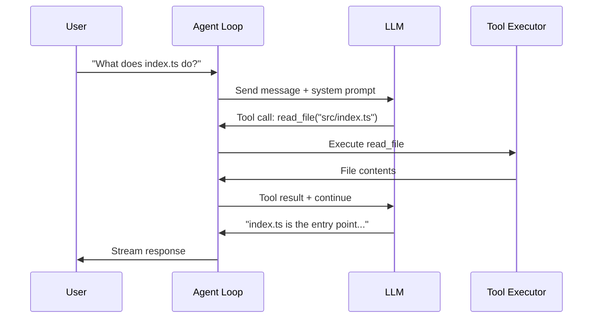

# Chapter 1: Getting Started

> Install nanocoder, configure your first provider, and run your first interactive coding session.

## Overview

This chapter walks you through installing nanocoder, connecting it to an LLM provider, and running your first interactive session. You'll understand the basic interaction model that all AI coding agents share: a conversational loop where the AI can read, write, and execute code on your behalf.

## Installation

### From npm (Recommended)

```bash
# Install globally
npm install -g @anthropic/nanocoder

# Verify installation
nanocoder --version
```

### From Source

```bash
# Clone the repository
git clone https://github.com/Nano-Collective/nanocoder.git
cd nanocoder

# Install dependencies
pnpm install

# Build the project
pnpm build

# Link for global usage
pnpm link --global
```

### System Requirements

| Requirement | Minimum | Recommended |
|-------------|---------|-------------|
| Node.js | 20.0+ | 22.x LTS |
| pnpm | 8.0+ | Latest |
| RAM | 4 GB | 8 GB+ (for local models) |
| Disk | 500 MB | 10 GB+ (for local models) |

## Configuring an LLM Provider

Nanocoder works with any OpenAI-compatible API. You can use cloud providers, local models, or a combination of both.

### Option 1: Local Models with Ollama

```bash
# Install Ollama (macOS)
brew install ollama

# Pull a coding model
ollama pull qwen2.5-coder:7b

# Nanocoder auto-detects Ollama at localhost:11434
nanocoder
```

### Option 2: Cloud Providers

```bash
# Set your API key as an environment variable
export OPENROUTER_API_KEY="sk-or-v1-..."

# Or configure in agents.config.json
cat > agents.config.json << 'EOF'
{
  "provider": {
    "name": "openrouter",
    "apiBase": "https://openrouter.ai/api/v1",
    "apiKey": "${OPENROUTER_API_KEY}",
    "model": "anthropic/claude-sonnet-4-20250514"
  }
}
EOF
```

### Option 3: Local Server (llama.cpp, LM Studio, vLLM)

```bash
# Point to any OpenAI-compatible server
cat > agents.config.json << 'EOF'
{
  "provider": {
    "name": "local",
    "apiBase": "http://localhost:8080/v1",
    "apiKey": "not-needed",
    "model": "local-model"
  }
}
EOF
```

## Your First Interactive Session

Launch nanocoder in any project directory:

```bash
cd ~/my-project
nanocoder
```

You'll see an interactive prompt where you can chat with the AI about your code:

```
🤖 nanocoder v0.1.0
Provider: ollama (qwen2.5-coder:7b)
Working directory: ~/my-project

> What files are in this project and what do they do?
```

The agent will:
1. Read your project structure
2. Analyze key files
3. Provide a summary of the codebase

### Understanding the Interaction Model



Every interaction follows this pattern:
1. **User sends a message** to the agent loop
2. **Agent forwards to LLM** with system prompt and conversation history
3. **LLM responds** with either text or tool calls
4. **Tool calls are executed** (with user approval for destructive operations)
5. **Results are fed back** to the LLM for further processing
6. **Final response** is streamed to the user

### Trying Tool-Based Operations

Ask the agent to make a change:

```
> Create a new file called hello.ts that exports a greet function

🔧 Tool: write_file
   Path: hello.ts
   Content:
   export function greet(name: string): string {
     return `Hello, ${name}!`;
   }

   Approve? [y/n/e(dit)]
```

The approval workflow ensures you always review changes before they're applied. This is a fundamental safety pattern in all production AI coding agents.

## Slash Commands

Nanocoder includes built-in commands for session control:

| Command | Description |
|---------|-------------|
| `/help` | Show available commands |
| `/model <name>` | Switch the active model |
| `/tag <file>` | Add a file to the context window |
| `/untag <file>` | Remove a file from context |
| `/clear` | Clear conversation history |
| `/config` | Show current configuration |
| `/exit` | End the session |

```
> /model claude-sonnet-4-20250514
Switched to model: claude-sonnet-4-20250514

> /tag src/utils.ts
Added src/utils.ts to context (2.1 KB, ~520 tokens)

> Now refactor the helper functions in utils.ts
```

## Non-Interactive Mode

For scripting and automation, use `run` mode:

```bash
# Single task execution
nanocoder run "Add error handling to all async functions in src/"

# Pipe input
echo "Fix the TypeScript errors" | nanocoder run

# With specific model
nanocoder run --model gpt-4o "Write unit tests for src/auth.ts"
```

## Project Structure Overview

Understanding nanocoder's own codebase helps you understand AI coding agents in general:

```
nanocoder/
├── src/
│   ├── index.ts          # CLI entry point
│   ├── agent/
│   │   ├── loop.ts       # Core agent loop
│   │   ├── system.ts     # System prompt construction
│   │   └── history.ts    # Conversation history management
│   ├── providers/
│   │   ├── base.ts       # Provider interface
│   │   ├── ollama.ts     # Ollama integration
│   │   └── openai.ts     # OpenAI-compatible API
│   ├── tools/
│   │   ├── registry.ts   # Tool registration
│   │   ├── read.ts       # File reading
│   │   ├── write.ts      # File writing
│   │   ├── bash.ts       # Command execution
│   │   └── search.ts     # Code search
│   ├── config/
│   │   └── loader.ts     # Configuration management
│   └── ui/
│       ├── terminal.ts   # Terminal rendering
│       └── approval.ts   # Approval workflow UI
├── agents.config.json    # Default configuration
├── package.json
└── tsconfig.json
```

## Summary

You've installed nanocoder, configured an LLM provider, and run your first interactive session. The key concept to remember is the **agent loop**: a cycle of user input → LLM reasoning → tool execution → result feedback that powers all AI coding agents.

## Key Takeaways

1. Nanocoder is a local-first CLI agent that keeps your code on your machine
2. It works with any OpenAI-compatible API, including local models via Ollama
3. The interaction model follows a read-eval-execute loop with tool calling
4. An approval workflow gates all destructive operations
5. Slash commands provide session control without leaving the chat interface

## Next Steps

In [Chapter 2: Architecture & Agent Loop](02-architecture-agent-loop.md), we'll dive deep into the core architecture—how the agent loop is implemented, how messages are orchestrated, and how the system prompt shapes agent behavior.

---

*Built with insights from the [Nanocoder](https://github.com/Nano-Collective/nanocoder) project.*
