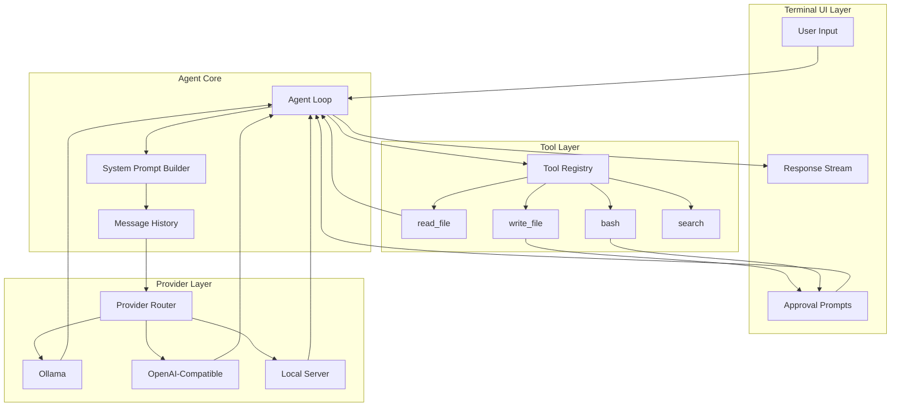
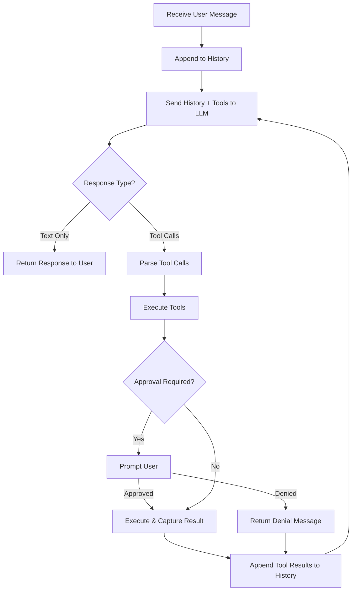

# Chapter 2: Architecture & Agent Loop

> Understanding the core architecture that powers every AI coding agent—from message orchestration to the agentic execution loop.

## Overview

The agent loop is the beating heart of every AI coding agent. This chapter dissects how nanocoder's architecture works internally: how user messages flow through the system, how the LLM decides when to use tools versus respond with text, and how results are fed back to create a coherent multi-turn interaction.

## High-Level Architecture



## The Agent Loop

The agent loop is a while-loop that continues until the LLM produces a final text response with no tool calls. Here's the core pattern:

```typescript
interface Message {
  role: "system" | "user" | "assistant" | "tool";
  content: string;
  tool_calls?: ToolCall[];
  tool_call_id?: string;
}

interface ToolCall {
  id: string;
  type: "function";
  function: {
    name: string;
    arguments: string; // JSON string
  };
}

async function agentLoop(
  userMessage: string,
  history: Message[],
  provider: LLMProvider,
  tools: ToolRegistry
): Promise<string> {
  // Add user message to history
  history.push({ role: "user", content: userMessage });

  while (true) {
    // Send full history to LLM
    const response = await provider.chat({
      messages: history,
      tools: tools.getSchemas(),
      stream: true,
    });

    // Add assistant response to history
    history.push({
      role: "assistant",
      content: response.content,
      tool_calls: response.toolCalls,
    });

    // If no tool calls, we're done
    if (!response.toolCalls || response.toolCalls.length === 0) {
      return response.content;
    }

    // Execute each tool call
    for (const toolCall of response.toolCalls) {
      const result = await tools.execute(
        toolCall.function.name,
        JSON.parse(toolCall.function.arguments)
      );

      // Add tool result to history
      history.push({
        role: "tool",
        content: JSON.stringify(result),
        tool_call_id: toolCall.id,
      });
    }

    // Loop continues — LLM will see tool results on next iteration
  }
}
```

### Loop Execution Flow



### Why This Pattern Works

The agent loop exploits a key property of modern LLMs: **tool use is a native capability**. When you provide tool schemas alongside your messages, the LLM can choose to:

1. **Respond with text** — when it has enough information
2. **Request tool calls** — when it needs to read files, execute commands, or gather more context
3. **Chain multiple tools** — reading a file, then modifying it, then running tests

The loop naturally handles multi-step tasks because each tool result becomes part of the conversation history, giving the LLM the context it needs to decide the next action.

## System Prompt Construction

The system prompt is the hidden instruction set that shapes agent behavior. Nanocoder builds it dynamically based on the current project and configuration:

```typescript
function buildSystemPrompt(config: AgentConfig): string {
  const sections: string[] = [];

  // Core identity
  sections.push(`You are a coding assistant running in the user's terminal.
You have access to tools for reading files, writing files, and executing commands.
Always explain what you're about to do before using tools.`);

  // Working directory context
  sections.push(`Current working directory: ${process.cwd()}
Project type: ${detectProjectType()}
Package manager: ${detectPackageManager()}`);

  // Tool usage guidelines
  sections.push(`## Tool Usage Guidelines
- Use read_file to examine code before making changes
- Always show file changes to the user before writing
- Use bash for running tests, builds, and other commands
- Never execute destructive commands without explicit approval`);

  // Custom instructions from config
  if (config.systemPrompt) {
    sections.push(`## Project-Specific Instructions\n${config.systemPrompt}`);
  }

  return sections.join("\n\n");
}
```

### Project Type Detection

```typescript
function detectProjectType(): string {
  const indicators: Record<string, string> = {
    "package.json": "Node.js/TypeScript",
    "pyproject.toml": "Python",
    "Cargo.toml": "Rust",
    "go.mod": "Go",
    "pom.xml": "Java (Maven)",
    "build.gradle": "Java (Gradle)",
    "Gemfile": "Ruby",
  };

  for (const [file, type] of Object.entries(indicators)) {
    if (existsSync(file)) return type;
  }
  return "Unknown";
}
```

## Message History Management

Conversation history is the LLM's working memory. Managing it well is critical for agent performance:

```typescript
class MessageHistory {
  private messages: Message[] = [];
  private maxTokens: number;

  constructor(maxTokens: number = 100000) {
    this.maxTokens = maxTokens;
  }

  push(message: Message): void {
    this.messages.push(message);
    this.trim();
  }

  // Keep recent messages, summarize or drop older ones
  private trim(): void {
    const totalTokens = this.estimateTokens();
    if (totalTokens <= this.maxTokens) return;

    // Strategy: keep system prompt + last N messages
    const systemMessages = this.messages.filter(
      (m) => m.role === "system"
    );
    const nonSystemMessages = this.messages.filter(
      (m) => m.role !== "system"
    );

    // Remove oldest non-system messages until under budget
    while (
      this.estimateTokens() > this.maxTokens &&
      nonSystemMessages.length > 2
    ) {
      nonSystemMessages.shift();
    }

    this.messages = [...systemMessages, ...nonSystemMessages];
  }

  private estimateTokens(): number {
    // Rough estimate: 1 token ≈ 4 characters
    return this.messages.reduce(
      (sum, m) => sum + Math.ceil(m.content.length / 4),
      0
    );
  }

  getMessages(): Message[] {
    return [...this.messages];
  }
}
```

## Streaming Responses

AI coding agents stream responses token-by-token for a responsive user experience:

```typescript
async function streamResponse(
  provider: LLMProvider,
  messages: Message[],
  tools: ToolSchema[]
): Promise<StreamedResponse> {
  const stream = await provider.chat({
    messages,
    tools,
    stream: true,
  });

  let content = "";
  let toolCalls: ToolCall[] = [];

  for await (const chunk of stream) {
    if (chunk.type === "content_delta") {
      content += chunk.text;
      process.stdout.write(chunk.text); // Real-time output
    }

    if (chunk.type === "tool_call_delta") {
      // Accumulate tool call data
      const existing = toolCalls.find((tc) => tc.id === chunk.id);
      if (existing) {
        existing.function.arguments += chunk.argumentsDelta;
      } else {
        toolCalls.push({
          id: chunk.id,
          type: "function",
          function: {
            name: chunk.functionName,
            arguments: chunk.argumentsDelta,
          },
        });
      }
    }
  }

  return { content, toolCalls };
}
```

## Error Handling in the Loop

Robust error handling prevents the agent from crashing mid-task:

```typescript
async function executeToolWithRetry(
  tools: ToolRegistry,
  toolCall: ToolCall,
  maxRetries: number = 2
): Promise<ToolResult> {
  for (let attempt = 0; attempt <= maxRetries; attempt++) {
    try {
      const result = await tools.execute(
        toolCall.function.name,
        JSON.parse(toolCall.function.arguments)
      );
      return { success: true, output: result };
    } catch (error) {
      if (attempt === maxRetries) {
        return {
          success: false,
          output: `Error executing ${toolCall.function.name}: ${error.message}`,
        };
      }
      // Feed error back to LLM for self-correction
    }
  }
}
```

The error result is added to the conversation history, allowing the LLM to:
- Understand what went wrong
- Try a different approach
- Ask the user for help

## Comparing Agent Architectures

Different AI coding agents implement the loop differently:

| Aspect | Nanocoder | Aider | Claude Code | OpenHands |
|--------|-----------|-------|-------------|-----------|
| **Loop Type** | Single-threaded | Single-threaded | Multi-threaded | Process-based |
| **History** | In-memory | Git-backed | In-memory + disk | Database |
| **Tool Protocol** | OpenAI function calling | Custom edit format | Anthropic tool use | Custom action space |
| **Streaming** | Token-level | Line-level | Token-level | Chunk-level |
| **Error Recovery** | Retry + feedback | Git rollback | Retry + feedback | Checkpoint restore |

## Summary

The agent loop is deceptively simple—a while-loop that sends messages to an LLM and executes tool calls until the LLM responds with text only. The sophistication lies in the details: how history is managed, how tools are defined, how errors are handled, and how the system prompt shapes behavior.

## Key Takeaways

1. The agent loop is a `while(true)` that breaks when the LLM produces no tool calls
2. Tool results become part of conversation history, enabling multi-step reasoning
3. System prompts are built dynamically based on project context
4. Message history must be actively managed to stay within token limits
5. Streaming provides responsive UX while accumulating tool call data
6. Error handling feeds failures back to the LLM for self-correction

## Next Steps

In [Chapter 3: Tool System Internals](03-tool-system-internals.md), we'll explore how tools are defined, registered, and executed—the interface between LLM intelligence and real-world actions.

---

*Built with insights from the [Nanocoder](https://github.com/Nano-Collective/nanocoder) project.*
