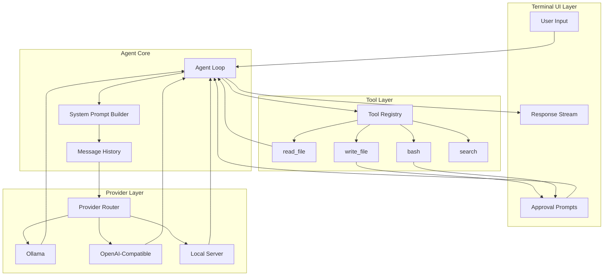
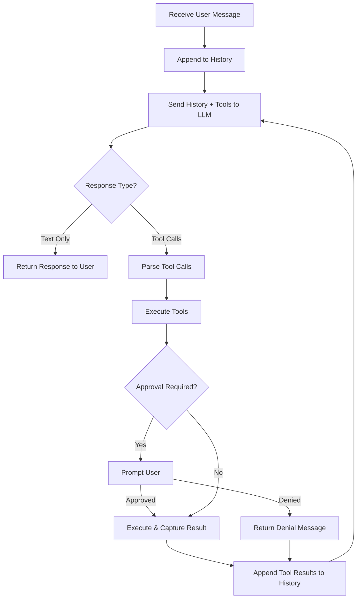

# Chapter 2: Architecture & Agent Loop

Welcome to **Chapter 2: Architecture & Agent Loop**. In this part of **Nanocoder Tutorial: Building and Understanding AI Coding Agents**, you will build an intuitive mental model first, then move into concrete implementation details and practical production tradeoffs.


> Understanding the core architecture that powers every AI coding agent—from message orchestration to the agentic execution loop.

## Overview

The agent loop is the beating heart of every AI coding agent. This chapter dissects how nanocoder's architecture works internally: how user messages flow through the system, how the LLM decides when to use tools versus respond with text, and how results are fed back to create a coherent multi-turn interaction.

## High-Level Architecture



## The Agent Loop

The agent loop is a while-loop that continues until the LLM produces a final text response with no tool calls. Here's the core pattern:

```typescript
interface Message {
  role: "system" | "user" | "assistant" | "tool";
  content: string;
  tool_calls?: ToolCall[];
  tool_call_id?: string;
}

interface ToolCall {
  id: string;
  type: "function";
  function: {
    name: string;
    arguments: string; // JSON string
  };
}

async function agentLoop(
  userMessage: string,
  history: Message[],
  provider: LLMProvider,
  tools: ToolRegistry
): Promise<string> {
  // Add user message to history
  history.push({ role: "user", content: userMessage });

  while (true) {
    // Send full history to LLM
    const response = await provider.chat({
      messages: history,
      tools: tools.getSchemas(),
      stream: true,
    });

    // Add assistant response to history
    history.push({
      role: "assistant",
      content: response.content,
      tool_calls: response.toolCalls,
    });

    // If no tool calls, we're done
    if (!response.toolCalls || response.toolCalls.length === 0) {
      return response.content;
    }

    // Execute each tool call
    for (const toolCall of response.toolCalls) {
      const result = await tools.execute(
        toolCall.function.name,
        JSON.parse(toolCall.function.arguments)
      );

      // Add tool result to history
      history.push({
        role: "tool",
        content: JSON.stringify(result),
        tool_call_id: toolCall.id,
      });
    }

    // Loop continues — LLM will see tool results on next iteration
  }
}
```

### Loop Execution Flow



### Why This Pattern Works

The agent loop exploits a key property of modern LLMs: **tool use is a native capability**. When you provide tool schemas alongside your messages, the LLM can choose to:

1. **Respond with text** — when it has enough information
2. **Request tool calls** — when it needs to read files, execute commands, or gather more context
3. **Chain multiple tools** — reading a file, then modifying it, then running tests

The loop naturally handles multi-step tasks because each tool result becomes part of the conversation history, giving the LLM the context it needs to decide the next action.

## System Prompt Construction

The system prompt is the hidden instruction set that shapes agent behavior. Nanocoder builds it dynamically based on the current project and configuration:

```typescript
function buildSystemPrompt(config: AgentConfig): string {
  const sections: string[] = [];

  // Core identity
  sections.push(`You are a coding assistant running in the user's terminal.
You have access to tools for reading files, writing files, and executing commands.
Always explain what you're about to do before using tools.`);

  // Working directory context
  sections.push(`Current working directory: ${process.cwd()}
Project type: ${detectProjectType()}
Package manager: ${detectPackageManager()}`);

  // Tool usage guidelines
  sections.push(`## Tool Usage Guidelines
- Use read_file to examine code before making changes
- Always show file changes to the user before writing
- Use bash for running tests, builds, and other commands
- Never execute destructive commands without explicit approval`);

  // Custom instructions from config
  if (config.systemPrompt) {
    sections.push(`## Project-Specific Instructions\n${config.systemPrompt}`);
  }

  return sections.join("\n\n");
}
```

### Project Type Detection

```typescript
function detectProjectType(): string {
  const indicators: Record<string, string> = {
    "package.json": "Node.js/TypeScript",
    "pyproject.toml": "Python",
    "Cargo.toml": "Rust",
    "go.mod": "Go",
    "pom.xml": "Java (Maven)",
    "build.gradle": "Java (Gradle)",
    "Gemfile": "Ruby",
  };

  for (const [file, type] of Object.entries(indicators)) {
    if (existsSync(file)) return type;
  }
  return "Unknown";
}
```

## Message History Management

Conversation history is the LLM's working memory. Managing it well is critical for agent performance:

```typescript
class MessageHistory {
  private messages: Message[] = [];
  private maxTokens: number;

  constructor(maxTokens: number = 100000) {
    this.maxTokens = maxTokens;
  }

  push(message: Message): void {
    this.messages.push(message);
    this.trim();
  }

  // Keep recent messages, summarize or drop older ones
  private trim(): void {
    const totalTokens = this.estimateTokens();
    if (totalTokens <= this.maxTokens) return;

    // Strategy: keep system prompt + last N messages
    const systemMessages = this.messages.filter(
      (m) => m.role === "system"
    );
    const nonSystemMessages = this.messages.filter(
      (m) => m.role !== "system"
    );

    // Remove oldest non-system messages until under budget
    while (
      this.estimateTokens() > this.maxTokens &&
      nonSystemMessages.length > 2
    ) {
      nonSystemMessages.shift();
    }

    this.messages = [...systemMessages, ...nonSystemMessages];
  }

  private estimateTokens(): number {
    // Rough estimate: 1 token ≈ 4 characters
    return this.messages.reduce(
      (sum, m) => sum + Math.ceil(m.content.length / 4),
      0
    );
  }

  getMessages(): Message[] {
    return [...this.messages];
  }
}
```

## Streaming Responses

AI coding agents stream responses token-by-token for a responsive user experience:

```typescript
async function streamResponse(
  provider: LLMProvider,
  messages: Message[],
  tools: ToolSchema[]
): Promise<StreamedResponse> {
  const stream = await provider.chat({
    messages,
    tools,
    stream: true,
  });

  let content = "";
  let toolCalls: ToolCall[] = [];

  for await (const chunk of stream) {
    if (chunk.type === "content_delta") {
      content += chunk.text;
      process.stdout.write(chunk.text); // Real-time output
    }

    if (chunk.type === "tool_call_delta") {
      // Accumulate tool call data
      const existing = toolCalls.find((tc) => tc.id === chunk.id);
      if (existing) {
        existing.function.arguments += chunk.argumentsDelta;
      } else {
        toolCalls.push({
          id: chunk.id,
          type: "function",
          function: {
            name: chunk.functionName,
            arguments: chunk.argumentsDelta,
          },
        });
      }
    }
  }

  return { content, toolCalls };
}
```

## Error Handling in the Loop

Robust error handling prevents the agent from crashing mid-task:

```typescript
async function executeToolWithRetry(
  tools: ToolRegistry,
  toolCall: ToolCall,
  maxRetries: number = 2
): Promise<ToolResult> {
  for (let attempt = 0; attempt <= maxRetries; attempt++) {
    try {
      const result = await tools.execute(
        toolCall.function.name,
        JSON.parse(toolCall.function.arguments)
      );
      return { success: true, output: result };
    } catch (error) {
      if (attempt === maxRetries) {
        return {
          success: false,
          output: `Error executing ${toolCall.function.name}: ${error.message}`,
        };
      }
      // Feed error back to LLM for self-correction
    }
  }
}
```

The error result is added to the conversation history, allowing the LLM to:
- Understand what went wrong
- Try a different approach
- Ask the user for help

## Comparing Agent Architectures

Different AI coding agents implement the loop differently:

| Aspect | Nanocoder | Aider | Claude Code | OpenHands |
|--------|-----------|-------|-------------|-----------|
| **Loop Type** | Single-threaded | Single-threaded | Multi-threaded | Process-based |
| **History** | In-memory | Git-backed | In-memory + disk | Database |
| **Tool Protocol** | OpenAI function calling | Custom edit format | Anthropic tool use | Custom action space |
| **Streaming** | Token-level | Line-level | Token-level | Chunk-level |
| **Error Recovery** | Retry + feedback | Git rollback | Retry + feedback | Checkpoint restore |

## Summary

The agent loop is deceptively simple—a while-loop that sends messages to an LLM and executes tool calls until the LLM responds with text only. The sophistication lies in the details: how history is managed, how tools are defined, how errors are handled, and how the system prompt shapes behavior.

## Key Takeaways

1. The agent loop is a `while(true)` that breaks when the LLM produces no tool calls
2. Tool results become part of conversation history, enabling multi-step reasoning
3. System prompts are built dynamically based on project context
4. Message history must be actively managed to stay within token limits
5. Streaming provides responsive UX while accumulating tool call data
6. Error handling feeds failures back to the LLM for self-correction

## Next Steps

In [Chapter 3: Tool System Internals](03-tool-system-internals.md), we'll explore how tools are defined, registered, and executed—the interface between LLM intelligence and real-world actions.

---

*Built with insights from the [Nanocoder](https://github.com/Nano-Collective/nanocoder) project.*

## Depth Expansion Playbook

<!-- depth-expansion-v2 -->

This chapter is expanded to v1-style depth for production-grade learning and implementation quality.

### Strategic Context

- tutorial: **Nanocoder Tutorial: Building and Understanding AI Coding Agents**
- tutorial slug: **nanocoder-tutorial**
- chapter focus: **Chapter 2: Architecture & Agent Loop**
- system context: **Nanocoder Tutorial**
- objective: move from surface-level usage to repeatable engineering operation

### Architecture Decomposition

1. Define the runtime boundary for `Chapter 2: Architecture & Agent Loop`.
2. Separate control-plane decisions from data-plane execution.
3. Capture input contracts, transformation points, and output contracts.
4. Trace state transitions across request lifecycle stages.
5. Identify extension hooks and policy interception points.
6. Map ownership boundaries for team and automation workflows.
7. Specify rollback and recovery paths for unsafe changes.
8. Track observability signals for correctness, latency, and cost.

### Operator Decision Matrix

| Decision Area | Low-Risk Path | High-Control Path | Tradeoff |
|:--------------|:--------------|:------------------|:---------|
| Runtime mode | managed defaults | explicit policy config | speed vs control |
| State handling | local ephemeral | durable persisted state | simplicity vs auditability |
| Tool integration | direct API use | mediated adapter layer | velocity vs governance |
| Rollout method | manual change | staged + canary rollout | effort vs safety |
| Incident response | best effort logs | runbooks + SLO alerts | cost vs reliability |

### Failure Modes and Countermeasures

| Failure Mode | Early Signal | Root Cause Pattern | Countermeasure |
|:-------------|:-------------|:-------------------|:---------------|
| stale context | inconsistent outputs | missing refresh window | enforce context TTL and refresh hooks |
| policy drift | unexpected execution | ad hoc overrides | centralize policy profiles |
| auth mismatch | 401/403 bursts | credential sprawl | rotation schedule + scope minimization |
| schema breakage | parser/validation errors | unmanaged upstream changes | contract tests per release |
| retry storms | queue congestion | no backoff controls | jittered backoff + circuit breakers |
| silent regressions | quality drop without alerts | weak baseline metrics | eval harness with thresholds |

### Implementation Runbook

1. Establish a reproducible baseline environment.
2. Capture chapter-specific success criteria before changes.
3. Implement minimal viable path with explicit interfaces.
4. Add observability before expanding feature scope.
5. Run deterministic tests for happy-path behavior.
6. Inject failure scenarios for negative-path validation.
7. Compare output quality against baseline snapshots.
8. Promote through staged environments with rollback gates.
9. Record operational lessons in release notes.

### Quality Gate Checklist

- [ ] chapter-level assumptions are explicit and testable
- [ ] API/tool boundaries are documented with input/output examples
- [ ] failure handling includes retry, timeout, and fallback policy
- [ ] security controls include auth scopes and secret rotation plans
- [ ] observability includes logs, metrics, traces, and alert thresholds
- [ ] deployment guidance includes canary and rollback paths
- [ ] docs include links to upstream sources and related tracks
- [ ] post-release verification confirms expected behavior under load

### Source Alignment

- [Nanocoder Repository](https://github.com/Nano-Collective/nanocoder)
- [Nanocoder Releases](https://github.com/Nano-Collective/nanocoder/releases)
- [Nanocoder Documentation Directory](https://github.com/Nano-Collective/nanocoder/tree/main/docs)
- [Nanocoder MCP Configuration Guide](https://github.com/Nano-Collective/nanocoder/blob/main/docs/mcp-configuration.md)
- [Nano Collective Website](https://nanocollective.org/)

### Cross-Tutorial Connection Map

- [Aider Tutorial](../aider-tutorial/)
- [Claude Code Tutorial](../claude-code-tutorial/)
- [Continue Tutorial](../continue-tutorial/)
- [OpenHands Tutorial](../openhands-tutorial/)
- [Chapter 1: Getting Started](01-getting-started.md)

### Advanced Practice Exercises

1. Build a minimal end-to-end implementation for `Chapter 2: Architecture & Agent Loop`.
2. Add instrumentation and measure baseline latency and error rate.
3. Introduce one controlled failure and confirm graceful recovery.
4. Add policy constraints and verify they are enforced consistently.
5. Run a staged rollout and document rollback decision criteria.

### Review Questions

1. Which execution boundary matters most for this chapter and why?
2. What signal detects regressions earliest in your environment?
3. What tradeoff did you make between delivery speed and governance?
4. How would you recover from the highest-impact failure mode?
5. What must be automated before scaling to team-wide adoption?

### Scenario Playbook 1: Chapter 2: Architecture & Agent Loop

- tutorial context: **Nanocoder Tutorial: Building and Understanding AI Coding Agents**
- trigger condition: incoming request volume spikes after release
- initial hypothesis: identify the smallest reproducible failure boundary
- immediate action: protect user-facing stability before optimization work
- engineering control: introduce adaptive concurrency limits and queue bounds
- verification target: latency p95 and p99 stay within defined SLO windows
- rollback trigger: pre-defined quality gate fails for two consecutive checks
- communication step: publish incident status with owner and ETA
- learning capture: add postmortem and convert findings into automated tests

### Scenario Playbook 2: Chapter 2: Architecture & Agent Loop

- tutorial context: **Nanocoder Tutorial: Building and Understanding AI Coding Agents**
- trigger condition: tool dependency latency increases under concurrency
- initial hypothesis: identify the smallest reproducible failure boundary
- immediate action: protect user-facing stability before optimization work
- engineering control: enable staged retries with jitter and circuit breaker fallback
- verification target: error budget burn rate remains below escalation threshold
- rollback trigger: pre-defined quality gate fails for two consecutive checks
- communication step: publish incident status with owner and ETA
- learning capture: add postmortem and convert findings into automated tests

### Scenario Playbook 3: Chapter 2: Architecture & Agent Loop

- tutorial context: **Nanocoder Tutorial: Building and Understanding AI Coding Agents**
- trigger condition: schema updates introduce incompatible payloads
- initial hypothesis: identify the smallest reproducible failure boundary
- immediate action: protect user-facing stability before optimization work
- engineering control: pin schema versions and add compatibility shims
- verification target: throughput remains stable under target concurrency
- rollback trigger: pre-defined quality gate fails for two consecutive checks
- communication step: publish incident status with owner and ETA
- learning capture: add postmortem and convert findings into automated tests

### Scenario Playbook 4: Chapter 2: Architecture & Agent Loop

- tutorial context: **Nanocoder Tutorial: Building and Understanding AI Coding Agents**
- trigger condition: environment parity drifts between staging and production
- initial hypothesis: identify the smallest reproducible failure boundary
- immediate action: protect user-facing stability before optimization work
- engineering control: restore environment parity via immutable config promotion
- verification target: retry volume stays bounded without feedback loops
- rollback trigger: pre-defined quality gate fails for two consecutive checks
- communication step: publish incident status with owner and ETA
- learning capture: add postmortem and convert findings into automated tests

### Scenario Playbook 5: Chapter 2: Architecture & Agent Loop

- tutorial context: **Nanocoder Tutorial: Building and Understanding AI Coding Agents**
- trigger condition: access policy changes reduce successful execution rates
- initial hypothesis: identify the smallest reproducible failure boundary
- immediate action: protect user-facing stability before optimization work
- engineering control: re-scope credentials and rotate leaked or stale keys
- verification target: data integrity checks pass across write/read cycles
- rollback trigger: pre-defined quality gate fails for two consecutive checks
- communication step: publish incident status with owner and ETA
- learning capture: add postmortem and convert findings into automated tests

### Scenario Playbook 6: Chapter 2: Architecture & Agent Loop

- tutorial context: **Nanocoder Tutorial: Building and Understanding AI Coding Agents**
- trigger condition: background jobs accumulate and exceed processing windows
- initial hypothesis: identify the smallest reproducible failure boundary
- immediate action: protect user-facing stability before optimization work
- engineering control: activate degradation mode to preserve core user paths
- verification target: audit logs capture all control-plane mutations
- rollback trigger: pre-defined quality gate fails for two consecutive checks
- communication step: publish incident status with owner and ETA
- learning capture: add postmortem and convert findings into automated tests

### Scenario Playbook 7: Chapter 2: Architecture & Agent Loop

- tutorial context: **Nanocoder Tutorial: Building and Understanding AI Coding Agents**
- trigger condition: incoming request volume spikes after release
- initial hypothesis: identify the smallest reproducible failure boundary
- immediate action: protect user-facing stability before optimization work
- engineering control: introduce adaptive concurrency limits and queue bounds
- verification target: latency p95 and p99 stay within defined SLO windows
- rollback trigger: pre-defined quality gate fails for two consecutive checks
- communication step: publish incident status with owner and ETA
- learning capture: add postmortem and convert findings into automated tests

### Scenario Playbook 8: Chapter 2: Architecture & Agent Loop

- tutorial context: **Nanocoder Tutorial: Building and Understanding AI Coding Agents**
- trigger condition: tool dependency latency increases under concurrency
- initial hypothesis: identify the smallest reproducible failure boundary
- immediate action: protect user-facing stability before optimization work
- engineering control: enable staged retries with jitter and circuit breaker fallback
- verification target: error budget burn rate remains below escalation threshold
- rollback trigger: pre-defined quality gate fails for two consecutive checks
- communication step: publish incident status with owner and ETA
- learning capture: add postmortem and convert findings into automated tests

## What Problem Does This Solve?

Most teams struggle here because the hard part is not writing more code, but deciding clear boundaries for `messages`, `Loop`, `content` so behavior stays predictable as complexity grows.

In practical terms, this chapter helps you avoid three common failures:

- coupling core logic too tightly to one implementation path
- missing the handoff boundaries between setup, execution, and validation
- shipping changes without clear rollback or observability strategy

After working through this chapter, you should be able to reason about `Chapter 2: Architecture & Agent Loop` as an operating subsystem inside **Nanocoder Tutorial: Building and Understanding AI Coding Agents**, with explicit contracts for inputs, state transitions, and outputs.

Use the implementation notes around `tools`, `push`, `chunk` as your checklist when adapting these patterns to your own repository.

## How it Works Under the Hood

Under the hood, `Chapter 2: Architecture & Agent Loop` usually follows a repeatable control path:

1. **Context bootstrap**: initialize runtime config and prerequisites for `messages`.
2. **Input normalization**: shape incoming data so `Loop` receives stable contracts.
3. **Core execution**: run the main logic branch and propagate intermediate state through `content`.
4. **Policy and safety checks**: enforce limits, auth scopes, and failure boundaries.
5. **Output composition**: return canonical result payloads for downstream consumers.
6. **Operational telemetry**: emit logs/metrics needed for debugging and performance tuning.

When debugging, walk this sequence in order and confirm each stage has explicit success/failure conditions.

## Source Walkthrough

Use the following upstream sources to verify implementation details while reading this chapter:

- [Nanocoder Repository](https://github.com/Nano-Collective/nanocoder)
  Why it matters: authoritative reference on `Nanocoder Repository` (github.com).
- [Nanocoder Releases](https://github.com/Nano-Collective/nanocoder/releases)
  Why it matters: authoritative reference on `Nanocoder Releases` (github.com).
- [Nanocoder Documentation Directory](https://github.com/Nano-Collective/nanocoder/tree/main/docs)
  Why it matters: authoritative reference on `Nanocoder Documentation Directory` (github.com).
- [Nanocoder MCP Configuration Guide](https://github.com/Nano-Collective/nanocoder/blob/main/docs/mcp-configuration.md)
  Why it matters: authoritative reference on `Nanocoder MCP Configuration Guide` (github.com).
- [Nano Collective Website](https://nanocollective.org/)
  Why it matters: authoritative reference on `Nano Collective Website` (nanocollective.org).

Suggested trace strategy:
- search upstream code for `messages` and `Loop` to map concrete implementation paths
- compare docs claims against actual runtime/config code before reusing patterns in production

## Chapter Connections

- [Tutorial Index](index.md)
- [Previous Chapter: Chapter 1: Getting Started](01-getting-started.md)
- [Next Chapter: Chapter 3: Tool System Internals](03-tool-system-internals.md)
- [Main Catalog](../../README.md#-tutorial-catalog)
- [A-Z Tutorial Directory](../../discoverability/tutorial-directory.md)
