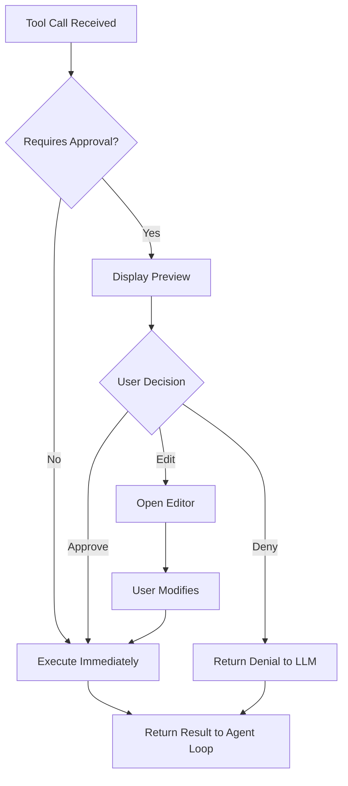

# Chapter 3: Tool System Internals

> How AI coding agents bridge the gap between LLM reasoning and real-world file system and shell operations.

## Overview

Tools are what transform an LLM from a chatbot into a coding agent. This chapter explores how the tool system works internally: the JSON Schema-based tool definitions that LLMs understand, the registry pattern for managing tools, the execution pipeline, and the approval workflow that keeps destructive operations safe.

## Tool Definition Schema

LLMs understand tools through JSON Schema definitions. Each tool has a name, description, and parameter schema:

```typescript
interface ToolDefinition {
  type: "function";
  function: {
    name: string;
    description: string;
    parameters: {
      type: "object";
      properties: Record<string, ParameterSchema>;
      required: string[];
    };
  };
}

// Example: read_file tool definition
const readFileTool: ToolDefinition = {
  type: "function",
  function: {
    name: "read_file",
    description:
      "Read the contents of a file at the given path. " +
      "Returns the file contents as a string. " +
      "Use this to examine code before making changes.",
    parameters: {
      type: "object",
      properties: {
        path: {
          type: "string",
          description: "Relative or absolute path to the file to read",
        },
        offset: {
          type: "number",
          description: "Line number to start reading from (1-indexed)",
        },
        limit: {
          type: "number",
          description: "Maximum number of lines to read",
        },
      },
      required: ["path"],
    },
  },
};
```

### Why Descriptions Matter

The tool description is the LLM's only guide for when and how to use a tool. Compare:

```typescript
// Bad: vague description
{
  name: "write_file",
  description: "Writes a file"
}

// Good: specific, instructive description
{
  name: "write_file",
  description:
    "Write content to a file, creating it if it doesn't exist " +
    "or overwriting if it does. Always use read_file first to " +
    "understand existing content before overwriting. Show the " +
    "user what you plan to write before executing."
}
```

## Tool Registry Pattern

The tool registry centralizes tool management—registration, schema export, and execution dispatch:

```typescript
type ToolHandler = (args: Record<string, unknown>) => Promise<string>;

interface RegisteredTool {
  definition: ToolDefinition;
  handler: ToolHandler;
  requiresApproval: boolean;
}

class ToolRegistry {
  private tools: Map<string, RegisteredTool> = new Map();

  register(
    definition: ToolDefinition,
    handler: ToolHandler,
    options: { requiresApproval?: boolean } = {}
  ): void {
    this.tools.set(definition.function.name, {
      definition,
      handler,
      requiresApproval: options.requiresApproval ?? false,
    });
  }

  getSchemas(): ToolDefinition[] {
    return Array.from(this.tools.values()).map((t) => t.definition);
  }

  async execute(
    name: string,
    args: Record<string, unknown>
  ): Promise<string> {
    const tool = this.tools.get(name);
    if (!tool) {
      throw new Error(`Unknown tool: ${name}`);
    }
    return tool.handler(args);
  }

  requiresApproval(name: string): boolean {
    return this.tools.get(name)?.requiresApproval ?? true;
  }
}
```

## Core Tool Implementations

### read_file

The simplest tool—read a file and return its contents:

```typescript
async function readFile(args: {
  path: string;
  offset?: number;
  limit?: number;
}): Promise<string> {
  const absolutePath = resolve(process.cwd(), args.path);

  // Security: prevent path traversal
  if (!absolutePath.startsWith(process.cwd())) {
    return "Error: Cannot read files outside the working directory";
  }

  try {
    const content = await fs.readFile(absolutePath, "utf-8");
    const lines = content.split("\n");

    const start = (args.offset ?? 1) - 1;
    const end = args.limit ? start + args.limit : lines.length;
    const slice = lines.slice(start, end);

    // Add line numbers for LLM reference
    return slice
      .map((line, i) => `${start + i + 1}\t${line}`)
      .join("\n");
  } catch (error) {
    return `Error reading ${args.path}: ${error.message}`;
  }
}
```

### write_file

Writing files requires showing the diff and getting approval:

```typescript
async function writeFile(args: {
  path: string;
  content: string;
}): Promise<string> {
  const absolutePath = resolve(process.cwd(), args.path);

  if (!absolutePath.startsWith(process.cwd())) {
    return "Error: Cannot write files outside the working directory";
  }

  try {
    // Read existing content for diff
    let existingContent = "";
    try {
      existingContent = await fs.readFile(absolutePath, "utf-8");
    } catch {
      // File doesn't exist yet
    }

    // Write the file
    await fs.mkdir(dirname(absolutePath), { recursive: true });
    await fs.writeFile(absolutePath, args.content, "utf-8");

    if (existingContent) {
      const diff = createDiff(existingContent, args.content);
      return `File updated: ${args.path}\n\nDiff:\n${diff}`;
    }
    return `File created: ${args.path} (${args.content.length} bytes)`;
  } catch (error) {
    return `Error writing ${args.path}: ${error.message}`;
  }
}
```

### bash

Command execution is the most powerful—and dangerous—tool:

```typescript
async function executeBash(args: {
  command: string;
  timeout?: number;
}): Promise<string> {
  const timeout = args.timeout ?? 30000; // 30 second default

  try {
    const { stdout, stderr } = await execAsync(args.command, {
      cwd: process.cwd(),
      timeout,
      maxBuffer: 1024 * 1024, // 1 MB
      env: {
        ...process.env,
        // Prevent interactive prompts
        GIT_TERMINAL_PROMPT: "0",
        DEBIAN_FRONTEND: "noninteractive",
      },
    });

    let output = "";
    if (stdout) output += stdout;
    if (stderr) output += `\nSTDERR:\n${stderr}`;

    // Truncate very long output
    if (output.length > 10000) {
      output =
        output.slice(0, 5000) +
        "\n... (truncated) ...\n" +
        output.slice(-2000);
    }

    return output || "(no output)";
  } catch (error) {
    return `Command failed (exit code ${error.code}):\n${error.stderr || error.message}`;
  }
}
```

### search (grep/ripgrep)

Code search helps the LLM find relevant files quickly:

```typescript
async function searchCode(args: {
  pattern: string;
  path?: string;
  glob?: string;
  maxResults?: number;
}): Promise<string> {
  const searchPath = args.path || ".";
  const maxResults = args.maxResults ?? 20;

  const rgArgs = [
    "--json",
    "--max-count",
    "5", // Max matches per file
    "-n", // Line numbers
  ];

  if (args.glob) {
    rgArgs.push("--glob", args.glob);
  }

  rgArgs.push(args.pattern, searchPath);

  try {
    const { stdout } = await execAsync(`rg ${rgArgs.join(" ")}`);
    const results = parseRipgrepJson(stdout);

    return results
      .slice(0, maxResults)
      .map(
        (r) =>
          `${r.file}:${r.line}: ${r.text.trim()}`
      )
      .join("\n");
  } catch {
    return `No matches found for pattern: ${args.pattern}`;
  }
}
```

## The Approval Workflow



### Categorizing Tool Safety

```typescript
function registerCoreTools(registry: ToolRegistry): void {
  // Safe: read-only operations
  registry.register(readFileDefinition, readFile, {
    requiresApproval: false,
  });

  registry.register(searchDefinition, searchCode, {
    requiresApproval: false,
  });

  // Requires approval: write operations
  registry.register(writeFileDefinition, writeFile, {
    requiresApproval: true,
  });

  // Requires approval: command execution
  registry.register(bashDefinition, executeBash, {
    requiresApproval: true,
  });
}
```

### Approval UI Implementation

```typescript
async function promptApproval(
  toolName: string,
  args: Record<string, unknown>
): Promise<"approve" | "deny" | "edit"> {
  console.log(`\n🔧 Tool: ${toolName}`);

  // Display tool-specific preview
  if (toolName === "write_file") {
    console.log(`   Path: ${args.path}`);
    console.log(`   Content:`);
    console.log(
      (args.content as string)
        .split("\n")
        .map((l) => `   ${l}`)
        .join("\n")
    );
  } else if (toolName === "bash") {
    console.log(`   Command: ${args.command}`);
  }

  const answer = await readline.question(
    "\n   Approve? [y/n/e(dit)] "
  );

  switch (answer.toLowerCase()) {
    case "y":
    case "yes":
      return "approve";
    case "e":
    case "edit":
      return "edit";
    default:
      return "deny";
  }
}
```

## Advanced: Tool Composition

LLMs naturally chain tools when given well-described capabilities:

```
User: "Add error handling to the fetch function in api.ts"

LLM thinks: I need to read the file first, then modify it.

Step 1: Tool call → read_file("src/api.ts")
        Result → file contents with fetch function

Step 2: Tool call → write_file("src/api.ts", modified_content)
        Approval → user reviews diff
        Result → "File updated"

Step 3: Tool call → bash("npm run typecheck")
        Approval → user approves
        Result → "No errors found"

Step 4: Text response → "I've added try-catch blocks..."
```

This emergent behavior requires no explicit orchestration—the LLM's training on coding patterns drives it to read-modify-verify naturally.

## Custom Tool Creation

You can extend nanocoder with project-specific tools:

```typescript
// Register a custom tool for running tests
registry.register(
  {
    type: "function",
    function: {
      name: "run_tests",
      description:
        "Run the project's test suite. Returns test results " +
        "including pass/fail counts and error details.",
      parameters: {
        type: "object",
        properties: {
          pattern: {
            type: "string",
            description: "Test file pattern to match (e.g., '*.test.ts')",
          },
          watch: {
            type: "boolean",
            description: "Run in watch mode",
          },
        },
        required: [],
      },
    },
  },
  async (args) => {
    const pattern = args.pattern ? `-- ${args.pattern}` : "";
    const { stdout, stderr } = await execAsync(
      `npm test ${pattern}`,
      { timeout: 60000 }
    );
    return stdout + (stderr ? `\nWarnings:\n${stderr}` : "");
  },
  { requiresApproval: true }
);
```

## Summary

The tool system is the bridge between LLM intelligence and real-world capability. Well-defined tool schemas with clear descriptions guide the LLM's decision-making, while the registry pattern keeps tool management clean and extensible. The approval workflow ensures safety without sacrificing the agent's ability to operate autonomously on read-only tasks.

## Key Takeaways

1. Tools are defined via JSON Schema—the LLM uses descriptions to decide when and how to call them
2. The registry pattern centralizes tool registration, schema export, and execution dispatch
3. Read-only tools (read_file, search) skip approval; write operations require user consent
4. Path traversal prevention and command timeouts are essential security measures
5. LLMs naturally compose tools into multi-step workflows without explicit orchestration
6. Custom tools extend agent capability for project-specific workflows

## Next Steps

In [Chapter 4: Multi-Provider Integration](04-multi-provider-integration.md), we'll explore how nanocoder supports multiple LLM backends through a provider abstraction layer.

---

*Built with insights from the [Nanocoder](https://github.com/Nano-Collective/nanocoder) project.*
