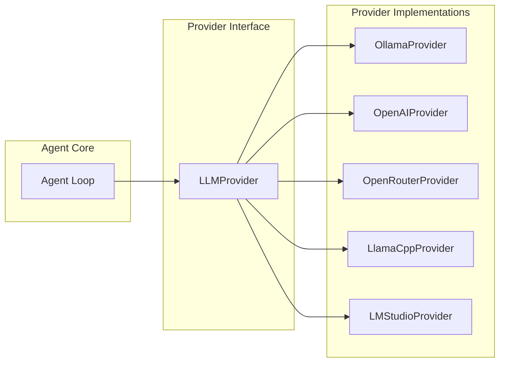

# Chapter 4: Multi-Provider Integration

> How AI coding agents abstract over multiple LLM backends through a unified provider interface.

## Overview

One of nanocoder's design goals is provider independence—the ability to work with any LLM that supports the OpenAI chat completions API format. This chapter explores the provider abstraction layer: the interface that unifies local models (Ollama, llama.cpp, LM Studio) and cloud APIs (OpenRouter, GitHub Models) behind a single contract.

## The Provider Interface

Every LLM backend must implement this interface:

```typescript
interface ChatRequest {
  messages: Message[];
  tools?: ToolDefinition[];
  stream?: boolean;
  temperature?: number;
  maxTokens?: number;
}

interface ChatResponse {
  content: string;
  toolCalls?: ToolCall[];
  usage?: {
    promptTokens: number;
    completionTokens: number;
    totalTokens: number;
  };
  finishReason: "stop" | "tool_calls" | "length";
}

interface LLMProvider {
  name: string;
  chat(request: ChatRequest): Promise<ChatResponse>;
  chatStream(
    request: ChatRequest
  ): AsyncIterable<StreamChunk>;
  listModels(): Promise<string[]>;
  getModelInfo(model: string): Promise<ModelInfo>;
}
```



## OpenAI-Compatible Provider

The base provider handles any server that implements the OpenAI chat completions API:

```typescript
class OpenAICompatibleProvider implements LLMProvider {
  name: string;
  private apiBase: string;
  private apiKey: string;
  private model: string;

  constructor(config: ProviderConfig) {
    this.name = config.name;
    this.apiBase = config.apiBase;
    this.apiKey = config.apiKey;
    this.model = config.model;
  }

  async chat(request: ChatRequest): Promise<ChatResponse> {
    const response = await fetch(
      `${this.apiBase}/chat/completions`,
      {
        method: "POST",
        headers: {
          "Content-Type": "application/json",
          Authorization: `Bearer ${this.apiKey}`,
        },
        body: JSON.stringify({
          model: this.model,
          messages: request.messages,
          tools: request.tools,
          temperature: request.temperature ?? 0.1,
          max_tokens: request.maxTokens ?? 4096,
          stream: false,
        }),
      }
    );

    if (!response.ok) {
      const error = await response.text();
      throw new ProviderError(
        `API request failed (${response.status}): ${error}`
      );
    }

    const data = await response.json();
    const choice = data.choices[0];

    return {
      content: choice.message.content ?? "",
      toolCalls: choice.message.tool_calls,
      usage: data.usage
        ? {
            promptTokens: data.usage.prompt_tokens,
            completionTokens: data.usage.completion_tokens,
            totalTokens: data.usage.total_tokens,
          }
        : undefined,
      finishReason: choice.finish_reason,
    };
  }

  async *chatStream(
    request: ChatRequest
  ): AsyncIterable<StreamChunk> {
    const response = await fetch(
      `${this.apiBase}/chat/completions`,
      {
        method: "POST",
        headers: {
          "Content-Type": "application/json",
          Authorization: `Bearer ${this.apiKey}`,
        },
        body: JSON.stringify({
          model: this.model,
          messages: request.messages,
          tools: request.tools,
          temperature: request.temperature ?? 0.1,
          max_tokens: request.maxTokens ?? 4096,
          stream: true,
        }),
      }
    );

    const reader = response.body!.getReader();
    const decoder = new TextDecoder();
    let buffer = "";

    while (true) {
      const { done, value } = await reader.read();
      if (done) break;

      buffer += decoder.decode(value, { stream: true });
      const lines = buffer.split("\n");
      buffer = lines.pop() ?? "";

      for (const line of lines) {
        if (!line.startsWith("data: ")) continue;
        const data = line.slice(6);
        if (data === "[DONE]") return;

        const chunk = JSON.parse(data);
        const delta = chunk.choices[0]?.delta;

        if (delta?.content) {
          yield { type: "content_delta", text: delta.content };
        }

        if (delta?.tool_calls) {
          for (const tc of delta.tool_calls) {
            yield {
              type: "tool_call_delta",
              id: tc.id,
              functionName: tc.function?.name,
              argumentsDelta: tc.function?.arguments ?? "",
            };
          }
        }
      }
    }
  }

  async listModels(): Promise<string[]> {
    const response = await fetch(`${this.apiBase}/models`, {
      headers: { Authorization: `Bearer ${this.apiKey}` },
    });
    const data = await response.json();
    return data.data.map((m: { id: string }) => m.id);
  }
}
```

## Ollama Provider

Ollama has its own API format but also supports OpenAI compatibility:

```typescript
class OllamaProvider extends OpenAICompatibleProvider {
  constructor(config?: Partial<ProviderConfig>) {
    super({
      name: "ollama",
      apiBase:
        config?.apiBase ?? "http://localhost:11434/v1",
      apiKey: config?.apiKey ?? "ollama", // Ollama ignores API keys
      model: config?.model ?? "qwen2.5-coder:7b",
    });
  }

  // Override model listing to use Ollama's native API
  async listModels(): Promise<string[]> {
    const baseUrl = this.apiBase.replace("/v1", "");
    const response = await fetch(`${baseUrl}/api/tags`);
    const data = await response.json();
    return data.models.map((m: { name: string }) => m.name);
  }

  // Check if Ollama is running
  async isAvailable(): Promise<boolean> {
    try {
      const baseUrl = this.apiBase.replace("/v1", "");
      const response = await fetch(baseUrl);
      return response.ok;
    } catch {
      return false;
    }
  }
}
```

## Provider Router

The router selects the right provider based on configuration and availability:

```typescript
class ProviderRouter {
  private providers: Map<string, LLMProvider> = new Map();
  private activeProvider: string;

  constructor(config: AgentConfig) {
    // Register configured providers
    if (config.providers) {
      for (const [name, providerConfig] of Object.entries(
        config.providers
      )) {
        this.registerProvider(name, providerConfig);
      }
    }

    // Auto-detect local providers
    this.autoDetect();

    this.activeProvider =
      config.defaultProvider ?? this.getFirstAvailable();
  }

  private registerProvider(
    name: string,
    config: ProviderConfig
  ): void {
    switch (config.type ?? name) {
      case "ollama":
        this.providers.set(
          name,
          new OllamaProvider(config)
        );
        break;
      default:
        this.providers.set(
          name,
          new OpenAICompatibleProvider({
            ...config,
            name,
          })
        );
    }
  }

  private async autoDetect(): Promise<void> {
    // Check for Ollama on default port
    if (!this.providers.has("ollama")) {
      const ollama = new OllamaProvider();
      if (await ollama.isAvailable()) {
        this.providers.set("ollama", ollama);
      }
    }
  }

  getActive(): LLMProvider {
    const provider = this.providers.get(this.activeProvider);
    if (!provider) {
      throw new Error(
        `No provider available. Configure one in agents.config.json`
      );
    }
    return provider;
  }

  switchProvider(name: string): void {
    if (!this.providers.has(name)) {
      throw new Error(
        `Unknown provider: ${name}. Available: ${[...this.providers.keys()].join(", ")}`
      );
    }
    this.activeProvider = name;
  }
}
```

## Model Capability Detection

Not all models support tool calling. The provider layer handles this:

```typescript
interface ModelCapabilities {
  supportsToolCalling: boolean;
  supportsStreaming: boolean;
  contextWindow: number;
  maxOutputTokens: number;
}

// Known model capabilities
const MODEL_CAPS: Record<string, Partial<ModelCapabilities>> = {
  "qwen2.5-coder": {
    supportsToolCalling: true,
    contextWindow: 32768,
  },
  "llama3.1": {
    supportsToolCalling: true,
    contextWindow: 128000,
  },
  "codellama": {
    supportsToolCalling: false,
    contextWindow: 16384,
  },
};

// Fallback for models without tool calling:
// Convert tools to system prompt instructions
function toolsToPromptFallback(
  tools: ToolDefinition[]
): string {
  let prompt = "You have access to these tools. ";
  prompt +=
    "To use a tool, respond with a JSON block:\n\n";
  prompt += '```json\n{"tool": "name", "args": {...}}\n```\n\n';

  for (const tool of tools) {
    prompt += `### ${tool.function.name}\n`;
    prompt += `${tool.function.description}\n`;
    prompt += `Parameters: ${JSON.stringify(tool.function.parameters, null, 2)}\n\n`;
  }

  return prompt;
}
```

## Environment Variable Interpolation

Configuration supports environment variable references for secure credential management:

```typescript
function interpolateEnvVars(value: string): string {
  return value.replace(
    /\$\{(\w+)\}/g,
    (match, varName) => {
      const envValue = process.env[varName];
      if (!envValue) {
        throw new Error(
          `Environment variable ${varName} is not set`
        );
      }
      return envValue;
    }
  );
}

// Usage in config loading
function loadProviderConfig(
  raw: RawProviderConfig
): ProviderConfig {
  return {
    name: raw.name,
    apiBase: raw.apiBase,
    apiKey: interpolateEnvVars(raw.apiKey), // "${OPENROUTER_API_KEY}" → actual key
    model: raw.model,
  };
}
```

## Cost Tracking

Cloud providers charge per token. Tracking costs helps users manage spend:

```typescript
class CostTracker {
  private sessions: SessionCost[] = [];

  recordUsage(
    provider: string,
    model: string,
    usage: TokenUsage
  ): void {
    const pricing = this.getPricing(model);
    const cost =
      (usage.promptTokens * pricing.inputPerMillion) /
        1_000_000 +
      (usage.completionTokens * pricing.outputPerMillion) /
        1_000_000;

    this.sessions.push({
      timestamp: Date.now(),
      provider,
      model,
      tokens: usage,
      cost,
    });
  }

  getSessionTotal(): number {
    return this.sessions.reduce((sum, s) => sum + s.cost, 0);
  }

  private getPricing(model: string): ModelPricing {
    // Pricing per million tokens (approximate)
    const pricing: Record<string, ModelPricing> = {
      "claude-sonnet-4-20250514": {
        inputPerMillion: 3.0,
        outputPerMillion: 15.0,
      },
      "gpt-4o": {
        inputPerMillion: 2.5,
        outputPerMillion: 10.0,
      },
      "llama3.1:70b": {
        inputPerMillion: 0,
        outputPerMillion: 0,
      }, // Local
    };
    return (
      pricing[model] ?? {
        inputPerMillion: 0,
        outputPerMillion: 0,
      }
    );
  }
}
```

## Summary

Provider abstraction is what makes an AI coding agent truly flexible. By standardizing on the OpenAI chat completions format, nanocoder can work with any LLM backend—from a free local model on Ollama to a frontier model through a cloud API. The key patterns are the provider interface, automatic detection of local servers, and graceful fallbacks for models that lack tool calling support.

## Key Takeaways

1. The provider interface (`chat`, `chatStream`, `listModels`) abstracts all LLM differences
2. OpenAI's chat completions format has become the de facto standard for LLM APIs
3. Ollama provides local inference with OpenAI-compatible endpoints out of the box
4. Environment variable interpolation keeps credentials out of config files
5. Models without native tool calling can use a prompt-based fallback
6. Cost tracking is essential for cloud provider usage management

## Next Steps

In [Chapter 5: Context Management](05-context-management.md), we'll explore how AI coding agents manage the limited context window—fitting the right code into the right number of tokens.

---

*Built with insights from the [Nanocoder](https://github.com/Nano-Collective/nanocoder) project.*
