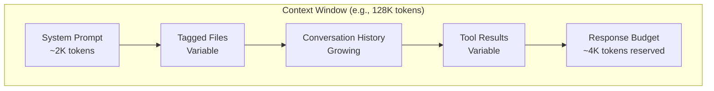
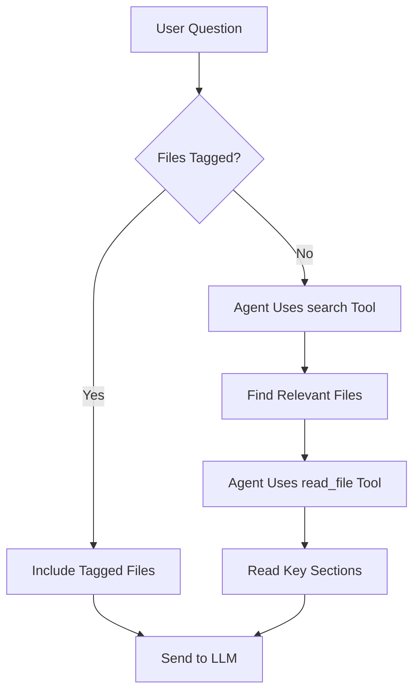

# Chapter 5: Context Management

> How AI coding agents fit the right code into limited token budgets and maintain coherent multi-turn conversations.

## Overview

Context management is the most critical engineering challenge in AI coding agents. LLMs have finite context windows (8K–200K tokens), but codebases can be millions of lines. This chapter covers how nanocoder decides what code to include, how conversation history is compressed, and how file tagging gives users explicit control over the context window.

## The Context Window Budget



Every message sent to the LLM must fit within the context window:

```typescript
interface ContextBudget {
  totalTokens: number;       // Model's context window
  systemPrompt: number;      // Fixed overhead
  taggedFiles: number;       // User-pinned files
  conversationHistory: number; // Past messages
  toolResults: number;       // Pending tool outputs
  responseReserve: number;   // Space for LLM's response
  available: number;         // Remaining budget
}

function calculateBudget(
  model: ModelInfo,
  history: Message[],
  taggedFiles: TaggedFile[]
): ContextBudget {
  const systemPrompt = estimateTokens(buildSystemPrompt());
  const taggedFilesTokens = taggedFiles.reduce(
    (sum, f) => sum + f.tokens,
    0
  );
  const historyTokens = history.reduce(
    (sum, m) => sum + estimateTokens(m.content),
    0
  );
  const responseReserve = model.maxOutputTokens ?? 4096;

  const used =
    systemPrompt + taggedFilesTokens + historyTokens + responseReserve;
  const available = model.contextWindow - used;

  return {
    totalTokens: model.contextWindow,
    systemPrompt,
    taggedFiles: taggedFilesTokens,
    conversationHistory: historyTokens,
    toolResults: 0,
    responseReserve,
    available: Math.max(0, available),
  };
}
```

## Token Estimation

Accurate token counting matters. Over-estimate and you waste context; under-estimate and you hit API errors:

```typescript
// Fast estimation: ~4 characters per token for English/code
function estimateTokensFast(text: string): number {
  return Math.ceil(text.length / 4);
}

// More accurate: use tiktoken or similar tokenizer
import { encoding_for_model } from "tiktoken";

function estimateTokensAccurate(
  text: string,
  model: string
): number {
  try {
    const enc = encoding_for_model(model as any);
    const tokens = enc.encode(text);
    enc.free();
    return tokens.length;
  } catch {
    // Fallback for unknown models
    return estimateTokensFast(text);
  }
}
```

## File Tagging System

Users explicitly control which files are always included in context:

```typescript
class FileTagManager {
  private taggedFiles: Map<string, TaggedFile> = new Map();

  async tag(path: string): Promise<TaggedFile> {
    const absolutePath = resolve(process.cwd(), path);
    const content = await fs.readFile(absolutePath, "utf-8");
    const tokens = estimateTokensFast(content);

    const file: TaggedFile = {
      path,
      absolutePath,
      content,
      tokens,
      taggedAt: Date.now(),
    };

    this.taggedFiles.set(path, file);
    return file;
  }

  untag(path: string): boolean {
    return this.taggedFiles.delete(path);
  }

  getTaggedContent(): string {
    if (this.taggedFiles.size === 0) return "";

    let content = "## Tagged Files\n\n";
    for (const file of this.taggedFiles.values()) {
      content += `### ${file.path}\n`;
      content += "```\n";
      content += file.content;
      content += "\n```\n\n";
    }
    return content;
  }

  getTotalTokens(): number {
    let total = 0;
    for (const file of this.taggedFiles.values()) {
      total += file.tokens;
    }
    return total;
  }

  // Refresh file contents if they changed on disk
  async refresh(): Promise<void> {
    for (const [path, file] of this.taggedFiles) {
      try {
        const content = await fs.readFile(
          file.absolutePath,
          "utf-8"
        );
        if (content !== file.content) {
          file.content = content;
          file.tokens = estimateTokensFast(content);
        }
      } catch {
        // File was deleted
        this.taggedFiles.delete(path);
      }
    }
  }
}
```

## Conversation History Strategies

As conversations grow, history must be compressed to fit:

### Strategy 1: Sliding Window

Keep the N most recent messages:

```typescript
function slidingWindow(
  messages: Message[],
  maxTokens: number
): Message[] {
  const result: Message[] = [];
  let tokens = 0;

  // Always keep system messages
  const systemMsgs = messages.filter(
    (m) => m.role === "system"
  );
  for (const msg of systemMsgs) {
    tokens += estimateTokensFast(msg.content);
    result.push(msg);
  }

  // Add messages from most recent to oldest
  const nonSystem = messages
    .filter((m) => m.role !== "system")
    .reverse();

  for (const msg of nonSystem) {
    const msgTokens = estimateTokensFast(msg.content);
    if (tokens + msgTokens > maxTokens) break;
    tokens += msgTokens;
    result.splice(systemMsgs.length, 0, msg); // Insert after system messages
  }

  return result;
}
```

### Strategy 2: Summarization

Compress older history into a summary:

```typescript
async function summarizeHistory(
  oldMessages: Message[],
  provider: LLMProvider
): Promise<string> {
  const response = await provider.chat({
    messages: [
      {
        role: "system",
        content:
          "Summarize this conversation history concisely. " +
          "Focus on: what files were discussed, what changes were made, " +
          "and any decisions or context that would be needed to continue.",
      },
      {
        role: "user",
        content: oldMessages
          .map(
            (m) => `[${m.role}]: ${m.content.slice(0, 500)}`
          )
          .join("\n"),
      },
    ],
  });

  return response.content;
}

async function compressHistory(
  messages: Message[],
  maxTokens: number,
  provider: LLMProvider
): Promise<Message[]> {
  const tokens = messages.reduce(
    (sum, m) => sum + estimateTokensFast(m.content),
    0
  );

  if (tokens <= maxTokens) return messages;

  // Split into old and recent
  const splitPoint = Math.floor(messages.length * 0.6);
  const oldMessages = messages.slice(0, splitPoint);
  const recentMessages = messages.slice(splitPoint);

  // Summarize old messages
  const summary = await summarizeHistory(
    oldMessages,
    provider
  );

  return [
    {
      role: "system" as const,
      content: `Previous conversation summary:\n${summary}`,
    },
    ...recentMessages,
  ];
}
```

### Strategy 3: Tool Result Compression

Tool results (especially file contents) are the largest context consumers:

```typescript
function compressToolResults(
  messages: Message[]
): Message[] {
  return messages.map((msg) => {
    if (msg.role !== "tool") return msg;

    // Truncate very long tool results
    if (msg.content.length > 5000) {
      const lines = msg.content.split("\n");
      if (lines.length > 100) {
        const kept = [
          ...lines.slice(0, 50),
          `\n... (${lines.length - 80} lines omitted) ...\n`,
          ...lines.slice(-30),
        ];
        return { ...msg, content: kept.join("\n") };
      }
    }
    return msg;
  });
}
```

## Automatic Context Discovery

When the user asks about code without tagging files, the agent must find relevant code on its own:



This is why the `search` tool is critical—it lets the agent discover context without the user manually tagging every file.

## Context Window Visualization

Show users how their context budget is being used:

```typescript
function displayContextUsage(budget: ContextBudget): void {
  const bar = (used: number, total: number): string => {
    const pct = Math.round((used / total) * 100);
    const filled = Math.round(pct / 5);
    return (
      "█".repeat(filled) + "░".repeat(20 - filled) + ` ${pct}%`
    );
  };

  console.log("\n📊 Context Usage:");
  console.log(
    `  System:  ${bar(budget.systemPrompt, budget.totalTokens)}`
  );
  console.log(
    `  Files:   ${bar(budget.taggedFiles, budget.totalTokens)}`
  );
  console.log(
    `  History: ${bar(budget.conversationHistory, budget.totalTokens)}`
  );
  console.log(
    `  Reserve: ${bar(budget.responseReserve, budget.totalTokens)}`
  );
  console.log(
    `  Free:    ${bar(budget.available, budget.totalTokens)}`
  );
  console.log(
    `  Total:   ${budget.totalTokens.toLocaleString()} tokens`
  );
}
```

Output:
```
📊 Context Usage:
  System:  █░░░░░░░░░░░░░░░░░░░ 2%
  Files:   ████░░░░░░░░░░░░░░░░ 18%
  History: ██████████░░░░░░░░░░ 45%
  Reserve: █░░░░░░░░░░░░░░░░░░░ 3%
  Free:    ██████░░░░░░░░░░░░░░ 32%
  Total:   128,000 tokens
```

## Best Practices for Context Management

| Practice | Description |
|----------|-------------|
| **Tag sparingly** | Only tag files you're actively working on |
| **Untag when done** | Remove files from context when they're no longer relevant |
| **Use search first** | Let the agent discover files rather than tagging everything |
| **Watch the budget** | Use `/context` to monitor token usage |
| **Choose models wisely** | Larger context windows (128K+) are better for big codebases |
| **Short conversations** | Start new sessions for new topics to keep history clean |

## Summary

Context management is the art of fitting the right information into a limited token budget. The combination of explicit file tagging, automatic context discovery via search, and history compression strategies gives AI coding agents the ability to work with codebases far larger than their context window.

## Key Takeaways

1. Context windows are finite—every token of system prompt, history, and file content competes for space
2. File tagging gives users explicit control over what the agent "sees"
3. History must be actively managed through sliding windows, summarization, or compression
4. Tool results are the biggest context consumers and should be truncated when old
5. The search tool enables automatic context discovery without manual file tagging
6. Displaying context usage helps users manage their token budget effectively

## Next Steps

In [Chapter 6: Configuration & Customization](06-configuration-customization.md), we'll explore how project-level and user-level configurations shape agent behavior.

---

*Built with insights from the [Nanocoder](https://github.com/Nano-Collective/nanocoder) project.*
