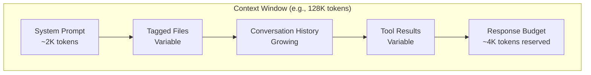
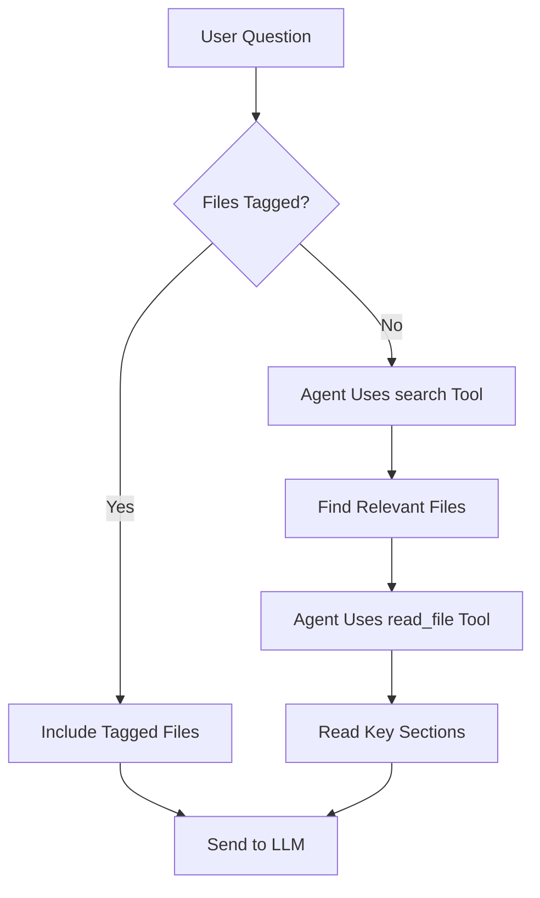

# Chapter 5: Context Management

Welcome to **Chapter 5: Context Management**. In this part of **Nanocoder Tutorial: Building and Understanding AI Coding Agents**, you will build an intuitive mental model first, then move into concrete implementation details and practical production tradeoffs.


> How AI coding agents fit the right code into limited token budgets and maintain coherent multi-turn conversations.

## Overview

Context management is the most critical engineering challenge in AI coding agents. LLMs have finite context windows (8K–200K tokens), but codebases can be millions of lines. This chapter covers how nanocoder decides what code to include, how conversation history is compressed, and how file tagging gives users explicit control over the context window.

## The Context Window Budget



Every message sent to the LLM must fit within the context window:

```typescript
interface ContextBudget {
  totalTokens: number;       // Model's context window
  systemPrompt: number;      // Fixed overhead
  taggedFiles: number;       // User-pinned files
  conversationHistory: number; // Past messages
  toolResults: number;       // Pending tool outputs
  responseReserve: number;   // Space for LLM's response
  available: number;         // Remaining budget
}

function calculateBudget(
  model: ModelInfo,
  history: Message[],
  taggedFiles: TaggedFile[]
): ContextBudget {
  const systemPrompt = estimateTokens(buildSystemPrompt());
  const taggedFilesTokens = taggedFiles.reduce(
    (sum, f) => sum + f.tokens,
    0
  );
  const historyTokens = history.reduce(
    (sum, m) => sum + estimateTokens(m.content),
    0
  );
  const responseReserve = model.maxOutputTokens ?? 4096;

  const used =
    systemPrompt + taggedFilesTokens + historyTokens + responseReserve;
  const available = model.contextWindow - used;

  return {
    totalTokens: model.contextWindow,
    systemPrompt,
    taggedFiles: taggedFilesTokens,
    conversationHistory: historyTokens,
    toolResults: 0,
    responseReserve,
    available: Math.max(0, available),
  };
}
```

## Token Estimation

Accurate token counting matters. Over-estimate and you waste context; under-estimate and you hit API errors:

```typescript
// Fast estimation: ~4 characters per token for English/code
function estimateTokensFast(text: string): number {
  return Math.ceil(text.length / 4);
}

// More accurate: use tiktoken or similar tokenizer
import { encoding_for_model } from "tiktoken";

function estimateTokensAccurate(
  text: string,
  model: string
): number {
  try {
    const enc = encoding_for_model(model as any);
    const tokens = enc.encode(text);
    enc.free();
    return tokens.length;
  } catch {
    // Fallback for unknown models
    return estimateTokensFast(text);
  }
}
```

## File Tagging System

Users explicitly control which files are always included in context:

```typescript
class FileTagManager {
  private taggedFiles: Map<string, TaggedFile> = new Map();

  async tag(path: string): Promise<TaggedFile> {
    const absolutePath = resolve(process.cwd(), path);
    const content = await fs.readFile(absolutePath, "utf-8");
    const tokens = estimateTokensFast(content);

    const file: TaggedFile = {
      path,
      absolutePath,
      content,
      tokens,
      taggedAt: Date.now(),
    };

    this.taggedFiles.set(path, file);
    return file;
  }

  untag(path: string): boolean {
    return this.taggedFiles.delete(path);
  }

  getTaggedContent(): string {
    if (this.taggedFiles.size === 0) return "";

    let content = "## Tagged Files\n\n";
    for (const file of this.taggedFiles.values()) {
      content += `### ${file.path}\n`;
      content += "```\n";
      content += file.content;
      content += "\n```\n\n";
    }
    return content;
  }

  getTotalTokens(): number {
    let total = 0;
    for (const file of this.taggedFiles.values()) {
      total += file.tokens;
    }
    return total;
  }

  // Refresh file contents if they changed on disk
  async refresh(): Promise<void> {
    for (const [path, file] of this.taggedFiles) {
      try {
        const content = await fs.readFile(
          file.absolutePath,
          "utf-8"
        );
        if (content !== file.content) {
          file.content = content;
          file.tokens = estimateTokensFast(content);
        }
      } catch {
        // File was deleted
        this.taggedFiles.delete(path);
      }
    }
  }
}
```

## Conversation History Strategies

As conversations grow, history must be compressed to fit:

### Strategy 1: Sliding Window

Keep the N most recent messages:

```typescript
function slidingWindow(
  messages: Message[],
  maxTokens: number
): Message[] {
  const result: Message[] = [];
  let tokens = 0;

  // Always keep system messages
  const systemMsgs = messages.filter(
    (m) => m.role === "system"
  );
  for (const msg of systemMsgs) {
    tokens += estimateTokensFast(msg.content);
    result.push(msg);
  }

  // Add messages from most recent to oldest
  const nonSystem = messages
    .filter((m) => m.role !== "system")
    .reverse();

  for (const msg of nonSystem) {
    const msgTokens = estimateTokensFast(msg.content);
    if (tokens + msgTokens > maxTokens) break;
    tokens += msgTokens;
    result.splice(systemMsgs.length, 0, msg); // Insert after system messages
  }

  return result;
}
```

### Strategy 2: Summarization

Compress older history into a summary:

```typescript
async function summarizeHistory(
  oldMessages: Message[],
  provider: LLMProvider
): Promise<string> {
  const response = await provider.chat({
    messages: [
      {
        role: "system",
        content:
          "Summarize this conversation history concisely. " +
          "Focus on: what files were discussed, what changes were made, " +
          "and any decisions or context that would be needed to continue.",
      },
      {
        role: "user",
        content: oldMessages
          .map(
            (m) => `[${m.role}]: ${m.content.slice(0, 500)}`
          )
          .join("\n"),
      },
    ],
  });

  return response.content;
}

async function compressHistory(
  messages: Message[],
  maxTokens: number,
  provider: LLMProvider
): Promise<Message[]> {
  const tokens = messages.reduce(
    (sum, m) => sum + estimateTokensFast(m.content),
    0
  );

  if (tokens <= maxTokens) return messages;

  // Split into old and recent
  const splitPoint = Math.floor(messages.length * 0.6);
  const oldMessages = messages.slice(0, splitPoint);
  const recentMessages = messages.slice(splitPoint);

  // Summarize old messages
  const summary = await summarizeHistory(
    oldMessages,
    provider
  );

  return [
    {
      role: "system" as const,
      content: `Previous conversation summary:\n${summary}`,
    },
    ...recentMessages,
  ];
}
```

### Strategy 3: Tool Result Compression

Tool results (especially file contents) are the largest context consumers:

```typescript
function compressToolResults(
  messages: Message[]
): Message[] {
  return messages.map((msg) => {
    if (msg.role !== "tool") return msg;

    // Truncate very long tool results
    if (msg.content.length > 5000) {
      const lines = msg.content.split("\n");
      if (lines.length > 100) {
        const kept = [
          ...lines.slice(0, 50),
          `\n... (${lines.length - 80} lines omitted) ...\n`,
          ...lines.slice(-30),
        ];
        return { ...msg, content: kept.join("\n") };
      }
    }
    return msg;
  });
}
```

## Automatic Context Discovery

When the user asks about code without tagging files, the agent must find relevant code on its own:



This is why the `search` tool is critical—it lets the agent discover context without the user manually tagging every file.

## Context Window Visualization

Show users how their context budget is being used:

```typescript
function displayContextUsage(budget: ContextBudget): void {
  const bar = (used: number, total: number): string => {
    const pct = Math.round((used / total) * 100);
    const filled = Math.round(pct / 5);
    return (
      "█".repeat(filled) + "░".repeat(20 - filled) + ` ${pct}%`
    );
  };

  console.log("\n📊 Context Usage:");
  console.log(
    `  System:  ${bar(budget.systemPrompt, budget.totalTokens)}`
  );
  console.log(
    `  Files:   ${bar(budget.taggedFiles, budget.totalTokens)}`
  );
  console.log(
    `  History: ${bar(budget.conversationHistory, budget.totalTokens)}`
  );
  console.log(
    `  Reserve: ${bar(budget.responseReserve, budget.totalTokens)}`
  );
  console.log(
    `  Free:    ${bar(budget.available, budget.totalTokens)}`
  );
  console.log(
    `  Total:   ${budget.totalTokens.toLocaleString()} tokens`
  );
}
```

Output:
```
📊 Context Usage:
  System:  █░░░░░░░░░░░░░░░░░░░ 2%
  Files:   ████░░░░░░░░░░░░░░░░ 18%
  History: ██████████░░░░░░░░░░ 45%
  Reserve: █░░░░░░░░░░░░░░░░░░░ 3%
  Free:    ██████░░░░░░░░░░░░░░ 32%
  Total:   128,000 tokens
```

## Best Practices for Context Management

| Practice | Description |
|----------|-------------|
| **Tag sparingly** | Only tag files you're actively working on |
| **Untag when done** | Remove files from context when they're no longer relevant |
| **Use search first** | Let the agent discover files rather than tagging everything |
| **Watch the budget** | Use `/context` to monitor token usage |
| **Choose models wisely** | Larger context windows (128K+) are better for big codebases |
| **Short conversations** | Start new sessions for new topics to keep history clean |

## Summary

Context management is the art of fitting the right information into a limited token budget. The combination of explicit file tagging, automatic context discovery via search, and history compression strategies gives AI coding agents the ability to work with codebases far larger than their context window.

## Key Takeaways

1. Context windows are finite—every token of system prompt, history, and file content competes for space
2. File tagging gives users explicit control over what the agent "sees"
3. History must be actively managed through sliding windows, summarization, or compression
4. Tool results are the biggest context consumers and should be truncated when old
5. The search tool enables automatic context discovery without manual file tagging
6. Displaying context usage helps users manage their token budget effectively

## Next Steps

In [Chapter 6: Configuration & Customization](06-configuration-customization.md), we'll explore how project-level and user-level configurations shape agent behavior.

---

*Built with insights from the [Nanocoder](https://github.com/Nano-Collective/nanocoder) project.*

## Depth Expansion Playbook

<!-- depth-expansion-v2 -->

This chapter is expanded to v1-style depth for production-grade learning and implementation quality.

### Strategic Context

- tutorial: **Nanocoder Tutorial: Building and Understanding AI Coding Agents**
- tutorial slug: **nanocoder-tutorial**
- chapter focus: **Chapter 5: Context Management**
- system context: **Nanocoder Tutorial**
- objective: move from surface-level usage to repeatable engineering operation

### Architecture Decomposition

1. Define the runtime boundary for `Chapter 5: Context Management`.
2. Separate control-plane decisions from data-plane execution.
3. Capture input contracts, transformation points, and output contracts.
4. Trace state transitions across request lifecycle stages.
5. Identify extension hooks and policy interception points.
6. Map ownership boundaries for team and automation workflows.
7. Specify rollback and recovery paths for unsafe changes.
8. Track observability signals for correctness, latency, and cost.

### Operator Decision Matrix

| Decision Area | Low-Risk Path | High-Control Path | Tradeoff |
|:--------------|:--------------|:------------------|:---------|
| Runtime mode | managed defaults | explicit policy config | speed vs control |
| State handling | local ephemeral | durable persisted state | simplicity vs auditability |
| Tool integration | direct API use | mediated adapter layer | velocity vs governance |
| Rollout method | manual change | staged + canary rollout | effort vs safety |
| Incident response | best effort logs | runbooks + SLO alerts | cost vs reliability |

### Failure Modes and Countermeasures

| Failure Mode | Early Signal | Root Cause Pattern | Countermeasure |
|:-------------|:-------------|:-------------------|:---------------|
| stale context | inconsistent outputs | missing refresh window | enforce context TTL and refresh hooks |
| policy drift | unexpected execution | ad hoc overrides | centralize policy profiles |
| auth mismatch | 401/403 bursts | credential sprawl | rotation schedule + scope minimization |
| schema breakage | parser/validation errors | unmanaged upstream changes | contract tests per release |
| retry storms | queue congestion | no backoff controls | jittered backoff + circuit breakers |
| silent regressions | quality drop without alerts | weak baseline metrics | eval harness with thresholds |

### Implementation Runbook

1. Establish a reproducible baseline environment.
2. Capture chapter-specific success criteria before changes.
3. Implement minimal viable path with explicit interfaces.
4. Add observability before expanding feature scope.
5. Run deterministic tests for happy-path behavior.
6. Inject failure scenarios for negative-path validation.
7. Compare output quality against baseline snapshots.
8. Promote through staged environments with rollback gates.
9. Record operational lessons in release notes.

### Quality Gate Checklist

- [ ] chapter-level assumptions are explicit and testable
- [ ] API/tool boundaries are documented with input/output examples
- [ ] failure handling includes retry, timeout, and fallback policy
- [ ] security controls include auth scopes and secret rotation plans
- [ ] observability includes logs, metrics, traces, and alert thresholds
- [ ] deployment guidance includes canary and rollback paths
- [ ] docs include links to upstream sources and related tracks
- [ ] post-release verification confirms expected behavior under load

### Source Alignment

- [Nanocoder Repository](https://github.com/Nano-Collective/nanocoder)
- [Nanocoder Releases](https://github.com/Nano-Collective/nanocoder/releases)
- [Nanocoder Documentation Directory](https://github.com/Nano-Collective/nanocoder/tree/main/docs)
- [Nanocoder MCP Configuration Guide](https://github.com/Nano-Collective/nanocoder/blob/main/docs/mcp-configuration.md)
- [Nano Collective Website](https://nanocollective.org/)

### Cross-Tutorial Connection Map

- [Aider Tutorial](../aider-tutorial/)
- [Claude Code Tutorial](../claude-code-tutorial/)
- [Continue Tutorial](../continue-tutorial/)
- [OpenHands Tutorial](../openhands-tutorial/)
- [Chapter 1: Getting Started](01-getting-started.md)

### Advanced Practice Exercises

1. Build a minimal end-to-end implementation for `Chapter 5: Context Management`.
2. Add instrumentation and measure baseline latency and error rate.
3. Introduce one controlled failure and confirm graceful recovery.
4. Add policy constraints and verify they are enforced consistently.
5. Run a staged rollout and document rollback decision criteria.

### Review Questions

1. Which execution boundary matters most for this chapter and why?
2. What signal detects regressions earliest in your environment?
3. What tradeoff did you make between delivery speed and governance?
4. How would you recover from the highest-impact failure mode?
5. What must be automated before scaling to team-wide adoption?

### Scenario Playbook 1: Chapter 5: Context Management

- tutorial context: **Nanocoder Tutorial: Building and Understanding AI Coding Agents**
- trigger condition: incoming request volume spikes after release
- initial hypothesis: identify the smallest reproducible failure boundary
- immediate action: protect user-facing stability before optimization work
- engineering control: introduce adaptive concurrency limits and queue bounds
- verification target: latency p95 and p99 stay within defined SLO windows
- rollback trigger: pre-defined quality gate fails for two consecutive checks
- communication step: publish incident status with owner and ETA
- learning capture: add postmortem and convert findings into automated tests

### Scenario Playbook 2: Chapter 5: Context Management

- tutorial context: **Nanocoder Tutorial: Building and Understanding AI Coding Agents**
- trigger condition: tool dependency latency increases under concurrency
- initial hypothesis: identify the smallest reproducible failure boundary
- immediate action: protect user-facing stability before optimization work
- engineering control: enable staged retries with jitter and circuit breaker fallback
- verification target: error budget burn rate remains below escalation threshold
- rollback trigger: pre-defined quality gate fails for two consecutive checks
- communication step: publish incident status with owner and ETA
- learning capture: add postmortem and convert findings into automated tests

### Scenario Playbook 3: Chapter 5: Context Management

- tutorial context: **Nanocoder Tutorial: Building and Understanding AI Coding Agents**
- trigger condition: schema updates introduce incompatible payloads
- initial hypothesis: identify the smallest reproducible failure boundary
- immediate action: protect user-facing stability before optimization work
- engineering control: pin schema versions and add compatibility shims
- verification target: throughput remains stable under target concurrency
- rollback trigger: pre-defined quality gate fails for two consecutive checks
- communication step: publish incident status with owner and ETA
- learning capture: add postmortem and convert findings into automated tests

### Scenario Playbook 4: Chapter 5: Context Management

- tutorial context: **Nanocoder Tutorial: Building and Understanding AI Coding Agents**
- trigger condition: environment parity drifts between staging and production
- initial hypothesis: identify the smallest reproducible failure boundary
- immediate action: protect user-facing stability before optimization work
- engineering control: restore environment parity via immutable config promotion
- verification target: retry volume stays bounded without feedback loops
- rollback trigger: pre-defined quality gate fails for two consecutive checks
- communication step: publish incident status with owner and ETA
- learning capture: add postmortem and convert findings into automated tests

### Scenario Playbook 5: Chapter 5: Context Management

- tutorial context: **Nanocoder Tutorial: Building and Understanding AI Coding Agents**
- trigger condition: access policy changes reduce successful execution rates
- initial hypothesis: identify the smallest reproducible failure boundary
- immediate action: protect user-facing stability before optimization work
- engineering control: re-scope credentials and rotate leaked or stale keys
- verification target: data integrity checks pass across write/read cycles
- rollback trigger: pre-defined quality gate fails for two consecutive checks
- communication step: publish incident status with owner and ETA
- learning capture: add postmortem and convert findings into automated tests

### Scenario Playbook 6: Chapter 5: Context Management

- tutorial context: **Nanocoder Tutorial: Building and Understanding AI Coding Agents**
- trigger condition: background jobs accumulate and exceed processing windows
- initial hypothesis: identify the smallest reproducible failure boundary
- immediate action: protect user-facing stability before optimization work
- engineering control: activate degradation mode to preserve core user paths
- verification target: audit logs capture all control-plane mutations
- rollback trigger: pre-defined quality gate fails for two consecutive checks
- communication step: publish incident status with owner and ETA
- learning capture: add postmortem and convert findings into automated tests

### Scenario Playbook 7: Chapter 5: Context Management

- tutorial context: **Nanocoder Tutorial: Building and Understanding AI Coding Agents**
- trigger condition: incoming request volume spikes after release
- initial hypothesis: identify the smallest reproducible failure boundary
- immediate action: protect user-facing stability before optimization work
- engineering control: introduce adaptive concurrency limits and queue bounds
- verification target: latency p95 and p99 stay within defined SLO windows
- rollback trigger: pre-defined quality gate fails for two consecutive checks
- communication step: publish incident status with owner and ETA
- learning capture: add postmortem and convert findings into automated tests

## What Problem Does This Solve?

Most teams struggle here because the hard part is not writing more code, but deciding clear boundaries for `taggedFiles`, `tokens`, `content` so behavior stays predictable as complexity grows.

In practical terms, this chapter helps you avoid three common failures:

- coupling core logic too tightly to one implementation path
- missing the handoff boundaries between setup, execution, and validation
- shipping changes without clear rollback or observability strategy

After working through this chapter, you should be able to reason about `Chapter 5: Context Management` as an operating subsystem inside **Nanocoder Tutorial: Building and Understanding AI Coding Agents**, with explicit contracts for inputs, state transitions, and outputs.

Use the implementation notes around `path`, `file`, `model` as your checklist when adapting these patterns to your own repository.

## How it Works Under the Hood

Under the hood, `Chapter 5: Context Management` usually follows a repeatable control path:

1. **Context bootstrap**: initialize runtime config and prerequisites for `taggedFiles`.
2. **Input normalization**: shape incoming data so `tokens` receives stable contracts.
3. **Core execution**: run the main logic branch and propagate intermediate state through `content`.
4. **Policy and safety checks**: enforce limits, auth scopes, and failure boundaries.
5. **Output composition**: return canonical result payloads for downstream consumers.
6. **Operational telemetry**: emit logs/metrics needed for debugging and performance tuning.

When debugging, walk this sequence in order and confirm each stage has explicit success/failure conditions.

## Source Walkthrough

Use the following upstream sources to verify implementation details while reading this chapter:

- [Nanocoder Repository](https://github.com/Nano-Collective/nanocoder)
  Why it matters: authoritative reference on `Nanocoder Repository` (github.com).
- [Nanocoder Releases](https://github.com/Nano-Collective/nanocoder/releases)
  Why it matters: authoritative reference on `Nanocoder Releases` (github.com).
- [Nanocoder Documentation Directory](https://github.com/Nano-Collective/nanocoder/tree/main/docs)
  Why it matters: authoritative reference on `Nanocoder Documentation Directory` (github.com).
- [Nanocoder MCP Configuration Guide](https://github.com/Nano-Collective/nanocoder/blob/main/docs/mcp-configuration.md)
  Why it matters: authoritative reference on `Nanocoder MCP Configuration Guide` (github.com).
- [Nano Collective Website](https://nanocollective.org/)
  Why it matters: authoritative reference on `Nano Collective Website` (nanocollective.org).

Suggested trace strategy:
- search upstream code for `taggedFiles` and `tokens` to map concrete implementation paths
- compare docs claims against actual runtime/config code before reusing patterns in production

## Chapter Connections

- [Tutorial Index](index.md)
- [Previous Chapter: Chapter 4: Multi-Provider Integration](04-multi-provider-integration.md)
- [Next Chapter: Chapter 6: Configuration & Customization](06-configuration-customization.md)
- [Main Catalog](../../README.md#-tutorial-catalog)
- [A-Z Tutorial Directory](../../discoverability/tutorial-directory.md)
