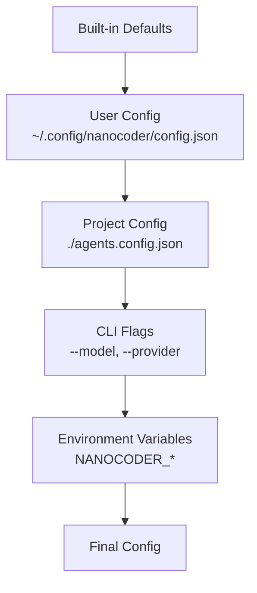

# Chapter 6: Configuration & Customization

> Project-level configs, agent personas, environment management, and team-consistent behavior.

## Overview

Configuration turns a generic AI coding agent into a project-specific assistant. This chapter covers nanocoder's configuration system: how `agents.config.json` files work at project and user levels, how to create custom agent personas, and how environment variable interpolation keeps credentials secure.

## Configuration Hierarchy

Nanocoder loads configuration from multiple sources with increasing precedence:



```typescript
interface AgentConfig {
  // Provider settings
  provider: ProviderConfig;
  providers?: Record<string, ProviderConfig>;
  defaultProvider?: string;

  // Agent behavior
  systemPrompt?: string;
  temperature?: number;
  maxTokens?: number;

  // Tool settings
  tools?: {
    autoApprove?: string[];    // Tools that skip approval
    disabled?: string[];       // Tools to disable
    timeout?: number;          // Default command timeout (ms)
  };

  // Context settings
  context?: {
    maxHistoryTokens?: number;
    autoTag?: string[];        // Files to tag automatically
    ignore?: string[];         // Patterns to exclude from search
  };

  // UI settings
  ui?: {
    theme?: "dark" | "light" | "auto";
    showTokenCount?: boolean;
    showCost?: boolean;
  };
}
```

## Configuration Loading

```typescript
async function loadConfig(): Promise<AgentConfig> {
  const defaults = getDefaultConfig();

  // Layer 1: User-level config
  const userConfigPath = join(
    homedir(),
    ".config",
    "nanocoder",
    "config.json"
  );
  const userConfig = await loadJsonFile(userConfigPath);

  // Layer 2: Project-level config
  const projectConfig = await loadJsonFile(
    resolve(process.cwd(), "agents.config.json")
  );

  // Layer 3: CLI flags (passed as parameter)
  // Layer 4: Environment variables
  const envOverrides = loadEnvConfig();

  // Merge with increasing precedence
  return deepMerge(
    defaults,
    userConfig,
    projectConfig,
    envOverrides
  );
}

function loadEnvConfig(): Partial<AgentConfig> {
  const config: Partial<AgentConfig> = {};

  if (process.env.NANOCODER_MODEL) {
    config.provider = {
      ...config.provider,
      model: process.env.NANOCODER_MODEL,
    } as ProviderConfig;
  }

  if (process.env.NANOCODER_TEMPERATURE) {
    config.temperature = parseFloat(
      process.env.NANOCODER_TEMPERATURE
    );
  }

  return config;
}
```

## Project Configuration Examples

### TypeScript/Node.js Project

```json
{
  "provider": {
    "name": "openrouter",
    "apiBase": "https://openrouter.ai/api/v1",
    "apiKey": "${OPENROUTER_API_KEY}",
    "model": "anthropic/claude-sonnet-4-20250514"
  },
  "systemPrompt": "This is a TypeScript monorepo using pnpm workspaces. Always use strict TypeScript types. Run 'pnpm typecheck' after making changes.",
  "temperature": 0.1,
  "tools": {
    "autoApprove": ["read_file", "search"],
    "timeout": 60000
  },
  "context": {
    "autoTag": ["tsconfig.json", "package.json"],
    "ignore": ["node_modules/**", "dist/**", ".next/**"]
  }
}
```

### Python ML Project

```json
{
  "provider": {
    "name": "ollama",
    "model": "qwen2.5-coder:32b"
  },
  "systemPrompt": "This is a Python ML project using PyTorch and Hugging Face. Use type hints. Follow PEP 8. Always activate the venv before running commands: source .venv/bin/activate",
  "tools": {
    "timeout": 120000
  },
  "context": {
    "autoTag": ["pyproject.toml", "requirements.txt"],
    "ignore": [
      "__pycache__/**",
      ".venv/**",
      "*.pyc",
      "data/**",
      "models/**"
    ]
  }
}
```

### Rust Project

```json
{
  "provider": {
    "name": "local",
    "apiBase": "http://localhost:8080/v1",
    "apiKey": "not-needed",
    "model": "codestral"
  },
  "systemPrompt": "This is a Rust project. Use idiomatic Rust patterns. Run 'cargo clippy' after changes. Prefer Result types over panics.",
  "context": {
    "autoTag": ["Cargo.toml"],
    "ignore": ["target/**"]
  }
}
```

## Custom Agent Personas

Personas let you define specialized agents for different tasks:

```json
{
  "personas": {
    "reviewer": {
      "systemPrompt": "You are a code reviewer. Focus on: security vulnerabilities, performance issues, error handling, and code clarity. Do NOT make changes—only report findings with severity levels.",
      "temperature": 0.3,
      "tools": {
        "disabled": ["write_file", "bash"]
      }
    },
    "architect": {
      "systemPrompt": "You are a software architect. Analyze the codebase structure, identify patterns, and suggest improvements. Use diagrams (Mermaid) to illustrate architectural decisions.",
      "temperature": 0.5,
      "tools": {
        "disabled": ["write_file"]
      }
    },
    "debugger": {
      "systemPrompt": "You are a debugging specialist. When investigating issues: 1) Reproduce the problem, 2) Add strategic logging, 3) Identify the root cause, 4) Propose a minimal fix.",
      "temperature": 0.1
    }
  }
}
```

Use personas with:
```bash
nanocoder --persona reviewer
nanocoder --persona architect
```

## Ignore Patterns

Control which files the agent can see and search:

```typescript
import { minimatch } from "minimatch";

class IgnoreManager {
  private patterns: string[] = [];

  constructor(config: AgentConfig) {
    // Default ignores
    this.patterns = [
      "node_modules/**",
      ".git/**",
      "*.lock",
      "dist/**",
      "build/**",
    ];

    // Add config ignores
    if (config.context?.ignore) {
      this.patterns.push(...config.context.ignore);
    }

    // Load .gitignore patterns
    this.loadGitignore();

    // Load .nanocoderignore if it exists
    this.loadCustomIgnore();
  }

  isIgnored(path: string): boolean {
    return this.patterns.some((pattern) =>
      minimatch(path, pattern)
    );
  }

  private loadGitignore(): void {
    try {
      const gitignore = readFileSync(".gitignore", "utf-8");
      const patterns = gitignore
        .split("\n")
        .filter((l) => l.trim() && !l.startsWith("#"))
        .map((l) => l.trim());
      this.patterns.push(...patterns);
    } catch {
      // No .gitignore
    }
  }

  private loadCustomIgnore(): void {
    try {
      const ignore = readFileSync(
        ".nanocoderignore",
        "utf-8"
      );
      const patterns = ignore
        .split("\n")
        .filter((l) => l.trim() && !l.startsWith("#"));
      this.patterns.push(...patterns);
    } catch {
      // No .nanocoderignore
    }
  }
}
```

## Auto-Tagging

Automatically include important files in every conversation:

```typescript
async function autoTagFiles(
  config: AgentConfig,
  tagManager: FileTagManager
): Promise<void> {
  const patterns = config.context?.autoTag ?? [];

  for (const pattern of patterns) {
    const files = await glob(pattern, {
      cwd: process.cwd(),
      nodir: true,
    });

    for (const file of files) {
      try {
        const tagged = await tagManager.tag(file);
        console.log(
          `Auto-tagged: ${file} (${tagged.tokens} tokens)`
        );
      } catch {
        // File doesn't exist or can't be read
      }
    }
  }
}
```

## Team Configuration

For teams, commit `agents.config.json` to the repo and use `.env` for personal credentials:

```bash
# .env (git-ignored)
OPENROUTER_API_KEY=sk-or-v1-your-key-here

# .env.example (committed)
OPENROUTER_API_KEY=sk-or-v1-your-key-here
```

```json
// agents.config.json (committed)
{
  "provider": {
    "name": "openrouter",
    "apiBase": "https://openrouter.ai/api/v1",
    "apiKey": "${OPENROUTER_API_KEY}",
    "model": "anthropic/claude-sonnet-4-20250514"
  },
  "systemPrompt": "Team coding standards: use conventional commits, write tests for all new functions, follow the existing architecture patterns.",
  "context": {
    "autoTag": ["ARCHITECTURE.md", "package.json"],
    "ignore": ["node_modules/**", "dist/**"]
  }
}
```

## Configuration Validation

Validate configurations at load time to catch errors early:

```typescript
function validateConfig(config: unknown): AgentConfig {
  const errors: string[] = [];

  if (typeof config !== "object" || config === null) {
    throw new Error("Config must be a JSON object");
  }

  const c = config as Record<string, unknown>;

  // Validate provider
  if (c.provider) {
    const p = c.provider as Record<string, unknown>;
    if (!p.model) {
      errors.push("provider.model is required");
    }
  }

  // Validate temperature
  if (
    c.temperature !== undefined &&
    (typeof c.temperature !== "number" ||
      c.temperature < 0 ||
      c.temperature > 2)
  ) {
    errors.push("temperature must be a number between 0 and 2");
  }

  // Validate tools
  if (c.tools) {
    const t = c.tools as Record<string, unknown>;
    if (t.autoApprove && !Array.isArray(t.autoApprove)) {
      errors.push("tools.autoApprove must be an array");
    }
  }

  if (errors.length > 0) {
    throw new Error(
      `Invalid configuration:\n${errors.map((e) => `  - ${e}`).join("\n")}`
    );
  }

  return config as AgentConfig;
}
```

## Summary

Configuration transforms a generic agent into a project-aware assistant. The layered hierarchy (defaults → user → project → CLI → env) provides flexibility while keeping credentials secure. Personas allow specialized agent behaviors, and ignore patterns prevent the agent from accessing irrelevant or sensitive files.

## Key Takeaways

1. Configuration layers merge with increasing precedence: defaults → user → project → CLI → env
2. `agents.config.json` should be committed to the repo for team consistency
3. Environment variable interpolation (`${VAR}`) keeps secrets out of config files
4. Custom personas define specialized agent behaviors (reviewer, architect, debugger)
5. Auto-tagging ensures important project files are always in context
6. Ignore patterns align with `.gitignore` and can be extended with `.nanocoderignore`

## Next Steps

In [Chapter 7: Building Your Own Agent](07-building-your-own-agent.md), we'll put everything together and implement a minimal AI coding agent from scratch.

---

*Built with insights from the [Nanocoder](https://github.com/Nano-Collective/nanocoder) project.*
