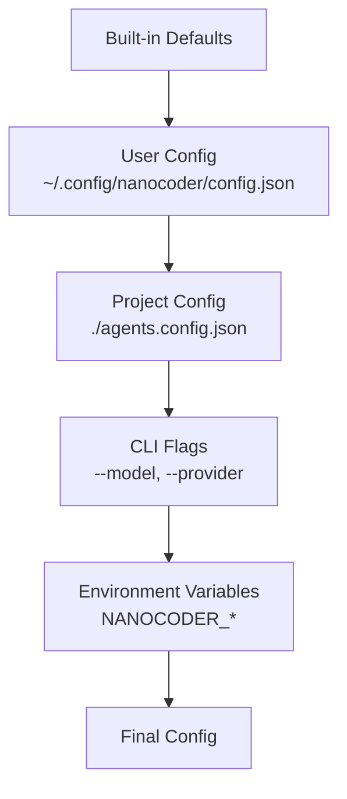

# Chapter 6: Configuration & Customization

Welcome to **Chapter 6: Configuration & Customization**. In this part of **Nanocoder Tutorial: Building and Understanding AI Coding Agents**, you will build an intuitive mental model first, then move into concrete implementation details and practical production tradeoffs.


> Project-level configs, agent personas, environment management, and team-consistent behavior.

## Overview

Configuration turns a generic AI coding agent into a project-specific assistant. This chapter covers nanocoder's configuration system: how `agents.config.json` files work at project and user levels, how to create custom agent personas, and how environment variable interpolation keeps credentials secure.

## Configuration Hierarchy

Nanocoder loads configuration from multiple sources with increasing precedence:



```typescript
interface AgentConfig {
  // Provider settings
  provider: ProviderConfig;
  providers?: Record<string, ProviderConfig>;
  defaultProvider?: string;

  // Agent behavior
  systemPrompt?: string;
  temperature?: number;
  maxTokens?: number;

  // Tool settings
  tools?: {
    autoApprove?: string[];    // Tools that skip approval
    disabled?: string[];       // Tools to disable
    timeout?: number;          // Default command timeout (ms)
  };

  // Context settings
  context?: {
    maxHistoryTokens?: number;
    autoTag?: string[];        // Files to tag automatically
    ignore?: string[];         // Patterns to exclude from search
  };

  // UI settings
  ui?: {
    theme?: "dark" | "light" | "auto";
    showTokenCount?: boolean;
    showCost?: boolean;
  };
}
```

## Configuration Loading

```typescript
async function loadConfig(): Promise<AgentConfig> {
  const defaults = getDefaultConfig();

  // Layer 1: User-level config
  const userConfigPath = join(
    homedir(),
    ".config",
    "nanocoder",
    "config.json"
  );
  const userConfig = await loadJsonFile(userConfigPath);

  // Layer 2: Project-level config
  const projectConfig = await loadJsonFile(
    resolve(process.cwd(), "agents.config.json")
  );

  // Layer 3: CLI flags (passed as parameter)
  // Layer 4: Environment variables
  const envOverrides = loadEnvConfig();

  // Merge with increasing precedence
  return deepMerge(
    defaults,
    userConfig,
    projectConfig,
    envOverrides
  );
}

function loadEnvConfig(): Partial<AgentConfig> {
  const config: Partial<AgentConfig> = {};

  if (process.env.NANOCODER_MODEL) {
    config.provider = {
      ...config.provider,
      model: process.env.NANOCODER_MODEL,
    } as ProviderConfig;
  }

  if (process.env.NANOCODER_TEMPERATURE) {
    config.temperature = parseFloat(
      process.env.NANOCODER_TEMPERATURE
    );
  }

  return config;
}
```

## Project Configuration Examples

### TypeScript/Node.js Project

```json
{
  "provider": {
    "name": "openrouter",
    "apiBase": "https://openrouter.ai/api/v1",
    "apiKey": "${OPENROUTER_API_KEY}",
    "model": "anthropic/claude-sonnet-4-20250514"
  },
  "systemPrompt": "This is a TypeScript monorepo using pnpm workspaces. Always use strict TypeScript types. Run 'pnpm typecheck' after making changes.",
  "temperature": 0.1,
  "tools": {
    "autoApprove": ["read_file", "search"],
    "timeout": 60000
  },
  "context": {
    "autoTag": ["tsconfig.json", "package.json"],
    "ignore": ["node_modules/**", "dist/**", ".next/**"]
  }
}
```

### Python ML Project

```json
{
  "provider": {
    "name": "ollama",
    "model": "qwen2.5-coder:32b"
  },
  "systemPrompt": "This is a Python ML project using PyTorch and Hugging Face. Use type hints. Follow PEP 8. Always activate the venv before running commands: source .venv/bin/activate",
  "tools": {
    "timeout": 120000
  },
  "context": {
    "autoTag": ["pyproject.toml", "requirements.txt"],
    "ignore": [
      "__pycache__/**",
      ".venv/**",
      "*.pyc",
      "data/**",
      "models/**"
    ]
  }
}
```

### Rust Project

```json
{
  "provider": {
    "name": "local",
    "apiBase": "http://localhost:8080/v1",
    "apiKey": "not-needed",
    "model": "codestral"
  },
  "systemPrompt": "This is a Rust project. Use idiomatic Rust patterns. Run 'cargo clippy' after changes. Prefer Result types over panics.",
  "context": {
    "autoTag": ["Cargo.toml"],
    "ignore": ["target/**"]
  }
}
```

## Custom Agent Personas

Personas let you define specialized agents for different tasks:

```json
{
  "personas": {
    "reviewer": {
      "systemPrompt": "You are a code reviewer. Focus on: security vulnerabilities, performance issues, error handling, and code clarity. Do NOT make changes—only report findings with severity levels.",
      "temperature": 0.3,
      "tools": {
        "disabled": ["write_file", "bash"]
      }
    },
    "architect": {
      "systemPrompt": "You are a software architect. Analyze the codebase structure, identify patterns, and suggest improvements. Use diagrams (Mermaid) to illustrate architectural decisions.",
      "temperature": 0.5,
      "tools": {
        "disabled": ["write_file"]
      }
    },
    "debugger": {
      "systemPrompt": "You are a debugging specialist. When investigating issues: 1) Reproduce the problem, 2) Add strategic logging, 3) Identify the root cause, 4) Propose a minimal fix.",
      "temperature": 0.1
    }
  }
}
```

Use personas with:
```bash
nanocoder --persona reviewer
nanocoder --persona architect
```

## Ignore Patterns

Control which files the agent can see and search:

```typescript
import { minimatch } from "minimatch";

class IgnoreManager {
  private patterns: string[] = [];

  constructor(config: AgentConfig) {
    // Default ignores
    this.patterns = [
      "node_modules/**",
      ".git/**",
      "*.lock",
      "dist/**",
      "build/**",
    ];

    // Add config ignores
    if (config.context?.ignore) {
      this.patterns.push(...config.context.ignore);
    }

    // Load .gitignore patterns
    this.loadGitignore();

    // Load .nanocoderignore if it exists
    this.loadCustomIgnore();
  }

  isIgnored(path: string): boolean {
    return this.patterns.some((pattern) =>
      minimatch(path, pattern)
    );
  }

  private loadGitignore(): void {
    try {
      const gitignore = readFileSync(".gitignore", "utf-8");
      const patterns = gitignore
        .split("\n")
        .filter((l) => l.trim() && !l.startsWith("#"))
        .map((l) => l.trim());
      this.patterns.push(...patterns);
    } catch {
      // No .gitignore
    }
  }

  private loadCustomIgnore(): void {
    try {
      const ignore = readFileSync(
        ".nanocoderignore",
        "utf-8"
      );
      const patterns = ignore
        .split("\n")
        .filter((l) => l.trim() && !l.startsWith("#"));
      this.patterns.push(...patterns);
    } catch {
      // No .nanocoderignore
    }
  }
}
```

## Auto-Tagging

Automatically include important files in every conversation:

```typescript
async function autoTagFiles(
  config: AgentConfig,
  tagManager: FileTagManager
): Promise<void> {
  const patterns = config.context?.autoTag ?? [];

  for (const pattern of patterns) {
    const files = await glob(pattern, {
      cwd: process.cwd(),
      nodir: true,
    });

    for (const file of files) {
      try {
        const tagged = await tagManager.tag(file);
        console.log(
          `Auto-tagged: ${file} (${tagged.tokens} tokens)`
        );
      } catch {
        // File doesn't exist or can't be read
      }
    }
  }
}
```

## Team Configuration

For teams, commit `agents.config.json` to the repo and use `.env` for personal credentials:

```bash
# .env (git-ignored)
OPENROUTER_API_KEY=sk-or-v1-your-key-here

# .env.example (committed)
OPENROUTER_API_KEY=sk-or-v1-your-key-here
```

```json
// agents.config.json (committed)
{
  "provider": {
    "name": "openrouter",
    "apiBase": "https://openrouter.ai/api/v1",
    "apiKey": "${OPENROUTER_API_KEY}",
    "model": "anthropic/claude-sonnet-4-20250514"
  },
  "systemPrompt": "Team coding standards: use conventional commits, write tests for all new functions, follow the existing architecture patterns.",
  "context": {
    "autoTag": ["ARCHITECTURE.md", "package.json"],
    "ignore": ["node_modules/**", "dist/**"]
  }
}
```

## Configuration Validation

Validate configurations at load time to catch errors early:

```typescript
function validateConfig(config: unknown): AgentConfig {
  const errors: string[] = [];

  if (typeof config !== "object" || config === null) {
    throw new Error("Config must be a JSON object");
  }

  const c = config as Record<string, unknown>;

  // Validate provider
  if (c.provider) {
    const p = c.provider as Record<string, unknown>;
    if (!p.model) {
      errors.push("provider.model is required");
    }
  }

  // Validate temperature
  if (
    c.temperature !== undefined &&
    (typeof c.temperature !== "number" ||
      c.temperature < 0 ||
      c.temperature > 2)
  ) {
    errors.push("temperature must be a number between 0 and 2");
  }

  // Validate tools
  if (c.tools) {
    const t = c.tools as Record<string, unknown>;
    if (t.autoApprove && !Array.isArray(t.autoApprove)) {
      errors.push("tools.autoApprove must be an array");
    }
  }

  if (errors.length > 0) {
    throw new Error(
      `Invalid configuration:\n${errors.map((e) => `  - ${e}`).join("\n")}`
    );
  }

  return config as AgentConfig;
}
```

## Summary

Configuration transforms a generic agent into a project-aware assistant. The layered hierarchy (defaults → user → project → CLI → env) provides flexibility while keeping credentials secure. Personas allow specialized agent behaviors, and ignore patterns prevent the agent from accessing irrelevant or sensitive files.

## Key Takeaways

1. Configuration layers merge with increasing precedence: defaults → user → project → CLI → env
2. `agents.config.json` should be committed to the repo for team consistency
3. Environment variable interpolation (`${VAR}`) keeps secrets out of config files
4. Custom personas define specialized agent behaviors (reviewer, architect, debugger)
5. Auto-tagging ensures important project files are always in context
6. Ignore patterns align with `.gitignore` and can be extended with `.nanocoderignore`

## Next Steps

In [Chapter 7: Building Your Own Agent](07-building-your-own-agent.md), we'll put everything together and implement a minimal AI coding agent from scratch.

---

*Built with insights from the [Nanocoder](https://github.com/Nano-Collective/nanocoder) project.*

## Depth Expansion Playbook

<!-- depth-expansion-v2 -->

This chapter is expanded to v1-style depth for production-grade learning and implementation quality.

### Strategic Context

- tutorial: **Nanocoder Tutorial: Building and Understanding AI Coding Agents**
- tutorial slug: **nanocoder-tutorial**
- chapter focus: **Chapter 6: Configuration & Customization**
- system context: **Nanocoder Tutorial**
- objective: move from surface-level usage to repeatable engineering operation

### Architecture Decomposition

1. Define the runtime boundary for `Chapter 6: Configuration & Customization`.
2. Separate control-plane decisions from data-plane execution.
3. Capture input contracts, transformation points, and output contracts.
4. Trace state transitions across request lifecycle stages.
5. Identify extension hooks and policy interception points.
6. Map ownership boundaries for team and automation workflows.
7. Specify rollback and recovery paths for unsafe changes.
8. Track observability signals for correctness, latency, and cost.

### Operator Decision Matrix

| Decision Area | Low-Risk Path | High-Control Path | Tradeoff |
|:--------------|:--------------|:------------------|:---------|
| Runtime mode | managed defaults | explicit policy config | speed vs control |
| State handling | local ephemeral | durable persisted state | simplicity vs auditability |
| Tool integration | direct API use | mediated adapter layer | velocity vs governance |
| Rollout method | manual change | staged + canary rollout | effort vs safety |
| Incident response | best effort logs | runbooks + SLO alerts | cost vs reliability |

### Failure Modes and Countermeasures

| Failure Mode | Early Signal | Root Cause Pattern | Countermeasure |
|:-------------|:-------------|:-------------------|:---------------|
| stale context | inconsistent outputs | missing refresh window | enforce context TTL and refresh hooks |
| policy drift | unexpected execution | ad hoc overrides | centralize policy profiles |
| auth mismatch | 401/403 bursts | credential sprawl | rotation schedule + scope minimization |
| schema breakage | parser/validation errors | unmanaged upstream changes | contract tests per release |
| retry storms | queue congestion | no backoff controls | jittered backoff + circuit breakers |
| silent regressions | quality drop without alerts | weak baseline metrics | eval harness with thresholds |

### Implementation Runbook

1. Establish a reproducible baseline environment.
2. Capture chapter-specific success criteria before changes.
3. Implement minimal viable path with explicit interfaces.
4. Add observability before expanding feature scope.
5. Run deterministic tests for happy-path behavior.
6. Inject failure scenarios for negative-path validation.
7. Compare output quality against baseline snapshots.
8. Promote through staged environments with rollback gates.
9. Record operational lessons in release notes.

### Quality Gate Checklist

- [ ] chapter-level assumptions are explicit and testable
- [ ] API/tool boundaries are documented with input/output examples
- [ ] failure handling includes retry, timeout, and fallback policy
- [ ] security controls include auth scopes and secret rotation plans
- [ ] observability includes logs, metrics, traces, and alert thresholds
- [ ] deployment guidance includes canary and rollback paths
- [ ] docs include links to upstream sources and related tracks
- [ ] post-release verification confirms expected behavior under load

### Source Alignment

- [Nanocoder Repository](https://github.com/Nano-Collective/nanocoder)
- [Nanocoder Releases](https://github.com/Nano-Collective/nanocoder/releases)
- [Nanocoder Documentation Directory](https://github.com/Nano-Collective/nanocoder/tree/main/docs)
- [Nanocoder MCP Configuration Guide](https://github.com/Nano-Collective/nanocoder/blob/main/docs/mcp-configuration.md)
- [Nano Collective Website](https://nanocollective.org/)

### Cross-Tutorial Connection Map

- [Aider Tutorial](../aider-tutorial/)
- [Claude Code Tutorial](../claude-code-tutorial/)
- [Continue Tutorial](../continue-tutorial/)
- [OpenHands Tutorial](../openhands-tutorial/)
- [Chapter 1: Getting Started](01-getting-started.md)

### Advanced Practice Exercises

1. Build a minimal end-to-end implementation for `Chapter 6: Configuration & Customization`.
2. Add instrumentation and measure baseline latency and error rate.
3. Introduce one controlled failure and confirm graceful recovery.
4. Add policy constraints and verify they are enforced consistently.
5. Run a staged rollout and document rollback decision criteria.

### Review Questions

1. Which execution boundary matters most for this chapter and why?
2. What signal detects regressions earliest in your environment?
3. What tradeoff did you make between delivery speed and governance?
4. How would you recover from the highest-impact failure mode?
5. What must be automated before scaling to team-wide adoption?

### Scenario Playbook 1: Chapter 6: Configuration & Customization

- tutorial context: **Nanocoder Tutorial: Building and Understanding AI Coding Agents**
- trigger condition: incoming request volume spikes after release
- initial hypothesis: identify the smallest reproducible failure boundary
- immediate action: protect user-facing stability before optimization work
- engineering control: introduce adaptive concurrency limits and queue bounds
- verification target: latency p95 and p99 stay within defined SLO windows
- rollback trigger: pre-defined quality gate fails for two consecutive checks
- communication step: publish incident status with owner and ETA
- learning capture: add postmortem and convert findings into automated tests

### Scenario Playbook 2: Chapter 6: Configuration & Customization

- tutorial context: **Nanocoder Tutorial: Building and Understanding AI Coding Agents**
- trigger condition: tool dependency latency increases under concurrency
- initial hypothesis: identify the smallest reproducible failure boundary
- immediate action: protect user-facing stability before optimization work
- engineering control: enable staged retries with jitter and circuit breaker fallback
- verification target: error budget burn rate remains below escalation threshold
- rollback trigger: pre-defined quality gate fails for two consecutive checks
- communication step: publish incident status with owner and ETA
- learning capture: add postmortem and convert findings into automated tests

### Scenario Playbook 3: Chapter 6: Configuration & Customization

- tutorial context: **Nanocoder Tutorial: Building and Understanding AI Coding Agents**
- trigger condition: schema updates introduce incompatible payloads
- initial hypothesis: identify the smallest reproducible failure boundary
- immediate action: protect user-facing stability before optimization work
- engineering control: pin schema versions and add compatibility shims
- verification target: throughput remains stable under target concurrency
- rollback trigger: pre-defined quality gate fails for two consecutive checks
- communication step: publish incident status with owner and ETA
- learning capture: add postmortem and convert findings into automated tests

### Scenario Playbook 4: Chapter 6: Configuration & Customization

- tutorial context: **Nanocoder Tutorial: Building and Understanding AI Coding Agents**
- trigger condition: environment parity drifts between staging and production
- initial hypothesis: identify the smallest reproducible failure boundary
- immediate action: protect user-facing stability before optimization work
- engineering control: restore environment parity via immutable config promotion
- verification target: retry volume stays bounded without feedback loops
- rollback trigger: pre-defined quality gate fails for two consecutive checks
- communication step: publish incident status with owner and ETA
- learning capture: add postmortem and convert findings into automated tests

### Scenario Playbook 5: Chapter 6: Configuration & Customization

- tutorial context: **Nanocoder Tutorial: Building and Understanding AI Coding Agents**
- trigger condition: access policy changes reduce successful execution rates
- initial hypothesis: identify the smallest reproducible failure boundary
- immediate action: protect user-facing stability before optimization work
- engineering control: re-scope credentials and rotate leaked or stale keys
- verification target: data integrity checks pass across write/read cycles
- rollback trigger: pre-defined quality gate fails for two consecutive checks
- communication step: publish incident status with owner and ETA
- learning capture: add postmortem and convert findings into automated tests

### Scenario Playbook 6: Chapter 6: Configuration & Customization

- tutorial context: **Nanocoder Tutorial: Building and Understanding AI Coding Agents**
- trigger condition: background jobs accumulate and exceed processing windows
- initial hypothesis: identify the smallest reproducible failure boundary
- immediate action: protect user-facing stability before optimization work
- engineering control: activate degradation mode to preserve core user paths
- verification target: audit logs capture all control-plane mutations
- rollback trigger: pre-defined quality gate fails for two consecutive checks
- communication step: publish incident status with owner and ETA
- learning capture: add postmortem and convert findings into automated tests

## What Problem Does This Solve?

Most teams struggle here because the hard part is not writing more code, but deciding clear boundaries for `config`, `patterns`, `provider` so behavior stays predictable as complexity grows.

In practical terms, this chapter helps you avoid three common failures:

- coupling core logic too tightly to one implementation path
- missing the handoff boundaries between setup, execution, and validation
- shipping changes without clear rollback or observability strategy

After working through this chapter, you should be able to reason about `Chapter 6: Configuration & Customization` as an operating subsystem inside **Nanocoder Tutorial: Building and Understanding AI Coding Agents**, with explicit contracts for inputs, state transitions, and outputs.

Use the implementation notes around `temperature`, `tools`, `ignore` as your checklist when adapting these patterns to your own repository.

## How it Works Under the Hood

Under the hood, `Chapter 6: Configuration & Customization` usually follows a repeatable control path:

1. **Context bootstrap**: initialize runtime config and prerequisites for `config`.
2. **Input normalization**: shape incoming data so `patterns` receives stable contracts.
3. **Core execution**: run the main logic branch and propagate intermediate state through `provider`.
4. **Policy and safety checks**: enforce limits, auth scopes, and failure boundaries.
5. **Output composition**: return canonical result payloads for downstream consumers.
6. **Operational telemetry**: emit logs/metrics needed for debugging and performance tuning.

When debugging, walk this sequence in order and confirm each stage has explicit success/failure conditions.

## Source Walkthrough

Use the following upstream sources to verify implementation details while reading this chapter:

- [Nanocoder Repository](https://github.com/Nano-Collective/nanocoder)
  Why it matters: authoritative reference on `Nanocoder Repository` (github.com).
- [Nanocoder Releases](https://github.com/Nano-Collective/nanocoder/releases)
  Why it matters: authoritative reference on `Nanocoder Releases` (github.com).
- [Nanocoder Documentation Directory](https://github.com/Nano-Collective/nanocoder/tree/main/docs)
  Why it matters: authoritative reference on `Nanocoder Documentation Directory` (github.com).
- [Nanocoder MCP Configuration Guide](https://github.com/Nano-Collective/nanocoder/blob/main/docs/mcp-configuration.md)
  Why it matters: authoritative reference on `Nanocoder MCP Configuration Guide` (github.com).
- [Nano Collective Website](https://nanocollective.org/)
  Why it matters: authoritative reference on `Nano Collective Website` (nanocollective.org).

Suggested trace strategy:
- search upstream code for `config` and `patterns` to map concrete implementation paths
- compare docs claims against actual runtime/config code before reusing patterns in production

## Chapter Connections

- [Tutorial Index](index.md)
- [Previous Chapter: Chapter 5: Context Management](05-context-management.md)
- [Next Chapter: Chapter 7: Building Your Own Agent](07-building-your-own-agent.md)
- [Main Catalog](../../README.md#-tutorial-catalog)
- [A-Z Tutorial Directory](../../discoverability/tutorial-directory.md)
