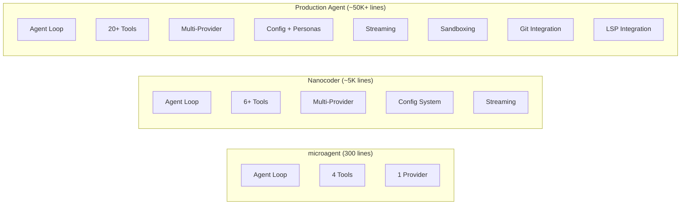

# Chapter 7: Building Your Own Agent

> Implement a minimal but functional AI coding agent from scratch using the architectural patterns we've learned.

## Overview

Now that you understand the architecture, tool system, provider abstraction, and context management, it's time to build your own AI coding agent. This chapter walks through implementing a ~300-line TypeScript agent called "microagent" that can read files, write files, execute commands, and search code—the four core capabilities of any coding agent.

## Project Setup

```bash
mkdir microagent && cd microagent
npm init -y
npm install typescript @types/node readline
npx tsc --init --target ES2022 --module NodeNext \
  --moduleResolution NodeNext --outDir dist \
  --rootDir src --strict
mkdir src
```

```json
// package.json additions
{
  "type": "module",
  "scripts": {
    "build": "tsc",
    "start": "node dist/index.js"
  }
}
```

## Step 1: Define the Types

```typescript
// src/types.ts

export interface Message {
  role: "system" | "user" | "assistant" | "tool";
  content: string;
  tool_calls?: ToolCall[];
  tool_call_id?: string;
}

export interface ToolCall {
  id: string;
  type: "function";
  function: {
    name: string;
    arguments: string;
  };
}

export interface ToolDefinition {
  type: "function";
  function: {
    name: string;
    description: string;
    parameters: {
      type: "object";
      properties: Record<string, unknown>;
      required: string[];
    };
  };
}

export interface ChatResponse {
  content: string;
  toolCalls?: ToolCall[];
}
```

## Step 2: Implement the Provider

```typescript
// src/provider.ts

import { Message, ToolDefinition, ChatResponse } from "./types.js";

export class Provider {
  constructor(
    private apiBase: string,
    private apiKey: string,
    private model: string
  ) {}

  async chat(
    messages: Message[],
    tools: ToolDefinition[]
  ): Promise<ChatResponse> {
    const response = await fetch(
      `${this.apiBase}/chat/completions`,
      {
        method: "POST",
        headers: {
          "Content-Type": "application/json",
          Authorization: `Bearer ${this.apiKey}`,
        },
        body: JSON.stringify({
          model: this.model,
          messages: messages.map((m) => ({
            role: m.role,
            content: m.content,
            ...(m.tool_calls && { tool_calls: m.tool_calls }),
            ...(m.tool_call_id && {
              tool_call_id: m.tool_call_id,
            }),
          })),
          tools: tools.length > 0 ? tools : undefined,
          temperature: 0.1,
          max_tokens: 4096,
        }),
      }
    );

    if (!response.ok) {
      const error = await response.text();
      throw new Error(`API error (${response.status}): ${error}`);
    }

    const data = await response.json();
    const choice = data.choices[0];

    return {
      content: choice.message.content ?? "",
      toolCalls: choice.message.tool_calls,
    };
  }
}
```

## Step 3: Implement the Tools

```typescript
// src/tools.ts

import { readFile, writeFile, mkdir } from "fs/promises";
import { execSync } from "child_process";
import { resolve, dirname } from "path";
import { ToolDefinition } from "./types.js";

// Tool definitions (JSON Schema for the LLM)
export const TOOL_DEFINITIONS: ToolDefinition[] = [
  {
    type: "function",
    function: {
      name: "read_file",
      description:
        "Read the contents of a file. Returns the file content " +
        "with line numbers. Use this to understand code before " +
        "making changes.",
      parameters: {
        type: "object",
        properties: {
          path: {
            type: "string",
            description: "Path to the file to read",
          },
        },
        required: ["path"],
      },
    },
  },
  {
    type: "function",
    function: {
      name: "write_file",
      description:
        "Write content to a file, creating it if it doesn't " +
        "exist or overwriting if it does. Always read the file " +
        "first to understand existing content.",
      parameters: {
        type: "object",
        properties: {
          path: {
            type: "string",
            description: "Path to write to",
          },
          content: {
            type: "string",
            description: "Content to write",
          },
        },
        required: ["path", "content"],
      },
    },
  },
  {
    type: "function",
    function: {
      name: "run_command",
      description:
        "Execute a shell command and return the output. " +
        "Use for running tests, builds, git commands, etc.",
      parameters: {
        type: "object",
        properties: {
          command: {
            type: "string",
            description: "The shell command to execute",
          },
        },
        required: ["command"],
      },
    },
  },
  {
    type: "function",
    function: {
      name: "search",
      description:
        "Search for a pattern in files using grep. " +
        "Returns matching lines with file paths and line numbers.",
      parameters: {
        type: "object",
        properties: {
          pattern: {
            type: "string",
            description: "Regex pattern to search for",
          },
          path: {
            type: "string",
            description:
              "Directory to search in (default: current directory)",
          },
        },
        required: ["pattern"],
      },
    },
  },
];

// Tool implementations
export async function executeTool(
  name: string,
  args: Record<string, string>
): Promise<string> {
  const cwd = process.cwd();

  switch (name) {
    case "read_file": {
      const fullPath = resolve(cwd, args.path);
      if (!fullPath.startsWith(cwd)) {
        return "Error: path traversal not allowed";
      }
      try {
        const content = await readFile(fullPath, "utf-8");
        return content
          .split("\n")
          .map((line, i) => `${i + 1}\t${line}`)
          .join("\n");
      } catch (e: any) {
        return `Error: ${e.message}`;
      }
    }

    case "write_file": {
      const fullPath = resolve(cwd, args.path);
      if (!fullPath.startsWith(cwd)) {
        return "Error: path traversal not allowed";
      }
      try {
        await mkdir(dirname(fullPath), { recursive: true });
        await writeFile(fullPath, args.content, "utf-8");
        return `Written: ${args.path} (${args.content.length} bytes)`;
      } catch (e: any) {
        return `Error: ${e.message}`;
      }
    }

    case "run_command": {
      try {
        const output = execSync(args.command, {
          cwd,
          encoding: "utf-8",
          timeout: 30000,
          maxBuffer: 1024 * 1024,
        });
        return output || "(no output)";
      } catch (e: any) {
        return `Exit code ${e.status}:\n${e.stderr || e.message}`;
      }
    }

    case "search": {
      const searchPath = args.path || ".";
      try {
        const output = execSync(
          `grep -rn "${args.pattern}" ${searchPath} --include="*.ts" --include="*.js" --include="*.py" --include="*.go" --include="*.rs" | head -20`,
          { cwd, encoding: "utf-8", timeout: 10000 }
        );
        return output || "No matches found";
      } catch {
        return "No matches found";
      }
    }

    default:
      return `Unknown tool: ${name}`;
  }
}
```

## Step 4: Implement the Agent Loop

```typescript
// src/agent.ts

import {
  createInterface,
  Interface as ReadlineInterface,
} from "readline";
import { Message, ToolCall } from "./types.js";
import { Provider } from "./provider.js";
import { TOOL_DEFINITIONS, executeTool } from "./tools.js";

export class Agent {
  private history: Message[] = [];
  private rl: ReadlineInterface;

  constructor(private provider: Provider) {
    this.rl = createInterface({
      input: process.stdin,
      output: process.stdout,
    });

    // Initialize with system prompt
    this.history.push({
      role: "system",
      content: this.buildSystemPrompt(),
    });
  }

  private buildSystemPrompt(): string {
    return [
      "You are a coding assistant running in the terminal.",
      `Working directory: ${process.cwd()}`,
      "",
      "Guidelines:",
      "- Read files before modifying them",
      "- Explain what you plan to do before using tools",
      "- Use search to find relevant code",
      "- Run tests after making changes",
    ].join("\n");
  }

  async run(): Promise<void> {
    console.log("🤖 microagent - AI Coding Agent");
    console.log(`Working directory: ${process.cwd()}`);
    console.log('Type "exit" to quit.\n');

    while (true) {
      const input = await this.prompt("> ");

      if (input.toLowerCase() === "exit") {
        console.log("Goodbye!");
        this.rl.close();
        break;
      }

      if (!input.trim()) continue;

      await this.processMessage(input);
    }
  }

  private async processMessage(userInput: string): Promise<void> {
    // Add user message to history
    this.history.push({ role: "user", content: userInput });

    // Agent loop: keep going until LLM responds without tool calls
    while (true) {
      try {
        const response = await this.provider.chat(
          this.history,
          TOOL_DEFINITIONS
        );

        // Add assistant response to history
        this.history.push({
          role: "assistant",
          content: response.content,
          tool_calls: response.toolCalls,
        });

        // If no tool calls, print response and break
        if (!response.toolCalls || response.toolCalls.length === 0) {
          if (response.content) {
            console.log(`\n${response.content}\n`);
          }
          break;
        }

        // Execute tool calls
        for (const toolCall of response.toolCalls) {
          const args = JSON.parse(toolCall.function.arguments);
          const toolName = toolCall.function.name;

          // Show what's being executed
          console.log(`\n🔧 ${toolName}: ${summarizeArgs(args)}`);

          // Ask for approval on write operations
          if (
            toolName === "write_file" ||
            toolName === "run_command"
          ) {
            const approved = await this.prompt(
              "   Approve? [y/n] "
            );
            if (approved.toLowerCase() !== "y") {
              this.history.push({
                role: "tool",
                content: "User denied this operation",
                tool_call_id: toolCall.id,
              });
              continue;
            }
          }

          // Execute the tool
          const result = await executeTool(toolName, args);

          // Show truncated result
          const preview =
            result.length > 200
              ? result.slice(0, 200) + "..."
              : result;
          console.log(`   Result: ${preview}`);

          // Add result to history
          this.history.push({
            role: "tool",
            content: result,
            tool_call_id: toolCall.id,
          });
        }

        // Continue the loop — LLM will see tool results
      } catch (error: any) {
        console.error(`\nError: ${error.message}\n`);
        break;
      }
    }

    // Trim history if it's getting too long
    this.trimHistory();
  }

  private trimHistory(): void {
    // Keep system prompt + last 40 messages
    if (this.history.length > 42) {
      const system = this.history[0];
      this.history = [
        system,
        ...this.history.slice(-40),
      ];
    }
  }

  private prompt(question: string): Promise<string> {
    return new Promise((resolve) => {
      this.rl.question(question, resolve);
    });
  }
}

function summarizeArgs(
  args: Record<string, string>
): string {
  if (args.path) return args.path;
  if (args.command) return args.command;
  if (args.pattern) return `"${args.pattern}"`;
  return JSON.stringify(args);
}
```

## Step 5: Entry Point

```typescript
// src/index.ts

import { Agent } from "./agent.js";
import { Provider } from "./provider.js";

// Configuration from environment
const apiBase =
  process.env.API_BASE ?? "http://localhost:11434/v1";
const apiKey = process.env.API_KEY ?? "ollama";
const model = process.env.MODEL ?? "qwen2.5-coder:7b";

const provider = new Provider(apiBase, apiKey, model);
const agent = new Agent(provider);

agent.run().catch(console.error);
```

## Running Your Agent

```bash
# Build
npm run build

# Run with local Ollama
npm start

# Run with OpenRouter
API_BASE=https://openrouter.ai/api/v1 \
API_KEY=sk-or-v1-... \
MODEL=anthropic/claude-sonnet-4-20250514 \
npm start
```

### Example Session

```
🤖 microagent - AI Coding Agent
Working directory: /home/user/my-project
Type "exit" to quit.

> What files are in this project?

🔧 run_command: ls -la
   Approve? [y/n] y
   Result: total 32
   drwxr-xr-x  5 user user  160 Jan 15 10:00 .
   drwxr-xr-x 12 user user  384 Jan 14 09:00 ..
   -rw-r--r--  1 user user  245 Jan 15 10:00 package.json
   -rw-r--r--  1 user user 1024 Jan 15 10:00 src/index.ts
   ...

🔧 read_file: package.json
   Result: 1  {
   2    "name": "my-project",
   3    "version": "1.0.0",
   ...

This is a TypeScript project with the following structure:
- `package.json` - Project configuration
- `src/index.ts` - Main entry point
...

> Add a logger utility to src/utils/logger.ts

I'll create a logger utility. Let me first check what logging patterns
are used in the existing code.

🔧 search: "console.log"
   Result: src/index.ts:15:  console.log("Server started");
   src/index.ts:42:  console.log("Request received:", req.url);

🔧 write_file: src/utils/logger.ts
   Approve? [y/n] y
   Result: Written: src/utils/logger.ts (512 bytes)

I've created a logger utility at src/utils/logger.ts with structured
logging support. Would you like me to update the existing console.log
calls to use the new logger?
```

## Enhancements to Explore

Once you have the basic agent working, here are improvements to try:

| Enhancement | Complexity | Impact |
|-------------|-----------|--------|
| Streaming responses | Medium | Much better UX |
| File tagging (`/tag`) | Low | Better context control |
| Conversation save/load | Low | Session persistence |
| Diff preview for writes | Medium | Safer file editing |
| Cost tracking | Low | Budget awareness |
| Multiple providers | Medium | Model flexibility |
| Custom tool registration | Medium | Extensibility |
| Parallel tool execution | High | Performance |

## Architecture Comparison

Your microagent implements the same core loop as production agents:



The fundamental architecture is the same at every scale. What changes is the breadth of tools, the sophistication of context management, and the depth of platform integrations.

## Summary

You've built a functional AI coding agent in roughly 300 lines of TypeScript. It implements the same core patterns as nanocoder and other production agents: a conversational loop with tool calling, an approval workflow for destructive operations, and a provider interface for LLM communication.

## Key Takeaways

1. A minimal AI coding agent needs only four components: provider, tools, agent loop, and UI
2. The agent loop is a while-loop that breaks when the LLM stops requesting tool calls
3. Tool definitions use JSON Schema—the same format used by OpenAI, Anthropic, and others
4. Approval workflows are simple to implement but critical for safety
5. Path traversal prevention and command timeouts are minimum security requirements
6. The same architecture scales from 300 lines to 50K+ lines—the loop never changes

## Next Steps

In [Chapter 8: Production Patterns & Security](08-production-patterns-security.md), we'll cover the patterns that separate a prototype from a production agent: sandboxing, cost controls, audit logging, and deployment strategies.

---

*Built with insights from the [Nanocoder](https://github.com/Nano-Collective/nanocoder) project.*
