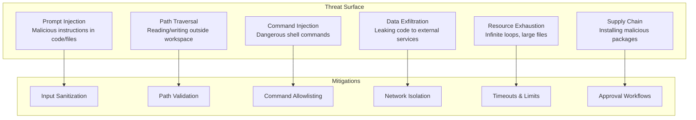

# Chapter 8: Production Patterns & Security

Welcome to **Chapter 8: Production Patterns & Security**. In this part of **Nanocoder Tutorial: Building and Understanding AI Coding Agents**, you will build an intuitive mental model first, then move into concrete implementation details and practical production tradeoffs.


> Sandboxing, approval workflows, cost management, audit logging, and deployment strategies for production AI coding agents.

## Overview

Moving from a prototype to a production AI coding agent requires addressing security, reliability, and operational concerns. This chapter covers the patterns that production agents like nanocoder, Aider, Claude Code, and OpenHands use to safely execute AI-generated code in real development environments.

## Threat Model

AI coding agents face unique security challenges:



## Sandboxing Strategies

### Strategy 1: Process-Level Isolation

Run tool execution in a restricted subprocess:

```typescript
import { spawn } from "child_process";

async function sandboxedExec(
  command: string,
  options: SandboxOptions
): Promise<ExecResult> {
  return new Promise((resolve, reject) => {
    const proc = spawn("sh", ["-c", command], {
      cwd: options.workingDir,
      timeout: options.timeout ?? 30000,
      env: {
        ...process.env,
        // Remove sensitive environment variables
        HOME: options.workingDir,
        PATH: options.restrictedPath ?? process.env.PATH,
      },
      stdio: ["ignore", "pipe", "pipe"],
      // Resource limits
      ...(process.platform !== "win32" && {
        uid: options.uid,
        gid: options.gid,
      }),
    });

    let stdout = "";
    let stderr = "";

    proc.stdout.on("data", (data) => {
      stdout += data;
      if (stdout.length > options.maxOutput ?? 1048576) {
        proc.kill();
        reject(new Error("Output limit exceeded"));
      }
    });

    proc.stderr.on("data", (data) => {
      stderr += data;
    });

    proc.on("close", (code) => {
      resolve({ stdout, stderr, exitCode: code ?? 1 });
    });

    proc.on("error", reject);
  });
}
```

### Strategy 2: Container-Based Isolation

For stronger isolation, execute commands in a Docker container:

```typescript
async function containerExec(
  command: string,
  workspace: string
): Promise<ExecResult> {
  const containerName = `agent-sandbox-${Date.now()}`;

  const dockerCommand = [
    "docker",
    "run",
    "--rm",
    `--name=${containerName}`,
    "--network=none", // No network access
    "--memory=512m", // Memory limit
    "--cpus=1", // CPU limit
    "--read-only", // Read-only root filesystem
    `--tmpfs=/tmp:size=100m`, // Writable temp
    `-v=${workspace}:/workspace`, // Mount workspace
    "-w=/workspace",
    "node:20-slim", // Base image
    "sh",
    "-c",
    command,
  ].join(" ");

  return sandboxedExec(dockerCommand, {
    workingDir: process.cwd(),
    timeout: 60000,
  });
}
```

### Strategy 3: File System Restrictions

Prevent access outside the workspace:

```typescript
class SecureFileSystem {
  private root: string;
  private allowedPaths: Set<string>;

  constructor(root: string) {
    this.root = realpathSync(root);
    this.allowedPaths = new Set([this.root]);
  }

  resolvePath(requestedPath: string): string {
    const absolute = resolve(this.root, requestedPath);
    const real = realpathSync(absolute);

    // Check that resolved path is within workspace
    if (!real.startsWith(this.root)) {
      throw new SecurityError(
        `Path traversal blocked: ${requestedPath} resolves to ${real}`
      );
    }

    return real;
  }

  async readFile(path: string): Promise<string> {
    const safePath = this.resolvePath(path);

    // Check file size before reading
    const stats = await fs.stat(safePath);
    if (stats.size > 10 * 1024 * 1024) {
      // 10 MB limit
      throw new SecurityError(
        `File too large: ${path} (${stats.size} bytes)`
      );
    }

    // Check for binary files
    if (await isBinaryFile(safePath)) {
      throw new SecurityError(
        `Binary file not supported: ${path}`
      );
    }

    return fs.readFile(safePath, "utf-8");
  }

  async writeFile(
    path: string,
    content: string
  ): Promise<void> {
    const safePath = this.resolvePath(path);

    // Prevent overwriting critical files
    const basename = safePath.split("/").pop()!;
    const blocked = [
      ".env",
      ".ssh",
      "id_rsa",
      "credentials.json",
    ];
    if (blocked.some((b) => basename.includes(b))) {
      throw new SecurityError(
        `Writing to ${basename} is blocked for security`
      );
    }

    await fs.writeFile(safePath, content, "utf-8");
  }
}
```

## Command Safety

### Blocked Command Patterns

```typescript
const BLOCKED_PATTERNS: RegExp[] = [
  /rm\s+-rf\s+[\/~]/, // rm -rf / or ~
  /mkfs/, // Filesystem formatting
  /dd\s+if=/, // Raw disk operations
  /chmod\s+777/, // Overly permissive permissions
  /curl.*\|\s*sh/, // Piping curl to shell
  /wget.*\|\s*sh/,
  /eval\s*\(/, // Dynamic evaluation
  />\s*\/dev\/sd/, // Writing to raw devices
  /shutdown/, // System shutdown
  /reboot/, // System reboot
  /:(){ :\|:& };:/, // Fork bomb
];

function isCommandSafe(command: string): {
  safe: boolean;
  reason?: string;
} {
  for (const pattern of BLOCKED_PATTERNS) {
    if (pattern.test(command)) {
      return {
        safe: false,
        reason: `Blocked pattern: ${pattern.source}`,
      };
    }
  }
  return { safe: true };
}
```

### Command Allowlisting

For high-security environments, use an allowlist instead:

```typescript
const ALLOWED_COMMANDS = new Set([
  "ls",
  "cat",
  "grep",
  "find",
  "git",
  "npm",
  "npx",
  "node",
  "python",
  "pip",
  "cargo",
  "go",
  "make",
  "tsc",
  "eslint",
  "prettier",
  "jest",
  "pytest",
]);

function isCommandAllowed(command: string): boolean {
  const baseCommand = command.trim().split(/\s+/)[0];
  // Strip path if present
  const name = baseCommand.split("/").pop()!;
  return ALLOWED_COMMANDS.has(name);
}
```

## Audit Logging

Track every action for accountability:

```typescript
interface AuditEntry {
  timestamp: string;
  sessionId: string;
  action: "tool_call" | "approval" | "error" | "message";
  tool?: string;
  args?: Record<string, unknown>;
  result?: string;
  approved?: boolean;
  userId?: string;
}

class AuditLog {
  private logPath: string;
  private sessionId: string;

  constructor(logDir: string) {
    this.sessionId = randomUUID();
    this.logPath = join(
      logDir,
      `audit-${this.sessionId}.jsonl`
    );
  }

  async log(entry: Omit<AuditEntry, "timestamp" | "sessionId">): Promise<void> {
    const fullEntry: AuditEntry = {
      timestamp: new Date().toISOString(),
      sessionId: this.sessionId,
      ...entry,
    };

    await fs.appendFile(
      this.logPath,
      JSON.stringify(fullEntry) + "\n"
    );
  }

  // Replay a session for debugging
  async replay(): Promise<AuditEntry[]> {
    const content = await fs.readFile(this.logPath, "utf-8");
    return content
      .trim()
      .split("\n")
      .map((line) => JSON.parse(line));
  }
}
```

## Cost Controls

Prevent runaway spend on cloud LLM providers:

```typescript
interface CostLimits {
  maxCostPerSession: number;    // e.g., $5.00
  maxCostPerDay: number;        // e.g., $50.00
  maxTokensPerRequest: number;  // e.g., 100000
  warnAtPercentage: number;     // e.g., 80
}

class CostController {
  private sessionCost = 0;
  private dailyCost = 0;

  constructor(private limits: CostLimits) {
    this.loadDailyCost();
  }

  checkBudget(estimatedCost: number): {
    allowed: boolean;
    reason?: string;
  } {
    if (
      this.sessionCost + estimatedCost >
      this.limits.maxCostPerSession
    ) {
      return {
        allowed: false,
        reason: `Session budget exceeded ($${this.sessionCost.toFixed(2)} / $${this.limits.maxCostPerSession})`,
      };
    }

    if (
      this.dailyCost + estimatedCost >
      this.limits.maxCostPerDay
    ) {
      return {
        allowed: false,
        reason: `Daily budget exceeded ($${this.dailyCost.toFixed(2)} / $${this.limits.maxCostPerDay})`,
      };
    }

    return { allowed: true };
  }

  recordCost(cost: number): void {
    this.sessionCost += cost;
    this.dailyCost += cost;

    // Warn when approaching limit
    const sessionPct =
      (this.sessionCost / this.limits.maxCostPerSession) * 100;
    if (sessionPct >= this.limits.warnAtPercentage) {
      console.warn(
        `⚠️  Session cost: $${this.sessionCost.toFixed(2)} ` +
          `(${sessionPct.toFixed(0)}% of limit)`
      );
    }
  }
}
```

## Rate Limiting

Prevent abuse and respect API rate limits:

```typescript
class RateLimiter {
  private requests: number[] = [];
  private maxRequests: number;
  private windowMs: number;

  constructor(maxRequests = 60, windowMs = 60000) {
    this.maxRequests = maxRequests;
    this.windowMs = windowMs;
  }

  async acquire(): Promise<void> {
    const now = Date.now();

    // Remove expired entries
    this.requests = this.requests.filter(
      (t) => now - t < this.windowMs
    );

    if (this.requests.length >= this.maxRequests) {
      const waitTime =
        this.requests[0] + this.windowMs - now;
      console.log(
        `Rate limited. Waiting ${(waitTime / 1000).toFixed(1)}s...`
      );
      await new Promise((r) => setTimeout(r, waitTime));
    }

    this.requests.push(now);
  }
}
```

## Error Recovery Patterns

### Checkpoint and Restore

Save state before risky operations:

```typescript
class CheckpointManager {
  private checkpoints: Map<string, Checkpoint> = new Map();

  async createCheckpoint(
    name: string,
    files: string[]
  ): Promise<string> {
    const id = `cp-${Date.now()}`;
    const snapshot: Record<string, string> = {};

    for (const file of files) {
      try {
        snapshot[file] = await fs.readFile(file, "utf-8");
      } catch {
        // File doesn't exist yet
      }
    }

    this.checkpoints.set(id, {
      id,
      name,
      timestamp: Date.now(),
      files: snapshot,
    });

    return id;
  }

  async restore(id: string): Promise<void> {
    const checkpoint = this.checkpoints.get(id);
    if (!checkpoint) throw new Error(`Checkpoint ${id} not found`);

    for (const [path, content] of Object.entries(
      checkpoint.files
    )) {
      await fs.writeFile(path, content, "utf-8");
    }

    console.log(
      `Restored checkpoint: ${checkpoint.name}`
    );
  }
}
```

### Git-Based Recovery

Use git for automatic backup:

```typescript
async function gitSafetyNet(
  operation: () => Promise<void>
): Promise<void> {
  // Stash any uncommitted changes
  const hasChanges =
    execSync("git status --porcelain", {
      encoding: "utf-8",
    }).trim() !== "";

  if (hasChanges) {
    execSync('git stash push -m "agent-safety-net"');
  }

  try {
    await operation();
  } catch (error) {
    // Restore on failure
    execSync("git checkout .");
    if (hasChanges) {
      execSync("git stash pop");
    }
    throw error;
  }
}
```

## Deployment Patterns

### As a CLI Tool

```bash
# Install globally
npm install -g nanocoder

# Run in any project
cd my-project && nanocoder
```

### As a CI/CD Agent

```yaml
# .github/workflows/ai-review.yml
name: AI Code Review
on: [pull_request]

jobs:
  review:
    runs-on: ubuntu-latest
    steps:
      - uses: actions/checkout@v4
      - uses: actions/setup-node@v4
        with:
          node-version: 20
      - run: npm install -g nanocoder
      - run: |
          nanocoder run "Review the changes in this PR. \
            Focus on security, performance, and correctness. \
            Output your findings as GitHub review comments."
        env:
          API_KEY: ${{ secrets.OPENROUTER_API_KEY }}
```

### As a Team Service

```typescript
// Express server wrapping the agent
import express from "express";
import { Agent } from "./agent.js";

const app = express();
app.use(express.json());

app.post("/api/agent", async (req, res) => {
  const { message, workspace, userId } = req.body;

  // Validate workspace access
  if (!isAuthorized(userId, workspace)) {
    return res.status(403).json({ error: "Unauthorized" });
  }

  const agent = new Agent({
    workspace,
    userId,
    costLimits: getUserLimits(userId),
  });

  const response = await agent.processMessage(message);
  res.json({ response });
});
```

## Production Checklist

| Category | Item | Status |
|----------|------|--------|
| **Security** | Path traversal prevention | Required |
| **Security** | Command blocklist/allowlist | Required |
| **Security** | Approval workflow for writes | Required |
| **Security** | Credential exclusion from context | Required |
| **Reliability** | Command timeouts | Required |
| **Reliability** | Output size limits | Required |
| **Reliability** | Error recovery/checkpoints | Recommended |
| **Observability** | Audit logging | Recommended |
| **Observability** | Cost tracking | Recommended |
| **Observability** | Token usage metrics | Recommended |
| **Operations** | Rate limiting | Recommended |
| **Operations** | Session persistence | Optional |
| **Operations** | Container sandboxing | Optional |

## Summary

Production AI coding agents must balance capability with safety. The core patterns—sandboxing, approval workflows, audit logging, and cost controls—are consistent across all production agents. The right level of security depends on your threat model: personal development tools need less than shared team services, which need less than CI/CD integrations.

## Key Takeaways

1. AI coding agents face unique threats: prompt injection, path traversal, command injection, and data exfiltration
2. Sandboxing ranges from process-level restrictions to full container isolation
3. Command safety uses blocklists (broad) or allowlists (strict) depending on security requirements
4. Audit logging tracks every tool call, approval decision, and error for accountability
5. Cost controls prevent runaway spend with per-session and per-day budgets
6. Git integration provides a natural checkpoint/restore mechanism for error recovery
7. Deployment options range from CLI tools to CI/CD agents to team services

---

*Built with insights from the [Nanocoder](https://github.com/Nano-Collective/nanocoder) project.*

## What Problem Does This Solve?

Most teams struggle here because the hard part is not writing more code, but deciding clear boundaries for `Promise`, `workspace`, `path` so behavior stays predictable as complexity grows.

In practical terms, this chapter helps you avoid three common failures:

- coupling core logic too tightly to one implementation path
- missing the handoff boundaries between setup, execution, and validation
- shipping changes without clear rollback or observability strategy

After working through this chapter, you should be able to reason about `Chapter 8: Production Patterns & Security` as an operating subsystem inside **Nanocoder Tutorial: Building and Understanding AI Coding Agents**, with explicit contracts for inputs, state transitions, and outputs.

Use the implementation notes around `files`, `command`, `options` as your checklist when adapting these patterns to your own repository.

## How it Works Under the Hood

Under the hood, `Chapter 8: Production Patterns & Security` usually follows a repeatable control path:

1. **Context bootstrap**: initialize runtime config and prerequisites for `Promise`.
2. **Input normalization**: shape incoming data so `workspace` receives stable contracts.
3. **Core execution**: run the main logic branch and propagate intermediate state through `path`.
4. **Policy and safety checks**: enforce limits, auth scopes, and failure boundaries.
5. **Output composition**: return canonical result payloads for downstream consumers.
6. **Operational telemetry**: emit logs/metrics needed for debugging and performance tuning.

When debugging, walk this sequence in order and confirm each stage has explicit success/failure conditions.

## Source Walkthrough

Use the following upstream sources to verify implementation details while reading this chapter:

- [Nanocoder Repository](https://github.com/Nano-Collective/nanocoder)
  Why it matters: authoritative reference on `Nanocoder Repository` (github.com).
- [Nanocoder Releases](https://github.com/Nano-Collective/nanocoder/releases)
  Why it matters: authoritative reference on `Nanocoder Releases` (github.com).
- [Nanocoder Documentation Directory](https://github.com/Nano-Collective/nanocoder/tree/main/docs)
  Why it matters: authoritative reference on `Nanocoder Documentation Directory` (github.com).
- [Nanocoder MCP Configuration Guide](https://github.com/Nano-Collective/nanocoder/blob/main/docs/mcp-configuration.md)
  Why it matters: authoritative reference on `Nanocoder MCP Configuration Guide` (github.com).
- [Nano Collective Website](https://nanocollective.org/)
  Why it matters: authoritative reference on `Nano Collective Website` (nanocollective.org).

Suggested trace strategy:
- search upstream code for `Promise` and `workspace` to map concrete implementation paths
- compare docs claims against actual runtime/config code before reusing patterns in production

## Chapter Connections

- [Tutorial Index](index.md)
- [Previous Chapter: Chapter 7: Building Your Own Agent](07-building-your-own-agent.md)
- [Main Catalog](../../README.md#-tutorial-catalog)
- [A-Z Tutorial Directory](../../discoverability/tutorial-directory.md)
