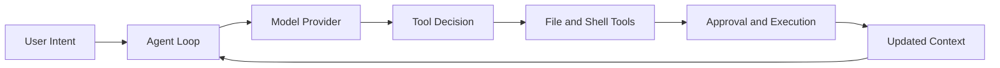

# Nanocoder Tutorial: Building and Understanding AI Coding Agents

> Learn how `Nano-Collective/nanocoder` implements local-first coding-agent workflows, tool execution loops, and multi-provider model integration.

## Why This Track Matters

Nanocoder is a practical open-source reference for local-first coding agents. It demonstrates patterns that apply across terminal and IDE agent ecosystems.

This track focuses on:

- agent loop internals for coding tasks
- safe tool execution and approval workflows
- provider abstraction across local and hosted models
- design decisions needed to build your own coding agent

## Current Snapshot (Verified February 11, 2026)

- repository: [`Nano-Collective/nanocoder`](https://github.com/Nano-Collective/nanocoder)
- stars: about **1.3k**
- latest release: [`v1.22.4`](https://github.com/Nano-Collective/nanocoder/releases/tag/v1.22.4)
- development activity: active with recent updates
- project positioning in repo: community-built, local-first terminal coding agent with extensible tooling

## Mental Model

## Chapter Guide

| Chapter | Key Question | Outcome |
|:--------|:-------------|:--------|
| [01 - Getting Started](01-getting-started.md) | How do I install and run Nanocoder effectively? | Working local setup |
| [02 - Architecture and Agent Loop](02-architecture-agent-loop.md) | How does the core agent loop operate? | Strong internal model of execution |
| [03 - Tool System Internals](03-tool-system-internals.md) | How are file, shell, and analysis tools orchestrated? | Tool-calling implementation understanding |
| [04 - Multi-Provider Integration](04-multi-provider-integration.md) | How does provider abstraction support different models? | Portable model backend strategy |
| [05 - Context Management](05-context-management.md) | How is context window budget managed in real workflows? | Better context and token handling |
| [06 - Configuration and Customization](06-configuration-customization.md) | How do I tailor behavior per project and team? | Maintainable configuration patterns |
| [07 - Building Your Own Agent](07-building-your-own-agent.md) | How do I implement a minimal coding agent myself? | Practical build blueprint |
| [08 - Production Patterns and Security](08-production-patterns-security.md) | How do I safely run coding agents at scale? | Security and operations baseline |

## What You Will Learn

- how coding-agent loops coordinate model reasoning with tools
- how to design safe command/file execution pipelines
- how to support multiple providers without vendor lock-in
- how to adapt Nanocoder design patterns for your own agent stack

## Source References

- [Nanocoder Repository](https://github.com/Nano-Collective/nanocoder)
- [Nanocoder Releases](https://github.com/Nano-Collective/nanocoder/releases)
- [Nanocoder Documentation Directory](https://github.com/Nano-Collective/nanocoder/tree/main/docs)
- [Nanocoder MCP Configuration Guide](https://github.com/Nano-Collective/nanocoder/blob/main/docs/mcp-configuration.md)
- [Nano Collective Website](https://nanocollective.org/)

## Related Tutorials

- [Aider Tutorial](../aider-tutorial/)
- [Claude Code Tutorial](../claude-code-tutorial/)
- [Continue Tutorial](../continue-tutorial/)
- [OpenHands Tutorial](../openhands-tutorial/)

---

Start with [Chapter 1: Getting Started](01-getting-started.md).
