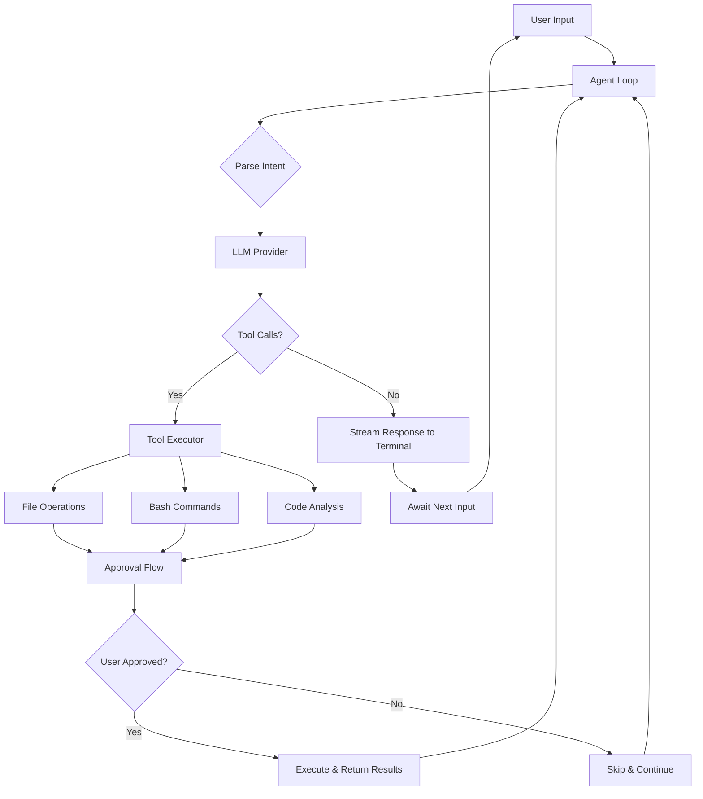

# Nanocoder: Building & Understanding AI Coding Agents

> A deep dive into how local-first AI coding agents work internally, using Nanocoder as a practical reference implementation.

[](https://github.com/Nano-Collective/nanocoder)
[](https://opensource.org/licenses/MIT)
[](https://github.com/Nano-Collective/nanocoder)


AI coding agents represent a fundamental shift in developer tooling—moving from passive code completion to autonomous code understanding, generation, and execution. Nanocoder is a community-driven, local-first CLI coding agent built in TypeScript that demonstrates the core architectural patterns shared by tools like Aider, Claude Code, and Continue.

This tutorial goes beyond usage guides. You'll learn **how AI coding agents work internally**: the tool-calling architecture, multi-provider abstraction layers, context management strategies, and the agent loop that ties everything together.



## Tutorial Chapters

| # | Chapter | Description |
|---|---------|-------------|
| 1 | [Getting Started](01-getting-started.md) | Installation, configuration, and your first interactive session |
| 2 | [Architecture & Agent Loop](02-architecture-agent-loop.md) | Core architecture, the agent loop, and message orchestration |
| 3 | [Tool System Internals](03-tool-system-internals.md) | How tool calling works: file operations, bash execution, and approval flows |
| 4 | [Multi-Provider Integration](04-multi-provider-integration.md) | Provider abstraction, local models, and API-compatible backends |
| 5 | [Context Management](05-context-management.md) | Token budgeting, file tagging, conversation history, and context windows |
| 6 | [Configuration & Customization](06-configuration-customization.md) | Project-level configs, agent personas, and environment management |
| 7 | [Building Your Own Agent](07-building-your-own-agent.md) | Implement a minimal AI coding agent from scratch using the same patterns |
| 8 | [Production Patterns & Security](08-production-patterns-security.md) | Sandboxing, approval workflows, cost management, and deployment |

## What You'll Learn

- **Agent Loop Architecture**: How the core read-eval-execute loop drives all AI coding agents
- **Tool Calling Internals**: The structured protocol that lets LLMs interact with your filesystem and shell
- **Provider Abstraction**: How to support multiple LLM backends through a unified interface
- **Context Window Management**: Strategies for fitting relevant code into limited token budgets
- **Security & Sandboxing**: How to safely execute AI-generated commands in development environments
- **Build Your Own**: Implement a minimal but functional AI coding agent from scratch

## Prerequisites

- **Node.js 20+** and **pnpm** installed
- Basic TypeScript/JavaScript knowledge
- Familiarity with terminal/CLI usage
- Understanding of REST APIs and HTTP
- An API key for at least one LLM provider (or Ollama installed locally)

## Quick Start

```bash
# Install nanocoder globally
npm install -g @anthropic/nanocoder

# Or clone and build from source
git clone https://github.com/Nano-Collective/nanocoder.git
cd nanocoder
pnpm install
pnpm build

# Start an interactive session
nanocoder

# Or run a one-off task
nanocoder run "Explain the main function in src/index.ts"
```

## Key Features

| Feature | Description |
|---------|-------------|
| **Local-First** | Runs entirely on your machine—your code never leaves your environment |
| **Multi-Provider** | Works with Ollama, llama.cpp, LM Studio, OpenRouter, and any OpenAI-compatible API |
| **Tool Calling** | File read/write, bash execution, and code search through structured tool use |
| **Approval Workflow** | Review and approve every file change and command before execution |
| **Project Configuration** | Per-project `agents.config.json` for team-consistent behavior |
| **Slash Commands** | Built-in commands for model switching, file tagging, and session control |

## Learning Path

| Track | Chapters | Focus |
|-------|----------|-------|
| 🟢 **User** | 1, 4, 6 | Get productive with nanocoder quickly |
| 🟡 **Developer** | 1-6 | Understand internals and customize behavior |
| 🔴 **Builder** | All chapters | Build your own AI coding agent from scratch |

## Related Tutorials

- [Aider Tutorial](../aider-tutorial/) - Git-integrated AI pair programming
- [Claude Code Tutorial](../claude-code-tutorial/) - Anthropic's terminal coding agent
- [Continue Tutorial](../continue-tutorial/) - IDE-native AI code assistant
- [OpenHands Tutorial](../openhands-tutorial/) - Autonomous software development agent
- [Ollama Tutorial](../ollama-tutorial/) - Local LLM inference server

---

**Ready to understand how AI coding agents really work?** Start with [Chapter 1: Getting Started](01-getting-started.md).
