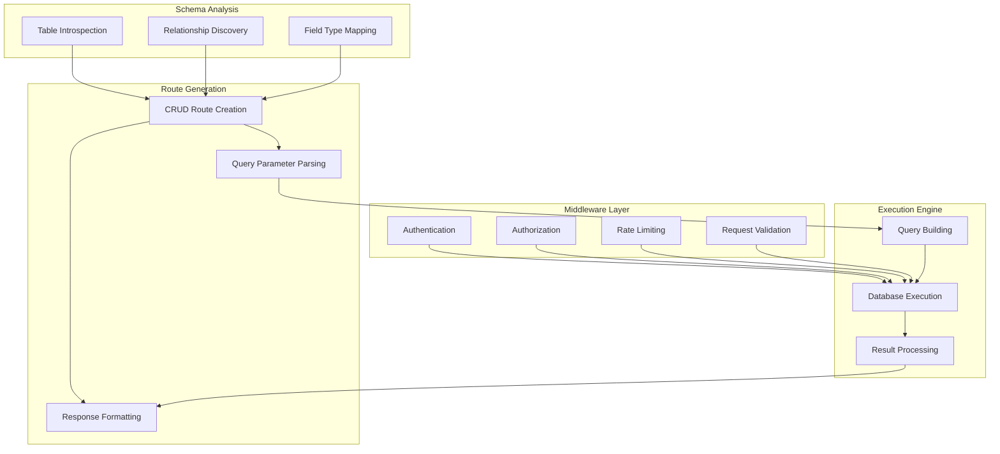

# Chapter 4: API Generation Engine

> Automatic REST API creation and management from database schemas

## 🎯 Learning Objectives

By the end of this chapter, you'll understand:
- How NocoDB automatically generates REST APIs from database schemas
- API endpoint structure and routing patterns
- Authentication and authorization for generated APIs
- Query parameter handling and response formatting
- Rate limiting and API management features

## 🚀 API Generation Architecture

NocoDB automatically creates REST APIs for every table, providing full CRUD operations without manual coding.

### **API Generation Components**



## 📋 REST API Structure

### **Standard CRUD Endpoints**

For each table, NocoDB generates a complete set of REST endpoints:

```javascript
// API endpoint generation
class ApiGenerator {
  constructor(schemaManager, routeManager) {
    this.schemaManager = schemaManager;
    this.routeManager = routeManager;
  }

  async generateTableApi(tableName) {
    const schema = await this.schemaManager.getTableSchema(tableName);

    // Generate base routes
    const basePath = `/api/v1/${tableName}`;

    // List records
    this.routeManager.addRoute({
      method: 'GET',
      path: basePath,
      handler: this.createListHandler(tableName, schema),
      middleware: ['auth', 'rateLimit']
    });

    // Create record
    this.routeManager.addRoute({
      method: 'POST',
      path: basePath,
      handler: this.createCreateHandler(tableName, schema),
      middleware: ['auth', 'rateLimit', 'validation']
    });

    // Get single record
    this.routeManager.addRoute({
      method: 'GET',
      path: `${basePath}/:id`,
      handler: this.createGetHandler(tableName, schema),
      middleware: ['auth', 'rateLimit']
    });

    // Update record
    this.routeManager.addRoute({
      method: 'PUT',
      path: `${basePath}/:id`,
      handler: this.createUpdateHandler(tableName, schema),
      middleware: ['auth', 'rateLimit', 'validation']
    });

    // Delete record
    this.routeManager.addRoute({
      method: 'DELETE',
      path: `${basePath}/:id`,
      handler: this.createDeleteHandler(tableName, schema),
      middleware: ['auth', 'rateLimit']
    });

    // Bulk operations
    this.routeManager.addRoute({
      method: 'POST',
      path: `${basePath}/bulk`,
      handler: this.createBulkHandler(tableName, schema),
      middleware: ['auth', 'rateLimit', 'validation']
    });

    return {
      basePath,
      endpoints: 6, // CRUD + bulk
      generated: new Date().toISOString()
    };
  }
}
```

### **Query Parameters and Filtering**

```javascript
// Query parameter handling
class QueryProcessor {
  constructor() {
    this.parameterMappings = {
      // Field filters
      'fields': this.parseFields,
      'where': this.parseWhere,
      'sort': this.parseSort,
      'limit': this.parseLimit,
      'offset': this.parseOffset,

      // Special parameters
      'include': this.parseInclude,
      'exclude': this.parseExclude,
      'search': this.parseSearch
    };
  }

  processQueryParameters(queryParams) {
    const processed = {
      select: [],
      where: [],
      orderBy: [],
      limit: null,
      offset: 0,
      include: [],
      exclude: [],
      search: null
    };

    for (const [key, value] of Object.entries(queryParams)) {
      if (this.parameterMappings[key]) {
        this.parameterMappings[key].call(this, value, processed);
      }
    }

    return processed;
  }

  parseFields(fields, processed) {
    if (typeof fields === 'string') {
      processed.select = fields.split(',').map(f => f.trim());
    } else if (Array.isArray(fields)) {
      processed.select = fields;
    }
  }

  parseWhere(where, processed) {
    // Parse complex where conditions
    if (typeof where === 'string') {
      try {
        // Assume JSON format for complex queries
        const conditions = JSON.parse(where);
        processed.where = this.parseWhereConditions(conditions);
      } catch (e) {
        // Simple field=value format
        const [field, value] = where.split('=');
        processed.where = [{ field, operator: 'eq', value }];
      }
    }
  }

  parseWhereConditions(conditions) {
    const parsed = [];

    for (const [field, condition] of Object.entries(conditions)) {
      if (typeof condition === 'object') {
        // Complex condition: {field: {operator: value}}
        for (const [operator, value] of Object.entries(condition)) {
          parsed.push({ field, operator, value });
        }
      } else {
        // Simple equality
        parsed.push({ field, operator: 'eq', value: condition });
      }
    }

    return parsed;
  }

  parseSort(sort, processed) {
    if (typeof sort === 'string') {
      // Format: field1:asc,field2:desc
      const sorts = sort.split(',').map(s => {
        const [field, direction] = s.split(':');
        return {
          field: field.trim(),
          direction: (direction || 'asc').toLowerCase()
        };
      });
      processed.orderBy = sorts;
    }
  }

  parseLimit(limit, processed) {
    const limitNum = parseInt(limit);
    if (limitNum > 0 && limitNum <= 1000) { // Reasonable limits
      processed.limit = limitNum;
    }
  }

  parseOffset(offset, processed) {
    const offsetNum = parseInt(offset);
    if (offsetNum >= 0) {
      processed.offset = offsetNum;
    }
  }

  parseInclude(include, processed) {
    if (typeof include === 'string') {
      processed.include = include.split(',').map(r => r.trim());
    }
  }

  parseExclude(exclude, processed) {
    if (typeof exclude === 'string') {
      processed.exclude = exclude.split(',').map(f => f.trim());
    }
  }

  parseSearch(search, processed) {
    if (typeof search === 'string' && search.trim()) {
      processed.search = search.trim();
    }
  }
}
```

## 🔐 Authentication and Authorization

### **API Authentication**

```javascript
// Authentication middleware
class ApiAuthenticator {
  constructor(userManager, tokenManager) {
    this.userManager = userManager;
    this.tokenManager = tokenManager;
  }

  async authenticateRequest(request) {
    const authHeader = request.headers.authorization;

    if (!authHeader) {
      throw new AuthenticationError('Missing authorization header');
    }

    const [scheme, token] = authHeader.split(' ');

    switch (scheme.toLowerCase()) {
      case 'bearer':
        return await this.authenticateBearerToken(token);
      case 'apikey':
        return await this.authenticateApiKey(token);
      default:
        throw new AuthenticationError(`Unsupported authentication scheme: ${scheme}`);
    }
  }

  async authenticateBearerToken(token) {
    // Validate JWT token
    const payload = await this.tokenManager.verifyToken(token);

    if (!payload || !payload.userId) {
      throw new AuthenticationError('Invalid token');
    }

    // Get user
    const user = await this.userManager.getUserById(payload.userId);

    if (!user) {
      throw new AuthenticationError('User not found');
    }

    return user;
  }

  async authenticateApiKey(apiKey) {
    // Validate API key
    const keyRecord = await this.userManager.getApiKey(apiKey);

    if (!keyRecord) {
      throw new AuthenticationError('Invalid API key');
    }

    // Check if key is active
    if (!keyRecord.active) {
      throw new AuthenticationError('API key is inactive');
    }

    // Check expiration
    if (keyRecord.expiresAt && new Date() > new Date(keyRecord.expiresAt)) {
      throw new AuthenticationError('API key has expired');
    }

    return keyRecord.user;
  }
}

// Authorization middleware
class ApiAuthorizer {
  constructor(permissionManager) {
    this.permissionManager = permissionManager;
  }

  async authorizeRequest(user, resource, action, request) {
    // Check if user has permission for this action on this resource
    const hasPermission = await this.permissionManager.checkPermission(
      user.id, resource, action
    );

    if (!hasPermission) {
      // Check for role-based permissions
      const roles = await this.userManager.getUserRoles(user.id);
      const hasRolePermission = await this.checkRolePermissions(roles, resource, action);

      if (!hasRolePermission) {
        throw new AuthorizationError(`Access denied for ${action} on ${resource}`);
      }
    }

    // Additional context-specific checks
    await this.performContextChecks(user, resource, action, request);
  }

  async checkRolePermissions(roles, resource, action) {
    for (const role of roles) {
      const permissions = await this.permissionManager.getRolePermissions(role.id);

      for (const permission of permissions) {
        if (permission.resource === resource && permission.action === action) {
          return true;
        }

        // Check wildcards
        if (permission.resource === '*' || permission.action === '*') {
          return true;
        }
      }
    }

    return false;
  }

  async performContextChecks(user, resource, action, request) {
    // Resource ownership checks
    if (action === 'update' || action === 'delete') {
      const isOwner = await this.checkResourceOwnership(user, resource, request.params.id);
      if (!isOwner) {
        throw new AuthorizationError('You can only modify your own resources');
      }
    }

    // Field-level permissions
    if (request.body) {
      await this.checkFieldPermissions(user, resource, action, request.body);
    }
  }

  async checkResourceOwnership(user, resource, resourceId) {
    // Query the resource to check ownership
    const resourceRecord = await this.db.query(
      `SELECT user_id FROM ${resource} WHERE id = ?`,
      [resourceId]
    );

    return resourceRecord && resourceRecord.user_id === user.id;
  }

  async checkFieldPermissions(user, resource, action, data) {
    const restrictedFields = await this.permissionManager.getRestrictedFields(user.id, resource);

    for (const field of restrictedFields) {
      if (data.hasOwnProperty(field)) {
        throw new AuthorizationError(`You don't have permission to modify field: ${field}`);
      }
    }
  }
}
```

### **Rate Limiting**

```javascript
// Rate limiting implementation
class RateLimiter {
  constructor(redisClient) {
    this.redis = redisClient;
    this.limits = {
      // Default limits
      'default': { requests: 100, window: 60 }, // 100 requests per minute
      'authenticated': { requests: 1000, window: 60 }, // 1000 requests per minute
      'admin': { requests: 10000, window: 60 } // 10000 requests per minute
    };
  }

  async checkLimit(identifier, userType = 'default') {
    const limit = this.limits[userType] || this.limits['default'];
    const key = `ratelimit:${identifier}:${Math.floor(Date.now() / (limit.window * 1000))}`;

    // Get current request count
    const current = await this.redis.get(key) || 0;

    if (parseInt(current) >= limit.requests) {
      const ttl = await this.redis.ttl(key);
      throw new RateLimitError(`Rate limit exceeded. Try again in ${ttl} seconds.`);
    }

    // Increment counter
    await this.redis.incr(key);

    // Set expiration if this is the first request in this window
    if (parseInt(current) === 0) {
      await this.redis.expire(key, limit.window);
    }

    return {
      remaining: limit.requests - parseInt(current) - 1,
      reset: Math.floor(Date.now() / 1000) + limit.window
    };
  }

  async getLimitStatus(identifier, userType = 'default') {
    const limit = this.limits[userType] || this.limits['default'];
    const key = `ratelimit:${identifier}:${Math.floor(Date.now() / (limit.window * 1000))}`;

    const current = await this.redis.get(key) || 0;
    const ttl = await this.redis.ttl(key);

    return {
      limit: limit.requests,
      remaining: Math.max(0, limit.requests - parseInt(current)),
      reset: Math.floor(Date.now() / 1000) + ttl,
      window: limit.window
    };
  }
}
```

## 📊 Response Formatting

### **Standardized API Responses**

```javascript
// Response formatter
class ApiResponseFormatter {
  constructor(serializer) {
    this.serializer = serializer;
  }

  formatSuccessResponse(data, meta = {}) {
    const response = {
      success: true,
      data: this.serializer.serialize(data),
      meta: {
        timestamp: new Date().toISOString(),
        ...meta
      }
    };

    return response;
  }

  formatErrorResponse(error, requestId) {
    let statusCode = 500;
    let errorCode = 'INTERNAL_ERROR';

    if (error instanceof ValidationError) {
      statusCode = 400;
      errorCode = 'VALIDATION_ERROR';
    } else if (error instanceof AuthenticationError) {
      statusCode = 401;
      errorCode = 'AUTHENTICATION_ERROR';
    } else if (error instanceof AuthorizationError) {
      statusCode = 403;
      errorCode = 'AUTHORIZATION_ERROR';
    } else if (error instanceof NotFoundError) {
      statusCode = 404;
      errorCode = 'NOT_FOUND';
    } else if (error instanceof RateLimitError) {
      statusCode = 429;
      errorCode = 'RATE_LIMIT_EXCEEDED';
    }

    const response = {
      success: false,
      error: {
        code: errorCode,
        message: error.message,
        details: error.details || null
      },
      meta: {
        timestamp: new Date().toISOString(),
        requestId: requestId
      }
    };

    return { response, statusCode };
  }

  formatListResponse(records, total, query, pagination) {
    const meta = {
      total,
      count: records.length,
      pagination: {
        page: Math.floor(pagination.offset / pagination.limit) + 1,
        limit: pagination.limit,
        offset: pagination.offset,
        hasNext: (pagination.offset + pagination.limit) < total,
        hasPrev: pagination.offset > 0
      },
      query: query // Include query parameters for debugging
    };

    return this.formatSuccessResponse(records, meta);
  }

  formatSingleResponse(record, query) {
    const meta = {
      query: query
    };

    return this.formatSuccessResponse(record, meta);
  }
}

// Data serializer
class DataSerializer {
  constructor(fieldMapper) {
    this.fieldMapper = fieldMapper;
  }

  serialize(data) {
    if (Array.isArray(data)) {
      return data.map(item => this.serializeItem(item));
    } else if (typeof data === 'object' && data !== null) {
      return this.serializeItem(data);
    } else {
      return data;
    }
  }

  serializeItem(item) {
    const serialized = {};

    for (const [key, value] of Object.entries(item)) {
      // Apply field mapping
      const mappedKey = this.fieldMapper.mapFieldName(key);

      // Serialize value based on type
      serialized[mappedKey] = this.serializeValue(value);
    }

    return serialized;
  }

  serializeValue(value) {
    if (value instanceof Date) {
      return value.toISOString();
    } else if (typeof value === 'object' && value !== null) {
      return this.serialize(value); // Recursive serialization
    } else {
      return value;
    }
  }
}
```

## 🔍 API Documentation Generation

### **OpenAPI Specification Generation**

```javascript
// OpenAPI documentation generator
class OpenApiGenerator {
  constructor(schemaManager, apiGenerator) {
    this.schemaManager = schemaManager;
    this.apiGenerator = apiGenerator;
  }

  async generateOpenApiSpec() {
    const tables = await this.schemaManager.getAllTables();

    const spec = {
      openapi: '3.0.3',
      info: {
        title: 'NocoDB API',
        version: '1.0.0',
        description: 'Automatically generated API documentation'
      },
      servers: [
        {
          url: '/api/v1',
          description: 'NocoDB API Server'
        }
      ],
      paths: {},
      components: {
        schemas: {},
        securitySchemes: {
          bearerAuth: {
            type: 'http',
            scheme: 'bearer',
            bearerFormat: 'JWT'
          },
          apiKeyAuth: {
            type: 'apiKey',
            in: 'header',
            name: 'Authorization',
            description: 'API Key authentication: Authorization: ApiKey YOUR_API_KEY'
          }
        }
      },
      security: [
        { bearerAuth: [] },
        { apiKeyAuth: [] }
      ]
    };

    // Generate paths and schemas for each table
    for (const tableName of tables) {
      const tableSchema = await this.schemaManager.getTableSchema(tableName);

      // Add paths
      spec.paths = {
        ...spec.paths,
        ...this.generateTablePaths(tableName, tableSchema)
      };

      // Add schemas
      spec.components.schemas[tableName] = this.generateTableSchema(tableSchema);
    }

    return spec;
  }

  generateTablePaths(tableName, schema) {
    const basePath = `/${tableName}`;

    return {
      [basePath]: {
        get: this.generateListOperation(tableName, schema),
        post: this.generateCreateOperation(tableName, schema)
      },
      [`${basePath}/{id}`]: {
        get: this.generateGetOperation(tableName, schema),
        put: this.generateUpdateOperation(tableName, schema),
        delete: this.generateDeleteOperation(tableName, schema),
        parameters: [
          {
            name: 'id',
            in: 'path',
            required: true,
            schema: { type: 'string' },
            description: 'Record ID'
          }
        ]
      }
    };
  }

  generateTableSchema(tableSchema) {
    const properties = {};

    for (const column of tableSchema.columns) {
      properties[column.name] = {
        type: this.mapColumnTypeToOpenApi(column.type),
        description: column.description || `${column.name} field`,
        maxLength: column.length,
        format: this.getColumnFormat(column.type)
      };

      if (column.default) {
        properties[column.name].default = column.default;
      }
    }

    return {
      type: 'object',
      properties,
      required: tableSchema.columns
        .filter(col => !col.nullable && !col.default)
        .map(col => col.name)
    };
  }

  mapColumnTypeToOpenApi(columnType) {
    const typeMap = {
      'integer': 'integer',
      'bigint': 'integer',
      'smallint': 'integer',
      'decimal': 'number',
      'float': 'number',
      'varchar': 'string',
      'char': 'string',
      'text': 'string',
      'boolean': 'boolean',
      'date': 'string',
      'timestamp': 'string',
      'json': 'object'
    };

    return typeMap[columnType] || 'string';
  }

  getColumnFormat(columnType) {
    const formatMap = {
      'date': 'date',
      'timestamp': 'date-time'
    };

    return formatMap[columnType];
  }

  generateListOperation(tableName, schema) {
    return {
      summary: `List ${tableName}`,
      description: `Retrieve a list of ${tableName} records`,
      parameters: [
        {
          name: 'limit',
          in: 'query',
          schema: { type: 'integer', minimum: 1, maximum: 1000, default: 100 },
          description: 'Maximum number of records to return'
        },
        {
          name: 'offset',
          in: 'query',
          schema: { type: 'integer', minimum: 0, default: 0 },
          description: 'Number of records to skip'
        },
        {
          name: 'where',
          in: 'query',
          schema: { type: 'string' },
          description: 'Filter conditions as JSON string'
        },
        {
          name: 'sort',
          in: 'query',
          schema: { type: 'string' },
          description: 'Sort order (e.g., "field1:asc,field2:desc")'
        }
      ],
      responses: {
        '200': {
          description: 'Successful response',
          content: {
            'application/json': {
              schema: {
                type: 'object',
                properties: {
                  success: { type: 'boolean', example: true },
                  data: {
                    type: 'array',
                    items: { $ref: `#/components/schemas/${tableName}` }
                  },
                  meta: {
                    type: 'object',
                    properties: {
                      total: { type: 'integer' },
                      count: { type: 'integer' },
                      pagination: {
                        type: 'object',
                        properties: {
                          page: { type: 'integer' },
                          limit: { type: 'integer' },
                          hasNext: { type: 'boolean' },
                          hasPrev: { type: 'boolean' }
                        }
                      }
                    }
                  }
                }
              }
            }
          }
        }
      }
    };
  }
}
```

## 🧪 Hands-On Exercise

**Estimated Time: 45 minutes**

1. **Explore Generated APIs**: Use NocoDB's web interface to examine the automatically generated REST endpoints
2. **Test CRUD Operations**: Use tools like Postman or curl to test Create, Read, Update, Delete operations
3. **Experiment with Query Parameters**: Try filtering, sorting, and pagination parameters
4. **Set Up Authentication**: Create API keys and test authenticated requests
5. **Review OpenAPI Documentation**: Examine the automatically generated API documentation

---

**Congratulations!** You've completed the **NocoDB Database Platform Deep Dive** tutorial. You now understand how NocoDB transforms SQL databases into powerful, collaborative spreadsheet interfaces with automatically generated APIs.

## 🎯 What You've Learned

1. **Database Abstraction**: How NocoDB works with multiple database systems through unified adapters
2. **Schema Management**: Visual table and field creation with dynamic schema modifications
3. **API Generation**: Automatic REST API creation with authentication, authorization, and rate limiting
4. **Real-Time Collaboration**: Multi-user editing with conflict resolution and presence indicators

## 🚀 Next Steps

- **Build Your Own Application**: Use NocoDB to create a custom business application
- **Explore Advanced Features**: Try plugins, integrations, and enterprise features
- **Contribute to NocoDB**: Help improve the platform or build custom integrations

**Happy building with NocoDB! 🎉**