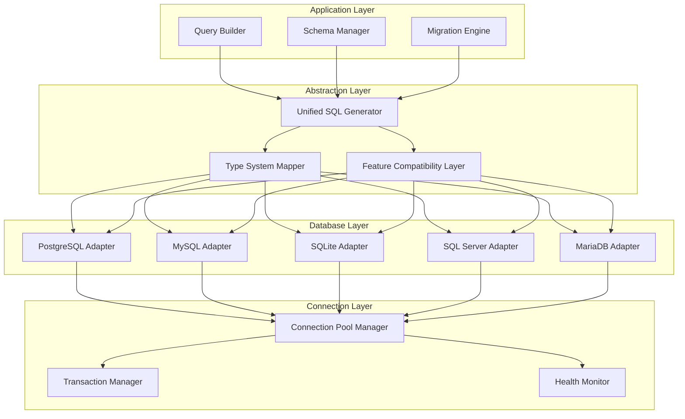

# Chapter 2: Database Abstraction Layer

> How NocoDB connects to and abstracts multiple database systems

## 🎯 Learning Objectives

By the end of this chapter, you'll understand:
- How NocoDB achieves database-agnostic operations
- The architecture of database connectors and adapters
- Query translation and optimization strategies
- Connection pooling and resource management
- Handling database-specific features and limitations

## 🏗️ Database Abstraction Architecture

NocoDB's database abstraction layer enables it to work with multiple database systems while providing a consistent interface.

### **The Abstraction Challenge**

Different databases have varying:
- **SQL Dialects**: Syntax differences in queries, functions, and data types
- **Feature Sets**: Available data types, constraints, and indexing options
- **Performance Characteristics**: Query optimization and execution plans
- **Connection Protocols**: Authentication methods and connection parameters

### **NocoDB's Solution: Multi-Layer Abstraction**



## 🔌 Database Adapter Pattern

Each database adapter implements a consistent interface while handling database-specific details.

### **Adapter Interface Definition**

```javascript
// Database adapter interface
class DatabaseAdapter {
  constructor(config) {
    this.config = config;
    this.connection = null;
    this.connectionPool = null;
  }

  // Connection management
  async connect() {
    throw new Error('connect() must be implemented by subclass');
  }

  async disconnect() {
    throw new Error('disconnect() must be implemented by subclass');
  }

  // Schema operations
  async getTables() {
    throw new Error('getTables() must be implemented by subclass');
  }

  async getColumns(tableName) {
    throw new Error('getColumns() must be implemented by subclass');
  }

  async createTable(tableDef) {
    throw new Error('createTable() must be implemented by subclass');
  }

  async alterTable(tableName, changes) {
    throw new Error('alterTable() must be implemented by subclass');
  }

  // Data operations
  async executeQuery(query, params) {
    throw new Error('executeQuery() must be implemented by subclass');
  }

  async insert(tableName, data) {
    throw new Error('insert() must be implemented by subclass');
  }

  async update(tableName, data, conditions) {
    throw new Error('update() must be implemented by subclass');
  }

  async delete(tableName, conditions) {
    throw new Error('delete() must be implemented by subclass');
  }

  // Transaction management
  async beginTransaction() {
    throw new Error('beginTransaction() must be implemented by subclass');
  }

  async commit() {
    throw new Error('commit() must be implemented by subclass');
  }

  async rollback() {
    throw new Error('rollback() must be implemented by subclass');
  }

  // Utility methods
  getConnectionString() {
    throw new Error('getConnectionString() must be implemented by subclass');
  }

  escapeIdentifier(identifier) {
    throw new Error('escapeIdentifier() must be implemented by subclass');
  }

  mapDataType(dataType) {
    throw new Error('mapDataType() must be implemented by subclass');
  }
}
```

### **PostgreSQL Adapter Implementation**

```javascript
// PostgreSQL adapter implementation
const { Pool } = require('pg');

class PostgreSQLAdapter extends DatabaseAdapter {
  constructor(config) {
    super(config);
    this.poolConfig = {
      host: config.host,
      port: config.port,
      database: config.database,
      user: config.username,
      password: config.password,
      max: config.maxConnections || 20,
      idleTimeoutMillis: 30000,
      connectionTimeoutMillis: 2000,
    };
  }

  async connect() {
    this.connectionPool = new Pool(this.poolConfig);

    // Test connection
    const client = await this.connectionPool.connect();
    await client.query('SELECT 1');
    client.release();

    return this;
  }

  async disconnect() {
    if (this.connectionPool) {
      await this.connectionPool.end();
    }
  }

  async getTables() {
    const query = `
      SELECT table_name
      FROM information_schema.tables
      WHERE table_schema = 'public'
      AND table_type = 'BASE TABLE'
      ORDER BY table_name
    `;

    const result = await this.executeQuery(query);
    return result.rows.map(row => row.table_name);
  }

  async getColumns(tableName) {
    const query = `
      SELECT
        column_name,
        data_type,
        is_nullable,
        column_default,
        character_maximum_length,
        numeric_precision,
        numeric_scale
      FROM information_schema.columns
      WHERE table_name = $1
      AND table_schema = 'public'
      ORDER BY ordinal_position
    `;

    const result = await this.executeQuery(query, [tableName]);
    return result.rows.map(row => ({
      name: row.column_name,
      type: this.mapDataType(row.data_type),
      nullable: row.is_nullable === 'YES',
      default: row.column_default,
      length: row.character_maximum_length,
      precision: row.numeric_precision,
      scale: row.numeric_scale
    }));
  }

  async createTable(tableDef) {
    const columns = tableDef.columns.map(col => {
      let colDef = `${this.escapeIdentifier(col.name)} ${this.mapDataTypeToSQL(col.type)}`;

      if (col.primaryKey) colDef += ' PRIMARY KEY';
      if (!col.nullable) colDef += ' NOT NULL';
      if (col.default) colDef += ` DEFAULT ${col.default}`;
      if (col.autoIncrement) colDef += ' GENERATED ALWAYS AS IDENTITY';

      return colDef;
    }).join(', ');

    const query = `CREATE TABLE ${this.escapeIdentifier(tableDef.name)} (${columns})`;

    await this.executeQuery(query);
  }

  async executeQuery(query, params = []) {
    const client = await this.connectionPool.connect();
    try {
      const result = await client.query(query, params);
      return result;
    } finally {
      client.release();
    }
  }

  mapDataType(sqlType) {
    const typeMap = {
      'integer': 'integer',
      'bigint': 'bigint',
      'smallint': 'smallint',
      'decimal': 'decimal',
      'numeric': 'decimal',
      'real': 'float',
      'double precision': 'double',
      'character varying': 'varchar',
      'character': 'char',
      'text': 'text',
      'boolean': 'boolean',
      'date': 'date',
      'time': 'time',
      'timestamp': 'timestamp',
      'json': 'json',
      'jsonb': 'json'
    };

    return typeMap[sqlType] || 'text';
  }

  mapDataTypeToSQL(internalType) {
    const typeMap = {
      'integer': 'INTEGER',
      'bigint': 'BIGINT',
      'smallint': 'SMALLINT',
      'decimal': 'DECIMAL',
      'float': 'REAL',
      'double': 'DOUBLE PRECISION',
      'varchar': 'VARCHAR',
      'char': 'CHAR',
      'text': 'TEXT',
      'boolean': 'BOOLEAN',
      'date': 'DATE',
      'time': 'TIME',
      'timestamp': 'TIMESTAMP',
      'json': 'JSONB'
    };

    return typeMap[internalType] || 'TEXT';
  }

  escapeIdentifier(identifier) {
    return `"${identifier.replace(/"/g, '""')}"`;
  }

  getConnectionString() {
    return `postgresql://${this.config.username}:${this.config.password}@${this.config.host}:${this.config.port}/${this.config.database}`;
  }
}
```

### **MySQL Adapter Implementation**

```javascript
// MySQL adapter implementation
const mysql = require('mysql2/promise');

class MySQLAdapter extends DatabaseAdapter {
  constructor(config) {
    super(config);
    this.poolConfig = {
      host: config.host,
      port: config.port,
      database: config.database,
      user: config.username,
      password: config.password,
      connectionLimit: config.maxConnections || 20,
      acquireTimeout: 60000,
      timeout: 60000,
    };
  }

  async connect() {
    this.connectionPool = mysql.createPool(this.poolConfig);

    // Test connection
    const connection = await this.connectionPool.getConnection();
    await connection.execute('SELECT 1');
    connection.release();

    return this;
  }

  async disconnect() {
    if (this.connectionPool) {
      await this.connectionPool.end();
    }
  }

  async getTables() {
    const query = `
      SELECT table_name
      FROM information_schema.tables
      WHERE table_schema = ?
      AND table_type = 'BASE TABLE'
      ORDER BY table_name
    `;

    const [rows] = await this.executeQuery(query, [this.config.database]);
    return rows.map(row => row.table_name);
  }

  async getColumns(tableName) {
    const query = `
      SELECT
        column_name,
        data_type,
        is_nullable,
        column_default,
        character_maximum_length,
        numeric_precision,
        numeric_scale
      FROM information_schema.columns
      WHERE table_name = ?
      AND table_schema = ?
      ORDER BY ordinal_position
    `;

    const [rows] = await this.executeQuery(query, [tableName, this.config.database]);
    return rows.map(row => ({
      name: row.column_name,
      type: this.mapDataType(row.data_type),
      nullable: row.is_nullable === 'YES',
      default: row.column_default,
      length: row.character_maximum_length,
      precision: row.numeric_precision,
      scale: row.numeric_scale
    }));
  }

  mapDataType(sqlType) {
    const typeMap = {
      'int': 'integer',
      'bigint': 'bigint',
      'smallint': 'smallint',
      'decimal': 'decimal',
      'float': 'float',
      'double': 'double',
      'varchar': 'varchar',
      'char': 'char',
      'text': 'text',
      'tinyint': 'boolean',
      'date': 'date',
      'time': 'time',
      'datetime': 'timestamp',
      'json': 'json'
    };

    return typeMap[sqlType] || 'text';
  }

  mapDataTypeToSQL(internalType) {
    const typeMap = {
      'integer': 'INT',
      'bigint': 'BIGINT',
      'smallint': 'SMALLINT',
      'decimal': 'DECIMAL',
      'float': 'FLOAT',
      'double': 'DOUBLE',
      'varchar': 'VARCHAR(255)',
      'char': 'CHAR',
      'text': 'TEXT',
      'boolean': 'TINYINT(1)',
      'date': 'DATE',
      'time': 'TIME',
      'timestamp': 'DATETIME',
      'json': 'JSON'
    };

    return typeMap[internalType] || 'TEXT';
  }

  async executeQuery(query, params = []) {
    const [rows, fields] = await this.connectionPool.execute(query, params);
    return { rows, fields };
  }

  escapeIdentifier(identifier) {
    return `\`${identifier.replace(/`/g, '``')}\``;
  }

  getConnectionString() {
    return `mysql://${this.config.username}:${this.config.password}@${this.config.host}:${this.config.port}/${this.config.database}`;
  }
}
```

## 🔄 Query Translation Layer

The query translation layer converts high-level operations into database-specific SQL.

### **Unified Query Builder**

```javascript
// Unified query builder
class QueryBuilder {
  constructor(adapter) {
    this.adapter = adapter;
    this.queryParts = {
      select: [],
      from: '',
      where: [],
      orderBy: [],
      limit: null,
      offset: null
    };
  }

  select(columns) {
    if (Array.isArray(columns)) {
      this.queryParts.select = columns;
    } else {
      this.queryParts.select = [columns];
    }
    return this;
  }

  from(tableName) {
    this.queryParts.from = tableName;
    return this;
  }

  where(conditions) {
    this.queryParts.where = this.parseConditions(conditions);
    return this;
  }

  orderBy(columns) {
    this.queryParts.orderBy = Array.isArray(columns) ? columns : [columns];
    return this;
  }

  limit(count) {
    this.queryParts.limit = count;
    return this;
  }

  offset(count) {
    this.queryParts.offset = count;
    return this;
  }

  build() {
    let query = 'SELECT ';

    // SELECT clause
    if (this.queryParts.select.length === 0) {
      query += '*';
    } else {
      query += this.queryParts.select
        .map(col => this.adapter.escapeIdentifier(col))
        .join(', ');
    }

    // FROM clause
    query += ` FROM ${this.adapter.escapeIdentifier(this.queryParts.from)}`;

    // WHERE clause
    if (this.queryParts.where.length > 0) {
      query += ' WHERE ' + this.queryParts.where.join(' AND ');
    }

    // ORDER BY clause
    if (this.queryParts.orderBy.length > 0) {
      query += ' ORDER BY ' + this.queryParts.orderBy
        .map(col => {
          if (typeof col === 'string') return this.adapter.escapeIdentifier(col);
          return `${this.adapter.escapeIdentifier(col.column)} ${col.direction || 'ASC'}`;
        })
        .join(', ');
    }

    // LIMIT and OFFSET
    if (this.adapter.constructor.name === 'PostgreSQLAdapter') {
      if (this.queryParts.limit) query += ` LIMIT ${this.queryParts.limit}`;
      if (this.queryParts.offset) query += ` OFFSET ${this.queryParts.offset}`;
    } else if (this.adapter.constructor.name === 'MySQLAdapter') {
      if (this.queryParts.limit) {
        query += ` LIMIT ${this.queryParts.limit}`;
        if (this.queryParts.offset) query += ` OFFSET ${this.queryParts.offset}`;
      }
    }

    return query;
  }

  parseConditions(conditions) {
    // Parse different condition formats into SQL
    const parsed = [];

    for (const condition of conditions) {
      if (typeof condition === 'string') {
        parsed.push(condition);
      } else if (typeof condition === 'object') {
        const { column, operator, value } = condition;
        const escapedColumn = this.adapter.escapeIdentifier(column);
        const placeholder = this.getPlaceholder();

        switch (operator.toLowerCase()) {
          case 'eq':
          case '=':
            parsed.push(`${escapedColumn} = ${placeholder}`);
            break;
          case 'neq':
          case '!=':
          case '<>':
            parsed.push(`${escapedColumn} != ${placeholder}`);
            break;
          case 'gt':
          case '>':
            parsed.push(`${escapedColumn} > ${placeholder}`);
            break;
          case 'gte':
          case '>=':
            parsed.push(`${escapedColumn} >= ${placeholder}`);
            break;
          case 'lt':
          case '<':
            parsed.push(`${escapedColumn} < ${placeholder}`);
            break;
          case 'lte':
          case '<=':
            parsed.push(`${escapedColumn} <= ${placeholder}`);
            break;
          case 'like':
            parsed.push(`${escapedColumn} LIKE ${placeholder}`);
            break;
          case 'in':
            const placeholders = value.map(() => this.getPlaceholder()).join(', ');
            parsed.push(`${escapedColumn} IN (${placeholders})`);
            break;
        }
      }
    }

    return parsed;
  }

  getPlaceholder() {
    // Return appropriate placeholder for the database
    if (this.adapter.constructor.name === 'PostgreSQLAdapter') {
      return '$' + (this.placeholderCount++ || 1);
    } else {
      return '?';
    }
  }
}
```

## 🔗 Schema Management

NocoDB provides dynamic schema management that works across different databases.

### **Unified Schema Representation**

```javascript
// Unified schema representation
class SchemaManager {
  constructor(adapter) {
    this.adapter = adapter;
    this.schemaCache = new Map();
  }

  async getTableSchema(tableName) {
    if (this.schemaCache.has(tableName)) {
      return this.schemaCache.get(tableName);
    }

    const columns = await this.adapter.getColumns(tableName);
    const primaryKey = await this.adapter.getPrimaryKey(tableName);
    const foreignKeys = await this.adapter.getForeignKeys(tableName);
    const indexes = await this.adapter.getIndexes(tableName);

    const schema = {
      name: tableName,
      columns: columns,
      primaryKey: primaryKey,
      foreignKeys: foreignKeys,
      indexes: indexes,
      metadata: {
        created: new Date().toISOString(),
        lastModified: new Date().toISOString()
      }
    };

    this.schemaCache.set(tableName, schema);
    return schema;
  }

  async createTable(schema) {
    // Validate schema
    this.validateSchema(schema);

    // Create table using adapter
    await this.adapter.createTable(schema);

    // Cache the new schema
    this.schemaCache.set(schema.name, {
      ...schema,
      metadata: {
        created: new Date().toISOString(),
        lastModified: new Date().toISOString()
      }
    });
  }

  async alterTable(tableName, changes) {
    // Get current schema
    const currentSchema = await this.getTableSchema(tableName);

    // Apply changes
    const newSchema = this.applyChanges(currentSchema, changes);

    // Validate new schema
    this.validateSchema(newSchema);

    // Execute changes
    await this.adapter.alterTable(tableName, changes);

    // Update cache
    this.schemaCache.set(tableName, {
      ...newSchema,
      metadata: {
        ...currentSchema.metadata,
        lastModified: new Date().toISOString()
      }
    });
  }

  validateSchema(schema) {
    // Validate table name
    if (!schema.name || typeof schema.name !== 'string') {
      throw new Error('Invalid table name');
    }

    // Validate columns
    if (!schema.columns || !Array.isArray(schema.columns)) {
      throw new Error('Columns must be an array');
    }

    // Check for primary key
    const hasPrimaryKey = schema.columns.some(col => col.primaryKey);
    if (!hasPrimaryKey && !schema.primaryKey) {
      throw new Error('Table must have a primary key');
    }

    // Validate each column
    for (const column of schema.columns) {
      this.validateColumn(column);
    }
  }

  validateColumn(column) {
    if (!column.name || typeof column.name !== 'string') {
      throw new Error('Column name is required');
    }

    if (!column.type || typeof column.type !== 'string') {
      throw new Error('Column type is required');
    }

    // Type-specific validations
    if (column.type === 'varchar' && !column.length) {
      throw new Error('VARCHAR columns must specify length');
    }

    if (column.type === 'decimal' && (!column.precision || !column.scale)) {
      throw new Error('DECIMAL columns must specify precision and scale');
    }
  }

  applyChanges(currentSchema, changes) {
    // Apply schema changes (add column, drop column, modify column, etc.)
    let newSchema = { ...currentSchema };

    for (const change of changes) {
      switch (change.type) {
        case 'addColumn':
          newSchema.columns.push(change.column);
          break;
        case 'dropColumn':
          newSchema.columns = newSchema.columns.filter(
            col => col.name !== change.columnName
          );
          break;
        case 'modifyColumn':
          const colIndex = newSchema.columns.findIndex(
            col => col.name === change.columnName
          );
          if (colIndex >= 0) {
            newSchema.columns[colIndex] = {
              ...newSchema.columns[colIndex],
              ...change.newDefinition
            };
          }
          break;
      }
    }

    return newSchema;
  }
}
```

## 🔄 Connection Pooling and Management

### **Connection Pool Manager**

```javascript
// Connection pool manager
class ConnectionPoolManager {
  constructor() {
    this.pools = new Map();
    this.healthChecks = new Map();
  }

  async getPool(databaseConfig) {
    const poolKey = this.getPoolKey(databaseConfig);

    if (!this.pools.has(poolKey)) {
      const pool = await this.createPool(databaseConfig);
      this.pools.set(poolKey, pool);

      // Start health monitoring
      this.startHealthCheck(poolKey, pool);
    }

    return this.pools.get(poolKey);
  }

  getPoolKey(config) {
    // Create unique key for connection pool
    return `${config.type}://${config.host}:${config.port}/${config.database}`;
  }

  async createPool(config) {
    // Create database-specific connection pool
    const adapter = this.createAdapter(config);
    await adapter.connect();

    return {
      adapter: adapter,
      config: config,
      created: new Date(),
      lastUsed: new Date(),
      activeConnections: 0,
      maxConnections: config.maxConnections || 20
    };
  }

  createAdapter(config) {
    switch (config.type) {
      case 'postgres':
      case 'postgresql':
        return new PostgreSQLAdapter(config);
      case 'mysql':
      case 'mariadb':
        return new MySQLAdapter(config);
      case 'sqlite':
        return new SQLiteAdapter(config);
      default:
        throw new Error(`Unsupported database type: ${config.type}`);
    }
  }

  async startHealthCheck(poolKey, pool) {
    const healthCheck = setInterval(async () => {
      try {
        await this.performHealthCheck(pool);
      } catch (error) {
        console.error(`Health check failed for pool ${poolKey}:`, error);
        // Remove unhealthy pool
        this.pools.delete(poolKey);
        clearInterval(healthCheck);
      }
    }, 30000); // Check every 30 seconds

    this.healthChecks.set(poolKey, healthCheck);
  }

  async performHealthCheck(pool) {
    // Simple health check query
    await pool.adapter.executeQuery('SELECT 1');
    pool.lastHealthCheck = new Date();
  }

  async closePool(poolKey) {
    const pool = this.pools.get(poolKey);
    if (pool) {
      await pool.adapter.disconnect();

      // Stop health check
      const healthCheck = this.healthChecks.get(poolKey);
      if (healthCheck) {
        clearInterval(healthCheck);
        this.healthChecks.delete(poolKey);
      }

      this.pools.delete(poolKey);
    }
  }

  async closeAllPools() {
    const poolKeys = Array.from(this.pools.keys());
    await Promise.all(poolKeys.map(key => this.closePool(key)));
  }

  getPoolStats() {
    const stats = {};

    for (const [poolKey, pool] of this.pools) {
      stats[poolKey] = {
        activeConnections: pool.activeConnections,
        maxConnections: pool.maxConnections,
        created: pool.created,
        lastUsed: pool.lastUsed,
        uptime: Date.now() - pool.created.getTime()
      };
    }

    return stats;
  }
}
```

## 🎯 Key Takeaways

1. **Adapter Pattern**: Clean abstraction over different database systems
2. **Unified Query Builder**: Database-agnostic query construction and execution
3. **Schema Management**: Dynamic table and column management across databases
4. **Connection Pooling**: Efficient resource management and health monitoring
5. **Type Mapping**: Consistent data type handling across different SQL dialects

## 🧪 Hands-On Exercise

**Estimated Time: 45 minutes**

1. **Set Up Multiple Databases**: Create connections to PostgreSQL and MySQL databases
2. **Compare Schema Introspection**: Examine how NocoDB reads table structures from different databases
3. **Test Query Translation**: Create the same logical query and see how it's translated for different databases
4. **Experiment with Connection Pools**: Monitor connection usage and implement connection limits

---

**Ready to manage schemas?** Continue to [Chapter 3: Schema Management](03-schema-management.md)