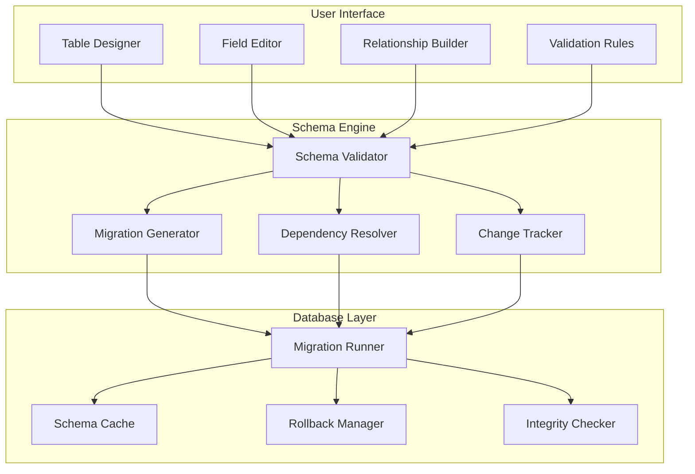

# Chapter 3: Schema Management

> Dynamic table and field handling in NocoDB's no-code interface

## 🎯 Learning Objectives

By the end of this chapter, you'll understand:
- How NocoDB manages database schemas through a visual interface
- Dynamic field creation and modification workflows
- Relationship management between tables
- Schema versioning and migration strategies
- Data integrity and validation in dynamic schemas

## 📋 Schema Management Architecture

NocoDB provides a visual interface for managing database schemas while maintaining data integrity and performance.

### **Schema Management Components**



## 🎨 Visual Table Designer

### **Table Creation Workflow**

```javascript
// Table creation and management
class TableDesigner {
  constructor(schemaManager, uiRenderer) {
    this.schemaManager = schemaManager;
    this.uiRenderer = uiRenderer;
    this.currentTable = null;
  }

  async createTable(tableConfig) {
    // Validate table configuration
    this.validateTableConfig(tableConfig);

    // Create initial schema
    const schema = {
      name: tableConfig.name,
      columns: this.generateInitialColumns(tableConfig),
      primaryKey: tableConfig.primaryKey || 'id',
      indexes: [],
      constraints: []
    };

    // Apply schema to database
    await this.schemaManager.createTable(schema);

    // Update UI
    this.uiRenderer.renderTable(schema);

    return schema;
  }

  async modifyTable(tableName, changes) {
    // Get current schema
    const currentSchema = await this.schemaManager.getTableSchema(tableName);

    // Analyze changes for safety
    const analysis = await this.analyzeChanges(currentSchema, changes);

    if (analysis.riskLevel === 'high') {
      // Require confirmation for risky changes
      const confirmed = await this.uiRenderer.confirmRiskyChanges(analysis);
      if (!confirmed) return;
    }

    // Apply changes
    await this.schemaManager.alterTable(tableName, changes);

    // Update UI
    const newSchema = await this.schemaManager.getTableSchema(tableName);
    this.uiRenderer.updateTableView(newSchema);
  }

  validateTableConfig(config) {
    if (!config.name || config.name.trim() === '') {
      throw new Error('Table name is required');
    }

    if (!/^[a-zA-Z_][a-zA-Z0-9_]*$/.test(config.name)) {
      throw new Error('Table name must be a valid identifier');
    }

    // Check for reserved words
    const reservedWords = ['select', 'from', 'where', 'table', 'column'];
    if (reservedWords.includes(config.name.toLowerCase())) {
      throw new Error('Table name cannot be a reserved word');
    }
  }

  generateInitialColumns(tableConfig) {
    const columns = [
      {
        name: 'id',
        type: 'integer',
        primaryKey: true,
        autoIncrement: true,
        nullable: false
      },
      {
        name: 'created_at',
        type: 'timestamp',
        nullable: false,
        default: 'CURRENT_TIMESTAMP'
      },
      {
        name: 'updated_at',
        type: 'timestamp',
        nullable: false,
        default: 'CURRENT_TIMESTAMP'
      }
    ];

    // Add user-defined columns
    if (tableConfig.initialColumns) {
      columns.push(...tableConfig.initialColumns);
    }

    return columns;
  }

  async analyzeChanges(currentSchema, changes) {
    const analysis = {
      riskLevel: 'low',
      warnings: [],
      breakingChanges: [],
      dataLoss: false
    };

    for (const change of changes) {
      switch (change.type) {
        case 'dropColumn':
          analysis.dataLoss = true;
          analysis.riskLevel = 'high';
          analysis.breakingChanges.push(`Dropping column ${change.columnName}`);
          break;

        case 'modifyColumn':
          if (change.newDefinition.type !== change.oldDefinition.type) {
            analysis.riskLevel = 'medium';
            analysis.warnings.push(`Type change for column ${change.columnName}`);
          }
          break;

        case 'dropTable':
          analysis.dataLoss = true;
          analysis.riskLevel = 'high';
          analysis.breakingChanges.push('Dropping entire table');
          break;
      }
    }

    return analysis;
  }
}
```

## 🔧 Dynamic Field Management

### **Field Type System**

NocoDB supports various field types that map to database columns:

```javascript
// Field type definitions
const FIELD_TYPES = {
  // Text fields
  'singleLineText': {
    databaseType: 'varchar',
    maxLength: 255,
    uiComponent: 'text-input',
    validators: ['maxLength']
  },
  'longText': {
    databaseType: 'text',
    uiComponent: 'textarea',
    validators: []
  },
  'richText': {
    databaseType: 'text',
    uiComponent: 'rich-text-editor',
    validators: []
  },

  // Number fields
  'number': {
    databaseType: 'decimal',
    precision: 10,
    scale: 2,
    uiComponent: 'number-input',
    validators: ['numeric']
  },
  'integer': {
    databaseType: 'integer',
    uiComponent: 'number-input',
    validators: ['integer']
  },

  // Date/Time fields
  'date': {
    databaseType: 'date',
    uiComponent: 'date-picker',
    validators: ['date']
  },
  'dateTime': {
    databaseType: 'timestamp',
    uiComponent: 'datetime-picker',
    validators: ['datetime']
  },

  // Selection fields
  'singleSelect': {
    databaseType: 'varchar',
    maxLength: 255,
    uiComponent: 'select-dropdown',
    validators: ['inList'],
    config: {
      options: []
    }
  },
  'multiSelect': {
    databaseType: 'json',
    uiComponent: 'multi-select',
    validators: ['array'],
    config: {
      options: []
    }
  },

  // Relationship fields
  'linkToAnotherRecord': {
    databaseType: 'integer', // Foreign key
    uiComponent: 'record-linker',
    validators: ['foreignKey'],
    config: {
      linkedTable: null,
      linkType: 'many-to-one' // or 'one-to-one'
    }
  },

  // Special fields
  'formula': {
    databaseType: 'text', // Stored computed result
    uiComponent: 'formula-display',
    validators: [],
    config: {
      formula: '',
      returnType: 'text'
    }
  },
  'lookup': {
    databaseType: null, // Virtual field, no database column
    uiComponent: 'lookup-display',
    validators: [],
    config: {
      sourceField: null,
      sourceTable: null,
      throughRelationship: null
    }
  }
};
```

### **Field Creation and Modification**

```javascript
// Field management system
class FieldManager {
  constructor(tableDesigner, schemaManager) {
    this.tableDesigner = tableDesigner;
    this.schemaManager = schemaManager;
  }

  async addField(tableName, fieldConfig) {
    // Validate field configuration
    this.validateFieldConfig(fieldConfig);

    // Get field type definition
    const fieldType = FIELD_TYPES[fieldConfig.type];
    if (!fieldType) {
      throw new Error(`Unknown field type: ${fieldConfig.type}`);
    }

    // Create database column
    const columnDef = this.createColumnDefinition(fieldConfig, fieldType);

    // Add column to table
    await this.schemaManager.addColumn(tableName, columnDef);

    // Create field metadata
    const fieldMetadata = {
      id: generateId(),
      name: fieldConfig.name,
      type: fieldConfig.type,
      config: fieldConfig.config || {},
      ui: fieldType.uiComponent,
      validators: fieldType.validators,
      created: new Date().toISOString()
    };

    // Store field metadata
    await this.saveFieldMetadata(tableName, fieldMetadata);

    // Update UI
    this.tableDesigner.uiRenderer.addFieldToView(fieldMetadata);

    return fieldMetadata;
  }

  async modifyField(tableName, fieldName, changes) {
    // Get current field metadata
    const currentField = await this.getFieldMetadata(tableName, fieldName);

    // Analyze changes
    const analysis = this.analyzeFieldChanges(currentField, changes);

    if (analysis.requiresMigration) {
      // Perform database migration
      await this.migrateField(tableName, fieldName, changes);
    }

    // Update field metadata
    const updatedField = { ...currentField, ...changes };
    await this.saveFieldMetadata(tableName, updatedField);

    // Update UI
    this.tableDesigner.uiRenderer.updateFieldInView(updatedField);
  }

  async deleteField(tableName, fieldName) {
    // Check for dependencies
    const dependencies = await this.checkFieldDependencies(tableName, fieldName);

    if (dependencies.length > 0) {
      throw new Error(`Cannot delete field: used in ${dependencies.join(', ')}`);
    }

    // Remove from database
    await this.schemaManager.dropColumn(tableName, fieldName);

    // Remove metadata
    await this.deleteFieldMetadata(tableName, fieldName);

    // Update UI
    this.tableDesigner.uiRenderer.removeFieldFromView(fieldName);
  }

  validateFieldConfig(config) {
    if (!config.name || config.name.trim() === '') {
      throw new Error('Field name is required');
    }

    if (!/^[a-zA-Z_][a-zA-Z0-9_]*$/.test(config.name)) {
      throw new Error('Field name must be a valid identifier');
    }

    if (!config.type || !FIELD_TYPES[config.type]) {
      throw new Error(`Invalid field type: ${config.type}`);
    }

    // Type-specific validation
    const fieldType = FIELD_TYPES[config.type];
    if (fieldType.config && fieldType.config.required) {
      for (const required of fieldType.config.required) {
        if (!config.config || !config.config[required]) {
          throw new Error(`Field ${config.name} requires ${required}`);
        }
      }
    }
  }

  createColumnDefinition(fieldConfig, fieldType) {
    const columnDef = {
      name: fieldConfig.name,
      type: fieldType.databaseType,
      nullable: fieldConfig.required !== true,
      default: fieldConfig.default
    };

    // Add type-specific properties
    if (fieldType.maxLength) {
      columnDef.length = fieldType.maxLength;
    }

    if (fieldType.precision) {
      columnDef.precision = fieldType.precision;
      columnDef.scale = fieldType.scale;
    }

    return columnDef;
  }

  analyzeFieldChanges(currentField, changes) {
    const analysis = {
      requiresMigration: false,
      dataLoss: false,
      warnings: []
    };

    // Check if type is changing
    if (changes.type && changes.type !== currentField.type) {
      analysis.requiresMigration = true;

      const oldType = FIELD_TYPES[currentField.type];
      const newType = FIELD_TYPES[changes.type];

      if (oldType.databaseType !== newType.databaseType) {
        analysis.warnings.push('Data type conversion may lose precision');
      }
    }

    // Check if field is becoming required
    if (changes.required === true && !currentField.required) {
      analysis.requiresMigration = true;

      // Check if there are null values
      const hasNulls = await this.checkForNullValues(currentField.table, currentField.name);
      if (hasNulls) {
        analysis.dataLoss = true;
        analysis.warnings.push('Making field required will fail if null values exist');
      }
    }

    return analysis;
  }

  async checkFieldDependencies(tableName, fieldName) {
    // Check for views, formulas, or other fields that depend on this field
    const dependencies = [];

    // Check views
    const views = await this.getViewsUsingField(tableName, fieldName);
    dependencies.push(...views.map(v => `view ${v.name}`));

    // Check formulas
    const formulas = await this.getFormulasUsingField(tableName, fieldName);
    dependencies.push(...formulas.map(f => `formula in ${f.name}`));

    return dependencies;
  }
}
```

## 🔗 Relationship Management

### **Foreign Key Relationships**

```javascript
// Relationship management
class RelationshipManager {
  constructor(schemaManager, fieldManager) {
    this.schemaManager = schemaManager;
    this.fieldManager = fieldManager;
  }

  async createRelationship(relationshipConfig) {
    const {
      fromTable,
      toTable,
      fromField,
      toField,
      relationshipType, // 'one-to-one', 'one-to-many', 'many-to-many'
      onDelete, // 'cascade', 'set_null', 'restrict'
      onUpdate   // 'cascade', 'set_null', 'restrict'
    } = relationshipConfig;

    // Validate relationship
    await this.validateRelationship(relationshipConfig);

    // Create foreign key constraint
    await this.createForeignKeyConstraint(relationshipConfig);

    // Create relationship metadata
    const relationship = {
      id: generateId(),
      fromTable,
      toTable,
      fromField,
      toField,
      type: relationshipType,
      constraints: {
        onDelete: onDelete || 'restrict',
        onUpdate: onUpdate || 'restrict'
      },
      created: new Date().toISOString()
    };

    // Store relationship metadata
    await this.saveRelationshipMetadata(relationship);

    // Create corresponding field if it doesn't exist
    await this.createRelationshipField(relationship);

    return relationship;
  }

  async validateRelationship(config) {
    // Check if tables exist
    const fromTableExists = await this.schemaManager.tableExists(config.fromTable);
    const toTableExists = await this.schemaManager.tableExists(config.toTable);

    if (!fromTableExists || !toTableExists) {
      throw new Error('Both tables must exist');
    }

    // Check if fields exist and are compatible
    const fromFieldType = await this.getFieldType(config.fromTable, config.fromField);
    const toFieldType = await this.getFieldType(config.toTable, config.toField);

    if (fromFieldType !== toFieldType) {
      throw new Error('Related fields must have compatible types');
    }

    // Check for circular references
    const hasCircularRef = await this.checkCircularReference(config);
    if (hasCircularRef) {
      throw new Error('Circular references are not allowed');
    }
  }

  async createForeignKeyConstraint(config) {
    const constraintName = `fk_${config.fromTable}_${config.fromField}`;

    let constraintSQL = `
      ALTER TABLE ${config.fromTable}
      ADD CONSTRAINT ${constraintName}
      FOREIGN KEY (${config.fromField})
      REFERENCES ${config.toTable}(${config.toField})
    `;

    if (config.onDelete) {
      constraintSQL += ` ON DELETE ${config.onDelete.toUpperCase()}`;
    }

    if (config.onUpdate) {
      constraintSQL += ` ON UPDATE ${config.onUpdate.toUpperCase()}`;
    }

    await this.schemaManager.executeSQL(constraintSQL);
  }

  async createRelationshipField(relationship) {
    // Create a link field in the 'from' table
    const fieldConfig = {
      name: `${relationship.toTable}_link`,
      type: 'linkToAnotherRecord',
      config: {
        linkedTable: relationship.toTable,
        linkType: relationship.type,
        relationshipId: relationship.id
      }
    };

    await this.fieldManager.addField(relationship.fromTable, fieldConfig);
  }

  async checkCircularReference(config) {
    // Use graph traversal to detect cycles
    const visited = new Set();
    const recursionStack = new Set();

    const hasCycle = await this.dfsCheck(
      config.fromTable,
      visited,
      recursionStack,
      config.toTable
    );

    return hasCycle;
  }

  async dfsCheck(table, visited, recursionStack, targetTable) {
    visited.add(table);
    recursionStack.add(table);

    // Get all relationships from this table
    const relationships = await this.getRelationshipsFromTable(table);

    for (const rel of relationships) {
      if (rel.toTable === targetTable && recursionStack.has(targetTable)) {
        return true; // Found cycle
      }

      if (!visited.has(rel.toTable)) {
        if (await this.dfsCheck(rel.toTable, visited, recursionStack, targetTable)) {
          return true;
        }
      }
    }

    recursionStack.delete(table);
    return false;
  }
}
```

## 🔄 Schema Versioning and Migrations

### **Migration System**

```javascript
// Schema migration system
class MigrationManager {
  constructor(schemaManager, db) {
    this.schemaManager = schemaManager;
    this.db = db;
    this.migrations = [];
  }

  async createMigration(changes, description) {
    const migration = {
      id: generateMigrationId(),
      description,
      changes,
      created: new Date().toISOString(),
      status: 'pending'
    };

    // Validate migration
    await this.validateMigration(migration);

    // Store migration metadata
    await this.saveMigration(migration);

    this.migrations.push(migration);
    return migration;
  }

  async applyMigration(migrationId) {
    const migration = this.migrations.find(m => m.id === migrationId);

    if (!migration) {
      throw new Error(`Migration ${migrationId} not found`);
    }

    if (migration.status !== 'pending') {
      throw new Error(`Migration ${migrationId} already applied`);
    }

    // Start transaction
    const transaction = await this.db.beginTransaction();

    try {
      // Apply each change
      for (const change of migration.changes) {
        await this.applyChange(change, transaction);
      }

      // Mark migration as applied
      migration.status = 'applied';
      migration.appliedAt = new Date().toISOString();
      await this.updateMigrationStatus(migration, transaction);

      // Commit transaction
      await transaction.commit();

    } catch (error) {
      // Rollback transaction
      await transaction.rollback();

      // Mark migration as failed
      migration.status = 'failed';
      migration.error = error.message;
      await this.updateMigrationStatus(migration);

      throw error;
    }
  }

  async rollbackMigration(migrationId) {
    const migration = this.migrations.find(m => m.id === migrationId);

    if (!migration || migration.status !== 'applied') {
      throw new Error(`Cannot rollback migration ${migrationId}`);
    }

    // Generate rollback changes
    const rollbackChanges = this.generateRollbackChanges(migration.changes);

    // Apply rollback
    const transaction = await this.db.beginTransaction();

    try {
      for (const change of rollbackChanges) {
        await this.applyChange(change, transaction);
      }

      migration.status = 'rolled_back';
      migration.rolledBackAt = new Date().toISOString();
      await this.updateMigrationStatus(migration, transaction);

      await transaction.commit();

    } catch (error) {
      await transaction.rollback();
      throw error;
    }
  }

  async applyChange(change, transaction) {
    switch (change.type) {
      case 'createTable':
        await this.schemaManager.createTable(change.schema, transaction);
        break;
      case 'dropTable':
        await this.schemaManager.dropTable(change.tableName, transaction);
        break;
      case 'addColumn':
        await this.schemaManager.addColumn(change.tableName, change.column, transaction);
        break;
      case 'dropColumn':
        await this.schemaManager.dropColumn(change.tableName, change.columnName, transaction);
        break;
      case 'modifyColumn':
        await this.schemaManager.modifyColumn(change.tableName, change.columnName, change.newDefinition, transaction);
        break;
    }
  }

  generateRollbackChanges(changes) {
    const rollbacks = [];

    // Reverse the changes
    for (const change of changes.reverse()) {
      switch (change.type) {
        case 'createTable':
          rollbacks.push({
            type: 'dropTable',
            tableName: change.schema.name
          });
          break;
        case 'dropTable':
          // Cannot rollback table drop without schema
          throw new Error('Cannot rollback table drop');
        case 'addColumn':
          rollbacks.push({
            type: 'dropColumn',
            tableName: change.tableName,
            columnName: change.column.name
          });
          break;
        case 'dropColumn':
          throw new Error('Cannot rollback column drop');
        case 'modifyColumn':
          rollbacks.push({
            type: 'modifyColumn',
            tableName: change.tableName,
            columnName: change.columnName,
            newDefinition: change.oldDefinition
          });
          break;
      }
    }

    return rollbacks;
  }

  async validateMigration(migration) {
    // Check for conflicting changes
    for (const change of migration.changes) {
      await this.validateChange(change);
    }

    // Check for circular dependencies
    const dependencies = this.analyzeDependencies(migration.changes);
    if (this.hasCircularDependencies(dependencies)) {
      throw new Error('Migration contains circular dependencies');
    }
  }

  async validateChange(change) {
    switch (change.type) {
      case 'createTable':
        const tableExists = await this.schemaManager.tableExists(change.schema.name);
        if (tableExists) {
          throw new Error(`Table ${change.schema.name} already exists`);
        }
        break;
      case 'addColumn':
        const columnExists = await this.schemaManager.columnExists(change.tableName, change.column.name);
        if (columnExists) {
          throw new Error(`Column ${change.column.name} already exists in table ${change.tableName}`);
        }
        break;
    }
  }
}
```

## 🧪 Hands-On Exercise

**Estimated Time: 60 minutes**

1. **Create a New Table**: Use NocoDB's visual interface to create a table with various field types
2. **Modify Schema**: Add, modify, and remove fields, observing how changes are handled
3. **Set Up Relationships**: Create relationships between tables and explore the different relationship types
4. **Test Migrations**: Make schema changes and observe how they're tracked and can be rolled back

---

**Ready to generate APIs?** Continue to [Chapter 4: API Generation Engine](04-api-generation.md)