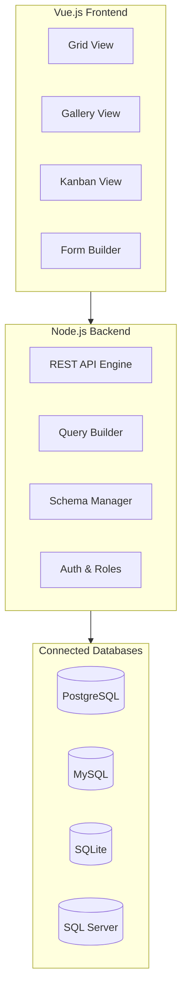

# NocoDB: Deep Dive Tutorial

> **Project**: [NocoDB](https://github.com/nocodb/nocodb) — An open-source Airtable alternative that turns any database into a smart spreadsheet.

## Why This Track Matters

NocoDB lets teams build collaborative no-code applications on top of their existing databases without rewriting their data layer — turning any SQL database into an Airtable-like interface with auto-generated APIs.

This track focuses on:
- connecting NocoDB to MySQL, PostgreSQL, SQLite, and SQL Server
- understanding automatic REST API generation from database schemas
- implementing RBAC, authentication, and audit logging
- deploying NocoDB with Docker for full self-hosted data ownership

## What Is NocoDB?

NocoDB transforms any SQL database (MySQL, PostgreSQL, SQL Server, SQLite) into a spreadsheet-like interface with auto-generated REST APIs. It provides a no-code layer over existing databases, enabling teams to build applications without rewriting their data layer.

| Feature | Description |
|---------|-------------|
| **Database Abstraction** | Connect to MySQL, PostgreSQL, SQL Server, SQLite |
| **Spreadsheet UI** | Grid, gallery, kanban, and form views |
| **Auto REST API** | Automatic API generation from database schema |
| **Collaboration** | Real-time multi-user editing with roles and permissions |
| **Plugin System** | Extensible with custom field types and integrations |
| **Self-Hosted** | Full Docker deployment, data stays on your infrastructure |

## Mental Model

## Chapter Guide

| Chapter | Topic | What You'll Learn |
|---------|-------|-------------------|
| [1. System Overview](01-system-overview.md) | Architecture | NocoDB's approach to database abstraction |
| [2. Database Abstraction](02-database-abstraction.md) | Connectors | Multi-database support and schema mapping |
| [3. Schema Management](03-schema-management.md) | Data Model | Dynamic table/field handling and migrations |
| [4. API Generation](04-api-generation.md) | APIs | Automatic REST endpoint creation |
| [5. Query Builder](05-query-builder.md) | Querying | Translating UI/API filters into SQL safely |
| [6. Auth System](06-auth-system.md) | Security | Authentication, RBAC, and auditability |
| [7. Vue Components](07-vue-components.md) | Frontend | Grid/editor component architecture |
| [8. Realtime Features](08-realtime-features.md) | Collaboration | Event streams, optimistic updates, and conflict handling |

## Tech Stack

| Component | Technology |
|-----------|-----------|
| **Backend** | Node.js, Express, Knex.js |
| **Frontend** | Vue.js, Nuxt |
| **Databases** | PostgreSQL, MySQL, SQLite, SQL Server |
| **Auth** | JWT, role-based access control |
| **Deployment** | Docker, npm |

---

Ready to begin? Start with [Chapter 1: System Overview](01-system-overview.md).

---

*Built with insights from the [NocoDB repository](https://github.com/nocodb/nocodb) and community documentation.*

## Navigation & Backlinks

- [Start Here: Chapter 1: NocoDB System Overview](01-system-overview.md)
- [Back to Main Catalog](../../README.md#-tutorial-catalog)
- [Browse A-Z Tutorial Directory](../../discoverability/tutorial-directory.md)
- [Search by Intent](../../discoverability/query-hub.md)
- [Explore Category Hubs](../../README.md#category-hubs)

## Full Chapter Map

1. [Chapter 1: NocoDB System Overview](01-system-overview.md)
2. [Chapter 2: Database Abstraction Layer](02-database-abstraction.md)
3. [Chapter 3: Schema Management](03-schema-management.md)
4. [Chapter 4: API Generation Engine](04-api-generation.md)
5. [Chapter 5: Query Builder](05-query-builder.md)
6. [Chapter 6: Auth System](06-auth-system.md)
7. [Chapter 7: Vue Components](07-vue-components.md)
8. [Chapter 8: Realtime Features](08-realtime-features.md)

## Current Snapshot (auto-updated)

- repository: [nocodb/nocodb](https://github.com/nocodb/nocodb)
- stars: about **48K**
- project positioning: open-source Airtable alternative built on top of existing SQL databases

## What You Will Learn

- how NocoDB abstracts multiple SQL databases behind a unified spreadsheet-like interface
- how automatic REST API generation works from existing database schemas
- how the query builder safely translates UI filters into parameterized SQL
- how to implement RBAC, configure authentication, and deploy NocoDB with Docker

## Source References

- [NocoDB](https://github.com/nocodb/nocodb)

*Generated by [AI Codebase Knowledge Builder](https://github.com/The-Pocket/Tutorial-Codebase-Knowledge)*
