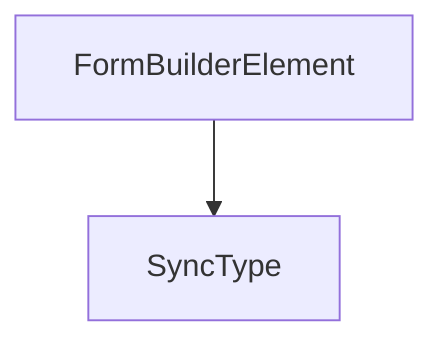

# Chapter 5: Query Builder

Welcome to **Chapter 5: Query Builder**. In this part of **NocoDB: Deep Dive Tutorial**, you will build an intuitive mental model first, then move into concrete implementation details and practical production tradeoffs.


NocoDB's query builder is the translation layer between spreadsheet-style UI operations and SQL execution.

## Core Responsibilities

- convert filter groups into SQL predicates
- map sort and pagination controls to stable query clauses
- resolve relation-aware joins from UI context
- validate column/operator/type compatibility before execution

## Translation Pipeline

1. parse UI query state into intermediate expression tree
2. normalize operators by data type
3. generate parameterized SQL with bound values
4. execute with workspace/table-level access checks

## Safety and Correctness Rules

| Rule | Why It Matters |
|:-----|:---------------|
| parameterized queries only | prevents injection attacks |
| operator allowlists by type | avoids invalid or unsafe expressions |
| bounded pagination defaults | protects database from unbounded scans |
| deterministic sort fallback | stable results across pages |

## Performance Considerations

- index-aware predicate ordering
- selective projection to avoid overfetching
- optional query plan inspection for expensive views

## Summary

You can now reason about how NocoDB maps end-user filters into safe, efficient SQL.

Next: [Chapter 6: Auth System](06-auth-system.md)

## What Problem Does This Solve?

Most teams struggle here because the hard part is not writing more code, but deciding clear boundaries for core abstractions in this chapter so behavior stays predictable as complexity grows.

In practical terms, this chapter helps you avoid three common failures:

- coupling core logic too tightly to one implementation path
- missing the handoff boundaries between setup, execution, and validation
- shipping changes without clear rollback or observability strategy

After working through this chapter, you should be able to reason about `Chapter 5: Query Builder` as an operating subsystem inside **NocoDB: Deep Dive Tutorial**, with explicit contracts for inputs, state transitions, and outputs.

Use the implementation notes around execution and reliability details as your checklist when adapting these patterns to your own repository.

## How it Works Under the Hood

Under the hood, `Chapter 5: Query Builder` usually follows a repeatable control path:

1. **Context bootstrap**: initialize runtime config and prerequisites for `core component`.
2. **Input normalization**: shape incoming data so `execution layer` receives stable contracts.
3. **Core execution**: run the main logic branch and propagate intermediate state through `state model`.
4. **Policy and safety checks**: enforce limits, auth scopes, and failure boundaries.
5. **Output composition**: return canonical result payloads for downstream consumers.
6. **Operational telemetry**: emit logs/metrics needed for debugging and performance tuning.

When debugging, walk this sequence in order and confirm each stage has explicit success/failure conditions.

## Source Walkthrough

Use the following upstream sources to verify implementation details while reading this chapter:

- [NocoDB](https://github.com/nocodb/nocodb)
  Why it matters: authoritative reference on `NocoDB` (github.com).

Suggested trace strategy:
- search upstream code for `Query` and `Builder` to map concrete implementation paths
- compare docs claims against actual runtime/config code before reusing patterns in production

## Chapter Connections

- [Tutorial Index](README.md)
- [Previous Chapter: Chapter 4: API Generation Engine](04-api-generation.md)
- [Next Chapter: Chapter 6: Auth System](06-auth-system.md)
- [Main Catalog](../../README.md#-tutorial-catalog)
- [A-Z Tutorial Directory](../../discoverability/tutorial-directory.md)

## Depth Expansion Playbook

## Source Code Walkthrough

### `packages/noco-integrations/nocodb-sdk-reference.ts`

The `FormBuilderElement` interface in [`packages/noco-integrations/nocodb-sdk-reference.ts`](https://github.com/nocodb/nocodb/blob/HEAD/packages/noco-integrations/nocodb-sdk-reference.ts) handles a key part of this chapter's functionality:

```ts
}

export interface FormBuilderElement {
  // element type
  type: FormBuilderInputType;
  // property path in the form JSON
  model?: string;
  // default value
  defaultValue?: string[] | string | boolean | number | null;
  // label for the element
  label?: string;
  // placeholder for the element (if applicable)
  placeholder?: string;
  // percentage width of the element
  width?: number;
  // category of the element - same category elements are grouped together
  category?: string;
  // help text for the element
  // options for select element
  options?: { value: string; label: string }[];
  // select mode for the element (if applicable) - default is single
  selectMode?: 'single' | 'multiple' | 'multipleWithInput';
  // integration type filter for integration element
  integrationFilter?: {
    type?: string;
    sub_type?: string;
  };
  // oauth meta
  oauthMeta?: {
    // oauth provider
    provider: string;
    // oauth auth uri
```

This interface is important because it defines how NocoDB: Deep Dive Tutorial implements the patterns covered in this chapter.

### `packages/noco-integrations/nocodb-sdk-reference.ts`

The `SyncType` interface in [`packages/noco-integrations/nocodb-sdk-reference.ts`](https://github.com/nocodb/nocodb/blob/HEAD/packages/noco-integrations/nocodb-sdk-reference.ts) handles a key part of this chapter's functionality:

```ts
export enum SyncType {
  Full = 'full',
  Incremental = 'incremental',
}

export enum SyncTrigger {
  Manual = 'manual',
  Schedule = 'schedule',
  Webhook = 'webhook',
}

export enum OnDeleteAction {
  Delete = 'delete',
  MarkDeleted = 'mark_deleted',
}

export enum SyncCategory {
  TICKETING = 'ticketing',
  CRM = 'crm',
  FILE_STORAGE = 'file_storage',
  CUSTOM = 'custom',
}

export const SyncTriggerMeta = {
  [SyncTrigger.Manual]: {
    value: SyncTrigger.Manual,
    label: 'Manual',
    description: 'Sync data manually',
  },
  [SyncTrigger.Schedule]: {
```

This interface is important because it defines how NocoDB: Deep Dive Tutorial implements the patterns covered in this chapter.


## How These Components Connect


