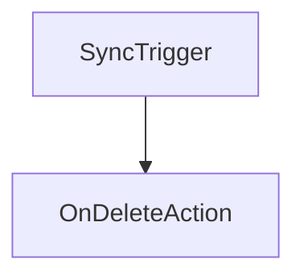

# Chapter 6: Auth System

Welcome to **Chapter 6: Auth System**. In this part of **NocoDB: Deep Dive Tutorial**, you will build an intuitive mental model first, then move into concrete implementation details and practical production tradeoffs.


Authentication and authorization enforce tenant boundaries and protect data operations.

## Auth Layer Capabilities

- identity/session or token lifecycle management
- role- and workspace-scoped permission checks
- API-level access enforcement for tables/views/actions
- audit event generation for privileged changes

## Authorization Model

A robust NocoDB deployment typically applies checks at multiple layers:

1. API boundary (request identity and role)
2. domain service layer (action permissions)
3. data layer (row/table/workspace constraints)

## Production Controls

| Control | Purpose |
|:--------|:--------|
| short-lived access tokens | reduce blast radius of credential leakage |
| refresh-token rotation | mitigate token replay risk |
| least-privilege role design | minimize unnecessary access |
| immutable audit logs | support incident response and compliance |

## Common Failure Modes

- role drift due to ad hoc permission grants
- missing checks on non-UI API paths
- unclear ownership of privileged operations

## Summary

You now understand the access-control architecture needed for secure multi-user NocoDB operations.

Next: [Chapter 7: Vue Components](07-vue-components.md)

## What Problem Does This Solve?

Most teams struggle here because the hard part is not writing more code, but deciding clear boundaries for core abstractions in this chapter so behavior stays predictable as complexity grows.

In practical terms, this chapter helps you avoid three common failures:

- coupling core logic too tightly to one implementation path
- missing the handoff boundaries between setup, execution, and validation
- shipping changes without clear rollback or observability strategy

After working through this chapter, you should be able to reason about `Chapter 6: Auth System` as an operating subsystem inside **NocoDB: Deep Dive Tutorial**, with explicit contracts for inputs, state transitions, and outputs.

Use the implementation notes around execution and reliability details as your checklist when adapting these patterns to your own repository.

## How it Works Under the Hood

Under the hood, `Chapter 6: Auth System` usually follows a repeatable control path:

1. **Context bootstrap**: initialize runtime config and prerequisites for `core component`.
2. **Input normalization**: shape incoming data so `execution layer` receives stable contracts.
3. **Core execution**: run the main logic branch and propagate intermediate state through `state model`.
4. **Policy and safety checks**: enforce limits, auth scopes, and failure boundaries.
5. **Output composition**: return canonical result payloads for downstream consumers.
6. **Operational telemetry**: emit logs/metrics needed for debugging and performance tuning.

When debugging, walk this sequence in order and confirm each stage has explicit success/failure conditions.

## Source Walkthrough

Use the following upstream sources to verify implementation details while reading this chapter:

- [NocoDB](https://github.com/nocodb/nocodb)
  Why it matters: authoritative reference on `NocoDB` (github.com).

Suggested trace strategy:
- search upstream code for `Auth` and `System` to map concrete implementation paths
- compare docs claims against actual runtime/config code before reusing patterns in production

## Chapter Connections

- [Tutorial Index](README.md)
- [Previous Chapter: Chapter 5: Query Builder](05-query-builder.md)
- [Next Chapter: Chapter 7: Vue Components](07-vue-components.md)
- [Main Catalog](../../README.md#-tutorial-catalog)
- [A-Z Tutorial Directory](../../discoverability/tutorial-directory.md)

## Depth Expansion Playbook

## Source Code Walkthrough

### `packages/noco-integrations/nocodb-sdk-reference.ts`

The `SyncTrigger` interface in [`packages/noco-integrations/nocodb-sdk-reference.ts`](https://github.com/nocodb/nocodb/blob/HEAD/packages/noco-integrations/nocodb-sdk-reference.ts) handles a key part of this chapter's functionality:

```ts
}

export enum SyncTrigger {
  Manual = 'manual',
  Schedule = 'schedule',
  Webhook = 'webhook',
}

export enum OnDeleteAction {
  Delete = 'delete',
  MarkDeleted = 'mark_deleted',
}

export enum SyncCategory {
  TICKETING = 'ticketing',
  CRM = 'crm',
  FILE_STORAGE = 'file_storage',
  CUSTOM = 'custom',
}

export const SyncTriggerMeta = {
  [SyncTrigger.Manual]: {
    value: SyncTrigger.Manual,
    label: 'Manual',
    description: 'Sync data manually',
  },
  [SyncTrigger.Schedule]: {
    value: SyncTrigger.Schedule,
    label: 'Scheduled',
    description: 'Sync data on a schedule',
  },
  [SyncTrigger.Webhook]: {
```

This interface is important because it defines how NocoDB: Deep Dive Tutorial implements the patterns covered in this chapter.

### `packages/noco-integrations/nocodb-sdk-reference.ts`

The `OnDeleteAction` interface in [`packages/noco-integrations/nocodb-sdk-reference.ts`](https://github.com/nocodb/nocodb/blob/HEAD/packages/noco-integrations/nocodb-sdk-reference.ts) handles a key part of this chapter's functionality:

```ts
}

export enum OnDeleteAction {
  Delete = 'delete',
  MarkDeleted = 'mark_deleted',
}

export enum SyncCategory {
  TICKETING = 'ticketing',
  CRM = 'crm',
  FILE_STORAGE = 'file_storage',
  CUSTOM = 'custom',
}

export const SyncTriggerMeta = {
  [SyncTrigger.Manual]: {
    value: SyncTrigger.Manual,
    label: 'Manual',
    description: 'Sync data manually',
  },
  [SyncTrigger.Schedule]: {
    value: SyncTrigger.Schedule,
    label: 'Scheduled',
    description: 'Sync data on a schedule',
  },
  [SyncTrigger.Webhook]: {
    value: SyncTrigger.Webhook,
    label: 'Webhook',
    description: 'Sync data via a webhook',
  },
};

```

This interface is important because it defines how NocoDB: Deep Dive Tutorial implements the patterns covered in this chapter.


## How These Components Connect


