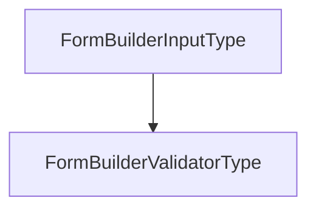

# Chapter 8: Realtime Features

Welcome to **Chapter 8: Realtime Features**. In this part of **NocoDB: Deep Dive Tutorial**, you will build an intuitive mental model first, then move into concrete implementation details and practical production tradeoffs.


Realtime features keep shared table state consistent for concurrent collaborators.

## Realtime Collaboration Flow

1. client submits optimistic local mutation
2. backend validates and persists canonical state
3. event stream broadcasts row/schema change
4. clients reconcile incoming event with local pending edits

## Conflict Handling

Use explicit conflict semantics:

- row versioning or monotonic timestamps
- deterministic merge or rebase rules
- visible conflict states in UI when auto-resolution fails

## Reliability Controls

| Control | Why It Matters |
|:--------|:---------------|
| ordered event streams per workspace/table | consistent replay and reconciliation |
| reconnect replay windows | recovers missed updates |
| idempotent event application | avoids duplicate mutations |
| bounded optimistic queue | prevents unbounded local drift |

## Final Summary

You now have complete NocoDB foundations from schema and API design through realtime multi-user consistency.

Related:
- [NocoDB Index](README.md)
- [Setup Guide](docs/setup.md)

## What Problem Does This Solve?

Most teams struggle here because the hard part is not writing more code, but deciding clear boundaries for core abstractions in this chapter so behavior stays predictable as complexity grows.

In practical terms, this chapter helps you avoid three common failures:

- coupling core logic too tightly to one implementation path
- missing the handoff boundaries between setup, execution, and validation
- shipping changes without clear rollback or observability strategy

After working through this chapter, you should be able to reason about `Chapter 8: Realtime Features` as an operating subsystem inside **NocoDB: Deep Dive Tutorial**, with explicit contracts for inputs, state transitions, and outputs.

Use the implementation notes around execution and reliability details as your checklist when adapting these patterns to your own repository.

## How it Works Under the Hood

Under the hood, `Chapter 8: Realtime Features` usually follows a repeatable control path:

1. **Context bootstrap**: initialize runtime config and prerequisites for `core component`.
2. **Input normalization**: shape incoming data so `execution layer` receives stable contracts.
3. **Core execution**: run the main logic branch and propagate intermediate state through `state model`.
4. **Policy and safety checks**: enforce limits, auth scopes, and failure boundaries.
5. **Output composition**: return canonical result payloads for downstream consumers.
6. **Operational telemetry**: emit logs/metrics needed for debugging and performance tuning.

When debugging, walk this sequence in order and confirm each stage has explicit success/failure conditions.

## Source Walkthrough

Use the following upstream sources to verify implementation details while reading this chapter:

- [NocoDB](https://github.com/nocodb/nocodb)
  Why it matters: authoritative reference on `NocoDB` (github.com).

Suggested trace strategy:
- search upstream code for `Realtime` and `Features` to map concrete implementation paths
- compare docs claims against actual runtime/config code before reusing patterns in production

## Chapter Connections

- [Tutorial Index](README.md)
- [Previous Chapter: Chapter 7: Vue Components](07-vue-components.md)
- [Main Catalog](../../README.md#-tutorial-catalog)
- [A-Z Tutorial Directory](../../discoverability/tutorial-directory.md)

## Depth Expansion Playbook

## Source Code Walkthrough

### `packages/noco-integrations/nocodb-sdk-reference.ts`

The `FormBuilderInputType` interface in [`packages/noco-integrations/nocodb-sdk-reference.ts`](https://github.com/nocodb/nocodb/blob/HEAD/packages/noco-integrations/nocodb-sdk-reference.ts) handles a key part of this chapter's functionality:

```ts
};

export enum FormBuilderInputType {
  Input = 'input',
  Select = 'select',
  Switch = 'switch',
  Space = 'space',
  Password = 'password',
  SelectIntegration = 'integration',
  SelectBase = 'select-base',
  OAuth = 'oauth',
}

export interface FormBuilderCondition {
  // model path to check for condition
  model: string;
  // value to check for condition
  value?: string;
  // check if the value is equal to the model value
  equal?: string;
  // check if the value is in the array
  in?: string[];
  // check if the value is empty
  empty?: boolean;
  // check if the value is not empty
  notEmpty?: boolean;
}

export enum FormBuilderValidatorType {
  Required = 'required',
}

```

This interface is important because it defines how NocoDB: Deep Dive Tutorial implements the patterns covered in this chapter.

### `packages/noco-integrations/nocodb-sdk-reference.ts`

The `FormBuilderValidatorType` interface in [`packages/noco-integrations/nocodb-sdk-reference.ts`](https://github.com/nocodb/nocodb/blob/HEAD/packages/noco-integrations/nocodb-sdk-reference.ts) handles a key part of this chapter's functionality:

```ts
}

export enum FormBuilderValidatorType {
  Required = 'required',
}

export interface FormBuilderElement {
  // element type
  type: FormBuilderInputType;
  // property path in the form JSON
  model?: string;
  // default value
  defaultValue?: string[] | string | boolean | number | null;
  // label for the element
  label?: string;
  // placeholder for the element (if applicable)
  placeholder?: string;
  // percentage width of the element
  width?: number;
  // category of the element - same category elements are grouped together
  category?: string;
  // help text for the element
  // options for select element
  options?: { value: string; label: string }[];
  // select mode for the element (if applicable) - default is single
  selectMode?: 'single' | 'multiple' | 'multipleWithInput';
  // integration type filter for integration element
  integrationFilter?: {
    type?: string;
    sub_type?: string;
  };
  // oauth meta
```

This interface is important because it defines how NocoDB: Deep Dive Tutorial implements the patterns covered in this chapter.


## How These Components Connect


