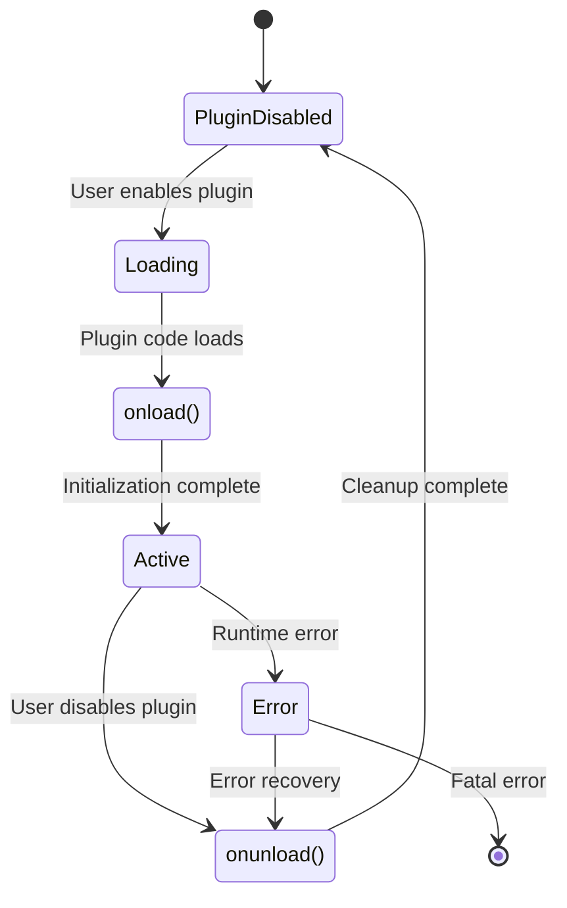

# Chapter 1: Obsidian Plugin Architecture

Welcome to **Chapter 1: Obsidian Plugin Architecture**. In this part of **Obsidian Outliner Plugin: Deep Dive Tutorial**, you will build an intuitive mental model first, then move into concrete implementation details and practical production tradeoffs.


> Understanding Obsidian's plugin system and API boundaries

## 🎯 Learning Objectives

By the end of this chapter, you'll understand:
- Obsidian's plugin architecture and lifecycle
- The plugin API and safe interaction patterns
- Plugin manifest and configuration
- Development environment setup

## 🏗️ Obsidian Plugin System Overview

Obsidian plugins extend the core functionality through a well-defined API that maintains security and stability. The plugin system is designed to be:

- **Secure**: Plugins run in sandboxed environments with controlled access
- **Extensible**: Clean APIs for adding features without modifying core code
- **Compatible**: Version-aware APIs that maintain backward compatibility
- **Discoverable**: Centralized plugin marketplace with quality controls

### **Plugin Types**

| Type | Description | Use Case |
|:-----|:------------|:---------|
| **Editor Plugin** | Extends editing capabilities | Custom editors, syntax highlighting |
| **View Plugin** | Adds new view types | Calendar, kanban boards, mind maps |
| **Command Plugin** | Adds commands to command palette | File operations, transformations |
| **Settings Plugin** | Adds settings UI | Configuration management |
| **Theme Plugin** | Modifies appearance | Custom styling, layouts |

## 📋 Plugin Manifest

Every Obsidian plugin requires a `manifest.json` file that defines its identity and capabilities:

```json
{
  "id": "obsidian-outliner",
  "name": "Outliner",
  "version": "4.8.0",
  "minAppVersion": "1.0.0",
  "description": "Work with your lists like in Workflowy or Roam Research.",
  "author": "Viacheslav Slinko",
  "authorUrl": "https://github.com/vslinko",
  "isDesktopOnly": false,
  "fundingUrl": "https://github.com/sponsors/vslinko"
}
```

### **Manifest Fields**

| Field | Required | Description |
|:------|:---------|:------------|
| `id` | ✅ | Unique plugin identifier (lowercase, hyphens) |
| `name` | ✅ | Human-readable plugin name |
| `version` | ✅ | Semantic version string |
| `minAppVersion` | ✅ | Minimum Obsidian version required |
| `description` | ✅ | Plugin description for marketplace |
| `author` | ✅ | Plugin author name |
| `authorUrl` | ❌ | Link to author website/GitHub |
| `isDesktopOnly` | ❌ | Whether plugin requires desktop features |
| `fundingUrl` | ❌ | Link for donations/sponsorship |

## 🔧 Plugin Class Structure

All Obsidian plugins extend the base `Plugin` class:

```typescript
import { Plugin, PluginManifest } from 'obsidian';

export default class OutlinerPlugin extends Plugin {
  // Plugin manifest passed to constructor
  constructor(app: App, manifest: PluginManifest) {
    super(app, manifest);
  }

  // Called when plugin is enabled
  async onload() {
    // Plugin initialization code
    console.log('Outliner plugin loaded');

    // Register commands, views, etc.
    this.registerCommands();
    this.registerViews();
    this.registerEvents();
  }

  // Called when plugin is disabled
  async onunload() {
    // Cleanup code
    console.log('Outliner plugin unloaded');

    // Clean up resources
    this.cleanup();
  }

  private registerCommands() {
    // Command registration
  }

  private registerViews() {
    // View registration
  }

  private registerEvents() {
    // Event listener registration
  }

  private cleanup() {
    // Resource cleanup
  }
}
```

### **Plugin Lifecycle**



## 🔌 Core API Components

### **App Interface**

The main entry point for accessing Obsidian functionality:

```typescript
interface App {
  // Vault management
  vault: Vault;

  // Workspace management
  workspace: Workspace;

  // Metadata management
  metadataCache: MetadataCache;

  // File manager
  fileManager: FileManager;

  // Plugin system
  plugins: PluginSystem;

  // Commands
  commands: Commands;

  // Settings
  setting: Setting;
}
```

### **Vault API**

Manages files and folders in the vault:

```typescript
interface Vault {
  // File operations
  create(path: string, data: string): Promise<TFile>;
  read(file: TFile): Promise<string>;
  modify(file: TFile, data: string): Promise<void>;
  delete(file: TFile, force?: boolean): Promise<void>;

  // Folder operations
  createFolder(path: string): Promise<TFolder>;
  delete(folder: TFolder, force?: boolean): Promise<void>;

  // Utility methods
  getAbstractFileByPath(path: string): TAbstractFile | null;
  getAllLoadedFiles(): TFile[];
  getMarkdownFiles(): TFile[];

  // Events
  on(name: 'create', callback: (file: TAbstractFile) => any): EventRef;
  on(name: 'delete', callback: (file: TAbstractFile) => any): EventRef;
  on(name: 'modify', callback: (file: TFile) => any): EventRef;
  on(name: 'rename', callback: (file: TAbstractFile, oldPath: string) => any): EventRef;
}
```

### **Workspace API**

Manages the user interface and views:

```typescript
interface Workspace {
  // Active file/view
  getActiveFile(): TFile | null;
  getActiveViewOfType<T extends View>(type: Constructor<T>): T | null;

  // View management
  getLeavesOfType(viewType: string): WorkspaceLeaf[];
  createLeafInTabGroup(): WorkspaceLeaf;
  createLeafBySplit(leaf: WorkspaceLeaf, direction: 'vertical' | 'horizontal'): WorkspaceLeaf;

  // Layout management
  changeLayout(workspace: any): Promise<void>;
  saveLayout(): Promise<void>;

  // Events
  on(name: 'active-leaf-change', callback: (leaf: WorkspaceLeaf | null) => any): EventRef;
  on(name: 'file-open', callback: (file: TFile) => any): EventRef;
  on(name: 'layout-change', callback: () => any): EventRef;
}
```

## 🛠️ Development Environment Setup

### **Project Structure**

```
obsidian-outliner-plugin/
├── manifest.json          # Plugin manifest
├── package.json           # Node.js dependencies
├── tsconfig.json          # TypeScript configuration
├── main.ts               # Main plugin file
├── src/                  # Source code
│   ├── plugin.ts         # Plugin class
│   ├── commands.ts       # Command implementations
│   ├── views.ts          # Custom view components
│   └── utils.ts          # Utility functions
├── styles.css            # Plugin styles
└── dist/                 # Built plugin (generated)
    ├── main.js
    └── manifest.json
```

### **Package.json Configuration**

```json
{
  "name": "obsidian-outliner",
  "version": "4.8.0",
  "description": "Work with your lists like in Workflowy or Roam Research",
  "main": "main.ts",
  "scripts": {
    "dev": "node esbuild.config.mjs",
    "build": "tsc -noEmit -skipLibCheck && node esbuild.config.mjs production",
    "version": "node version-bump.mjs && git add manifest.json package.json"
  },
  "keywords": ["obsidian", "plugin", "outliner"],
  "author": "Viacheslav Slinko",
  "license": "MIT",
  "devDependencies": {
    "@types/node": "^16.11.6",
    "@typescript-eslint/eslint-plugin": "5.29.0",
    "@typescript-eslint/parser": "5.29.0",
    "builtin-modules": "3.3.0",
    "esbuild": "0.17.3",
    "obsidian": "latest",
    "tslib": "2.4.0",
    "typescript": "4.7.4"
  }
}
```

### **TypeScript Configuration**

```json
{
  "compilerOptions": {
    "baseUrl": ".",
    "inlineSourceMap": true,
    "inlineSources": true,
    "module": "ESNext",
    "target": "ES6",
    "allowJs": true,
    "noImplicitAny": true,
    "moduleResolution": "node",
    "importHelpers": true,
    "allowSyntheticDefaultImports": true,
    "experimentalDecorators": true,
    "strictNullChecks": false,
    "noImplicitReturns": true,
    "noImplicitThis": true,
    "noImplicitAny": false,
    "strictBindCallApply": false,
    "strictFunctionTypes": false,
    "strictPropertyInitialization": false,
    "lib": [
      "DOM",
      "ES5",
      "ES6",
      "ES7"
    ]
  },
  "include": [
    "**/*.ts"
  ],
  "exclude": [
    "node_modules",
    "dist"
  ]
}
```

### **Build Configuration**

```javascript
// esbuild.config.mjs
import esbuild from "esbuild";
import process from "process";

const banner =
`/*
THIS IS A GENERATED/BUNDLED FILE BY ESBUILD
if you want to view the source, please visit the github repository of this plugin
*/
`;

const prod = (process.argv[2] === 'production');

esbuild.build({
  banner: {
    js: banner,
  },
  entryPoints: ['main.ts'],
  bundle: true,
  external: [
    'obsidian',
    'electron',
    '@codemirror/view',
    '@codemirror/state',
    '@codemirror/lang-markdown'
  ],
  format: 'cjs',
  target: 'es2018',
  logLevel: "info",
  sourcemap: prod ? false : 'inline',
  treeShaking: true,
  outfile: 'dist/main.js',
}).catch(() => process.exit(1));
```

## 🔒 API Boundaries and Best Practices

### **Safe Plugin Development**

```typescript
// ✅ Good: Using official APIs
export default class SafePlugin extends Plugin {
  async onload() {
    // Safe: Using documented API
    this.registerEvent(
      this.app.vault.on('modify', (file) => {
        console.log(`${file.name} was modified`);
      })
    );

    // Safe: Using command API
    this.addCommand({
      id: 'my-command',
      name: 'My Command',
      callback: () => {
        // Command implementation
      }
    });
  }
}

// ❌ Bad: Accessing private APIs
export default class UnsafePlugin extends Plugin {
  async onload() {
    // Unsafe: Accessing private properties
    const privateProperty = (this.app as any)._privateProperty;

    // Unsafe: Modifying DOM directly
    document.querySelector('.some-internal-class').style.display = 'none';
  }
}
```

### **Plugin Security Guidelines**

1. **API Compliance**: Only use documented APIs and methods
2. **Resource Management**: Clean up event listeners and resources on unload
3. **Error Handling**: Implement proper error handling and recovery
4. **Performance**: Avoid blocking operations and memory leaks
5. **Compatibility**: Test across different Obsidian versions

## 🧪 Development Workflow

### **Local Development Setup**

1. **Clone sample plugin**:
   ```bash
   git clone https://github.com/obsidianmd/obsidian-sample-plugin.git
   cd obsidian-sample-plugin
   npm install
   ```

2. **Copy plugin to vault**:
   ```bash
   # Create plugins folder in your vault
   mkdir -p /path/to/vault/.obsidian/plugins/your-plugin-id/

   # Copy built plugin
   cp dist/main.js /path/to/vault/.obsidian/plugins/your-plugin-id/
   cp manifest.json /path/to/vault/.obsidian/plugins/your-plugin-id/
   ```

3. **Enable plugin in Obsidian**:
   - Open Settings → Community plugins
   - Turn on "Safe mode" off
   - Find your plugin in the list and enable it

### **Hot Reload Development**

```typescript
// For development with auto-reload
export default class DevPlugin extends Plugin {
  async onload() {
    // Development helpers
    if (process.env.NODE_ENV === 'development') {
      this.registerDomEvent(window, 'keydown', (evt) => {
        if (evt.key === 'F5' && evt.ctrlKey) {
          // Trigger reload
          window.location.reload();
        }
      });
    }

    // Your plugin logic here
  }
}
```

## 🎯 Key Takeaways

1. **Plugin Architecture**: Clean separation between plugin and core functionality
2. **API Boundaries**: Respect documented APIs to ensure compatibility and security
3. **Lifecycle Management**: Proper initialization and cleanup of resources
4. **Type Safety**: TypeScript provides compile-time safety for plugin development
5. **Development Workflow**: Streamlined setup for efficient plugin development

## 🧪 Hands-On Exercise

**Estimated Time: 30 minutes**

1. **Set up development environment**:
   - Clone the Obsidian sample plugin
   - Configure TypeScript and build system
   - Create a basic plugin structure

2. **Create a simple plugin**:
   - Add a command that shows a notice
   - Register an event listener for file changes
   - Test plugin loading and unloading

3. **Explore the API**:
   - Access vault files and metadata
   - Register commands and shortcuts
   - Add settings to the plugin

---

**Ready to build text editing features?** Continue to [Chapter 2: Text Editing Implementation](02-text-editing.md)

## What Problem Does This Solve?

Most teams struggle here because the hard part is not writing more code, but deciding clear boundaries for `plugin`, `file`, `obsidian` so behavior stays predictable as complexity grows.

In practical terms, this chapter helps you avoid three common failures:

- coupling core logic too tightly to one implementation path
- missing the handoff boundaries between setup, execution, and validation
- shipping changes without clear rollback or observability strategy

After working through this chapter, you should be able to reason about `Chapter 1: Obsidian Plugin Architecture` as an operating subsystem inside **Obsidian Outliner Plugin: Deep Dive Tutorial**, with explicit contracts for inputs, state transitions, and outputs.

Use the implementation notes around `Plugin`, `name`, `TFile` as your checklist when adapting these patterns to your own repository.

## How it Works Under the Hood

Under the hood, `Chapter 1: Obsidian Plugin Architecture` usually follows a repeatable control path:

1. **Context bootstrap**: initialize runtime config and prerequisites for `plugin`.
2. **Input normalization**: shape incoming data so `file` receives stable contracts.
3. **Core execution**: run the main logic branch and propagate intermediate state through `obsidian`.
4. **Policy and safety checks**: enforce limits, auth scopes, and failure boundaries.
5. **Output composition**: return canonical result payloads for downstream consumers.
6. **Operational telemetry**: emit logs/metrics needed for debugging and performance tuning.

When debugging, walk this sequence in order and confirm each stage has explicit success/failure conditions.

## Source Walkthrough

Use the following upstream sources to verify implementation details while reading this chapter:

- [Obsidian Outliner](https://github.com/vslinko/obsidian-outliner)
  Why it matters: authoritative reference on `Obsidian Outliner` (github.com).

Suggested trace strategy:
- search upstream code for `plugin` and `file` to map concrete implementation paths
- compare docs claims against actual runtime/config code before reusing patterns in production

## Chapter Connections

- [Tutorial Index](index.md)
- [Next Chapter: Chapter 2: Text Editing Implementation](02-text-editing.md)
- [Main Catalog](../../README.md#-tutorial-catalog)
- [A-Z Tutorial Directory](../../discoverability/tutorial-directory.md)
