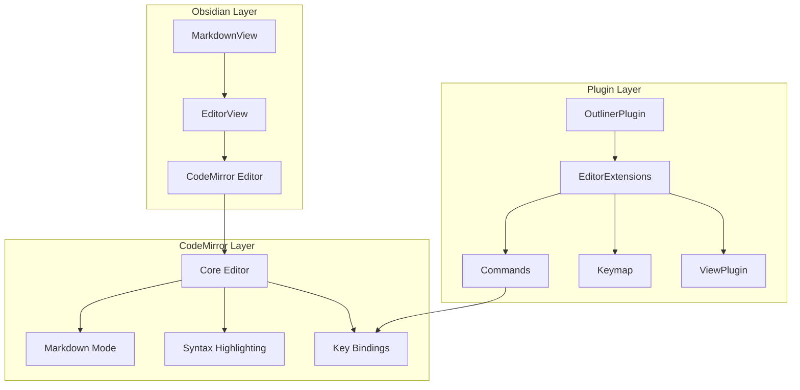

# Chapter 2: Text Editing Implementation

Welcome to **Chapter 2: Text Editing Implementation**. In this part of **Obsidian Outliner Plugin: Deep Dive Tutorial**, you will build an intuitive mental model first, then move into concrete implementation details and practical production tradeoffs.


> Implementing sophisticated editor behaviors and keyboard shortcuts

## 🎯 Learning Objectives

By the end of this chapter, you'll understand:
- Obsidian's editor architecture and CodeMirror integration
- Implementing custom editing commands and behaviors
- Managing editor state and cursor positions
- Creating keyboard shortcuts and hotkeys
- Handling text transformations and manipulations

## 📝 Obsidian Editor Architecture

Obsidian's editor is built on CodeMirror 6, a powerful text editing framework. The Outliner plugin extends this foundation with advanced list and tree manipulation features.

### **Editor Component Hierarchy**



### **Accessing the Editor**

```typescript
// Getting the active editor instance
export default class OutlinerPlugin extends Plugin {
  getActiveEditor(): Editor | null {
    const activeView = this.app.workspace.getActiveViewOfType(MarkdownView);
    return activeView?.editor || null;
  }

  getEditorFromView(view: MarkdownView): Editor {
    return view.editor;
  }

  // Example usage
  someCommand() {
    const editor = this.getActiveEditor();
    if (!editor) return;

    // Use editor API
    const cursor = editor.getCursor();
    const selectedText = editor.getSelection();
  }
}
```

## ⌨️ Keyboard Shortcuts and Commands

### **Command Registration**

```typescript
export default class OutlinerPlugin extends Plugin {
  async onload() {
    // Register outliner commands
    this.addCommand({
      id: 'outliner-indent',
      name: 'Indent list item',
      hotkeys: [
        {
          modifiers: ['Mod'],
          key: ']'
        }
      ],
      editorCallback: (editor: Editor) => {
        this.indentListItem(editor);
      }
    });

    this.addCommand({
      id: 'outliner-outdent',
      name: 'Outdent list item',
      hotkeys: [
        {
          modifiers: ['Mod'],
          key: '['
        }
      ],
      editorCallback: (editor: Editor) => {
        this.outdentListItem(editor);
      }
    });

    this.addCommand({
      id: 'outliner-move-up',
      name: 'Move list item up',
      hotkeys: [
        {
          modifiers: ['Mod', 'Shift'],
          key: 'ArrowUp'
        }
      ],
      editorCallback: (editor: Editor) => {
        this.moveListItemUp(editor);
      }
    });

    this.addCommand({
      id: 'outliner-move-down',
      name: 'Move list item down',
      hotkeys: [
        {
          modifiers: ['Mod', 'Shift'],
          key: 'ArrowDown'
        }
      ],
      editorCallback: (editor: Editor) => {
        this.moveListItemDown(editor);
      }
    });
  }
}
```

### **Advanced Keymap Configuration**

```typescript
// Custom keymap for advanced editing
const outlinerKeymap: KeyBinding[] = [
  // Tab for indent (alternative to Mod+])
  {
    key: 'Tab',
    run: (view: EditorView): boolean => {
      const plugin = getPluginFromView(view);
      if (plugin?.isInList(view)) {
        plugin.indentListItem(view);
        return true;
      }
      return false;
    }
  },

  // Shift+Tab for outdent (alternative to Mod+[])
  {
    key: 'Shift-Tab',
    run: (view: EditorView): boolean => {
      const plugin = getPluginFromView(view);
      if (plugin?.isInList(view)) {
        plugin.outdentListItem(view);
        return true;
      }
      return false;
    }
  },

  // Enter for new list item
  {
    key: 'Enter',
    run: (view: EditorView): boolean => {
      const plugin = getPluginFromView(view);
      if (plugin?.isInList(view)) {
        plugin.createNewListItem(view);
        return true;
      }
      return false;
    }
  }
];

// Register keymap with CodeMirror
class OutlinerViewPlugin implements PluginValue {
  constructor(view: EditorView) {
    this.view = view;
  }

  update(update: ViewUpdate) {
    // Handle view updates
  }
}

// Register the plugin
const outlinerPlugin = ViewPlugin.fromClass(OutlinerViewPlugin, {
  decorations: (value: OutlinerViewPlugin) => value.decorations
});
```

## 📋 List Item Manipulation

### **List Detection and Parsing**

```typescript
// List parsing utilities
class ListParser {
  // Regular expressions for list detection
  static readonly UNORDERED_LIST_REGEX = /^(\s*)([-*+])\s+/;
  static readonly ORDERED_LIST_REGEX = /^(\s*)\d+\.\s+/;
  static readonly CHECKBOX_REGEX = /^(\s*)([-*+])\s+\[([ xX])\]\s+/;

  static isListLine(line: string): boolean {
    return this.UNORDERED_LIST_REGEX.test(line) ||
           this.ORDERED_LIST_REGEX.test(line) ||
           this.CHECKBOX_REGEX.test(line);
  }

  static getListInfo(line: string): ListInfo | null {
    let match;

    // Checkbox list
    match = line.match(this.CHECKBOX_REGEX);
    if (match) {
      return {
        indent: match[1].length,
        marker: match[2],
        type: 'checkbox',
        checked: match[3].toLowerCase() === 'x',
        content: line.substring(match[0].length)
      };
    }

    // Unordered list
    match = line.match(this.UNORDERED_LIST_REGEX);
    if (match) {
      return {
        indent: match[1].length,
        marker: match[2],
        type: 'unordered',
        content: line.substring(match[0].length)
      };
    }

    // Ordered list
    match = line.match(this.ORDERED_LIST_REGEX);
    if (match) {
      return {
        indent: match[1].length,
        marker: null,
        type: 'ordered',
        content: line.substring(match[0].length)
      };
    }

    return null;
  }

  static getListLevel(line: string): number {
    const info = this.getListInfo(line);
    return info ? Math.floor(info.indent / 2) : 0;
  }

  static createListLine(content: string, level: number, type: ListType = 'unordered'): string {
    const indent = '  '.repeat(level);
    const marker = type === 'ordered' ? '1.' : '-';

    return `${indent}${marker} ${content}`;
  }
}

interface ListInfo {
  indent: number;
  marker: string | null;
  type: 'unordered' | 'ordered' | 'checkbox';
  checked?: boolean;
  content: string;
}

type ListType = 'unordered' | 'ordered' | 'checkbox';
```

### **Indentation and Outdentation**

```typescript
// List manipulation methods
export default class OutlinerPlugin extends Plugin {
  indentListItem(editor: Editor) {
    const cursor = editor.getCursor();
    const line = editor.getLine(cursor.line);

    if (!ListParser.isListLine(line)) return;

    const listInfo = ListParser.getListInfo(line);
    if (!listInfo) return;

    // Increase indentation
    const newIndent = listInfo.indent + 2;
    const newLine = ' '.repeat(newIndent) + line.trim();

    editor.setLine(cursor.line, newLine);

    // Move cursor to end of line content
    const newCursorPos = {
      line: cursor.line,
      ch: newLine.length
    };
    editor.setCursor(newCursorPos);
  }

  outdentListItem(editor: Editor) {
    const cursor = editor.getCursor();
    const line = editor.getLine(cursor.line);

    if (!ListParser.isListLine(line)) return;

    const listInfo = ListParser.getListInfo(line);
    if (!listInfo || listInfo.indent < 2) return;

    // Decrease indentation
    const newIndent = Math.max(0, listInfo.indent - 2);
    const newLine = ' '.repeat(newIndent) + line.trim();

    editor.setLine(cursor.line, newLine);

    // Move cursor to end of line content
    const newCursorPos = {
      line: cursor.line,
      ch: newLine.length
    };
    editor.setCursor(newCursorPos);
  }

  createNewListItem(editor: Editor) {
    const cursor = editor.getCursor();
    const currentLine = editor.getLine(cursor.line);

    if (!ListParser.isListLine(currentLine)) return;

    const listInfo = ListParser.getListInfo(currentLine);
    if (!listInfo) return;

    // Create new list item at same level
    const newLineContent = ListParser.createListLine('', listInfo.indent / 2, listInfo.type);
    const newLineNumber = cursor.line + 1;

    // Insert new line
    editor.replaceRange('\n' + newLineContent, {line: newLineNumber - 1, ch: editor.getLine(newLineNumber - 1).length});

    // Move cursor to new line
    editor.setCursor({line: newLineNumber, ch: newLineContent.length});
  }
}
```

## 🌳 Tree Structure Management

### **Tree Traversal and Manipulation**

```typescript
// Tree data structure for outlines
class OutlineTree {
  root: OutlineNode;

  constructor(content: string) {
    this.root = this.parseContent(content);
  }

  parseContent(content: string): OutlineNode {
    const lines = content.split('\n');
    const root = new OutlineNode('', 0, 'root');

    let currentParents: OutlineNode[] = [root];
    let currentLevel = 0;

    for (const line of lines) {
      if (!line.trim()) continue;

      const level = ListParser.getListLevel(line);
      const node = new OutlineNode(
        ListParser.getListInfo(line)?.content || line,
        level,
        'item'
      );

      // Find correct parent
      while (currentParents.length > level + 1) {
        currentParents.pop();
      }

      const parent = currentParents[currentParents.length - 1];
      parent.children.push(node);
      node.parent = parent;

      // Update parent stack
      if (level >= currentLevel) {
        currentParents.push(node);
        currentLevel = level;
      }
    }

    return root;
  }

  toString(): string {
    return this.root.toString().trim();
  }

  moveNode(node: OutlineNode, newParent: OutlineNode, index: number = -1) {
    // Remove from current parent
    const currentIndex = node.parent?.children.indexOf(node);
    if (currentIndex !== undefined && currentIndex >= 0) {
      node.parent!.children.splice(currentIndex, 1);
    }

    // Add to new parent
    if (index === -1) {
      newParent.children.push(node);
    } else {
      newParent.children.splice(index, 0, node);
    }

    node.parent = newParent;

    // Update levels recursively
    this.updateNodeLevel(node, newParent.level + 1);
  }

  private updateNodeLevel(node: OutlineNode, level: number) {
    node.level = level;
    for (const child of node.children) {
      this.updateNodeLevel(child, level + 1);
    }
  }

  findNodeAtLine(lineNumber: number): OutlineNode | null {
    let currentLine = 0;
    return this.traverseTree(this.root, (node) => {
      if (currentLine === lineNumber) {
        return node;
      }
      currentLine++;
      return null;
    });
  }

  private traverseTree(node: OutlineNode, callback: (node: OutlineNode) => OutlineNode | null): OutlineNode | null {
    const result = callback(node);
    if (result) return result;

    for (const child of node.children) {
      const childResult = this.traverseTree(child, callback);
      if (childResult) return childResult;
    }

    return null;
  }
}

class OutlineNode {
  content: string;
  level: number;
  type: 'root' | 'item';
  parent: OutlineNode | null = null;
  children: OutlineNode[] = [];

  constructor(content: string, level: number, type: 'root' | 'item' = 'item') {
    this.content = content;
    this.level = level;
    this.type = type;
  }

  toString(): string {
    if (this.type === 'root') {
      return this.children.map(child => child.toString()).join('\n');
    }

    const indent = '  '.repeat(this.level);
    const marker = '-';
    let result = `${indent}${marker} ${this.content}`;

    for (const child of this.children) {
      result += '\n' + child.toString();
    }

    return result;
  }

  getPreviousSibling(): OutlineNode | null {
    if (!this.parent) return null;

    const index = this.parent.children.indexOf(this);
    return index > 0 ? this.parent.children[index - 1] : null;
  }

  getNextSibling(): OutlineNode | null {
    if (!this.parent) return null;

    const index = this.parent.children.indexOf(this);
    return index < this.parent.children.length - 1 ? this.parent.children[index + 1] : null;
  }
}
```

### **Tree-Based Movement Commands**

```typescript
// Tree manipulation commands
export default class OutlinerPlugin extends Plugin {
  moveListItemUp(editor: Editor) {
    const cursor = editor.getCursor();
    const content = editor.getValue();
    const tree = new OutlineTree(content);

    const currentNode = tree.findNodeAtLine(cursor.line);
    if (!currentNode || !currentNode.parent) return;

    const siblings = currentNode.parent.children;
    const currentIndex = siblings.indexOf(currentNode);

    if (currentIndex > 0) {
      // Move up within siblings
      [siblings[currentIndex], siblings[currentIndex - 1]] =
      [siblings[currentIndex - 1], siblings[currentIndex]];

      editor.setValue(tree.toString());
      editor.setCursor({line: cursor.line - 1, ch: cursor.ch});
    } else if (currentNode.parent.parent) {
      // Move to end of previous parent's children
      const grandParent = currentNode.parent.parent;
      const parentIndex = grandParent.children.indexOf(currentNode.parent);

      if (parentIndex > 0) {
        const prevParent = grandParent.children[parentIndex - 1];
        tree.moveNode(currentNode, prevParent);

        editor.setValue(tree.toString());
        // Recalculate cursor position
        this.updateCursorAfterMove(editor, tree, currentNode);
      }
    }
  }

  moveListItemDown(editor: Editor) {
    const cursor = editor.getCursor();
    const content = editor.getValue();
    const tree = new OutlineTree(content);

    const currentNode = tree.findNodeAtLine(cursor.line);
    if (!currentNode || !currentNode.parent) return;

    const siblings = currentNode.parent.children;
    const currentIndex = siblings.indexOf(currentNode);

    if (currentIndex < siblings.length - 1) {
      // Move down within siblings
      [siblings[currentIndex], siblings[currentIndex + 1]] =
      [siblings[currentIndex + 1], siblings[currentIndex]];

      editor.setValue(tree.toString());
      editor.setCursor({line: cursor.line + 1, ch: cursor.ch});
    } else if (currentNode.parent.parent) {
      // Move to next parent's beginning
      const grandParent = currentNode.parent.parent;
      const parentIndex = grandParent.children.indexOf(currentNode.parent);

      if (parentIndex < grandParent.children.length - 1) {
        const nextParent = grandParent.children[parentIndex + 1];
        tree.moveNode(currentNode, nextParent, 0);

        editor.setValue(tree.toString());
        // Recalculate cursor position
        this.updateCursorAfterMove(editor, tree, currentNode);
      }
    }
  }

  private updateCursorAfterMove(editor: Editor, tree: OutlineTree, movedNode: OutlineNode) {
    // Find the new line number of the moved node
    let lineNumber = 0;
    tree.traverseTree(tree.root, (node) => {
      if (node === movedNode) {
        editor.setCursor({line: lineNumber, ch: editor.getCursor().ch});
        return node;
      }
      lineNumber++;
      return null;
    });
  }
}
```

## 🎨 Editor State Management

### **Managing Complex Editor States**

```typescript
// Editor state management
class EditorStateManager {
  private states: Map<string, EditorState> = new Map();

  saveState(filePath: string, editor: Editor) {
    const state = {
      cursor: editor.getCursor(),
      selections: editor.getSelections(),
      scrollTop: editor.getScrollTop(),
      scrollLeft: editor.getScrollLeft(),
      content: editor.getValue(),
      timestamp: Date.now()
    };

    this.states.set(filePath, state);
  }

  restoreState(filePath: string, editor: Editor) {
    const state = this.states.get(filePath);
    if (!state) return;

    // Only restore if content hasn't changed significantly
    if (editor.getValue() === state.content) {
      editor.setCursor(state.cursor);
      editor.setSelections(state.selections);
      editor.scrollTo(state.scrollLeft, state.scrollTop);
    }
  }

  clearOldStates(maxAge: number = 24 * 60 * 60 * 1000) { // 24 hours
    const cutoff = Date.now() - maxAge;

    for (const [filePath, state] of this.states) {
      if (state.timestamp < cutoff) {
        this.states.delete(filePath);
      }
    }
  }
}

interface EditorState {
  cursor: {line: number, ch: number};
  selections: Array<{anchor: {line: number, ch: number}, head: {line: number, ch: number}}>;
  scrollTop: number;
  scrollLeft: number;
  content: string;
  timestamp: number;
}
```

## 🎯 Key Takeaways

1. **Editor Integration**: Deep integration with Obsidian's CodeMirror-based editor
2. **Command System**: Flexible command registration with hotkey support
3. **List Parsing**: Robust parsing of different list types and indentation levels
4. **Tree Manipulation**: Efficient algorithms for hierarchical content management
5. **State Management**: Preserving editor state during complex operations

## 🧪 Hands-On Exercise

**Estimated Time: 45 minutes**

1. **Implement Basic Commands**:
   - Create indent/outdent commands with keyboard shortcuts
   - Add a command to create new list items

2. **Build Tree Navigation**:
   - Implement move up/down functionality for list items
   - Add commands to navigate between different tree levels

3. **Advanced List Operations**:
   - Create a command to convert regular text to lists
   - Implement list sorting and filtering features

---

**Ready to master tree algorithms?** Continue to [Chapter 3: Tree Data Structures](03-tree-structures.md)

## What Problem Does This Solve?

Most teams struggle here because the hard part is not writing more code, but deciding clear boundaries for `editor`, `line`, `parent` so behavior stays predictable as complexity grows.

In practical terms, this chapter helps you avoid three common failures:

- coupling core logic too tightly to one implementation path
- missing the handoff boundaries between setup, execution, and validation
- shipping changes without clear rollback or observability strategy

After working through this chapter, you should be able to reason about `Chapter 2: Text Editing Implementation` as an operating subsystem inside **Obsidian Outliner Plugin: Deep Dive Tutorial**, with explicit contracts for inputs, state transitions, and outputs.

Use the implementation notes around `cursor`, `content`, `node` as your checklist when adapting these patterns to your own repository.

## How it Works Under the Hood

Under the hood, `Chapter 2: Text Editing Implementation` usually follows a repeatable control path:

1. **Context bootstrap**: initialize runtime config and prerequisites for `editor`.
2. **Input normalization**: shape incoming data so `line` receives stable contracts.
3. **Core execution**: run the main logic branch and propagate intermediate state through `parent`.
4. **Policy and safety checks**: enforce limits, auth scopes, and failure boundaries.
5. **Output composition**: return canonical result payloads for downstream consumers.
6. **Operational telemetry**: emit logs/metrics needed for debugging and performance tuning.

When debugging, walk this sequence in order and confirm each stage has explicit success/failure conditions.

## Source Walkthrough

Use the following upstream sources to verify implementation details while reading this chapter:

- [Obsidian Outliner](https://github.com/vslinko/obsidian-outliner)
  Why it matters: authoritative reference on `Obsidian Outliner` (github.com).

Suggested trace strategy:
- search upstream code for `editor` and `line` to map concrete implementation paths
- compare docs claims against actual runtime/config code before reusing patterns in production

## Chapter Connections

- [Tutorial Index](index.md)
- [Previous Chapter: Chapter 1: Obsidian Plugin Architecture](01-plugin-architecture.md)
- [Next Chapter: Chapter 3: Tree Data Structures](03-tree-structures.md)
- [Main Catalog](../../README.md#-tutorial-catalog)
- [A-Z Tutorial Directory](../../discoverability/tutorial-directory.md)
