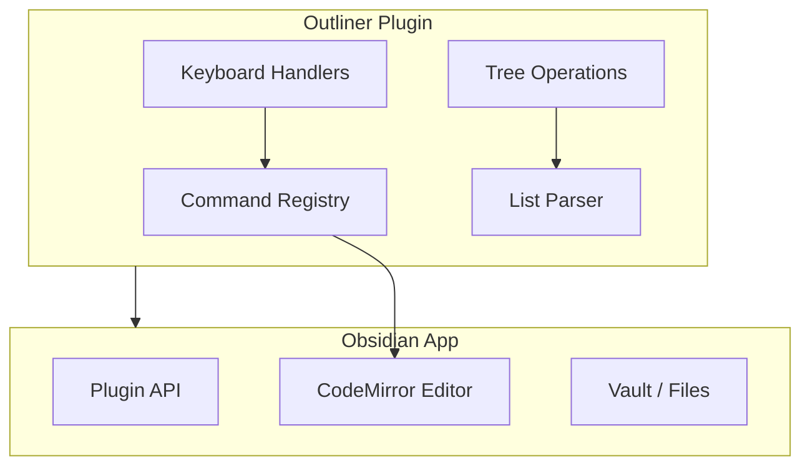

# Obsidian Outliner Plugin: Deep Dive Tutorial

> **Project**: [Obsidian Outliner](https://github.com/vslinko/obsidian-outliner) — A plugin that adds outliner-style editing behaviors to Obsidian, demonstrating advanced plugin architecture patterns.

## Why This Track Matters

The Obsidian Outliner plugin is an ideal case study for Obsidian plugin development — it covers the full arc from API integration and CodeMirror editor extensions to tree data structures and production maintenance.

This track focuses on:
- understanding the Obsidian plugin lifecycle and API boundaries
- implementing custom editing behaviors with CodeMirror 6
- managing hierarchical list structures with tree manipulation algorithms
- packaging, releasing, and maintaining a production Obsidian plugin

## What Is This Tutorial?

This tutorial uses the Obsidian Outliner plugin as a case study for understanding Obsidian plugin development patterns — including editor extensions, tree data structures, keyboard shortcuts, and the Obsidian Plugin API.

| Feature | Description |
|---------|-------------|
| **Plugin Architecture** | Obsidian's plugin system, API boundaries, lifecycle |
| **Editor Extensions** | Custom editing behaviors, cursor management |
| **Tree Manipulation** | Hierarchical list operations (indent, move, fold) |
| **Keyboard Shortcuts** | Custom hotkey handling and command registration |
| **Performance** | Efficient algorithms for large documents |

## Mental Model

## Chapter Guide

| Chapter | Topic | What You'll Learn |
|---------|-------|-------------------|
| [1. Plugin Architecture](01-plugin-architecture.md) | Foundation | Obsidian plugin API, lifecycle, settings |
| [2. Text Editing](02-text-editing.md) | Editor | CodeMirror integration, cursor management |
| [3. Tree Structures](03-tree-structures.md) | Data | Hierarchical list parsing and manipulation |
| [4. Advanced Features](04-advanced-features.md) | Polish | Folding, drag-and-drop, performance |
| [5. Keyboard Shortcuts](05-keyboard-shortcuts.md) | Commands | Hotkey registration and command precedence |
| [6. Testing and Debugging](06-testing-debugging.md) | Quality | Test strategy for tree mutations and editor state |
| [7. Plugin Packaging](07-plugin-packaging.md) | Release | Manifest/versioning and compatibility strategy |
| [8. Production Maintenance](08-production-maintenance.md) | Operations | Stability, triage, and long-term maintenance |

## Tech Stack

| Component | Technology |
|-----------|-----------|
| **Language** | TypeScript |
| **Editor** | CodeMirror 6 (via Obsidian) |
| **Platform** | Obsidian Plugin API |
| **Build** | esbuild |

---

Ready to begin? Start with [Chapter 1: Plugin Architecture](01-plugin-architecture.md).

---

*Built with insights from the [Obsidian Outliner](https://github.com/vslinko/obsidian-outliner) plugin and Obsidian developer documentation.*

## Navigation & Backlinks

- [Start Here: Chapter 1: Obsidian Plugin Architecture](01-plugin-architecture.md)
- [Back to Main Catalog](../../README.md#-tutorial-catalog)
- [Browse A-Z Tutorial Directory](../../discoverability/tutorial-directory.md)
- [Search by Intent](../../discoverability/query-hub.md)
- [Explore Category Hubs](../../README.md#category-hubs)

## Full Chapter Map

1. [Chapter 1: Obsidian Plugin Architecture](01-plugin-architecture.md)
2. [Chapter 2: Text Editing Implementation](02-text-editing.md)
3. [Chapter 3: Tree Data Structures](03-tree-structures.md)
4. [Chapter 4: Advanced Features](04-advanced-features.md)
5. [Chapter 5: Keyboard Shortcuts](05-keyboard-shortcuts.md)
6. [Chapter 6: Testing and Debugging](06-testing-debugging.md)
7. [Chapter 7: Plugin Packaging](07-plugin-packaging.md)
8. [Chapter 8: Production Maintenance](08-production-maintenance.md)

## Current Snapshot (auto-updated)

- repository: [vslinko/obsidian-outliner](https://github.com/vslinko/obsidian-outliner)
- stars: about **2.5K**
- project positioning: popular Obsidian plugin adding outliner-style editing to Obsidian notes

## What You Will Learn

- how the Obsidian Plugin API and CodeMirror 6 are used to extend editor behavior
- how tree data structures model and manipulate hierarchical markdown lists
- how keyboard shortcuts, commands, and hotkeys are registered and managed
- how to package, version, and maintain an Obsidian plugin for long-term compatibility

## Source References

- [Obsidian Outliner](https://github.com/vslinko/obsidian-outliner)

*Generated by [AI Codebase Knowledge Builder](https://github.com/The-Pocket/Tutorial-Codebase-Knowledge)*
