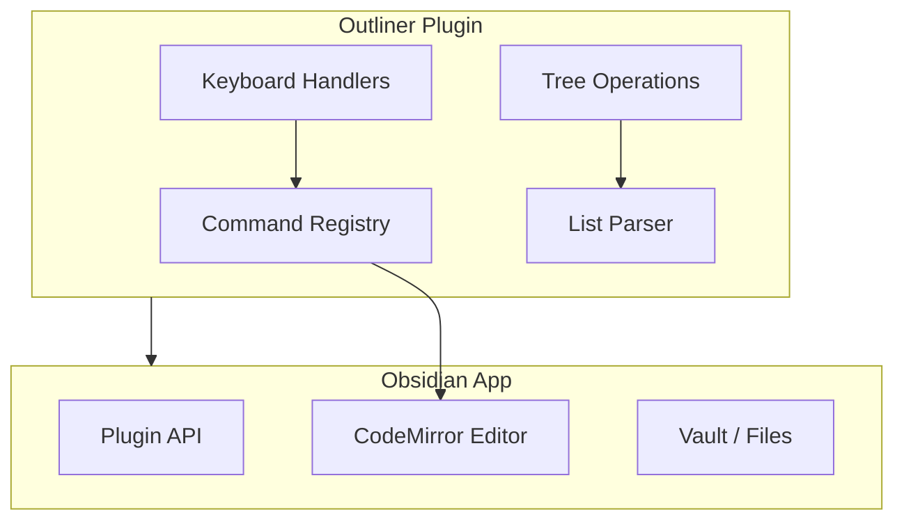

# Obsidian Outliner Plugin: Deep Dive Tutorial

> **Project**: [Obsidian Outliner](https://github.com/vslinko/obsidian-outliner) — A plugin that adds outliner-style editing behaviors to Obsidian, demonstrating advanced plugin architecture patterns.

## What Is This Tutorial?

This tutorial uses the Obsidian Outliner plugin as a case study for understanding Obsidian plugin development patterns — including editor extensions, tree data structures, keyboard shortcuts, and the Obsidian Plugin API.

| Feature | Description |
|---------|-------------|
| **Plugin Architecture** | Obsidian's plugin system, API boundaries, lifecycle |
| **Editor Extensions** | Custom editing behaviors, cursor management |
| **Tree Manipulation** | Hierarchical list operations (indent, move, fold) |
| **Keyboard Shortcuts** | Custom hotkey handling and command registration |
| **Performance** | Efficient algorithms for large documents |

## Architecture Overview

## Tutorial Structure

| Chapter | Topic | What You'll Learn |
|---------|-------|-------------------|
| [1. Plugin Architecture](docs/01-plugin-architecture.md) | Foundation | Obsidian plugin API, lifecycle, settings |
| [2. Text Editing](docs/02-text-editing.md) | Editor | CodeMirror integration, cursor management |
| [3. Tree Structures](docs/03-tree-structures.md) | Data | Hierarchical list parsing and manipulation |
| [4. Advanced Features](docs/04-advanced-features.md) | Polish | Folding, drag-and-drop, performance |
| [5. Keyboard Shortcuts](docs/05-keyboard-shortcuts.md) | Commands | Hotkey registration and command precedence |
| [6. Testing and Debugging](docs/06-testing-debugging.md) | Quality | Test strategy for tree mutations and editor state |
| [7. Plugin Packaging](docs/07-plugin-packaging.md) | Release | Manifest/versioning and compatibility strategy |
| [8. Production Maintenance](docs/08-production-maintenance.md) | Operations | Stability, triage, and long-term maintenance |

## Tech Stack

| Component | Technology |
|-----------|-----------|
| **Language** | TypeScript |
| **Editor** | CodeMirror 6 (via Obsidian) |
| **Platform** | Obsidian Plugin API |
| **Build** | esbuild |

---

Ready to begin? Start with [Chapter 1: Plugin Architecture](docs/01-plugin-architecture.md).

---

*Built with insights from the [Obsidian Outliner](https://github.com/vslinko/obsidian-outliner) plugin and Obsidian developer documentation.*
