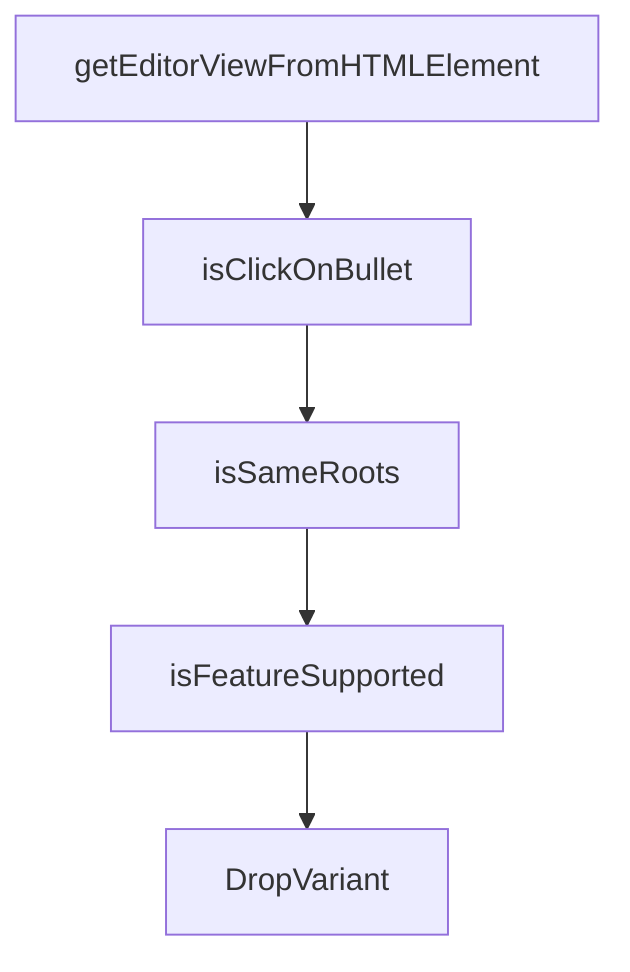

# Chapter 5: Keyboard Shortcuts

Welcome to **Chapter 5: Keyboard Shortcuts**. In this part of **Obsidian Outliner Plugin: Deep Dive Tutorial**, you will build an intuitive mental model first, then move into concrete implementation details and practical production tradeoffs.


This chapter explains command registration and hotkey handling for outliner workflows.

## Command Registration Model

- register named commands with explicit editor preconditions
- map commands to default hotkeys and user overrides
- keep command handlers deterministic and side-effect bounded

## Shortcut Priorities

1. editor-native shortcut handling
2. plugin command interception
3. fallback to Obsidian default behavior

## Reliability Practices

- avoid conflicting defaults with common Obsidian shortcuts
- provide discoverable command palette names
- ensure all shortcuts work with nested list contexts

## Summary

You now understand how the plugin wires keyboard-first editing into Obsidian's command system.

Next: [Chapter 6: Testing and Debugging](06-testing-debugging.md)

## What Problem Does This Solve?

Most teams struggle here because the hard part is not writing more code, but deciding clear boundaries for core abstractions in this chapter so behavior stays predictable as complexity grows.

In practical terms, this chapter helps you avoid three common failures:

- coupling core logic too tightly to one implementation path
- missing the handoff boundaries between setup, execution, and validation
- shipping changes without clear rollback or observability strategy

After working through this chapter, you should be able to reason about `Chapter 5: Keyboard Shortcuts` as an operating subsystem inside **Obsidian Outliner Plugin: Deep Dive Tutorial**, with explicit contracts for inputs, state transitions, and outputs.

Use the implementation notes around execution and reliability details as your checklist when adapting these patterns to your own repository.

## How it Works Under the Hood

Under the hood, `Chapter 5: Keyboard Shortcuts` usually follows a repeatable control path:

1. **Context bootstrap**: initialize runtime config and prerequisites for `core component`.
2. **Input normalization**: shape incoming data so `execution layer` receives stable contracts.
3. **Core execution**: run the main logic branch and propagate intermediate state through `state model`.
4. **Policy and safety checks**: enforce limits, auth scopes, and failure boundaries.
5. **Output composition**: return canonical result payloads for downstream consumers.
6. **Operational telemetry**: emit logs/metrics needed for debugging and performance tuning.

When debugging, walk this sequence in order and confirm each stage has explicit success/failure conditions.

## Source Walkthrough

Use the following upstream sources to verify implementation details while reading this chapter:

- [Obsidian Outliner](https://github.com/vslinko/obsidian-outliner)
  Why it matters: authoritative reference on `Obsidian Outliner` (github.com).

Suggested trace strategy:
- search upstream code for `Keyboard` and `Shortcuts` to map concrete implementation paths
- compare docs claims against actual runtime/config code before reusing patterns in production

## Chapter Connections

- [Tutorial Index](README.md)
- [Previous Chapter: Chapter 4: Advanced Features](04-advanced-features.md)
- [Next Chapter: Chapter 6: Testing and Debugging](06-testing-debugging.md)
- [Main Catalog](../../README.md#-tutorial-catalog)
- [A-Z Tutorial Directory](../../discoverability/tutorial-directory.md)

## Depth Expansion Playbook

## Source Code Walkthrough

### `src/features/DragAndDrop.ts`

The `getEditorViewFromHTMLElement` function in [`src/features/DragAndDrop.ts`](https://github.com/vslinko/obsidian-outliner/blob/HEAD/src/features/DragAndDrop.ts) handles a key part of this chapter's functionality:

```ts
    }

    const view = getEditorViewFromHTMLElement(e.target as HTMLElement);
    if (!view) {
      return;
    }

    e.preventDefault();
    e.stopPropagation();

    this.preStart = {
      x: e.x,
      y: e.y,
      view,
    };
  };

  private handleMouseMove = (e: MouseEvent) => {
    if (this.preStart) {
      this.startDragging();
    }
    if (this.state) {
      this.detectAndDrawDropZone(e.x, e.y);
    }
  };

  private handleMouseUp = () => {
    if (this.preStart) {
      this.preStart = null;
    }
    if (this.state) {
      this.stopDragging();
```

This function is important because it defines how Obsidian Outliner Plugin: Deep Dive Tutorial implements the patterns covered in this chapter.

### `src/features/DragAndDrop.ts`

The `isClickOnBullet` function in [`src/features/DragAndDrop.ts`](https://github.com/vslinko/obsidian-outliner/blob/HEAD/src/features/DragAndDrop.ts) handles a key part of this chapter's functionality:

```ts
      !isFeatureSupported() ||
      !this.settings.dragAndDrop ||
      !isClickOnBullet(e)
    ) {
      return;
    }

    const view = getEditorViewFromHTMLElement(e.target as HTMLElement);
    if (!view) {
      return;
    }

    e.preventDefault();
    e.stopPropagation();

    this.preStart = {
      x: e.x,
      y: e.y,
      view,
    };
  };

  private handleMouseMove = (e: MouseEvent) => {
    if (this.preStart) {
      this.startDragging();
    }
    if (this.state) {
      this.detectAndDrawDropZone(e.x, e.y);
    }
  };

  private handleMouseUp = () => {
```

This function is important because it defines how Obsidian Outliner Plugin: Deep Dive Tutorial implements the patterns covered in this chapter.

### `src/features/DragAndDrop.ts`

The `isSameRoots` function in [`src/features/DragAndDrop.ts`](https://github.com/vslinko/obsidian-outliner/blob/HEAD/src/features/DragAndDrop.ts) handles a key part of this chapter's functionality:

```ts

    const newRoot = this.parser.parse(editor, root.getContentStart());
    if (!isSameRoots(root, newRoot)) {
      new Notice(
        `The item cannot be moved. The page content changed during the move.`,
        5000,
      );
      return;
    }

    this.operationPerformer.eval(
      root,
      new MoveListToDifferentPosition(
        root,
        list,
        dropVariant.placeToMove,
        dropVariant.whereToMove,
        this.obisidian.getDefaultIndentChars(),
      ),
      editor,
    );
  }

  private highlightDraggingLines() {
    const { state } = this;
    const { list, editor, view } = state;

    const lines = [];
    const fromLine = list.getFirstLineContentStart().line;
    const tillLine = list.getContentEndIncludingChildren().line;
    for (let i = fromLine; i <= tillLine; i++) {
      lines.push(editor.posToOffset({ line: i, ch: 0 }));
```

This function is important because it defines how Obsidian Outliner Plugin: Deep Dive Tutorial implements the patterns covered in this chapter.

### `src/features/DragAndDrop.ts`

The `isFeatureSupported` function in [`src/features/DragAndDrop.ts`](https://github.com/vslinko/obsidian-outliner/blob/HEAD/src/features/DragAndDrop.ts) handles a key part of this chapter's functionality:

```ts

  private handleSettingsChange = () => {
    if (!isFeatureSupported()) {
      return;
    }

    if (this.settings.dragAndDrop) {
      document.body.classList.add(BODY_CLASS);
    } else {
      document.body.classList.remove(BODY_CLASS);
    }
  };

  private handleMouseDown = (e: MouseEvent) => {
    if (
      !isFeatureSupported() ||
      !this.settings.dragAndDrop ||
      !isClickOnBullet(e)
    ) {
      return;
    }

    const view = getEditorViewFromHTMLElement(e.target as HTMLElement);
    if (!view) {
      return;
    }

    e.preventDefault();
    e.stopPropagation();

    this.preStart = {
      x: e.x,
```

This function is important because it defines how Obsidian Outliner Plugin: Deep Dive Tutorial implements the patterns covered in this chapter.


## How These Components Connect


