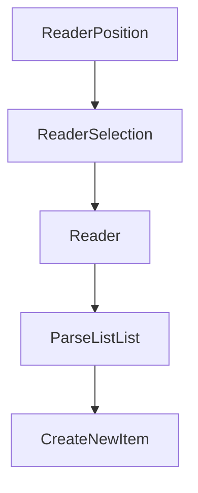

# Chapter 6: Testing and Debugging

Welcome to **Chapter 6: Testing and Debugging**. In this part of **Obsidian Outliner Plugin: Deep Dive Tutorial**, you will build an intuitive mental model first, then move into concrete implementation details and practical production tradeoffs.


Editor plugins require strong mutation-focused testing because small command bugs can corrupt note structure.

## High-Value Test Areas

- indent/outdent in nested hierarchies
- move up/down with mixed sibling depths
- fold/unfold state persistence across reloads
- multi-cursor and selection edge cases
- undo/redo across structural + text mutations

## Test Layering Strategy

1. unit tests for pure tree-transform helpers
2. integration tests for command execution in editor context
3. fixture-based regression tests for known bug patterns

## Debugging Workflow

- instrument command entry/exit with structured logs
- snapshot outline tree before and after each command
- isolate parser/selection issues with minimal markdown fixtures
- add deterministic reproduction scripts for flaky failures

## Observability Tips

| Signal | Use |
|:-------|:----|
| command failure rate | catches regressions quickly |
| unexpected selection states | identifies cursor logic bugs |
| mutation latency | reveals slow tree operations |

## Summary

You can now implement a practical quality system for reliable outliner command behavior.

Next: [Chapter 7: Plugin Packaging](07-plugin-packaging.md)

## What Problem Does This Solve?

Most teams struggle here because the hard part is not writing more code, but deciding clear boundaries for core abstractions in this chapter so behavior stays predictable as complexity grows.

In practical terms, this chapter helps you avoid three common failures:

- coupling core logic too tightly to one implementation path
- missing the handoff boundaries between setup, execution, and validation
- shipping changes without clear rollback or observability strategy

After working through this chapter, you should be able to reason about `Chapter 6: Testing and Debugging` as an operating subsystem inside **Obsidian Outliner Plugin: Deep Dive Tutorial**, with explicit contracts for inputs, state transitions, and outputs.

Use the implementation notes around execution and reliability details as your checklist when adapting these patterns to your own repository.

## How it Works Under the Hood

Under the hood, `Chapter 6: Testing and Debugging` usually follows a repeatable control path:

1. **Context bootstrap**: initialize runtime config and prerequisites for `core component`.
2. **Input normalization**: shape incoming data so `execution layer` receives stable contracts.
3. **Core execution**: run the main logic branch and propagate intermediate state through `state model`.
4. **Policy and safety checks**: enforce limits, auth scopes, and failure boundaries.
5. **Output composition**: return canonical result payloads for downstream consumers.
6. **Operational telemetry**: emit logs/metrics needed for debugging and performance tuning.

When debugging, walk this sequence in order and confirm each stage has explicit success/failure conditions.

## Source Walkthrough

Use the following upstream sources to verify implementation details while reading this chapter:

- [Obsidian Outliner](https://github.com/vslinko/obsidian-outliner)
  Why it matters: authoritative reference on `Obsidian Outliner` (github.com).

Suggested trace strategy:
- search upstream code for `Testing` and `and` to map concrete implementation paths
- compare docs claims against actual runtime/config code before reusing patterns in production

## Chapter Connections

- [Tutorial Index](README.md)
- [Previous Chapter: Chapter 5: Keyboard Shortcuts](05-keyboard-shortcuts.md)
- [Next Chapter: Chapter 7: Plugin Packaging](07-plugin-packaging.md)
- [Main Catalog](../../README.md#-tutorial-catalog)
- [A-Z Tutorial Directory](../../discoverability/tutorial-directory.md)

## Depth Expansion Playbook

## Source Code Walkthrough

### `src/services/Parser.ts`

The `ReaderPosition` interface in [`src/services/Parser.ts`](https://github.com/vslinko/obsidian-outliner/blob/HEAD/src/services/Parser.ts) handles a key part of this chapter's functionality:

```ts
);

export interface ReaderPosition {
  line: number;
  ch: number;
}

export interface ReaderSelection {
  anchor: ReaderPosition;
  head: ReaderPosition;
}

export interface Reader {
  getCursor(): ReaderPosition;
  getLine(n: number): string;
  lastLine(): number;
  listSelections(): ReaderSelection[];
  getAllFoldedLines(): number[];
}

interface ParseListList {
  getFirstLineIndent(): string;
  setNotesIndent(notesIndent: string): void;
  getNotesIndent(): string | null;
  addLine(text: string): void;
  getParent(): ParseListList | null;
  addAfterAll(list: ParseListList): void;
}

export class Parser {
  constructor(
    private logger: Logger,
```

This interface is important because it defines how Obsidian Outliner Plugin: Deep Dive Tutorial implements the patterns covered in this chapter.

### `src/services/Parser.ts`

The `ReaderSelection` interface in [`src/services/Parser.ts`](https://github.com/vslinko/obsidian-outliner/blob/HEAD/src/services/Parser.ts) handles a key part of this chapter's functionality:

```ts
}

export interface ReaderSelection {
  anchor: ReaderPosition;
  head: ReaderPosition;
}

export interface Reader {
  getCursor(): ReaderPosition;
  getLine(n: number): string;
  lastLine(): number;
  listSelections(): ReaderSelection[];
  getAllFoldedLines(): number[];
}

interface ParseListList {
  getFirstLineIndent(): string;
  setNotesIndent(notesIndent: string): void;
  getNotesIndent(): string | null;
  addLine(text: string): void;
  getParent(): ParseListList | null;
  addAfterAll(list: ParseListList): void;
}

export class Parser {
  constructor(
    private logger: Logger,
    private settings: Settings,
  ) {}

  parseRange(editor: Reader, fromLine = 0, toLine = editor.lastLine()): Root[] {
    const lists: Root[] = [];
```

This interface is important because it defines how Obsidian Outliner Plugin: Deep Dive Tutorial implements the patterns covered in this chapter.

### `src/services/Parser.ts`

The `Reader` interface in [`src/services/Parser.ts`](https://github.com/vslinko/obsidian-outliner/blob/HEAD/src/services/Parser.ts) handles a key part of this chapter's functionality:

```ts
);

export interface ReaderPosition {
  line: number;
  ch: number;
}

export interface ReaderSelection {
  anchor: ReaderPosition;
  head: ReaderPosition;
}

export interface Reader {
  getCursor(): ReaderPosition;
  getLine(n: number): string;
  lastLine(): number;
  listSelections(): ReaderSelection[];
  getAllFoldedLines(): number[];
}

interface ParseListList {
  getFirstLineIndent(): string;
  setNotesIndent(notesIndent: string): void;
  getNotesIndent(): string | null;
  addLine(text: string): void;
  getParent(): ParseListList | null;
  addAfterAll(list: ParseListList): void;
}

export class Parser {
  constructor(
    private logger: Logger,
```

This interface is important because it defines how Obsidian Outliner Plugin: Deep Dive Tutorial implements the patterns covered in this chapter.

### `src/services/Parser.ts`

The `ParseListList` interface in [`src/services/Parser.ts`](https://github.com/vslinko/obsidian-outliner/blob/HEAD/src/services/Parser.ts) handles a key part of this chapter's functionality:

```ts
}

interface ParseListList {
  getFirstLineIndent(): string;
  setNotesIndent(notesIndent: string): void;
  getNotesIndent(): string | null;
  addLine(text: string): void;
  getParent(): ParseListList | null;
  addAfterAll(list: ParseListList): void;
}

export class Parser {
  constructor(
    private logger: Logger,
    private settings: Settings,
  ) {}

  parseRange(editor: Reader, fromLine = 0, toLine = editor.lastLine()): Root[] {
    const lists: Root[] = [];

    for (let i = fromLine; i <= toLine; i++) {
      const line = editor.getLine(i);

      if (i === fromLine || this.isListItem(line)) {
        const list = this.parseWithLimits(editor, i, fromLine, toLine);

        if (list) {
          lists.push(list);
          i = list.getContentEnd().line;
        }
      }
    }
```

This interface is important because it defines how Obsidian Outliner Plugin: Deep Dive Tutorial implements the patterns covered in this chapter.


## How These Components Connect


