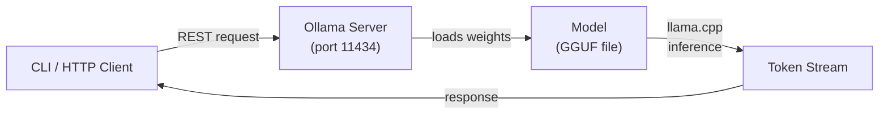

# Chapter 1: Getting Started with Ollama

> Install Ollama, pull your first model, and run a local chat with an OpenAI-compatible API.

## Overview

Ollama runs LLMs locally with zero cloud dependency. It wraps the high-performance **llama.cpp** inference engine in a friendly CLI and an OpenAI-style HTTP API. It works on macOS, Linux, and Windows (via WSL2), supports both CPU and GPU inference, and makes switching between models as simple as `ollama run <model>`.

Whether you want to prototype an AI feature without worrying about API keys, keep sensitive data off third-party servers, or simply experiment with open-source models on your own hardware, Ollama is one of the fastest ways to get started.

## How Ollama Works Under the Hood

Before you install anything, it helps to understand the architecture at a high level.



When you type `ollama run llama3` in your terminal, here is what happens behind the scenes:

1. **CLI sends a request** -- The `ollama` binary is a thin client. It sends an HTTP request to the Ollama server process (which listens on `localhost:11434` by default).
2. **Server loads the model** -- The server locates the requested model on disk, loads its weights into memory (RAM or VRAM), and prepares the inference context.
3. **llama.cpp runs inference** -- Ollama uses [llama.cpp](https://github.com/ggerganov/llama.cpp) as its core inference engine. This C/C++ library is optimized for running quantized models efficiently on consumer hardware.
4. **Tokens stream back** -- The model generates tokens one at a time. By default, Ollama streams them back to the client so you see text appear incrementally, just like a cloud-hosted chatbot.

### The GGUF Model Format

Ollama stores models in the **GGUF** (GPT-Generated Unified Format) format. GGUF is a single-file binary format designed specifically for llama.cpp. Each GGUF file bundles:

- **Model metadata** -- Architecture details, vocabulary size, context length, and other hyperparameters.
- **Tokenizer data** -- The byte-pair encoding (BPE) or SentencePiece tables needed to convert text into tokens and back.
- **Quantized weight tensors** -- The actual neural network weights, compressed using quantization schemes like Q4_0, Q4_K_M, or Q8_0.

Quantization is the key to running large models on modest hardware. A full-precision 7B-parameter model would need roughly 28 GB of memory, but a 4-bit quantized version fits in about 4 GB.

### Model Layers and Memory

When a model is loaded, Ollama maps its layers into memory. On systems with a compatible GPU, layers can be offloaded to VRAM for faster inference. You can control this behavior with the `--gpu-layers` flag or let Ollama decide automatically. The server will:

- Place as many layers on the GPU as VRAM allows.
- Fall back to system RAM for the remaining layers.
- Use memory-mapped files so the OS can page layers in and out efficiently.

This hybrid approach means you can run a 13B model on a machine with only 8 GB of VRAM -- some layers will run on the GPU and the rest on the CPU, giving you a balance of speed and capability.

## Prerequisites

- macOS 12+ / Linux (Ubuntu, Debian, RHEL, Fedora, Arch) / Windows 10 or 11 via WSL2
- Sufficient RAM for your target model size (see the hardware requirements table below)
- Optional: NVIDIA GPU with CUDA 11.7+ drivers, AMD GPU with ROCm, or Apple Silicon (M1/M2/M3/M4) for GPU-accelerated inference
- `curl` for API tests
- Python 3.8+ or Node.js 18+ for the SDK quickstart examples

## Hardware Requirements

The amount of RAM you need depends directly on the model size and quantization level. Here is a practical reference table for 4-bit quantized models (Q4_K_M), which is the default quantization Ollama uses:

| Model Size | RAM Required | VRAM (GPU) Recommended | Example Models |
|---|---|---|---|
| **1B -- 3B** | 4 GB | 2 GB+ | `tinyllama`, `phi3:mini`, `gemma:2b` |
| **7B** | 8 GB | 6 GB+ | `llama3:8b`, `mistral`, `gemma:7b` |
| **13B** | 16 GB | 10 GB+ | `llama2:13b`, `codellama:13b` |
| **34B** | 32 GB | 24 GB+ | `codellama:34b`, `yi:34b` |
| **70B** | 64 GB | 48 GB+ | `llama3:70b`, `mixtral:8x7b` |

**Tips for choosing a model:**
- If you have **8 GB of RAM** and no dedicated GPU, stick with 7B models. They offer surprisingly good quality for most tasks.
- If you have **16 GB of RAM**, 13B models are the sweet spot -- noticeably smarter than 7B with reasonable speed.
- **70B models** require serious hardware. Consider cloud GPU instances if you do not have 64 GB+ of RAM.
- Apple Silicon Macs with unified memory work particularly well because the GPU and CPU share the same memory pool.

## Install Ollama

### macOS

The simplest way to install on macOS is via Homebrew:

```bash
brew install ollama/tap/ollama
```

Alternatively, download the macOS app directly from [ollama.com/download](https://ollama.com/download). The desktop app includes the CLI and runs the server as a background service automatically.

### Linux (Official Script)

The one-liner install script works on most distributions:

```bash
curl -fsSL https://ollama.com/install.sh | sh
```

This installs the `ollama` binary to `/usr/local/bin` and sets up a systemd service. On non-systemd distributions, you will need to start the server manually.

### Windows (via WSL2)

1. Install WSL2 and Ubuntu from the Microsoft Store.
2. Open your Ubuntu terminal and run the Linux install script:
   ```bash
   curl -fsSL https://ollama.com/install.sh | sh
   ```
3. If you have an NVIDIA GPU, make sure the NVIDIA Container Toolkit / CUDA drivers are installed inside WSL2 for GPU acceleration.

### Docker

Running Ollama in Docker is a great option for reproducible environments, CI/CD pipelines, or keeping your host system clean:

```bash
# CPU-only
docker run -d -v ollama:/root/.ollama -p 11434:11434 --name ollama ollama/ollama

# NVIDIA GPU (requires nvidia-container-toolkit)
docker run -d --gpus all -v ollama:/root/.ollama -p 11434:11434 --name ollama ollama/ollama

# AMD GPU (ROCm)
docker run -d --device /dev/kfd --device /dev/dri -v ollama:/root/.ollama -p 11434:11434 --name ollama ollama/ollama:rocm
```

Once the container is running, you can execute Ollama commands inside it:

```bash
docker exec -it ollama ollama pull llama3
docker exec -it ollama ollama run llama3 "Hello from Docker!"
```

Or simply call the API from your host machine since port 11434 is mapped.

### Verifying Your Installation

After installing, run these checks to make sure everything is working:

```bash
# 1. Check the CLI version
ollama --version
# Expected output: ollama version 0.x.x

# 2. Start the server (skip if using the macOS app or Docker)
ollama serve &

# 3. Verify the server is responding
curl http://localhost:11434
# Expected output: "Ollama is running"

# 4. Pull a small test model
ollama pull tinyllama

# 5. Run a quick test
ollama run tinyllama "Say hello in three languages"
```

If step 3 returns "Ollama is running", your installation is healthy and ready to go.

## Start the Ollama Service

```bash
ollama serve   # starts the background server on port 11434
```

- **Default API endpoint**: `http://localhost:11434`
- **Logs**: `~/.ollama/logs` (location varies by platform)
- **Automatic start**: On macOS (desktop app) and Linux (systemd), the server starts automatically at boot. You only need to run `ollama serve` manually if you installed via a method that does not set up a service.

To confirm the server is running at any time:

```bash
curl http://localhost:11434
# Returns: "Ollama is running"
```

## Pull Your First Model

```bash
ollama pull llama3
ollama list          # verify the model is downloaded
```

The first pull will take a few minutes depending on your internet speed -- `llama3` (8B, 4-bit) is approximately 4.7 GB. Progress is displayed in the terminal.

**Popular starter models:**

| Model | Size | Best For |
|---|---|---|
| `tinyllama` | ~600 MB | Testing, fast iteration |
| `phi3:mini` | ~2.3 GB | Small and capable, great for code |
| `mistral` | ~4.1 GB | Balanced quality and speed |
| `llama3` | ~4.7 GB | Strong general-purpose model |
| `codellama` | ~3.8 GB | Code generation and analysis |

## Understanding Model Tags

When you see a model name like `llama3:8b-instruct-q4_K_M`, it follows a structured naming convention:

```
<family>:<size>-<variant>-<quantization>
```

Here is what each part means:

- **Family** (`llama3`) -- The base model family or architecture.
- **Size** (`8b`) -- The number of parameters (e.g., 8 billion).
- **Variant** (`instruct`) -- The fine-tuning variant. Common variants include:
  - `instruct` -- Fine-tuned to follow instructions (most common for chat).
  - `chat` -- Optimized for conversational interactions.
  - `code` -- Fine-tuned specifically for programming tasks.
  - `text` -- Base model without instruction tuning.
- **Quantization** (`q4_K_M`) -- The compression method. Lower numbers mean smaller files but slightly reduced quality:
  - `q4_0` -- 4-bit, basic quantization. Smallest size, lower quality.
  - `q4_K_M` -- 4-bit, K-quant medium. Good balance (Ollama's default).
  - `q5_K_M` -- 5-bit, K-quant medium. Better quality, slightly larger.
  - `q8_0` -- 8-bit quantization. Near-original quality, roughly double the size.

When you run `ollama pull llama3`, Ollama automatically downloads the default tag, which is usually the instruct variant with Q4_K_M quantization. You can be explicit if you want a specific version:

```bash
ollama pull llama3:8b              # default quantization
ollama pull llama3:8b-q8_0         # higher quality, larger file
ollama pull llama3:70b             # much larger model
```

## Run Your First Chat

Interactive chat in the terminal:

```bash
ollama run llama3 "What is Ollama?"          # one-off prompt with immediate response
ollama run llama3                             # enters the REPL for an ongoing conversation
```

Inside the REPL you can type messages, and the model will respond. Press `Ctrl+D` or type `/bye` to exit.

## Your First Conversation -- Multi-Turn Chat

One of Ollama's strengths is maintaining context across multiple turns in a conversation. Here is how multi-turn chat works with the HTTP API:

```bash
curl http://localhost:11434/api/chat -d '{
  "model": "llama3",
  "stream": false,
  "messages": [
    {"role": "system", "content": "You are a helpful cooking assistant."},
    {"role": "user", "content": "I have chicken, rice, and broccoli. What can I make?"},
    {"role": "assistant", "content": "You could make a chicken stir-fry with rice and broccoli! Slice the chicken, stir-fry it with the broccoli, season with soy sauce and garlic, and serve over steamed rice."},
    {"role": "user", "content": "Great idea! How long should I cook the chicken?"}
  ]
}'
```

The key insight is that **you send the entire conversation history** with each request. Ollama does not store session state between HTTP calls -- the context is built from the `messages` array you provide. This is the same pattern used by the OpenAI Chat Completions API, so if you have experience with that, you will feel right at home.

In the REPL (`ollama run llama3`), this history is managed automatically for you. Each message you type is appended to the conversation, giving the model full context of what you have discussed.

## Call the HTTP API (OpenAI-Compatible)

Ollama exposes two API styles. The native Ollama API and an OpenAI-compatible endpoint:

### Native Ollama API

```bash
curl http://localhost:11434/api/chat -d '{
  "model": "llama3",
  "messages": [
    {"role": "user", "content": "Tell me a short joke"}
  ]
}'
```

By default this streams newline-delimited JSON objects. Add `"stream": false` to receive a single JSON response.

### OpenAI-Compatible API

```bash
curl http://localhost:11434/v1/chat/completions -d '{
  "model": "llama3",
  "messages": [
    {"role": "user", "content": "Tell me a short joke"}
  ]
}' -H "Content-Type: application/json"
```

This endpoint mirrors the OpenAI chat completions format (`choices`, `message`, `usage`), making it straightforward to point existing OpenAI-based code at your local Ollama instance.

## Python Quickstart

### Basic Request

```python
import requests

resp = requests.post("http://localhost:11434/api/chat", json={
    "model": "llama3",
    "messages": [{"role": "user", "content": "Explain RAG in 3 bullets"}],
    "stream": False
})
print(resp.json()["message"]["content"])
```

### Streaming Responses

For a better user experience -- especially with longer answers -- you can stream the response token by token. This lets you display text as it is generated, rather than waiting for the full response:

```python
import requests
import json

resp = requests.post("http://localhost:11434/api/chat", json={
    "model": "llama3",
    "messages": [{"role": "user", "content": "Write a short poem about open source"}],
    "stream": True
}, stream=True)

for line in resp.iter_lines():
    if line:
        chunk = json.loads(line)
        # Each chunk contains a partial message
        content = chunk.get("message", {}).get("content", "")
        print(content, end="", flush=True)

        # The last chunk has "done": true
        if chunk.get("done"):
            print()  # newline at the end
```

When `stream` is `True`, Ollama sends a sequence of JSON objects, one per line. Each object contains a small piece of the response in `message.content`. The final object includes `"done": true` along with timing and token-count metadata.

### Using the Official Python Library

Ollama also provides an official Python client that simplifies things further:

```bash
pip install ollama
```

```python
import ollama

# Non-streaming
response = ollama.chat(model="llama3", messages=[
    {"role": "user", "content": "What is the capital of France?"}
])
print(response["message"]["content"])

# Streaming
for chunk in ollama.chat(model="llama3", messages=[
    {"role": "user", "content": "Explain quantum computing simply"}
], stream=True):
    print(chunk["message"]["content"], end="", flush=True)
```

## Node.js Quickstart

Because Ollama's `/v1` endpoint is OpenAI-compatible, you can use the official OpenAI Node.js SDK directly:

```bash
npm install openai
```

```javascript
import OpenAI from "openai";

const client = new OpenAI({
  baseURL: "http://localhost:11434/v1",
  apiKey: "ollama"  // required by the SDK but not used by Ollama
});

const chat = await client.chat.completions.create({
  model: "llama3",
  messages: [{ role: "user", content: "Summarize Ollama in one sentence" }],
});

console.log(chat.choices[0].message.content);
```

## Key CLI Commands

```bash
ollama list                # list all installed models
ollama pull <model>        # download a model from the registry
ollama run <model>         # start a chat or send a one-off prompt
ollama show <model>        # display model metadata (parameters, template, license)
ollama rm <model>          # remove a model from disk
ollama cp <src> <dst>      # copy/rename a local model
ollama ps                  # show currently loaded models and memory usage
```

The `ollama ps` command is particularly useful for debugging. It shows you which models are currently loaded into memory, how much RAM/VRAM they are using, and whether they are running on CPU or GPU.

## Environment Variables

You can customize Ollama's behavior using environment variables. Set these before starting the server, or add them to your shell profile for persistence:

| Variable | Default | Description |
|---|---|---|
| `OLLAMA_HOST` | `127.0.0.1:11434` | Bind address and port for the server. Set to `0.0.0.0:11434` to allow remote connections. |
| `OLLAMA_MODELS` | `~/.ollama/models` | Directory where model files are stored. Change this to use a different disk or partition. |
| `OLLAMA_KEEP_ALIVE` | `5m` | How long a model stays loaded in memory after the last request. Set to `0` to unload immediately, or `-1` to keep loaded forever. |
| `OLLAMA_NUM_PARALLEL` | `1` | Number of parallel request slots per model. Increase for concurrent users. |
| `OLLAMA_MAX_LOADED_MODELS` | `1` | Maximum number of models loaded in memory simultaneously. |
| `OLLAMA_DEBUG` | `0` | Set to `1` to enable verbose debug logging. |
| `OLLAMA_ORIGINS` | (none) | Comma-separated list of allowed CORS origins for browser-based access. |
| `OLLAMA_TMPDIR` | system default | Directory for temporary files during model downloads and operations. |

**Example: Changing the model storage directory and allowing remote access:**

```bash
export OLLAMA_HOST=0.0.0.0:11434
export OLLAMA_MODELS=/mnt/large-disk/ollama-models
export OLLAMA_KEEP_ALIVE=30m
ollama serve
```

## Files and Paths

| Item | macOS / Linux | Windows (WSL) |
|---|---|---|
| **Models** | `~/.ollama/models` | `~/.ollama/models` (inside WSL) |
| **Logs** | `~/.ollama/logs` | `~/.ollama/logs` (inside WSL) |
| **Config** | `~/.ollama/config.json` | `~/.ollama/config.json` |
| **Binary** | `/usr/local/bin/ollama` | `/usr/local/bin/ollama` (inside WSL) |

The `config.json` file is rarely needed -- environment variables and CLI flags cover most configuration needs.

## Troubleshooting

| Problem | Solution |
|---|---|
| **"could not connect"** | Make sure the server is running with `ollama serve`, or check that the macOS app / Docker container is active. |
| **Port conflict on 11434** | Set `OLLAMA_HOST=0.0.0.0:11435` (or another free port) and restart the server. |
| **Slow model downloads** | Retry the pull -- downloads resume automatically. Check your network connection. |
| **Out of memory errors** | Try a smaller model or a more aggressive quantization (e.g., `q4_0` instead of `q8_0`). Close other memory-heavy applications. |
| **GPU not detected** | Verify drivers are installed (`nvidia-smi` for NVIDIA, `rocm-smi` for AMD). On macOS, Apple Silicon GPUs are used automatically. |
| **Model not found** | Check the model name with `ollama list`. Pull it first with `ollama pull <model>`. |
| **Slow inference on CPU** | This is expected for larger models. Consider a smaller model, or add a GPU for significant speedup. |

---

Next: [Chapter 2: Models & Modelfiles](02-models.md)
