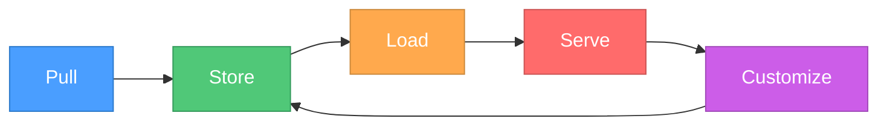

# Chapter 2: Models, Pulling, and Modelfiles

Welcome to **Chapter 2: Models, Pulling, and Modelfiles**. In this part of **Ollama Tutorial: Running and Serving LLMs Locally**, you will build an intuitive mental model first, then move into concrete implementation details and practical production tradeoffs.


> Discover, manage, and customize models with Modelfiles and parameters. Learn how quantization works, which model families exist, how to import your own weights, and how to keep your disk tidy.

## The Model Lifecycle

Before diving into commands, it helps to see the big picture. Every model you work with in Ollama moves through a simple lifecycle:



| Stage | What happens |
|---|---|
| **Pull** | Download a model from the Ollama library (or import a local GGUF file). |
| **Store** | The model blob is saved under `~/.ollama/models` on disk. |
| **Load** | When you first run a model, Ollama loads its weights into RAM (and VRAM when a GPU is available). |
| **Serve** | The loaded model handles inference requests through the CLI or API. |
| **Customize** | You create a Modelfile to wrap a base model with a system prompt, parameters, or adapters, then store the result as a new named model. |

This cycle means you can always go back and re-customize without re-downloading the base weights.

---

## Browsing and Pulling Models

The Ollama library at [ollama.com/library](https://ollama.com/library) lists every officially supported model. From the CLI you can pull any of them by name and optional tag:

```bash
ollama list                     # show all installed models
ollama pull llama3:8b           # download a specific size tag
ollama pull mistral             # latest default tag
ollama pull phi3:mini           # small and fast
```

Tags follow the pattern `model:variant`. When you omit the tag, Ollama pulls the default variant (usually the smallest recommended size).

### Common tags at a glance

- `llama3`, `llama3:8b`, `llama3:70b`
- `mistral`, `mixtral:8x7b`
- `phi3:mini`, `phi3:medium`
- `qwen2`, `qwen2:72b`
- `gemma`, `gemma:7b`

### Removing and copying models

```bash
ollama rm llama3:8b             # delete a model from disk
ollama cp llama3:8b my-llama3   # copy/rename (cheap, shares blobs)
```

Copying is almost free on disk because Ollama uses content-addressed storage. The copy points to the same underlying blob until you customize it.

---

## Popular Models Comparison

Choosing a model can be overwhelming. The table below gives you a starting point. RAM figures are approximate for the default quantization that Ollama ships.

| Model | Default Size | Strengths | Best Use Case | RAM Needed |
|---|---|---|---|---|
| **Llama 3 8B** | ~4.7 GB | Strong general reasoning, good instruction following | General assistant, summarization, Q&A | 8 GB |
| **Llama 3 70B** | ~40 GB | Near-frontier quality, excellent coding | Complex reasoning, long-form writing | 48 GB+ |
| **Mistral 7B** | ~4.1 GB | Fast, strong for its size, great at European languages | Chatbots, translation, light coding | 8 GB |
| **Mixtral 8x7B** | ~26 GB | Mixture-of-experts, high throughput | Multi-domain assistant, enterprise apps | 32 GB+ |
| **Phi-3 Mini** | ~2.4 GB | Tiny footprint, surprisingly capable | Edge devices, quick prototyping, CI pipelines | 4 GB |
| **Phi-3 Medium** | ~7.5 GB | Best quality-to-size in the Phi family | Coding assistance, structured extraction | 10 GB |
| **Qwen 2 7B** | ~4.4 GB | Strong multilingual, excellent at Chinese/English | Multilingual chat, data extraction | 8 GB |
| **Qwen 2 72B** | ~41 GB | Top-tier multilingual reasoning | Research, enterprise multilingual | 48 GB+ |
| **Gemma 7B** | ~5.0 GB | Lightweight, Google-trained on high-quality data | Summarization, lightweight assistants | 8 GB |
| **CodeGemma 7B** | ~5.0 GB | Purpose-built for code generation | Code completion, refactoring, review | 8 GB |
| **DeepSeek Coder** | ~4.5 GB | Trained on 2T tokens of code | Code generation, debugging, unit tests | 8 GB |

**Tip:** If you are just getting started, `phi3:mini` lets you validate your entire pipeline on a laptop with 8 GB of RAM. Once everything works, swap in a larger model for production quality.

---

## Model Parameters (Runtime)

Every time you call a model you can override its default generation parameters. Use the `options` object in API calls or pass flags in the CLI:

| Parameter | Range / Type | What it controls |
|---|---|---|
| `temperature` | 0 -- 1.5 | Randomness. Lower is more deterministic. |
| `top_p` | 0 -- 1.0 | Nucleus sampling cutoff. |
| `top_k` | integer | Limits token pool per step. |
| `repeat_penalty` | float | Penalizes repeated tokens. |
| `presence_penalty` | float | Penalizes tokens that have already appeared. |
| `frequency_penalty` | float | Penalizes tokens proportional to their frequency. |
| `num_ctx` | integer | Context window in tokens (e.g., 4096, 8192). |
| `num_gpu` | integer | Number of GPU layers. Auto-detected; override if needed. |
| `num_predict` | integer | Maximum tokens to generate. |

### Example: tuning via the API

```bash
curl http://localhost:11434/api/chat -d '{
  "model": "mistral",
  "options": {
    "temperature": 0.7,
    "top_p": 0.9,
    "num_ctx": 4096
  },
  "messages": [{"role": "user", "content": "Give me 3 startup ideas"}]
}'
```

### Example: tuning via the CLI

```bash
ollama run mistral --verbose \
  "Give me 3 startup ideas" \
  --num-ctx 4096
```

The `--verbose` flag prints timing stats after each response so you can see how parameter changes affect speed.

---

## Modelfiles (Build Custom Models)

A **Modelfile** is a plain-text recipe that tells Ollama how to create a new model from a base model plus your own configuration. Think of it like a Dockerfile, but for LLMs.

### Modelfile syntax reference

| Instruction | Purpose |
|---|---|
| `FROM <base>` | Required. The base model name or path to a GGUF file. |
| `SYSTEM "<text>"` | Sets the default system prompt baked into the model. |
| `PARAMETER <key> <value>` | Sets a default generation parameter. |
| `TEMPLATE "<text>"` | Custom prompt template using Go template syntax. |
| `FORMAT json` | Encourages structured JSON output. |
| `ADAPTER <path>` | Applies a LoRA or QLoRA adapter file. |
| `LICENSE "<text>"` | Embeds a license string into model metadata. |
| `MESSAGE <role> <content>` | Seeds the conversation with example messages. |

### Build and run workflow

```bash
# 1. Write a Modelfile (any filename works)
# 2. Create the model
ollama create my-model -f ./Modelfile

# 3. Test it
ollama run my-model "Hello, who are you?"

# 4. Inspect metadata
ollama show my-model
```

Now let's look at three complete, real-world Modelfile examples.

---

### Worked Example 1: Code Assistant

This model is tuned for concise, accurate code generation. It uses a low temperature so answers are deterministic, a large context window for reading long files, and a system prompt that keeps responses focused.

```
# Modelfile.code-assistant
FROM llama3:8b

SYSTEM """You are a senior software engineer acting as a code assistant.
Rules:
- Always respond with code first, explanation second.
- Use the language the user specifies. Default to Python if unspecified.
- Include brief inline comments in generated code.
- When fixing bugs, show the original line and the corrected line.
- Never apologize or add filler phrases.
"""

PARAMETER temperature 0.1
PARAMETER top_p 0.9
PARAMETER num_ctx 8192
PARAMETER repeat_penalty 1.1
PARAMETER num_predict 2048
```

Build and test:

```bash
ollama create code-assistant -f Modelfile.code-assistant

ollama run code-assistant "Write a Python function that merges two sorted lists in O(n) time"
```

Because the temperature is set to 0.1 the model will produce nearly identical output every time, which is exactly what you want for code generation.

---

### Worked Example 2: JSON Extractor

This model takes unstructured text and returns clean JSON. The `FORMAT json` instruction plus a strict system prompt make it reliable for pipelines.

```
# Modelfile.json-extractor
FROM mistral

SYSTEM """You are a structured data extraction engine.
Given any input text, extract entities and return ONLY valid JSON.
Do not include markdown fences, explanations, or commentary.

Output schema:
{
  "entities": [
    {
      "name": "<string>",
      "type": "<person|organization|location|date|other>",
      "confidence": <0.0-1.0>
    }
  ],
  "summary": "<one sentence summary of the input>"
}
"""

FORMAT json
PARAMETER temperature 0.0
PARAMETER top_p 0.85
PARAMETER num_ctx 4096
PARAMETER num_predict 1024
PARAMETER repeat_penalty 1.0

MESSAGE user "Acme Corp announced on Jan 5 that CEO Jane Doe will open a new office in Berlin."
MESSAGE assistant "{\"entities\":[{\"name\":\"Acme Corp\",\"type\":\"organization\",\"confidence\":0.95},{\"name\":\"Jane Doe\",\"type\":\"person\",\"confidence\":0.97},{\"name\":\"Berlin\",\"type\":\"location\",\"confidence\":0.99},{\"name\":\"Jan 5\",\"type\":\"date\",\"confidence\":0.90}],\"summary\":\"Acme Corp CEO Jane Doe will open a new Berlin office.\"}"
```

Build and test:

```bash
ollama create json-extractor -f Modelfile.json-extractor

echo "SpaceX launched Starship from Boca Chica on March 14. Elon Musk watched from mission control." \
  | ollama run json-extractor
```

The `MESSAGE` instructions at the bottom act as few-shot examples. They teach the model the exact output shape you expect, which dramatically improves consistency.

---

### Worked Example 3: Creative Writer

This model is the opposite of the code assistant -- it values variety, flair, and unexpected turns. A high temperature and generous top-k let it explore the token space.

```
# Modelfile.creative-writer
FROM llama3:8b

SYSTEM """You are a world-class creative writing collaborator.
- Write vivid, sensory prose with varied sentence lengths.
- Embrace metaphor, subtext, and surprising word choices.
- Match the genre and tone the user requests (fantasy, sci-fi, literary, humor, etc.).
- When asked to continue a passage, maintain voice consistency.
- Avoid cliches. Prefer fresh imagery over stock phrases.
"""

PARAMETER temperature 1.2
PARAMETER top_p 0.95
PARAMETER top_k 80
PARAMETER num_ctx 8192
PARAMETER num_predict 4096
PARAMETER repeat_penalty 1.15
PARAMETER presence_penalty 0.6
```

Build and test:

```bash
ollama create creative-writer -f Modelfile.creative-writer

ollama run creative-writer "Write the opening paragraph of a noir detective story set on Mars"
```

The high `repeat_penalty` and `presence_penalty` push the model away from repetitive phrasing, which is essential for creative text that needs to stay interesting over long passages.

---

### Adding Templates and Formats

The `TEMPLATE` instruction lets you control the raw prompt structure sent to the model. This is useful when a model expects a particular chat format:

```
FROM mistral
TEMPLATE """
{{ if .System }}[INST] <<SYS>>{{ .System }}<</SYS>> {{ end }}
{{ .Prompt }} [/INST]
"""
FORMAT json
PARAMETER temperature 0.1
```

- `TEMPLATE` uses Go template syntax. `.System` and `.Prompt` are injected by Ollama.
- `FORMAT json` tells Ollama to constrain the output grammar toward valid JSON.

### Using LoRA / Adapters

If you have fine-tuned a LoRA adapter, you can layer it on top of a base model:

```
FROM llama3
ADAPTER ./adapters/my-lora.bin
SYSTEM "You are a domain-specific assistant."
PARAMETER num_ctx 4096
```

The adapter file must be in a format compatible with the base model architecture. Ollama currently supports GGUF-based adapters.

---

## Understanding Quantization

When people talk about running a "7B model in 4 GB of RAM," quantization is the reason that is possible. This section explains what it is and how to pick the right level.

### What is quantization?

Full-precision model weights use 16 bits (FP16) or 32 bits (FP32) per parameter. A 7-billion-parameter model at FP16 needs about 14 GB just for the weights. **Quantization** reduces each weight to fewer bits -- 8, 5, 4, or even 2 -- shrinking the file and the RAM footprint at the cost of some quality.

### The GGUF format

GGUF (GPT-Generated Unified Format) is the file format used by `llama.cpp` and Ollama. It bundles the quantized weights, tokenizer, and metadata into a single file. When you pull a model from the Ollama library, you are downloading a GGUF blob.

### Common quantization levels

| Quant Label | Bits per Weight | File Size (7B) | Quality | Speed | When to use |
|---|---|---|---|---|---|
| `Q2_K` | ~2.5 | ~2.7 GB | Low | Fastest | Extreme memory constraints, rough prototyping |
| `Q3_K_S` | ~3.0 | ~3.2 GB | Low-Medium | Very fast | Edge devices with 4 GB RAM |
| `Q3_K_M` | ~3.3 | ~3.5 GB | Medium-Low | Fast | Budget hardware testing |
| `Q4_K_S` | ~4.0 | ~3.9 GB | Medium | Fast | Good default for speed-sensitive apps |
| `Q4_K_M` | ~4.5 | ~4.3 GB | **Good (recommended)** | **Balanced** | **Best all-round choice for most users** |
| `Q5_K_S` | ~5.0 | ~4.8 GB | Good-High | Moderate | When you want a quality bump |
| `Q5_K_M` | ~5.3 | ~5.1 GB | High | Moderate | Quality-sensitive production use |
| `Q6_K` | ~6.0 | ~5.8 GB | Very High | Slower | Near-original quality |
| `Q8_0` | ~8.0 | ~7.5 GB | Excellent | Slow | Benchmarking, reference baseline |
| `FP16` | 16 | ~14 GB | Original | Slowest | Research, fine-tuning starting point |

### How to read a model tag

When you see a tag like `llama3:8b-q4_K_M`, it tells you:

- **llama3** -- model family
- **8b** -- 8 billion parameters
- **q4_K_M** -- Q4_K_M quantization

If no quantization is mentioned in the tag, Ollama picks a sensible default (usually Q4_K_M or Q4_0).

### Picking the right quantization

A simple rule of thumb:

1. **Laptop / 8 GB RAM** -- use Q4_K_M or smaller.
2. **Desktop / 16--32 GB RAM** -- use Q5_K_M for a quality boost.
3. **Server / 64 GB+ RAM** -- use Q6_K or Q8_0 if quality matters more than throughput.
4. **GPU with limited VRAM (6--8 GB)** -- use Q4_K_S to keep the whole model in VRAM.

The quality difference between Q4_K_M and Q5_K_M is noticeable in creative writing and nuanced reasoning. For straightforward Q&A or code generation, Q4_K_M is usually indistinguishable from higher quants.

---

## Model Families

The open-weight LLM landscape has several major families. Each has different training data, architecture choices, and sweet spots.

### Llama (Meta)

Meta's Llama family is the most widely used open-weight foundation. Llama 3 improved instruction following, multilingual support, and coding ability over Llama 2.

- **Strengths:** Broad general knowledge, strong reasoning, large community and ecosystem.
- **Best for:** General assistants, summarization, Q&A, RAG pipelines.
- **Sizes:** 8B, 70B (and community-made variants).

### Mistral / Mixtral (Mistral AI)

Mistral 7B punches well above its weight class. Mixtral 8x7B is a mixture-of-experts model that activates only a fraction of its parameters per token, giving excellent throughput.

- **Strengths:** Speed, European language quality, strong coding, efficient inference.
- **Best for:** Chatbots, translation, real-time applications, multilingual support.
- **Sizes:** 7B (Mistral), 8x7B (Mixtral).

### Phi (Microsoft)

The Phi series proves that small models trained on high-quality, curated data can compete with models several times their size.

- **Strengths:** Tiny RAM footprint, good reasoning for its size, fast inference.
- **Best for:** Edge deployment, CI pipeline testing, resource-constrained environments, mobile.
- **Sizes:** 3.8B (Mini), 14B (Medium).

### Qwen (Alibaba Cloud)

Qwen 2 is a multilingual powerhouse with particularly strong Chinese and English performance. It also performs well on math and code benchmarks.

- **Strengths:** Best-in-class multilingual, strong math and structured data.
- **Best for:** Multilingual applications, data extraction, math tutoring.
- **Sizes:** 7B, 72B (and smaller instruct variants).

### Gemma (Google)

Gemma models are built on the same research and technology as Google's Gemini family but released as open weights. CodeGemma is a variant fine-tuned specifically for code tasks.

- **Strengths:** Clean training data, solid reasoning, well-documented.
- **Best for:** Summarization, lightweight assistants, code completion (CodeGemma).
- **Sizes:** 2B, 7B.

### Quick decision guide

| I need... | Try first |
|---|---|
| A reliable general assistant | Llama 3 8B |
| The smallest possible model | Phi-3 Mini |
| Multilingual support | Qwen 2 7B |
| Fast inference on modest hardware | Mistral 7B |
| Code generation and review | DeepSeek Coder or CodeGemma |
| Frontier-level quality locally | Llama 3 70B or Qwen 2 72B |

---

## Importing Custom Models

You are not limited to the Ollama library. If you find a GGUF file on HuggingFace or train your own, you can import it directly.

### Step 1: Download a GGUF from HuggingFace

Many model authors publish GGUF quantizations on HuggingFace. Look for repositories with names like `*-GGUF`. You can download with `curl`, `wget`, or the HuggingFace CLI:

```bash
# Example: downloading a Q4_K_M quant of a model
# Replace the URL with the actual file from the HuggingFace repo
curl -L -o my-model.Q4_K_M.gguf \
  "https://huggingface.co/TheBloke/Example-7B-GGUF/resolve/main/example-7b.Q4_K_M.gguf"
```

### Step 2: Create a Modelfile pointing to the GGUF

```
# Modelfile.custom
FROM ./my-model.Q4_K_M.gguf

SYSTEM "You are a helpful assistant."
PARAMETER temperature 0.7
PARAMETER num_ctx 4096
```

The `FROM` line points to a local file path instead of a library model name. Ollama will register the GGUF blob in its store.

### Step 3: Build and test

```bash
ollama create my-custom-model -f Modelfile.custom
ollama run my-custom-model "Tell me about yourself"
```

### Step 4: Verify the import

```bash
ollama show my-custom-model
```

This prints the model's metadata including parameter count, quantization level, context length, and your system prompt.

### Tips for importing

- Make sure the GGUF file is compatible with the version of `llama.cpp` that your Ollama release uses. If you get an error about unsupported format versions, update Ollama first.
- You can also import safetensors by first converting them to GGUF using the `llama.cpp` conversion scripts, but GGUF is the simplest path.
- Adapters (LoRA) must also be in GGUF format when used with the `ADAPTER` instruction.

---

## Model Storage Management

As you experiment with many models, disk usage can grow quickly. A single 70B model can take 40 GB or more. Here is how to stay in control.

### Where models live

| Platform | Default path |
|---|---|
| macOS / Linux | `~/.ollama/models` |
| Windows (WSL) | `~/.ollama/models` inside your WSL distro |

You can change the storage location by setting the `OLLAMA_MODELS` environment variable before starting the server:

```bash
export OLLAMA_MODELS="/mnt/external-drive/ollama-models"
ollama serve
```

### Checking disk usage

```bash
# List all models with their sizes
ollama list

# See detailed info for one model
ollama show llama3:8b

# Check total disk usage of the models directory
du -sh ~/.ollama/models
```

### Cleaning up

```bash
# Remove a specific model
ollama rm llama3:70b

# Remove a custom model you no longer need
ollama rm json-extractor

# List what remains
ollama list
```

### Sharing blobs between models

Ollama uses content-addressed storage. When you create a custom model with `ollama create`, it does not duplicate the base model weights. The custom model's metadata layer points to the same blob. This means:

- `ollama cp llama3:8b my-llama` costs almost zero extra disk.
- Creating ten Modelfile variants of `mistral` only stores the weights once.
- Deleting a custom model does not delete the shared base blob unless it is the last reference.

### Practical disk-saving tips

1. **Remove models you are not using.** It sounds obvious, but it is the single most effective strategy.
2. **Prefer smaller quants when quality is acceptable.** Q4_K_M is roughly half the size of Q8_0.
3. **Avoid pulling both the tagged and untagged version.** `ollama pull mistral` and `ollama pull mistral:latest` are the same blob, but `ollama pull mistral:7b` might be different. Check with `ollama list`.
4. **Move storage to an external drive** using `OLLAMA_MODELS` if your boot drive is small.
5. **Back up your `~/.ollama/models` directory** if you maintain curated custom models. A simple `rsync` or `tar` works.

---

## Best Practices

- **Start small.** Validate your entire pipeline with `phi3:mini` before scaling up.
- **Pin your tags.** Use `llama3:8b` instead of just `llama3` to avoid unexpected weight changes when the library updates.
- **Use `FORMAT json` in Modelfiles** when you need structured output for downstream parsing.
- **Keep separate custom models** for different personas and use cases. They are cheap to store.
- **Version your Modelfiles** in git alongside your application code so changes are tracked and reproducible.
- **Test quantization trade-offs** on your actual workload. Benchmark with a sample of real prompts rather than relying only on leaderboard scores.

---

## Summary

In this chapter you learned how to browse and pull models, compare popular options, write Modelfiles with real-world examples, understand quantization trade-offs, navigate the major model families, import custom GGUF weights from HuggingFace, and manage disk usage. With these skills you can confidently pick, configure, and maintain the right models for any project.

---

Previous: [Chapter 1: Getting Started](01-getting-started.md) | Next: [Chapter 3: Chat & Completions](03-chat-completions.md)

## Depth Expansion Playbook

<!-- depth-expansion-v2 -->

This chapter is expanded to v1-style depth for production-grade learning and implementation quality.

### Strategic Context

- tutorial: **Ollama Tutorial: Running and Serving LLMs Locally**
- tutorial slug: **ollama-tutorial**
- chapter focus: **Chapter 2: Models, Pulling, and Modelfiles**
- system context: **Ollama Tutorial**
- objective: move from surface-level usage to repeatable engineering operation

### Architecture Decomposition

1. Define the runtime boundary for `Chapter 2: Models, Pulling, and Modelfiles`.
2. Separate control-plane decisions from data-plane execution.
3. Capture input contracts, transformation points, and output contracts.
4. Trace state transitions across request lifecycle stages.
5. Identify extension hooks and policy interception points.
6. Map ownership boundaries for team and automation workflows.
7. Specify rollback and recovery paths for unsafe changes.
8. Track observability signals for correctness, latency, and cost.

### Operator Decision Matrix

| Decision Area | Low-Risk Path | High-Control Path | Tradeoff |
|:--------------|:--------------|:------------------|:---------|
| Runtime mode | managed defaults | explicit policy config | speed vs control |
| State handling | local ephemeral | durable persisted state | simplicity vs auditability |
| Tool integration | direct API use | mediated adapter layer | velocity vs governance |
| Rollout method | manual change | staged + canary rollout | effort vs safety |
| Incident response | best effort logs | runbooks + SLO alerts | cost vs reliability |

### Failure Modes and Countermeasures

| Failure Mode | Early Signal | Root Cause Pattern | Countermeasure |
|:-------------|:-------------|:-------------------|:---------------|
| stale context | inconsistent outputs | missing refresh window | enforce context TTL and refresh hooks |
| policy drift | unexpected execution | ad hoc overrides | centralize policy profiles |
| auth mismatch | 401/403 bursts | credential sprawl | rotation schedule + scope minimization |
| schema breakage | parser/validation errors | unmanaged upstream changes | contract tests per release |
| retry storms | queue congestion | no backoff controls | jittered backoff + circuit breakers |
| silent regressions | quality drop without alerts | weak baseline metrics | eval harness with thresholds |

### Implementation Runbook

1. Establish a reproducible baseline environment.
2. Capture chapter-specific success criteria before changes.
3. Implement minimal viable path with explicit interfaces.
4. Add observability before expanding feature scope.
5. Run deterministic tests for happy-path behavior.
6. Inject failure scenarios for negative-path validation.
7. Compare output quality against baseline snapshots.
8. Promote through staged environments with rollback gates.
9. Record operational lessons in release notes.

### Quality Gate Checklist

- [ ] chapter-level assumptions are explicit and testable
- [ ] API/tool boundaries are documented with input/output examples
- [ ] failure handling includes retry, timeout, and fallback policy
- [ ] security controls include auth scopes and secret rotation plans
- [ ] observability includes logs, metrics, traces, and alert thresholds
- [ ] deployment guidance includes canary and rollback paths
- [ ] docs include links to upstream sources and related tracks
- [ ] post-release verification confirms expected behavior under load

### Source Alignment

- [Ollama Repository](https://github.com/ollama/ollama)
- [Ollama Releases](https://github.com/ollama/ollama/releases)
- [Ollama Website and Docs](https://ollama.com/)

### Cross-Tutorial Connection Map

- [Open WebUI Tutorial](../open-webui-tutorial/)
- [LiteLLM Tutorial](../litellm-tutorial/)
- [Llama.cpp Tutorial](../llama-cpp-tutorial/)
- [VLLM Tutorial](../vllm-tutorial/)
- [Chapter 1: Getting Started](01-getting-started.md)

### Advanced Practice Exercises

1. Build a minimal end-to-end implementation for `Chapter 2: Models, Pulling, and Modelfiles`.
2. Add instrumentation and measure baseline latency and error rate.
3. Introduce one controlled failure and confirm graceful recovery.
4. Add policy constraints and verify they are enforced consistently.
5. Run a staged rollout and document rollback decision criteria.

### Review Questions

1. Which execution boundary matters most for this chapter and why?
2. What signal detects regressions earliest in your environment?
3. What tradeoff did you make between delivery speed and governance?
4. How would you recover from the highest-impact failure mode?
5. What must be automated before scaling to team-wide adoption?

## What Problem Does This Solve?

Most teams struggle here because the hard part is not writing more code, but deciding clear boundaries for `ollama`, `PARAMETER`, `model` so behavior stays predictable as complexity grows.

In practical terms, this chapter helps you avoid three common failures:

- coupling core logic too tightly to one implementation path
- missing the handoff boundaries between setup, execution, and validation
- shipping changes without clear rollback or observability strategy

After working through this chapter, you should be able to reason about `Chapter 2: Models, Pulling, and Modelfiles` as an operating subsystem inside **Ollama Tutorial: Running and Serving LLMs Locally**, with explicit contracts for inputs, state transitions, and outputs.

Use the implementation notes around `Modelfile`, `llama3`, `assistant` as your checklist when adapting these patterns to your own repository.

## How it Works Under the Hood

Under the hood, `Chapter 2: Models, Pulling, and Modelfiles` usually follows a repeatable control path:

1. **Context bootstrap**: initialize runtime config and prerequisites for `ollama`.
2. **Input normalization**: shape incoming data so `PARAMETER` receives stable contracts.
3. **Core execution**: run the main logic branch and propagate intermediate state through `model`.
4. **Policy and safety checks**: enforce limits, auth scopes, and failure boundaries.
5. **Output composition**: return canonical result payloads for downstream consumers.
6. **Operational telemetry**: emit logs/metrics needed for debugging and performance tuning.

When debugging, walk this sequence in order and confirm each stage has explicit success/failure conditions.

## Source Walkthrough

Use the following upstream sources to verify implementation details while reading this chapter:

- [Ollama Repository](https://github.com/ollama/ollama)
  Why it matters: authoritative reference on `Ollama Repository` (github.com).
- [Ollama Releases](https://github.com/ollama/ollama/releases)
  Why it matters: authoritative reference on `Ollama Releases` (github.com).
- [Ollama Website and Docs](https://ollama.com/)
  Why it matters: authoritative reference on `Ollama Website and Docs` (ollama.com).

Suggested trace strategy:
- search upstream code for `ollama` and `PARAMETER` to map concrete implementation paths
- compare docs claims against actual runtime/config code before reusing patterns in production

## Chapter Connections

- [Tutorial Index](index.md)
- [Previous Chapter: Chapter 1: Getting Started with Ollama](01-getting-started.md)
- [Next Chapter: Chapter 3: Chat, Completions, and Parameters](03-chat-completions.md)
- [Main Catalog](../../README.md#-tutorial-catalog)
- [A-Z Tutorial Directory](../../discoverability/tutorial-directory.md)
