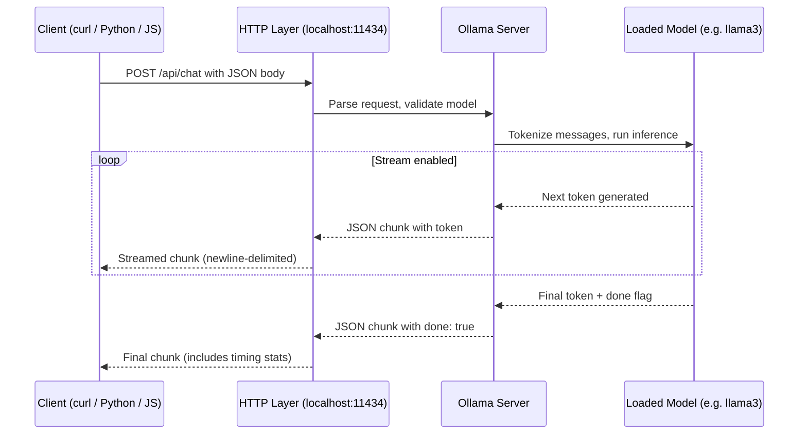

# Chapter 3: Chat, Completions, and Parameters

> Build chats and completions with streaming, JSON output, system prompts, conversation history, and safe parameter tuning -- all running locally on your machine.

In this chapter, you will learn how requests flow through Ollama, how to use both the Chat and Completions APIs, how to stream responses in real time, and how to fine-tune generation behavior with parameters. By the end, you will be comfortable building multi-turn conversations with structured output.

---

## How a Request Flows Through Ollama

Before writing any code, it helps to understand what happens when you send a prompt to Ollama. The diagram below shows the full lifecycle of a single request.



Key things to notice:

- **Ollama runs a local HTTP server** on port 11434 by default. Every interaction is a standard REST call -- no SDK lock-in required.
- **Streaming is the default behavior.** Ollama sends tokens back one at a time as newline-delimited JSON objects. You can disable streaming by setting `"stream": false` in your request.
- **The model stays loaded in memory** after the first request (for about five minutes by default), so subsequent requests start much faster.
- **Timing statistics** are included in the final chunk, giving you insight into prompt evaluation speed and token generation rate.

---

## Chat vs Completions API

Ollama exposes two main generation endpoints. They serve different purposes, and choosing the right one matters.

| Feature | `/api/chat` (Chat) | `/api/generate` (Completions) |
|---|---|---|
| **Input format** | Array of `messages` with roles | Single `prompt` string |
| **Roles supported** | `system`, `user`, `assistant` | N/A (raw text only) |
| **Best for** | Conversations, assistants, agents | One-shot generation, simple prompts |
| **OpenAI compatibility** | Yes (`/v1/chat/completions`) | Partial (`/v1/completions`) |
| **Multi-turn support** | Built-in via message history | Manual (you concatenate context) |
| **Streaming** | Yes (default) | Yes (default) |
| **JSON format support** | Yes | Yes |

**When to use Chat:** Almost always. The chat endpoint gives you structured roles, making it easy to separate instructions (system), user input, and model responses. It is also the format that most libraries and frameworks expect.

**When to use Completions:** When you need raw text-in, text-out generation -- for example, code completion, text transformation, or when you are building your own prompt template and do not want role formatting.

### Chat Endpoint Example

```bash
curl http://localhost:11434/api/chat -d '{
  "model": "llama3",
  "messages": [
    {"role": "system", "content": "You are a concise assistant."},
    {"role": "user", "content": "Explain RAG in 3 bullets"}
  ],
  "stream": false
}'
```

Python:

```python
import requests

response = requests.post("http://localhost:11434/api/chat", json={
    "model": "llama3",
    "messages": [
        {"role": "system", "content": "You are concise."},
        {"role": "user", "content": "Summarize Ollama in two sentences."}
    ],
    "stream": False
})

data = response.json()
print(data["message"]["content"])
```

Node.js (using the OpenAI-compatible endpoint):

```javascript
import OpenAI from "openai";

const client = new OpenAI({
  baseURL: "http://localhost:11434/v1",
  apiKey: "ollama"   // required by the SDK but not checked by Ollama
});

const chat = await client.chat.completions.create({
  model: "llama3",
  messages: [{ role: "user", content: "List 3 MLOps tools" }],
});

console.log(chat.choices[0].message.content);
```

### Completions Endpoint Example

```bash
curl http://localhost:11434/api/generate -d '{
  "model": "llama3",
  "prompt": "Write a haiku about databases",
  "stream": false
}'
```

Python:

```python
import requests

response = requests.post("http://localhost:11434/api/generate", json={
    "model": "llama3",
    "prompt": "Translate the following English text to French:\n\nThe weather is nice today.",
    "stream": False
})

print(response.json()["response"])
```

---

## Streaming Responses

Streaming is Ollama's default mode and is one of the best features of running models locally. Instead of waiting for the entire response, you receive tokens as they are generated. This makes your application feel much more responsive.

### Streaming with curl

```bash
curl -N http://localhost:11434/api/chat -d '{
  "model": "mistral",
  "messages": [{"role": "user", "content": "Tell a short story about a robot"}],
  "stream": true
}'
```

Each line of output is a JSON object. Most lines look like this:

```json
{"model":"mistral","created_at":"2024-...","message":{"role":"assistant","content":" once"},"done":false}
```

The final line has `"done": true` and includes performance statistics like `total_duration`, `eval_count`, and `eval_duration`.

### Streaming with Python (requests library)

The `requests` library supports streaming natively. You read the response line by line and parse each JSON chunk as it arrives.

```python
import requests
import json

def stream_chat(model: str, messages: list[dict]) -> str:
    """Stream a chat response from Ollama, printing tokens as they arrive."""
    full_response = []

    with requests.post(
        "http://localhost:11434/api/chat",
        json={"model": model, "messages": messages, "stream": True},
        stream=True    # tells requests to not download the full body at once
    ) as resp:
        resp.raise_for_status()

        for line in resp.iter_lines():
            if not line:
                continue
            chunk = json.loads(line)

            # Each chunk has a "message" with a "content" fragment
            token = chunk.get("message", {}).get("content", "")
            print(token, end="", flush=True)
            full_response.append(token)

            # The final chunk signals completion
            if chunk.get("done"):
                stats = {
                    "total_tokens": chunk.get("eval_count", 0),
                    "duration_s": chunk.get("total_duration", 0) / 1e9,
                }
                print(f"\n\n--- Stats: {stats}")

    return "".join(full_response)


# Usage
messages = [
    {"role": "system", "content": "You are a helpful assistant."},
    {"role": "user", "content": "Explain how streaming works in 3 sentences."}
]

result = stream_chat("llama3", messages)
```

This pattern is useful for CLI tools, chatbot UIs, and any application where perceived latency matters. You can also adapt it to feed tokens into a web socket or a server-sent events (SSE) endpoint for browser-based applications.

### Disabling Streaming

If you just want the complete response in a single JSON object (simpler to parse, but slower to feel), set `"stream": false`:

```python
response = requests.post("http://localhost:11434/api/chat", json={
    "model": "llama3",
    "messages": [{"role": "user", "content": "Hello!"}],
    "stream": False
})

print(response.json()["message"]["content"])
```

---

## System Prompts

System prompts are your primary tool for steering model behavior. They are included as the first message with `"role": "system"` and establish the ground rules before the user ever speaks.

### Why System Prompts Matter

Without a system prompt, the model falls back to its default training behavior, which is usually verbose and general-purpose. A good system prompt can:

- **Set the tone** (formal, casual, technical)
- **Constrain the format** (bullet points, JSON, single paragraph)
- **Define the persona** (expert, tutor, code reviewer)
- **Establish rules** (no speculation, cite sources, stay on topic)

### Effective System Prompt Patterns

Here are battle-tested patterns you can adapt for your own applications.

**Pattern 1: The Concise Expert**

```python
system_prompt = """You are a senior software engineer.
Answer questions about code accurately and concisely.
Use code blocks with language tags.
If you are unsure, say so rather than guessing."""
```

**Pattern 2: The Structured Responder**

```python
system_prompt = """You are a research assistant.
Always respond in this exact format:

SUMMARY: (one sentence overview)
KEY POINTS:
- (point 1)
- (point 2)
- (point 3)
CONFIDENCE: (high / medium / low)"""
```

**Pattern 3: The Scoped Helper**

```python
system_prompt = """You are a Python programming tutor for beginners.
Only answer questions about Python.
If asked about other topics, politely redirect to Python.
Use simple language and explain concepts step by step.
Always include a runnable code example."""
```

**Pattern 4: The JSON-Only Responder**

```python
system_prompt = """You are a data extraction API.
You ONLY output valid JSON. No markdown, no explanation, no preamble.
If you cannot extract the requested data, return: {"error": "unable to extract"}"""
```

### Tips for Better System Prompts

1. **Be specific.** "Be concise" is weaker than "Respond in three sentences or fewer."
2. **Give examples.** Show the model the format you want. Models follow demonstrated patterns reliably.
3. **State what NOT to do.** "Do not include disclaimers" is surprisingly effective.
4. **Keep it short.** Long system prompts eat into your context window. Aim for 50-150 words.
5. **Test with edge cases.** Try off-topic questions to make sure the model stays on track.

---

## Conversation History Management

When you use the `/api/chat` endpoint, Ollama does not automatically remember previous messages. Each request is stateless -- you must send the full conversation history every time. This gives you complete control, but it also means you need to manage context carefully.

### How Context Windows Work

Every model has a fixed context window (measured in tokens). For example:

- **llama3 (8B):** 8,192 tokens by default (extendable via `num_ctx`)
- **mistral:** 8,192 tokens
- **phi3:mini:** 4,096 tokens

Your conversation history, system prompt, and the model's new response must all fit inside this window. If the total exceeds the limit, the model will not see the earliest messages.

A rough rule of thumb: **1 token is about 4 characters** in English. So an 8,192-token context window holds roughly 32,000 characters of combined input and output.

### Truncation Strategies

When conversations get long, you need a strategy for deciding what to keep and what to drop.

**Strategy 1: Sliding Window (Simple)**

Keep only the last N message pairs. This is the easiest approach and works well for casual chat applications.

```python
def sliding_window(messages: list[dict], max_pairs: int = 10) -> list[dict]:
    """Keep the system prompt and the last N user/assistant pairs."""
    system_msgs = [m for m in messages if m["role"] == "system"]
    conversation = [m for m in messages if m["role"] != "system"]

    # Keep only the last max_pairs * 2 messages (user + assistant = 1 pair)
    trimmed = conversation[-(max_pairs * 2):]

    return system_msgs + trimmed
```

**Strategy 2: Token-Based Truncation (Accurate)**

Count tokens and drop the oldest messages until you are under the limit. This is more precise but requires a tokenizer or a good estimate.

```python
def truncate_by_tokens(
    messages: list[dict],
    max_tokens: int = 6000,
    chars_per_token: float = 4.0
) -> list[dict]:
    """Drop oldest non-system messages until total is under max_tokens."""
    system_msgs = [m for m in messages if m["role"] == "system"]
    conversation = [m for m in messages if m["role"] != "system"]

    def estimate_tokens(msgs):
        total_chars = sum(len(m["content"]) for m in msgs)
        return int(total_chars / chars_per_token)

    while conversation and estimate_tokens(system_msgs + conversation) > max_tokens:
        conversation.pop(0)  # remove the oldest message

    return system_msgs + conversation
```

**Strategy 3: Summarize and Compress**

For very long conversations, periodically ask the model to summarize the conversation so far, then replace the old messages with the summary. This preserves context without consuming the full window.

```python
def summarize_history(messages: list[dict], model: str = "llama3") -> list[dict]:
    """Replace old messages with an AI-generated summary."""
    import requests

    system_msgs = [m for m in messages if m["role"] == "system"]
    conversation = [m for m in messages if m["role"] != "system"]

    if len(conversation) < 10:
        return messages  # too short to need summarization

    # Take the older half and summarize it
    midpoint = len(conversation) // 2
    old_part = conversation[:midpoint]
    recent_part = conversation[midpoint:]

    old_text = "\n".join(f"{m['role']}: {m['content']}" for m in old_part)

    summary_response = requests.post(
        "http://localhost:11434/api/chat",
        json={
            "model": model,
            "messages": [
                {"role": "system", "content": "Summarize this conversation in 2-3 sentences."},
                {"role": "user", "content": old_text}
            ],
            "stream": False
        }
    )

    summary = summary_response.json()["message"]["content"]
    summary_msg = {"role": "assistant", "content": f"[Summary of earlier conversation: {summary}]"}

    return system_msgs + [summary_msg] + recent_part
```

---

## Structured JSON Output

Getting models to output valid JSON is one of the most practically useful skills. Ollama provides a `format` parameter that constrains the model to produce valid JSON.

### Using the format Parameter

The simplest way to get JSON output is to set `"format": "json"` in your request. This tells Ollama to constrain the model's output to valid JSON tokens only.

```bash
curl http://localhost:11434/api/chat -d '{
  "model": "llama3",
  "messages": [
    {
      "role": "system",
      "content": "You extract structured data from text. Always respond with valid JSON."
    },
    {
      "role": "user",
      "content": "Extract info: John Smith is 34, works at Acme Corp as a senior engineer in Seattle."
    }
  ],
  "format": "json",
  "stream": false
}'
```

Expected output:

```json
{
  "name": "John Smith",
  "age": 34,
  "company": "Acme Corp",
  "title": "Senior Engineer",
  "location": "Seattle"
}
```

### Complete Working Example in Python

Here is a full, runnable example that extracts structured data from unstructured text and validates the result.

```python
import requests
import json

def extract_structured_data(text: str, schema_description: str) -> dict:
    """
    Extract structured JSON data from unstructured text using Ollama.

    Args:
        text: The unstructured text to extract data from.
        schema_description: A description of the JSON fields you want.

    Returns:
        A parsed Python dictionary.
    """
    response = requests.post(
        "http://localhost:11434/api/chat",
        json={
            "model": "llama3",
            "messages": [
                {
                    "role": "system",
                    "content": (
                        "You are a data extraction API. "
                        "Extract the requested fields from the user's text. "
                        "Respond ONLY with valid JSON. No extra text."
                    )
                },
                {
                    "role": "user",
                    "content": (
                        f"Extract the following fields: {schema_description}\n\n"
                        f"Text: {text}"
                    )
                }
            ],
            "format": "json",
            "stream": False,
            "options": {
                "temperature": 0.1   # low temperature for consistent extraction
            }
        }
    )

    response.raise_for_status()
    raw = response.json()["message"]["content"]

    # Parse and validate
    try:
        parsed = json.loads(raw)
        return parsed
    except json.JSONDecodeError as e:
        print(f"Failed to parse JSON: {e}")
        print(f"Raw output: {raw}")
        return {}


# --- Usage ---

product_review = """
I bought the UltraWidget Pro 3000 last week for $49.99 from TechMart.
The build quality is excellent and battery lasts about 12 hours.
My only complaint is that it is a bit heavy at 380 grams.
Overall I would rate it 4 out of 5 stars.
"""

schema = "product_name, price, store, battery_life, weight, rating, pros (array), cons (array)"

result = extract_structured_data(product_review, schema)
print(json.dumps(result, indent=2))
```

Expected output:

```json
{
  "product_name": "UltraWidget Pro 3000",
  "price": 49.99,
  "store": "TechMart",
  "battery_life": "12 hours",
  "weight": "380 grams",
  "rating": "4/5",
  "pros": ["excellent build quality", "good battery life"],
  "cons": ["heavy"]
}
```

### Tips for Reliable JSON Output

1. **Always use `"format": "json"`** -- this constrains token generation at the model level, not just in the prompt.
2. **Set temperature low** (0.1-0.2) for consistent schemas.
3. **Describe the expected fields** in the prompt so the model knows what to extract.
4. **Validate on your side** -- even with format constraints, always wrap `json.loads()` in a try/except.
5. **Use the system prompt** to reinforce "JSON only, no extra text."

---

## Parameter Tuning Guide

Ollama gives you fine-grained control over how the model generates text. Understanding these parameters will help you get the right balance between creativity and accuracy for your use case.

### Temperature

Temperature controls randomness. It scales the probability distribution over the vocabulary before sampling.

```
temperature = 0.0  -->  Always pick the most likely token (deterministic)
temperature = 0.3  -->  Mostly predictable, slight variation
temperature = 0.7  -->  Balanced creativity (good default)
temperature = 1.0  -->  Full randomness from the learned distribution
temperature = 1.5+ -->  Very random, often incoherent
```

**Visual intuition:** Imagine the model is choosing between the words "happy", "glad", "joyful", and "ecstatic" to continue a sentence.

```
Low temperature (0.1):   happy: 90%  |  glad: 7%  |  joyful: 2%  |  ecstatic: 1%
                          ^^^^^^^^^^^ almost always picks "happy"

Mid temperature (0.7):   happy: 45%  |  glad: 28% |  joyful: 17% |  ecstatic: 10%
                          ^^^ likely "happy" but others have a fair chance

High temperature (1.5):  happy: 28%  |  glad: 26% |  joyful: 24% |  ecstatic: 22%
                          ^^^ nearly equal chance for any word
```

**Rule of thumb:**
- Factual Q&A, data extraction, code: `temperature: 0.1 - 0.3`
- General conversation, summaries: `temperature: 0.5 - 0.7`
- Creative writing, brainstorming: `temperature: 0.8 - 1.0`

### Top-p (Nucleus Sampling)

Top-p limits the model to the smallest set of tokens whose cumulative probability is at least `p`. It is an alternative to temperature for controlling diversity.

```
top_p = 0.1  -->  Only the top ~10% probability mass (very focused)
top_p = 0.5  -->  Top ~50% (moderate diversity)
top_p = 0.9  -->  Top ~90% (allows most reasonable tokens)
top_p = 1.0  -->  No filtering (consider everything)
```

**When to use:** If you want to allow creative responses but prevent truly nonsensical tokens, set `top_p: 0.9` with a moderate temperature.

### Top-k

Top-k limits the model to the `k` most probable tokens before sampling. It is a simpler alternative to top-p.

```
top_k = 1    -->  Greedy decoding (always most probable token)
top_k = 10   -->  Choose from top 10 tokens
top_k = 40   -->  Good default for balanced generation
top_k = 100  -->  Very diverse
```

### Repeat Penalty

Repeat penalty discourages the model from repeating words or phrases it has already generated. Without it, models sometimes get stuck in loops.

```
repeat_penalty = 1.0   -->  No penalty (default behavior)
repeat_penalty = 1.05  -->  Light penalty (subtle effect)
repeat_penalty = 1.1   -->  Moderate (good default for most tasks)
repeat_penalty = 1.3+  -->  Strong (may cause odd word choices)
```

### Putting It All Together

```bash
curl http://localhost:11434/api/chat -d '{
  "model": "llama3",
  "options": {
    "temperature": 0.3,
    "top_p": 0.9,
    "top_k": 40,
    "repeat_penalty": 1.1,
    "num_ctx": 4096,
    "num_predict": 512
  },
  "messages": [
    {"role": "system", "content": "You are a technical writer. Be precise and clear."},
    {"role": "user", "content": "Explain the CAP theorem in databases."}
  ],
  "stream": false
}'
```

### Recommended Presets

| Use Case | temperature | top_p | top_k | repeat_penalty | num_predict |
|---|---|---|---|---|---|
| Code generation | 0.1 | 0.9 | 40 | 1.05 | 1024 |
| Factual Q&A | 0.2 | 0.9 | 40 | 1.1 | 256 |
| Summarization | 0.3 | 0.85 | 40 | 1.1 | 512 |
| General chat | 0.7 | 0.9 | 50 | 1.1 | 512 |
| Creative writing | 0.9 | 0.95 | 80 | 1.15 | 1024 |
| Brainstorming | 1.0 | 1.0 | 100 | 1.0 | 512 |

---

## Multi-turn Conversations

A multi-turn conversation is a back-and-forth exchange where the model needs to remember what was said earlier. Since Ollama is stateless, you maintain the conversation history on your side and send it with every request.

### Complete Multi-turn Example

Here is a full, runnable Python script that implements a multi-turn chatbot with history management, token-based truncation, and streaming.

```python
import requests
import json
from datetime import datetime


class OllamaChat:
    """A multi-turn conversation manager for Ollama."""

    def __init__(
        self,
        model: str = "llama3",
        system_prompt: str = "You are a helpful assistant.",
        max_context_tokens: int = 6000,
        chars_per_token: float = 4.0
    ):
        self.model = model
        self.base_url = "http://localhost:11434/api/chat"
        self.max_context_tokens = max_context_tokens
        self.chars_per_token = chars_per_token
        self.messages = [{"role": "system", "content": system_prompt}]
        self.turn_count = 0

    def _estimate_tokens(self) -> int:
        """Estimate total tokens in the current message history."""
        total_chars = sum(len(m["content"]) for m in self.messages)
        return int(total_chars / self.chars_per_token)

    def _truncate_if_needed(self):
        """Remove oldest non-system messages if context is getting full."""
        while (
            self._estimate_tokens() > self.max_context_tokens
            and len(self.messages) > 2   # keep at least system + 1 message
        ):
            # Find the first non-system message and remove it
            for i, msg in enumerate(self.messages):
                if msg["role"] != "system":
                    removed = self.messages.pop(i)
                    print(f"  [Truncated old {removed['role']} message to fit context window]")
                    break

    def send(self, user_message: str, stream: bool = True) -> str:
        """Send a message and get a response, maintaining conversation history."""
        self.turn_count += 1
        self.messages.append({"role": "user", "content": user_message})

        # Truncate history if it is getting too long
        self._truncate_if_needed()

        # Make the API call
        payload = {
            "model": self.model,
            "messages": self.messages,
            "stream": stream,
            "options": {
                "temperature": 0.7,
                "repeat_penalty": 1.1,
                "num_predict": 512
            }
        }

        full_response = []

        if stream:
            with requests.post(self.base_url, json=payload, stream=True) as resp:
                resp.raise_for_status()
                for line in resp.iter_lines():
                    if not line:
                        continue
                    chunk = json.loads(line)
                    token = chunk.get("message", {}).get("content", "")
                    print(token, end="", flush=True)
                    full_response.append(token)
                print()  # newline after response
        else:
            resp = requests.post(self.base_url, json=payload)
            resp.raise_for_status()
            content = resp.json()["message"]["content"]
            full_response.append(content)
            print(content)

        # Add assistant response to history
        assistant_message = "".join(full_response)
        self.messages.append({"role": "assistant", "content": assistant_message})

        return assistant_message

    def get_history(self) -> list[dict]:
        """Return the current conversation history."""
        return self.messages.copy()

    def reset(self):
        """Clear conversation history, keeping only the system prompt."""
        system = self.messages[0]
        self.messages = [system]
        self.turn_count = 0
        print("[Conversation reset]")


def main():
    """Run an interactive multi-turn chat session."""
    print("Ollama Multi-turn Chat")
    print("Commands: 'quit' to exit, 'reset' to clear history, 'history' to view messages")
    print("-" * 50)

    chat = OllamaChat(
        model="llama3",
        system_prompt="You are a knowledgeable and friendly assistant. Keep answers concise.",
        max_context_tokens=6000
    )

    while True:
        try:
            user_input = input(f"\n[Turn {chat.turn_count + 1}] You: ").strip()
        except (KeyboardInterrupt, EOFError):
            print("\nGoodbye!")
            break

        if not user_input:
            continue
        if user_input.lower() == "quit":
            print("Goodbye!")
            break
        if user_input.lower() == "reset":
            chat.reset()
            continue
        if user_input.lower() == "history":
            for msg in chat.get_history():
                role = msg["role"].upper()
                content = msg["content"][:80] + ("..." if len(msg["content"]) > 80 else "")
                print(f"  {role}: {content}")
            continue

        print("Assistant: ", end="")
        chat.send(user_input)


if __name__ == "__main__":
    main()
```

### Example Session

```
Ollama Multi-turn Chat
Commands: 'quit' to exit, 'reset' to clear history, 'history' to view messages
--------------------------------------------------

[Turn 1] You: What is the capital of France?
Assistant: The capital of France is Paris.

[Turn 2] You: What is its population?
Assistant: Paris has a population of approximately 2.1 million in the city proper,
and about 12.2 million in the greater metropolitan area.

[Turn 3] You: What are three famous landmarks there?
Assistant: Three famous landmarks in Paris are:
1. The Eiffel Tower
2. The Louvre Museum
3. Notre-Dame Cathedral
```

Notice that in turns 2 and 3, the model understands "its" and "there" refer to Paris. This works because the full conversation history is sent with each request.

---

## Safety and Quality Tips

- **Lower `temperature`** for factual tasks; raise it for creative tasks.
- **Set `num_predict`** to avoid runaway generation. A model that generates 10,000 tokens when you expected 200 wastes time and resources.
- **Use `repeat_penalty` around 1.1** to reduce repetitive loops without distorting output quality.
- **Prefer the chat format** over raw completions for anything conversational. The role structure helps the model understand what is expected.
- **Include concise system messages** to steer behavior. Even a simple "Be concise" makes a measurable difference.
- **Validate JSON output** on your side, even when using the `format` parameter.

---

## Troubleshooting

| Problem | Likely Cause | Fix |
|---|---|---|
| Empty or very short outputs | `num_predict` too low or `repeat_penalty` too high | Increase `num_predict`; lower `repeat_penalty` to 1.0-1.1 |
| Hallucinations or fabricated facts | Temperature too high; no grounding context | Lower `temperature`; add system constraints; provide context in the prompt |
| Slow responses | Model too large for hardware; context window too big | Use a smaller model (e.g., `phi3:mini`); reduce `num_ctx`; ensure GPU offloading |
| Repetitive output loops | No repeat penalty; conversation too long | Set `repeat_penalty: 1.1`; truncate old history |
| Invalid JSON output | Missing `format` parameter; temperature too high | Add `"format": "json"`; lower temperature to 0.1-0.2; reinforce JSON in system prompt |
| Model ignores system prompt | System prompt too long or vague | Shorten and sharpen the system prompt; use explicit constraints |
| Context window exceeded | Too many messages in history | Implement truncation (sliding window or token-based) |

---

## Summary

In this chapter, you learned how to:

- **Use the Chat and Completions APIs** and when to choose each one
- **Stream responses** for real-time token-by-token output
- **Write effective system prompts** using proven patterns
- **Manage conversation history** with truncation and summarization strategies
- **Extract structured JSON** using the `format` parameter
- **Tune generation parameters** (temperature, top_p, top_k, repeat_penalty) for different tasks
- **Build multi-turn conversations** with a complete, reusable Python class

Next up, you will learn how to generate embeddings and build a simple retrieval-augmented generation (RAG) pipeline -- all running locally.

---

Previous: [Chapter 2: Models & Modelfiles](02-models.md) | Next: [Chapter 4: Embeddings & RAG](04-embeddings-rag.md)
