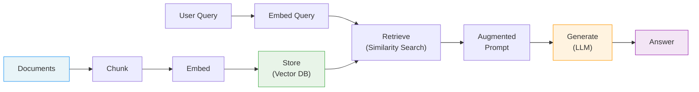

# Chapter 4: Embeddings and RAG with Ollama

Welcome to **Chapter 4: Embeddings and RAG with Ollama**. In this part of **Ollama Tutorial: Running and Serving LLMs Locally**, you will build an intuitive mental model first, then move into concrete implementation details and practical production tradeoffs.


> Create vector embeddings locally and build retrieval-augmented generation (RAG) workflows -- all running on your own machine with no API keys required.

## The RAG Pipeline at a Glance

Before diving into code, here is the full pipeline you will build in this chapter. Every step runs locally with Ollama and a lightweight vector store.



**In plain language:** you take your documents, split them into manageable chunks, turn each chunk into a numeric vector (an "embedding"), and store them. When a user asks a question, you embed the question with the same model, find the most similar chunks, paste them into a prompt, and let the LLM generate an answer grounded in your own data.

---

## What Are Embeddings?

If you are new to embeddings, think of them as a way to convert text into a list of numbers (a "vector") so that similar meanings end up close together in mathematical space.

**A quick analogy.** Imagine a huge library where every book has GPS coordinates. Books about cooking are clustered in one corner, books about space exploration in another. An embedding model is the librarian that assigns those coordinates. When you hand it a question about "pasta recipes," it gives you coordinates right in the middle of the cooking section -- making it easy to find the most relevant books.

Key properties of embeddings:

- **Fixed-length vectors.** No matter how long or short the input text is, the output is always a vector of the same dimensionality (e.g., 768 numbers).
- **Semantic similarity.** Texts with similar meanings produce vectors that are close together (measured by cosine similarity or dot product).
- **Model-dependent.** Different embedding models produce different vector spaces. You must always query with the same model you used to index.

Here is a tiny Python example to see embeddings in action:

```python
import requests
import numpy as np

def get_embedding(text, model="nomic-embed-text"):
    """Get an embedding vector from Ollama."""
    r = requests.post("http://localhost:11434/api/embeddings", json={
        "model": model,
        "prompt": text
    })
    return r.json()["embedding"]

# Embed three sentences
vec_a = get_embedding("The cat sat on the mat.")
vec_b = get_embedding("A kitten was resting on a rug.")
vec_c = get_embedding("The stock market crashed yesterday.")

# Cosine similarity helper
def cosine_sim(a, b):
    a, b = np.array(a), np.array(b)
    return np.dot(a, b) / (np.linalg.norm(a) * np.linalg.norm(b))

print(f"cat vs kitten:  {cosine_sim(vec_a, vec_b):.4f}")   # high
print(f"cat vs stocks:  {cosine_sim(vec_a, vec_c):.4f}")   # low
```

You will see that the first two sentences score much higher in similarity than the third -- even though they use different words. That is the magic of semantic embeddings.

---

## Embeddings Endpoint

Ollama exposes an embeddings API that is compatible with the OpenAI format, so most tooling works out of the box.

**cURL:**

```bash
curl http://localhost:11434/api/embeddings -d '{
  "model": "nomic-embed-text",
  "prompt": "An embedding turns text into a vector."
}'
```

**Python (requests):**

```python
import requests

r = requests.post("http://localhost:11434/api/embeddings", json={
    "model": "nomic-embed-text",
    "prompt": "Searchable vector"
})
vec = r.json()["embedding"]
print(f"Dimensions: {len(vec)}, first 5 values: {vec[:5]}")
```

**Node.js (OpenAI client):**

```javascript
import OpenAI from "openai";
const client = new OpenAI({
  baseURL: "http://localhost:11434/v1",
  apiKey: "ollama",
});

const emb = await client.embeddings.create({
  model: "nomic-embed-text",
  input: "Vectorize this text",
});
console.log("Dimensions:", emb.data[0].embedding.length);
```

**Batch embedding (Python):**

If you have many texts to embed, send them in a loop but reuse a single `requests.Session` to avoid connection overhead:

```python
import requests

session = requests.Session()
texts = ["First document.", "Second document.", "Third document."]
embeddings = []

for text in texts:
    r = session.post("http://localhost:11434/api/embeddings", json={
        "model": "nomic-embed-text",
        "prompt": text
    })
    embeddings.append(r.json()["embedding"])

print(f"Embedded {len(embeddings)} texts, each with {len(embeddings[0])} dimensions.")
```

---

## Embedding Model Comparison

Ollama ships several embedding models. The table below compares the most popular options so you can pick the right one for your workload.

| Model | Dimensions | Size on Disk | Relative Speed | Quality Notes |
|---|---|---|---|---|
| `nomic-embed-text` | 768 | ~270 MB | Fast | Great all-rounder; strong on English text, good balance of speed and quality |
| `all-minilm` (L6-v2) | 384 | ~45 MB | Very fast | Smallest footprint; ideal for prototyping or resource-constrained devices |
| `bge-base-en` | 768 | ~220 MB | Medium | High-quality BAAI model; excels on benchmarks, slightly heavier than nomic |
| `bge-large-en` | 1024 | ~650 MB | Slower | Top retrieval quality; best choice when accuracy matters more than latency |
| `snowflake-arctic-embed` | 1024 | ~650 MB | Slower | Strong multilingual support; good for non-English or mixed-language corpora |

**How to choose:**

- **Just getting started?** Use `nomic-embed-text`. It is fast, compact, and produces high-quality embeddings.
- **Running on a Raspberry Pi or small VM?** Use `all-minilm` for the smallest memory footprint.
- **Need maximum retrieval accuracy?** Use `bge-large-en` and accept the extra latency.
- **Multilingual data?** Try `snowflake-arctic-embed`.

Pull any model with a single command:

```bash
ollama pull nomic-embed-text
ollama pull all-minilm
ollama pull bge-base-en
```

---

## Chunking Strategies

RAG quality depends heavily on how you split your documents. If chunks are too large, the LLM's context gets diluted with irrelevant text. If they are too small, you lose the surrounding context that makes a passage meaningful.

### Fixed-Size Chunking with Overlap

The simplest approach: split text every N characters (or tokens) and overlap by some amount so important information at chunk boundaries is not lost.

```python
def fixed_size_chunks(text, chunk_size=500, overlap=100):
    """Split text into chunks of `chunk_size` characters with `overlap`."""
    chunks = []
    start = 0
    while start < len(text):
        end = start + chunk_size
        chunks.append(text[start:end])
        start += chunk_size - overlap
    return chunks

# Example
text = open("my_document.txt").read()
chunks = fixed_size_chunks(text, chunk_size=600, overlap=120)
print(f"Created {len(chunks)} chunks, each ~600 chars with 120-char overlap.")
```

**Guideline:** an overlap of 15--25 % of the chunk size works well for most prose. For code, use a smaller overlap (or split on function boundaries instead).

### Recursive / Separator-Based Chunking

A smarter approach splits first on major boundaries (double newlines, headings) and then falls back to smaller separators if a section is still too long.

```python
def recursive_chunks(text, chunk_size=600, separators=None):
    """Recursively split text using a hierarchy of separators."""
    if separators is None:
        separators = ["\n\n", "\n", ". ", " "]

    if len(text) <= chunk_size:
        return [text]

    # Try each separator in order
    for sep in separators:
        parts = text.split(sep)
        if len(parts) > 1:
            chunks = []
            current = ""
            for part in parts:
                candidate = current + sep + part if current else part
                if len(candidate) <= chunk_size:
                    current = candidate
                else:
                    if current:
                        chunks.append(current)
                    current = part
            if current:
                chunks.append(current)
            # If all chunks are small enough, we are done
            if all(len(c) <= chunk_size for c in chunks):
                return chunks
            # Otherwise recurse into oversized chunks
            result = []
            for c in chunks:
                result.extend(recursive_chunks(c, chunk_size, separators))
            return result

    # Last resort: hard split
    return fixed_size_chunks(text, chunk_size, overlap=0)
```

### Semantic Chunking

The most advanced approach uses the embedding model itself to decide where to split. The idea: embed each sentence, then cut whenever the cosine similarity between consecutive sentences drops below a threshold.

```python
import numpy as np
import re

def semantic_chunks(text, model="nomic-embed-text", threshold=0.75):
    """Split text at points where consecutive sentences are semantically different."""
    sentences = re.split(r'(?<=[.!?])\s+', text)
    if len(sentences) <= 1:
        return [text]

    # Embed every sentence
    vecs = [get_embedding(s, model) for s in sentences]

    # Find similarity drops
    chunks, current = [], [sentences[0]]
    for i in range(1, len(sentences)):
        sim = cosine_sim(vecs[i - 1], vecs[i])
        if sim < threshold:
            chunks.append(" ".join(current))
            current = [sentences[i]]
        else:
            current.append(sentences[i])
    if current:
        chunks.append(" ".join(current))
    return chunks
```

**When to use which strategy:**

| Strategy | Pros | Cons | Best For |
|---|---|---|---|
| Fixed-size + overlap | Simple, predictable | Ignores document structure | Quick prototypes, uniform text |
| Recursive / separator | Respects headings and paragraphs | Needs tuning per doc format | Markdown, HTML, articles |
| Semantic | Chunks are topically coherent | Slow (needs per-sentence embedding) | High-quality RAG, small corpora |

---

## Simple RAG Pipeline (Python + ChromaDB)

Now let's put it all together. This section walks through indexing a handful of documents and querying them with context-augmented generation.

### Install Dependencies

```bash
pip install chromadb requests numpy
```

### Index Documents

```python
import chromadb
import requests
import uuid

# Connect to a persistent Chroma database (data survives restarts)
chroma = chromadb.PersistentClient(path="./chroma_data")
collection = chroma.get_or_create_collection(
    name="docs",
    metadata={"hnsw:space": "cosine"}   # use cosine similarity
)

# Sample documents -- in practice you would load these from files
texts = [
    "Ollama runs large language models locally on your laptop or server.",
    "RAG combines information retrieval with text generation for grounded answers.",
    "Embeddings convert text into numeric vectors that capture meaning.",
    "ChromaDB is a lightweight vector store that runs in-process.",
    "Chunking strategies affect retrieval quality significantly.",
]

def embed(text, model="nomic-embed-text"):
    r = requests.post("http://localhost:11434/api/embeddings", json={
        "model": model, "prompt": text
    })
    return r.json()["embedding"]

# Add each document to the collection
for i, text in enumerate(texts):
    collection.add(
        ids=[f"doc-{i}"],
        embeddings=[embed(text)],
        documents=[text],
        metadatas=[{"source": "tutorial", "index": i}]
    )

print(f"Indexed {collection.count()} documents.")
```

### Query with Context

```python
question = "What is RAG and how does it work?"

# 1. Embed the question
q_vec = embed(question)

# 2. Retrieve the top-3 most relevant chunks
results = collection.query(query_embeddings=[q_vec], n_results=3)
context = "\n---\n".join(results["documents"][0])

print("Retrieved context:")
print(context)
print()

# 3. Generate an answer grounded in the retrieved context
answer = requests.post("http://localhost:11434/api/chat", json={
    "model": "llama3",
    "stream": False,
    "messages": [
        {
            "role": "system",
            "content": (
                "You are a helpful assistant. Answer the user's question "
                "using ONLY the provided context. If the context does not "
                "contain enough information, say so honestly."
            ),
        },
        {
            "role": "user",
            "content": f"Context:\n{context}\n\nQuestion: {question}",
        },
    ],
}).json()["message"]["content"]

print("Answer:", answer)
```

The key instruction in the system prompt -- "using ONLY the provided context" -- is what keeps the model grounded and reduces hallucination.

---

## Building a Local Knowledge Base

The snippet above used hardcoded strings. In a real project you will want to load documents from files, chunk them, embed each chunk, and persist everything so you do not have to re-embed on every run.

Below is a complete, end-to-end example.

```python
#!/usr/bin/env python3
"""local_kb.py -- Build and query a local knowledge base with Ollama + ChromaDB."""

import os
import glob
import uuid
import requests
import chromadb

# ---------- Configuration ----------
DOCS_DIR       = "./knowledge"          # folder with .txt and .md files
CHUNK_SIZE     = 500                    # characters per chunk
CHUNK_OVERLAP  = 100                    # overlap between consecutive chunks
EMBED_MODEL    = "nomic-embed-text"
CHAT_MODEL     = "llama3"
CHROMA_PATH    = "./chroma_kb"
COLLECTION     = "knowledge_base"
TOP_K          = 5

# ---------- Helpers ----------
def load_documents(directory):
    """Read all .txt and .md files from a directory."""
    docs = []
    for pattern in ["*.txt", "*.md"]:
        for filepath in sorted(glob.glob(os.path.join(directory, pattern))):
            with open(filepath, "r", encoding="utf-8") as f:
                docs.append({
                    "text": f.read(),
                    "source": os.path.basename(filepath),
                })
    return docs


def chunk_text(text, size=CHUNK_SIZE, overlap=CHUNK_OVERLAP):
    """Split text into fixed-size chunks with overlap."""
    chunks = []
    start = 0
    while start < len(text):
        end = start + size
        chunks.append(text[start:end])
        start += size - overlap
    return chunks


def embed(text):
    """Get an embedding from Ollama."""
    r = requests.post("http://localhost:11434/api/embeddings", json={
        "model": EMBED_MODEL, "prompt": text
    })
    return r.json()["embedding"]


# ---------- Indexing ----------
def build_index():
    """Load documents, chunk them, embed chunks, and store in ChromaDB."""
    chroma = chromadb.PersistentClient(path=CHROMA_PATH)

    # Delete old collection if it exists, then recreate
    try:
        chroma.delete_collection(COLLECTION)
    except Exception:
        pass
    collection = chroma.create_collection(
        name=COLLECTION,
        metadata={"hnsw:space": "cosine"},
    )

    docs = load_documents(DOCS_DIR)
    print(f"Loaded {len(docs)} files from {DOCS_DIR}")

    total_chunks = 0
    for doc in docs:
        chunks = chunk_text(doc["text"])
        for i, chunk in enumerate(chunks):
            collection.add(
                ids=[str(uuid.uuid4())],
                embeddings=[embed(chunk)],
                documents=[chunk],
                metadatas=[{"source": doc["source"], "chunk_index": i}],
            )
        total_chunks += len(chunks)
        print(f"  {doc['source']}: {len(chunks)} chunks")

    print(f"Indexed {total_chunks} chunks total.\n")
    return collection


# ---------- Querying ----------
def query_kb(collection, question):
    """Retrieve relevant chunks and generate an answer."""
    q_vec = embed(question)
    results = collection.query(query_embeddings=[q_vec], n_results=TOP_K)

    # Build context with source attribution
    context_parts = []
    for doc, meta in zip(results["documents"][0], results["metadatas"][0]):
        context_parts.append(f"[{meta['source']}] {doc}")
    context = "\n---\n".join(context_parts)

    # Generate answer
    resp = requests.post("http://localhost:11434/api/chat", json={
        "model": CHAT_MODEL,
        "stream": False,
        "messages": [
            {
                "role": "system",
                "content": (
                    "You are a helpful assistant. Answer the question using "
                    "ONLY the context provided. Cite the source file when possible. "
                    "If the context is insufficient, say you don't know."
                ),
            },
            {
                "role": "user",
                "content": f"Context:\n{context}\n\nQuestion: {question}",
            },
        ],
    }).json()

    return resp["message"]["content"], results


# ---------- Main ----------
if __name__ == "__main__":
    collection = build_index()

    while True:
        q = input("\nAsk a question (or 'quit'): ").strip()
        if q.lower() in ("quit", "exit", "q"):
            break
        answer, raw = query_kb(collection, q)
        print(f"\n{answer}")
        print("\nSources used:")
        for meta in raw["metadatas"][0]:
            print(f"  - {meta['source']} (chunk {meta['chunk_index']})")
```

**To try it:**

1. Create a `knowledge/` folder and drop in a few `.txt` or `.md` files.
2. Run `python local_kb.py`.
3. The script indexes everything once, then enters an interactive question loop.

Because ChromaDB is persisted to `./chroma_kb`, subsequent runs can skip re-indexing by loading the existing collection instead.

---

## Hybrid Search

Pure vector search is powerful but not perfect. Sometimes the user's query contains an exact keyword (a product ID, an error code, a person's name) that vector similarity might miss. Hybrid search combines keyword matching with vector similarity to get the best of both worlds.

### How Hybrid Search Works

1. **Keyword search** -- filter or score documents that contain specific terms (like a traditional search engine).
2. **Vector search** -- rank documents by embedding similarity.
3. **Combine** -- merge the two ranked lists using a weighted score.

### Implementation with ChromaDB Metadata Filters

ChromaDB supports `where_document` filters that let you require certain keywords to be present before vector ranking kicks in.

```python
# Keyword-constrained vector search
results = collection.query(
    query_embeddings=[embed("How do I fix error E1234?")],
    n_results=5,
    where_document={"$contains": "E1234"},    # must contain this keyword
)
```

This is a simple but effective form of hybrid search: only documents containing the exact keyword are considered, and among those, the closest vectors win.

### Manual Hybrid Scoring

For more control, you can run both searches independently and combine the scores:

```python
import numpy as np
from collections import defaultdict

def hybrid_search(collection, query, top_k=5, keyword_weight=0.3, vector_weight=0.7):
    """Combine keyword and vector search with weighted scoring."""
    q_vec = embed(query)

    # Vector search -- get more candidates than we need
    vec_results = collection.query(
        query_embeddings=[q_vec],
        n_results=top_k * 2,
        include=["documents", "distances", "metadatas"],
    )

    # Build score map from vector results
    # ChromaDB distances are L2 by default; convert to a 0-1 similarity
    scores = defaultdict(lambda: {"vector": 0.0, "keyword": 0.0, "doc": "", "meta": {}})

    for doc_id, doc, dist, meta in zip(
        vec_results["ids"][0],
        vec_results["documents"][0],
        vec_results["distances"][0],
        vec_results["metadatas"][0],
    ):
        similarity = 1.0 / (1.0 + dist)          # convert distance to similarity
        scores[doc_id]["vector"] = similarity
        scores[doc_id]["doc"] = doc
        scores[doc_id]["meta"] = meta

    # Keyword scoring -- simple term-frequency approach
    query_terms = set(query.lower().split())
    for doc_id, info in scores.items():
        doc_lower = info["doc"].lower()
        matches = sum(1 for t in query_terms if t in doc_lower)
        info["keyword"] = matches / max(len(query_terms), 1)

    # Weighted combination
    ranked = sorted(
        scores.items(),
        key=lambda x: (
            vector_weight * x[1]["vector"] + keyword_weight * x[1]["keyword"]
        ),
        reverse=True,
    )

    return ranked[:top_k]

# Usage
top_results = hybrid_search(collection, "error E1234 in production")
for doc_id, info in top_results:
    combined = 0.7 * info["vector"] + 0.3 * info["keyword"]
    print(f"[{combined:.3f}] {info['doc'][:80]}...")
```

**When to use hybrid search:**

- Your documents contain identifiers, codes, or proper nouns that must match exactly.
- Pure vector search is returning "close but wrong" results.
- You want to give the user the option to filter by category, date, or tag alongside semantic search.

---

## RAG Evaluation

Building a RAG pipeline is only half the battle. You also need to know whether it actually retrieves the right information and produces correct answers. This section introduces practical ways to measure retrieval and generation quality.

### Retrieval Metrics

These metrics tell you how well your vector search finds the right chunks.

**Recall at K:** Of all the relevant chunks in your corpus, how many appear in the top-K results?

```python
def recall_at_k(relevant_ids, retrieved_ids, k):
    """Fraction of relevant documents found in the top-k retrieved results."""
    top_k = set(retrieved_ids[:k])
    relevant = set(relevant_ids)
    if not relevant:
        return 0.0
    return len(top_k & relevant) / len(relevant)
```

**Mean Reciprocal Rank (MRR):** How high does the first relevant result appear?

```python
def mrr(relevant_ids, retrieved_ids):
    """Mean Reciprocal Rank -- rewards finding a relevant doc early."""
    relevant = set(relevant_ids)
    for rank, doc_id in enumerate(retrieved_ids, start=1):
        if doc_id in relevant:
            return 1.0 / rank
    return 0.0
```

### Building a Test Set

To use these metrics you need a small evaluation set: a list of questions paired with the chunk IDs (or document IDs) that should be retrieved.

```python
eval_set = [
    {
        "question": "What is RAG?",
        "relevant_ids": ["doc-1"],        # IDs of chunks that answer this
    },
    {
        "question": "How does Ollama run models locally?",
        "relevant_ids": ["doc-0"],
    },
    # ... add 10-20 examples for a meaningful evaluation
]
```

Even a small set of 10--20 question-answer pairs is enough to catch regressions when you change your chunking strategy or switch embedding models.

### Running an Evaluation Loop

```python
def evaluate_retrieval(collection, eval_set, k=5):
    """Evaluate retrieval quality over a test set."""
    recalls, mrrs = [], []
    for item in eval_set:
        q_vec = embed(item["question"])
        results = collection.query(query_embeddings=[q_vec], n_results=k)
        retrieved = results["ids"][0]

        recalls.append(recall_at_k(item["relevant_ids"], retrieved, k))
        mrrs.append(mrr(item["relevant_ids"], retrieved))

    avg_recall = sum(recalls) / len(recalls)
    avg_mrr = sum(mrrs) / len(mrrs)

    print(f"Recall@{k}: {avg_recall:.3f}")
    print(f"MRR:        {avg_mrr:.3f}")
    return avg_recall, avg_mrr
```

### Answer Quality (LLM-as-Judge)

Retrieval metrics do not tell you whether the final generated answer is good. A quick and practical approach is to use the LLM itself as a judge:

```python
def llm_judge(question, generated_answer, reference_answer):
    """Ask the LLM to rate the generated answer against a reference."""
    prompt = f"""You are an impartial judge. Rate the following answer on a
scale from 1 (completely wrong) to 5 (perfect).

Question: {question}
Reference answer: {reference_answer}
Generated answer: {generated_answer}

Respond with ONLY a JSON object: {{"score": <int>, "reason": "<brief explanation>"}}"""

    resp = requests.post("http://localhost:11434/api/chat", json={
        "model": "llama3",
        "stream": False,
        "messages": [{"role": "user", "content": prompt}],
        "options": {"temperature": 0.0},
    }).json()
    return resp["message"]["content"]
```

### Quick Evaluation Checklist

Use this checklist whenever you change your RAG pipeline:

| Check | What to Look For |
|---|---|
| Recall@5 | Are relevant chunks in the top 5? Aim for > 0.8 on your test set. |
| MRR | Is the best chunk ranked first or second? Aim for > 0.7. |
| Answer faithfulness | Does the answer only use information from the context? |
| Answer completeness | Does the answer address the full question? |
| Latency | Is the end-to-end time acceptable for your use case? |

---

## Retrieval Patterns

Beyond the basics, here are common patterns you will encounter as your RAG system matures:

- **Top-k search**: adjust `n_results` based on how much context your generator model can handle. More chunks means more information but also more noise.
- **Re-ranking**: retrieve a larger candidate set (e.g., top-20) and then re-rank with a cross-encoder or a second LLM call to surface the best results.
- **Metadata filtering**: attach metadata (date, author, category) to each chunk and filter before or during vector search to narrow scope.
- **Multi-query retrieval**: rephrase the user's question in 2--3 different ways, retrieve for each, and merge the results. This improves recall for ambiguous queries.
- **Contextual compression**: after retrieving chunks, use the LLM to extract only the sentences that are relevant to the question, reducing noise in the final prompt.
- **Caching embeddings**: store embeddings on disk (ChromaDB `PersistentClient`, SQLite, or another DB) so you do not re-embed on every restart.

---

## Performance Tips

- **Use smaller embed models for speed** when quality is sufficient. `all-minilm` is 6x smaller than `bge-large-en` and still works well for many tasks.
- **Batch requests client-side** by reusing an HTTP session to avoid repeated connection overhead.
- **Keep context windows reasonable.** The `num_ctx` parameter of your generator model should be large enough to hold the system prompt, retrieved context, and the user's question.
- **Persist your vector store.** Re-embedding thousands of chunks on every run wastes time. Use `PersistentClient` in ChromaDB or an equivalent.
- **Profile your pipeline.** Measure time spent in embedding, retrieval, and generation separately so you know where the bottleneck is.

---

## Troubleshooting

| Symptom | Likely Cause | Fix |
|---|---|---|
| Dimension mismatch error | Different embedding models used for indexing vs. querying | Always use the same model for both. Rebuild the index if you switch models. |
| Slow queries | Large vectors, huge top-k, or no persistence | Use a smaller model (`all-minilm`), reduce `n_results`, persist the DB to disk. |
| Low relevance | Poor chunking or a weak embedding model | Experiment with chunk sizes, add overlap, try `bge-large-en`, clean noisy text. |
| Answer hallucination | Context does not contain the answer, or system prompt is too weak | Strengthen the "only use context" instruction, increase top-k, improve chunking. |
| Out-of-memory | Embedding model too large for your hardware | Switch to `all-minilm` (45 MB) or run on a machine with more RAM. |

---

## Summary

In this chapter you learned how to:

1. **Generate embeddings** using Ollama's API with multiple client libraries.
2. **Choose an embedding model** based on your quality, speed, and memory requirements.
3. **Chunk documents** using fixed-size, recursive, and semantic strategies.
4. **Build a RAG pipeline** that retrieves relevant context and generates grounded answers.
5. **Create a local knowledge base** from files on disk with persistent storage.
6. **Combine keyword and vector search** with hybrid retrieval.
7. **Evaluate your pipeline** with retrieval metrics and LLM-as-judge scoring.

With these building blocks you can create powerful, private, fully local AI applications that answer questions grounded in your own data -- no cloud APIs required.

---

Previous: [Chapter 3: Chat & Completions](03-chat-completions.md) | Next: [Chapter 5: Custom Models](05-modelfiles-custom.md)

## What Problem Does This Solve?

Most teams struggle here because the hard part is not writing more code, but deciding clear boundaries for `text`, `chunks`, `embed` so behavior stays predictable as complexity grows.

In practical terms, this chapter helps you avoid three common failures:

- coupling core logic too tightly to one implementation path
- missing the handoff boundaries between setup, execution, and validation
- shipping changes without clear rollback or observability strategy

After working through this chapter, you should be able to reason about `Chapter 4: Embeddings and RAG with Ollama` as an operating subsystem inside **Ollama Tutorial: Running and Serving LLMs Locally**, with explicit contracts for inputs, state transitions, and outputs.

Use the implementation notes around `print`, `collection`, `model` as your checklist when adapting these patterns to your own repository.

## How it Works Under the Hood

Under the hood, `Chapter 4: Embeddings and RAG with Ollama` usually follows a repeatable control path:

1. **Context bootstrap**: initialize runtime config and prerequisites for `text`.
2. **Input normalization**: shape incoming data so `chunks` receives stable contracts.
3. **Core execution**: run the main logic branch and propagate intermediate state through `embed`.
4. **Policy and safety checks**: enforce limits, auth scopes, and failure boundaries.
5. **Output composition**: return canonical result payloads for downstream consumers.
6. **Operational telemetry**: emit logs/metrics needed for debugging and performance tuning.

When debugging, walk this sequence in order and confirm each stage has explicit success/failure conditions.

## Source Walkthrough

Use the following upstream sources to verify implementation details while reading this chapter:

- [Ollama Repository](https://github.com/ollama/ollama)
  Why it matters: authoritative reference on `Ollama Repository` (github.com).
- [Ollama Releases](https://github.com/ollama/ollama/releases)
  Why it matters: authoritative reference on `Ollama Releases` (github.com).
- [Ollama Website and Docs](https://ollama.com/)
  Why it matters: authoritative reference on `Ollama Website and Docs` (ollama.com).

Suggested trace strategy:
- search upstream code for `text` and `chunks` to map concrete implementation paths
- compare docs claims against actual runtime/config code before reusing patterns in production

## Chapter Connections

- [Tutorial Index](index.md)
- [Previous Chapter: Chapter 3: Chat, Completions, and Parameters](03-chat-completions.md)
- [Next Chapter: Chapter 5: Modelfiles, Templates, and Custom Models](05-modelfiles-custom.md)
- [Main Catalog](../../README.md#-tutorial-catalog)
- [A-Z Tutorial Directory](../../discoverability/tutorial-directory.md)
